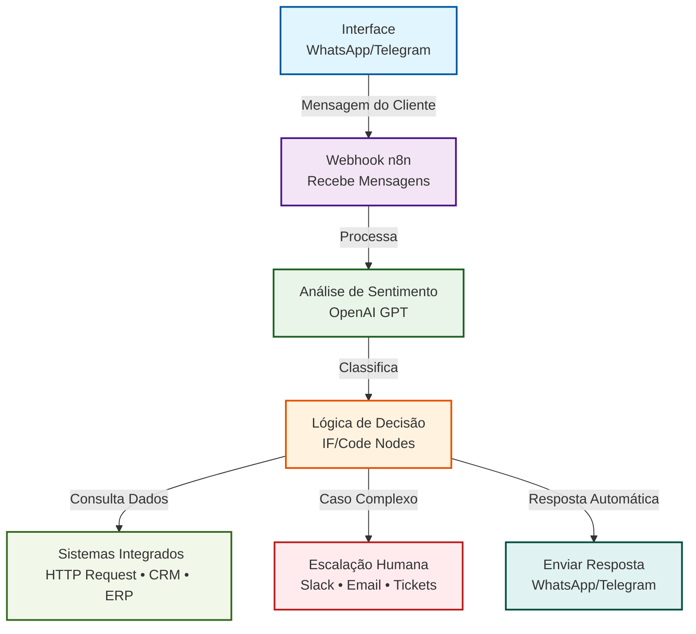
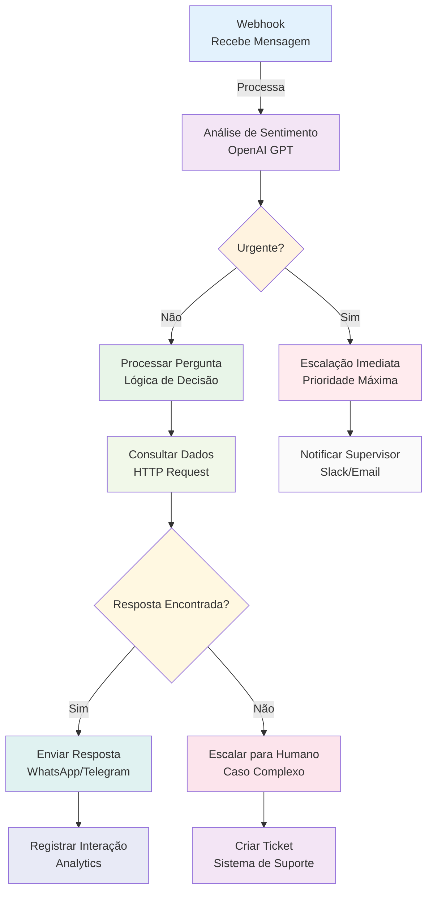
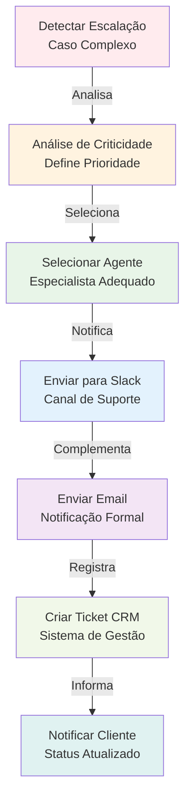
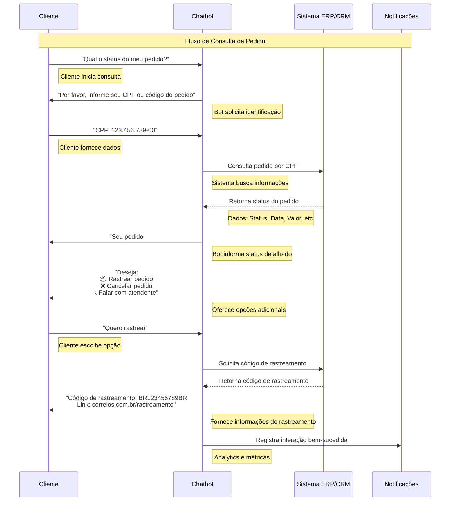
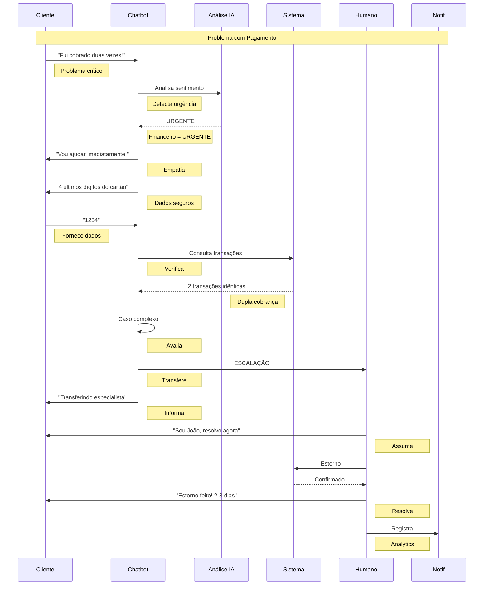
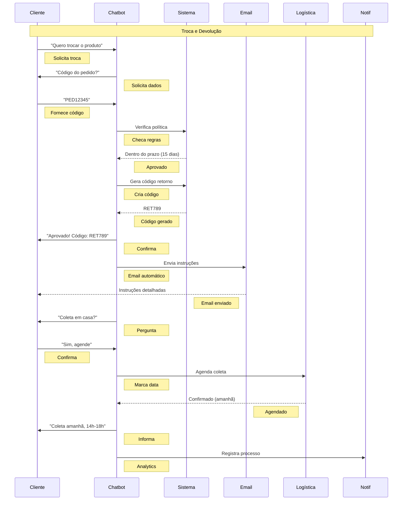
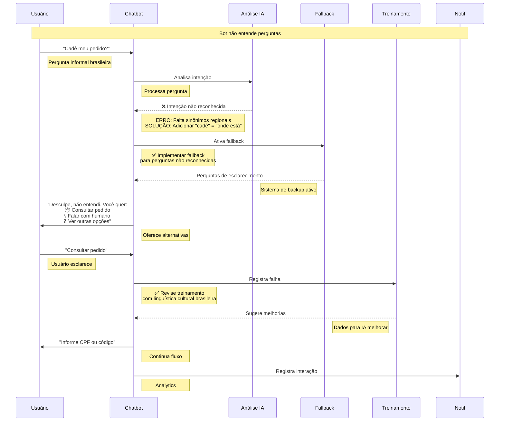
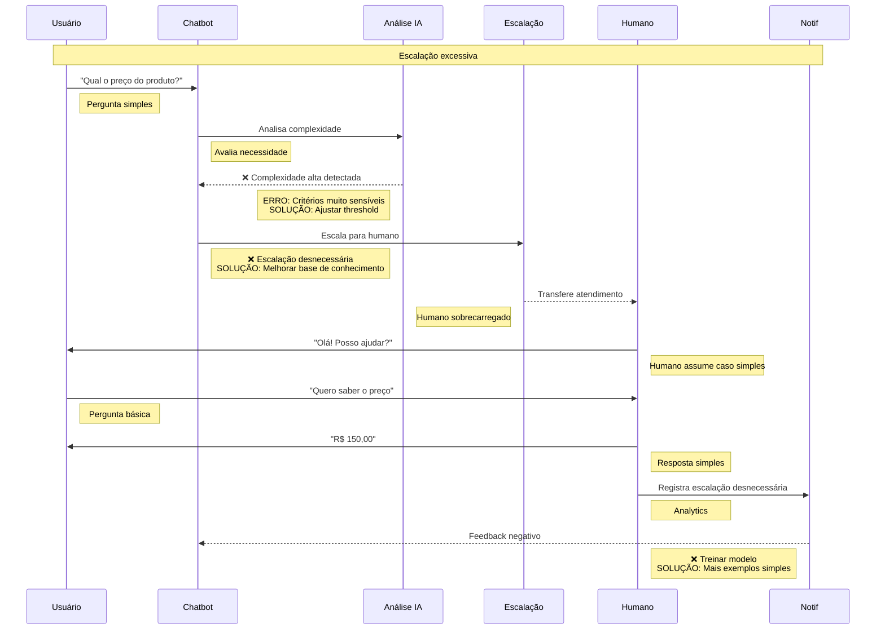
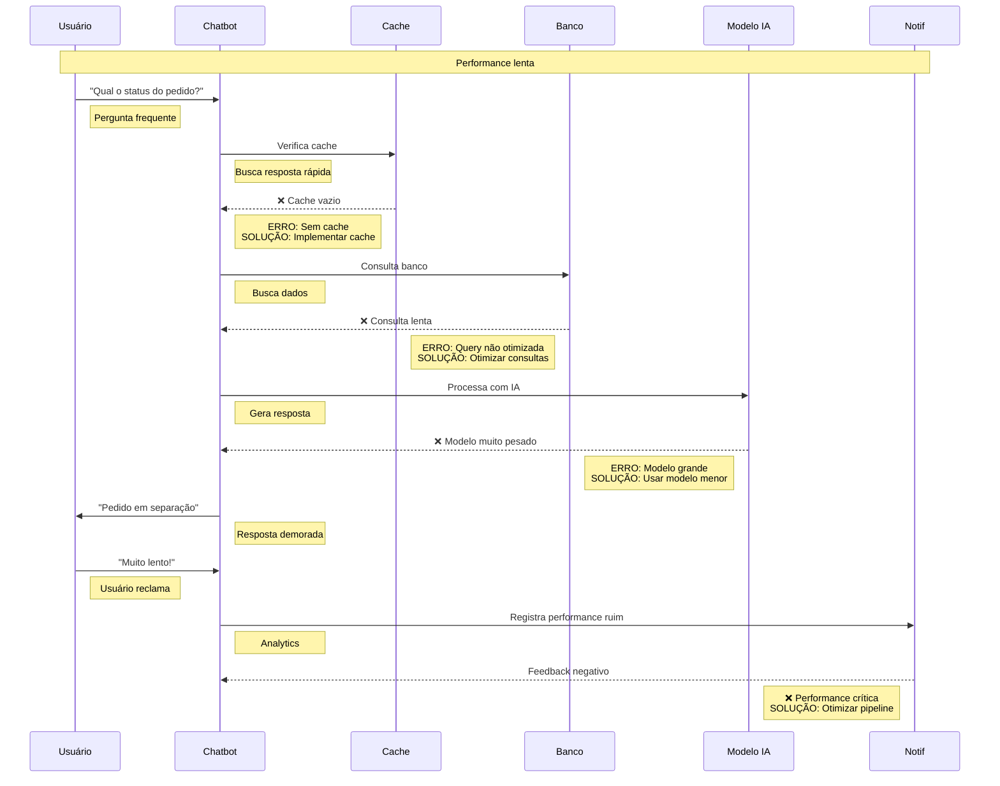

# <ion-icon name="chatbubble-ellipses-outline" style={{ fontSize: '32px', color: '#ea4b71' }}></ion-icon> Chatbot de Suporte - Atendimento Inteligente

Este guia ensina como criar chatbots inteligentes para atendimento ao cliente usando n8n, com recursos avançados como escalação automática, análise de sentimento e integração com sistemas brasileiros de atendimento.

## <ion-icon name="checkmark-circle-outline" style={{ fontSize: '24px', color: '#ea4b71' }}></ion-icon> Pré-requisitos Técnicos

Antes de começar, certifique-se de ter:

**Conhecimento Básico:**
- Conceitos de APIs REST e webhooks
- Noções de JavaScript para personalização de lógica
- Familiaridade com fluxos de trabalho visuais

**Infraestrutura Necessária:**
- Instância n8n configurada (versão 1.0+)
- Credenciais configuradas para:
  - OpenAI API (gpt-3.5-turbo ou superior)
  - WhatsApp Business API ou Telegram Bot API
  - Slack Workspace com permissões de bot
  - Sistema CRM/ERP com API disponível

**Recursos de Desenvolvimento:**
- Acesso a ambiente de testes
- Documentação das APIs que serão integradas
- Base de conhecimento da empresa para treinamento

:::tip **Dica de Preparação**
Configure todas as credenciais necessárias antes de iniciar a implementação. Isso evita interrupções durante o desenvolvimento e facilita os testes.
:::

## <ion-icon name="chatbubble-ellipses-outline" style={{ fontSize: '24px', color: '#ea4b71' }}></ion-icon> Caso de Uso: E-commerce

Imagine um e-commerce brasileiro que recebe centenas de perguntas diárias sobre produtos, pedidos e problemas técnicos. Um chatbot inteligente pode:

- **Reduzir 70% da carga** do atendimento humano
- **Responder 24/7** sem interrupções
- **Escalar automaticamente** casos complexos para humanos
- **Analisar sentimento** para priorizar atendimentos urgentes
- **Integrar com sistemas** brasileiros como WhatsApp Business API

## <ion-icon name="construct-outline" style={{ fontSize: '24px', color: '#ea4b71' }}></ion-icon> Arquitetura do Sistema

O chatbot de suporte segue uma arquitetura em camadas com fluxo de dados inteligente:


```mermaid
graph TD
    A[<ion-icon name="phone-portrait-outline"></ion-icon> Interface<br/>WhatsApp/Telegram] -->|Mensagem do Cliente| B[<ion-icon name="chatbubble-ellipses-outline"></ion-icon> Webhook n8n<br/>Recebe Mensagens]
    B -->|Processa| C[<ion-icon name="analytics-outline"></ion-icon> Análise de Sentimento<br/>OpenAI GPT]
    C -->|Classifica| D[<ion-icon name="bulb-outline"></ion-icon> Lógica de Decisão<br/>IF/Code Nodes]
    D -->|Consulta Dados| E[<ion-icon name="link-outline"></ion-icon> Sistemas Integrados<br/>HTTP Request • CRM • ERP]
    D -->|Caso Complexo| F[<ion-icon name="people-outline"></ion-icon> Escalação Humana<br/>Slack • Email • Tickets]
    D -->|Resposta Automática| G[<ion-icon name="send-outline"></ion-icon> Enviar Resposta<br/>WhatsApp/Telegram]
    
    style A fill:#e1f5fe
    style B fill:#f3e5f5
    style C fill:#e8f5e8
    style D fill:#fff3e0
    style E fill:#f1f8e9
    style F fill:#ffebee
    style G fill:#e0f2f1
    
    classDef interface fill:#e1f5fe,stroke:#01579b,stroke-width:2px
    classDef webhook fill:#f3e5f5,stroke:#4a148c,stroke-width:2px
    classDef analysis fill:#e8f5e8,stroke:#1b5e20,stroke-width:2px
    classDef logic fill:#fff3e0,stroke:#e65100,stroke-width:2px
    classDef systems fill:#f1f8e9,stroke:#33691e,stroke-width:2px
    classDef human fill:#ffebee,stroke:#b71c1c,stroke-width:2px
    classDef response fill:#e0f2f1,stroke:#004d40,stroke-width:2px
    
    class A interface
    class B webhook
    class C analysis
    class D logic
    class E systems
    class F human
    class G response
```

### ✅ Checkpoint de Validação - Arquitetura

**Teste seu entendimento:**
- [ ] Consigo explicar o fluxo de dados entre os componentes
- [ ] Entendo a função de cada camada da arquitetura
- [ ] Sei identificar onde cada integração acontece

**Se algum ponto não estiver claro, revise a seção anterior antes de continuar.**

## <ion-icon name="hammer-outline" style={{ fontSize: '24px', color: '#ea4b71' }}></ion-icon> Implementação Passo a Passo

<details>
<summary>Implementação Passo a Passo</summary>

### Passo 1: Configurar Webhook para Receber Mensagens

Configure um **Webhook** para receber mensagens do WhatsApp ou Telegram com segurança:

#### Configuração Básica do Webhook

```json
{
  "node": "n8n-nodes-base.webhook",
  "parameters": {
    "httpMethod": "POST",
    "path": "chatbot",
    "responseMode": "responseNode",
    "options": {
      "responseHeaders": {
        "entries": [
          {
            "name": "Content-Type",
            "value": "application/json"
          },
          {
            "name": "Access-Control-Allow-Origin",
            "value": "*"
          }
        ]
      }
    }
  }
}
```

#### Opções de Autenticação para Produção

**Opção A - Autenticação por Header (Recomendada para APIs customizadas):**

```json
{
  "node": "n8n-nodes-base.webhook",
  "parameters": {
    "httpMethod": "POST",
    "path": "chatbot",
    "responseMode": "responseNode",
    "authentication": "headerAuth",
    "options": {
      "authentication": {
        "headerName": "Authorization",
        "expectedValue": "Bearer {{ $env.WEBHOOK_TOKEN }}"
      },
      "responseHeaders": {
        "entries": [
          {
            "name": "Content-Type",
            "value": "application/json"
          }
        ]
      }
    }
  }
}
```

**Opção B - Validação de Assinatura (Recomendada para WhatsApp/Telegram):**

```json
{
  "node": "n8n-nodes-base.webhook",
  "parameters": {
    "httpMethod": "POST",
    "path": "chatbot",
    "responseMode": "responseNode",
    "options": {
      "authentication": "webhookSignature",
      "signatureAlgorithm": "sha256",
      "secretKey": "{{ $env.WEBHOOK_SECRET }}",
      "responseHeaders": {
        "entries": [
          {
            "name": "Content-Type",
            "value": "application/json"
          }
        ]
      }
    }
  }
}
```

#### Estruturas de Dados Esperadas

**WhatsApp Business API:**
```json
{
  "object": "whatsapp_business_account",
  "entry": [{
    "changes": [{
      "value": {
        "messages": [{
          "from": "5511999999999",
          "text": {"body": "Mensagem do usuário"},
          "timestamp": "1234567890"
        }]
      }
    }]
  }]
}
```

**Telegram Bot API:**
```json
{
  "update_id": 123456789,
  "message": {
    "message_id": 1,
    "from": {"id": 123456, "first_name": "João"},
    "chat": {"id": 123456, "type": "private"},
    "text": "Mensagem do usuário"
  }
}
```

#### Validação de Funcionamento

Teste seu webhook com dados simulados:

```bash
# Teste básico do webhook
curl -X POST https://seu-n8n.com/webhook/chatbot \
  -H "Content-Type: application/json" \
  -d '{"message": "teste", "from": "usuario_teste"}'
```

**Resposta esperada:**
```json
{
  "message": "Mensagem processada com sucesso",
  "status": "ok"
}
```

:::tip **Dica de Segurança**
Configure variáveis de ambiente para tokens e secrets. Nunca hardcode credenciais no código.
:::

#### Nó "Respond to Webhook" para Respostas Customizadas

Após processar a mensagem, use o nó "Respond to Webhook" para enviar respostas estruturadas:

```json
{
  "node": "n8n-nodes-base.respondToWebhook",
  "parameters": {
    "respondWith": "json",
    "responseBody": {
      "message": "Mensagem processada com sucesso",
      "status": "ok",
      "timestamp": "={{ new Date().toISOString() }}",
      "sessionId": "={{ $json.sessionId }}"
    },
    "options": {
      "responseHeaders": {
        "entries": [
          {
            "name": "Content-Type",
            "value": "application/json"
          }
        ]
      }
    }
  }
}
```

### Passo 2: Validação e Sanitização de Dados

Antes de processar a mensagem, valide e sanitize os dados de entrada:

```json
{
  "node": "n8n-nodes-base.code",
  "parameters": {
    "code": `
    // Extrair dados da mensagem baseado na plataforma
    let messageData = {};
    
    if ($json.object === 'whatsapp_business_account') {
      // WhatsApp Business API
      const entry = $json.entry[0];
      const change = entry.changes[0];
      const message = change.value.messages[0];
      
      messageData = {
        platform: 'whatsapp',
        message: message.text.body,
        from: message.from,
        timestamp: message.timestamp,
        messageId: message.id
      };
    } else if ($json.message) {
      // Telegram Bot API
      messageData = {
        platform: 'telegram',
        message: $json.message.text,
        from: $json.message.from.id,
        timestamp: $json.message.date,
        messageId: $json.message.message_id,
        firstName: $json.message.from.first_name
      };
    } else {
      throw new Error('Formato de mensagem não reconhecido');
    }
    
    // Sanitização básica
    const sanitizedMessage = messageData.message.replace(/[<>]/g, '');
    
    // Validação de telefone brasileiro (WhatsApp)
    if (messageData.platform === 'whatsapp') {
      const phoneRegex = /^55[1-9]{2}[9]?[0-9]{8}$/;
      const isValidPhone = phoneRegex.test(messageData.from);
      if (!isValidPhone) {
        throw new Error('Número de telefone inválido');
      }
    }
    
    // Verificar conteúdo suspeito
    const suspiciousWords = ['script', 'javascript', 'eval', 'exec', 'alert'];
    const hasSuspiciousContent = suspiciousWords.some(word => 
      sanitizedMessage.toLowerCase().includes(word)
    );
    
    if (hasSuspiciousContent) {
      throw new Error('Conteúdo suspeito detectado');
    }
    
    // Rate limiting básico (implementar com Redis em produção)
    const sessionId = messageData.from + '_' + Math.floor(Date.now() / 60000);
    
    return {
      ...messageData,
      message: sanitizedMessage,
      sessionId,
      timestamp: new Date().toISOString()
    };
    `
  }
}
```

### Passo 3: Implementar Análise de Sentimento

Use o **OpenAI** node para análise de sentimento com configuração validada:

```json
{
  "node": "n8n-nodes-base.openAi",
  "parameters": {
    "resource": "chat",
    "operation": "complete",
    "prompt": {
      "messages": {
        "values": [
          {
            "role": "system",
            "content": "Analise o sentimento da mensagem do cliente considerando o contexto brasileiro. INDICADORES NEGATIVOS: palavras como 'péssimo', 'horrível', 'irritado', 'reclamação', uso excessivo de pontos de exclamação, menções a problemas financeiros. INDICADORES URGENTES: problemas com medicamentos, questões de segurança, reclamações sobre valores altos, clientes idosos. Responda apenas: POSITIVO, NEUTRO, NEGATIVO ou URGENTE"
          },
          {
            "role": "user",
            "content": "={{ $json.body.message }}"
          }
        ]
      }
    },
    "options": {
      "maxTokens": 10,
      "temperature": 0.1
    }
  }
}
```

### Passo 4: Lógica de Decisão com IF Node

Configure decisões baseadas no sentimento com estrutura validada:

```json
{
  "node": "n8n-nodes-base.if",
  "parameters": {
    "conditions": {
      "conditions": [
        {
          "id": "urgent",
          "leftValue": "={{ $('Análise de Sentimento').item.json.choices[0].message.content }}",
          "rightValue": "URGENTE",
          "operator": {
            "type": "string",
            "operation": "equals"
          }
        },
        {
          "id": "negative",
          "leftValue": "={{ $('Análise de Sentimento').item.json.choices[0].message.content }}",
          "rightValue": "NEGATIVO",
          "operator": {
            "type": "string",
            "operation": "equals"
          }
        }
      ],
      "combineOperation": "any"
    }
  }
}
```

### Passo 5: Integração com Sistemas

Use **HTTP Request** para consultar dados:

```json
{
  "node": "n8n-nodes-base.httpRequest",
  "parameters": {
    "url": "={{ $credentials.crm.url }}/api/pedidos/{{ $json.customerId }}",
    "method": "GET",
    "authentication": "genericCredentialType",
    "genericAuthType": "httpHeaderAuth",
    "sendHeaders": true,
    "headerParameters": {
      "parameters": [
        {
          "name": "Authorization",
          "value": "Bearer {{ $credentials.crm.token }}"
        }
      ]
    }
  }
}
```

### Passo 6: Monitoramento e Logging

Implemente logging estruturado para monitorar o funcionamento do chatbot:

```json
{
  "node": "n8n-nodes-base.code",
  "parameters": {
    "code": `
    // Log estruturado para monitoramento
    const logEntry = {
      timestamp: new Date().toISOString(),
      sessionId: $json.sessionId,
      platform: $json.platform,
      from: $json.from,
      message: $json.message.substring(0, 100), // Primeiros 100 chars
      sentiment: $('Análise de Sentimento').item.json.choices[0].message.content,
      escalated: $json.escalated || false,
      processingTime: Date.now() - new Date($json.timestamp).getTime(),
      status: 'success'
    };
    
    // Em produção, enviar para sistema de logging (ELK, CloudWatch, etc.)
    console.log('Chatbot Log:', JSON.stringify(logEntry));
    
    // Retornar dados para próximo node
    return {
      ...$json,
      logEntry
    };
    `
  }
}
```

#### Configuração de Alertas

Configure alertas para situações críticas:

```json
{
  "node": "n8n-nodes-base.code",
  "parameters": {
    "code": `
    const sentiment = $('Análise de Sentimento').item.json.choices[0].message.content;
    const message = $json.message;
    
    // Alertas para situações críticas
    const alerts = [];
    
    if (sentiment === 'URGENTE') {
      alerts.push({
        type: 'urgent',
        message: 'Cliente com problema urgente detectado',
        data: { from: $json.from, message: message }
      });
    }
    
    if (message.toLowerCase().includes('procon') || message.toLowerCase().includes('reclamação')) {
      alerts.push({
        type: 'complaint',
        message: 'Possível reclamação Procon detectada',
        data: { from: $json.from, message: message }
      });
    }
    
    if (message.toLowerCase().includes('cancelar') && message.toLowerCase().includes('pedido')) {
      alerts.push({
        type: 'cancellation',
        message: 'Tentativa de cancelamento detectada',
        data: { from: $json.from, message: message }
      });
    }
    
    return {
      ...$json,
      alerts
    };
    `
  }
}
```

:::tip **Dica de Monitoramento**
Configure dashboards para acompanhar métricas como tempo de resposta, taxa de escalação e satisfação do cliente.
:::

</details>

### ✅ Checkpoint de Validação - Implementação

**Teste seu entendimento:**
- [ ] Consigo configurar cada node com os parâmetros corretos
- [ ] Entendo como os dados fluem entre os nodes
- [ ] Sei ajustar as configurações para meu caso específico

**Se algum ponto não estiver claro, revise a seção anterior antes de continuar.**

<details>
<summary>Workflow Completo</summary>

### Workflow Principal: Chatbot Inteligente


```mermaid
graph TD
    A[<ion-icon name="chatbubble-ellipses-outline"></ion-icon> Webhook<br/>Recebe Mensagem] -->|Processa| B[<ion-icon name="analytics-outline"></ion-icon> Análise de Sentimento<br/>OpenAI GPT]
    B --> C{<ion-icon name="alert-circle-outline"></ion-icon> Urgente?}
    C -->|Sim| D[<ion-icon name="alert-outline"></ion-icon> Escalação Imediata<br/>Prioridade Máxima]
    C -->|Não| E[<ion-icon name="chatbubbles-outline"></ion-icon> Processar Pergunta<br/>Lógica de Decisão]
    E --> F[<ion-icon name="search-outline"></ion-icon> Consultar Dados<br/>HTTP Request]
    F --> G{<ion-icon name="bulb-outline"></ion-icon> Resposta Encontrada?}
    G -->|Sim| H[<ion-icon name="send-outline"></ion-icon> Enviar Resposta<br/>WhatsApp/Telegram]
    G -->|Não| I[<ion-icon name="people-outline"></ion-icon> Escalar para Humano<br/>Caso Complexo]
    D --> J[<ion-icon name="notifications-outline"></ion-icon> Notificar Supervisor<br/>Slack/Email]
    I --> K[<ion-icon name="ticket-outline"></ion-icon> Criar Ticket<br/>Sistema de Suporte]
    H --> L[<ion-icon name="document-text-outline"></ion-icon> Registrar Interação<br/>Analytics]
    
    style A fill:#e3f2fd
    style B fill:#f3e5f5
    style C fill:#fff3e0
    style D fill:#ffebee
    style E fill:#e8f5e8
    style F fill:#f1f8e9
    style G fill:#fff8e1
    style H fill:#e0f2f1
    style I fill:#fce4ec
    style J fill:#fafafa
    style K fill:#f3e5f5
    style L fill:#e8eaf6
```

### Workflow de Escalação


```mermaid
graph TD
    A[<ion-icon name="alert-outline"></ion-icon> Detectar Escalação<br/>Caso Complexo] -->|Analisa| B[<ion-icon name="analytics-outline"></ion-icon> Análise de Criticidade<br/>Define Prioridade]
    B -->|Seleciona| C[<ion-icon name="person-outline"></ion-icon> Selecionar Agente<br/>Especialista Adequado]
    C -->|Notifica| D[<ion-icon name="logo-slack"></ion-icon> Enviar para Slack<br/>Canal de Suporte]
    D -->|Complementa| E[<ion-icon name="mail-outline"></ion-icon> Enviar Email<br/>Notificação Formal]
    E -->|Registra| F[<ion-icon name="ticket-outline"></ion-icon> Criar Ticket CRM<br/>Sistema de Gestão]
    F -->|Informa| G[<ion-icon name="chatbubble-ellipses-outline"></ion-icon> Notificar Cliente<br/>Status Atualizado]
    
    style A fill:#ffebee
    style B fill:#fff3e0
    style C fill:#e8f5e8
    style D fill:#e3f2fd
    style E fill:#f3e5f5
    style F fill:#f1f8e9
    style G fill:#e0f2f1
```

</details>

<details>
<summary>Integrações de Comunicação</summary>

### WhatsApp Business API

```json
{
  "node": "n8n-nodes-base.httpRequest",
  "parameters": {
    "url": "https://graph.facebook.com/v18.0/{{ $credentials.whatsapp.phoneNumberId }}/messages",
    "method": "POST",
    "headers": {
      "Authorization": "Bearer {{ $credentials.whatsapp.accessToken }}",
      "Content-Type": "application/json"
    },
    "body": {
      "messaging_product": "whatsapp",
      "to": "{{ $json.customerPhone }}",
      "type": "text",
      "text": {
        "body": "{{ $json.response }}"
      }
    }
  }
}
```

### Sistema de Tickets (Zendesk/ServiceNow)

```json
{
  "node": "n8n-nodes-base.httpRequest",
  "parameters": {
    "url": "{{ $credentials.zendesk.url }}/api/v2/tickets.json",
    "method": "POST",
    "headers": {
      "Authorization": "Basic {{ $credentials.zendesk.token }}",
      "Content-Type": "application/json"
    },
    "body": {
      "ticket": {
        "subject": "Escalação Chatbot - {{ $json.customerName }}",
        "description": "{{ $json.conversation }}",
        "priority": "{{ $json.priority }}",
        "tags": ["chatbot", "escalação", "{{ $json.category }}"]
      }
    }
  }
}
```

</details>

<details>
<summary>Configurações Avançadas</summary>

### Prompts Otimizados para Português

```javascript
// Prompt do Sistema para OpenAI
const systemPrompt = `
Você é um assistente virtual especializado em atendimento ao cliente para e-commerce brasileiro.

REGRAS IMPORTANTES:
1. Use linguagem formal mas amigável
2. Sempre confirme informações antes de dar respostas definitivas
3. Para problemas de pagamento, peça dados de forma segura
4. Para reclamações, demonstre empatia e ofereça soluções
5. Use emojis moderadamente para tornar a conversa mais humana
6. Sempre ofereça alternativas quando possível

CAPACIDADES:
- Consultar produtos e preços
- Verificar status de pedidos
- Explicar políticas de troca e devolução
- Abrir tickets de suporte
- Escalar casos complexos para humanos

EXEMPLOS DE RESPOSTAS:
- "Entendo sua situação, vou verificar isso para você..."
- "Para sua segurança, preciso confirmar alguns dados..."
- "Vou escalar seu caso para um atendente especializado..."
`;

// Prompt para Análise de Sentimento
const sentimentPrompt = `
Analise o sentimento do cliente considerando o contexto brasileiro:

INDICADORES NEGATIVOS:
- Palavras como "péssimo", "horrível", "irritado", "reclamação"
- Uso excessivo de pontos de exclamação
- Menções a problemas financeiros ou tempo perdido
- Referências a processos judiciais ou Procon

INDICADORES URGENTES:
- Problemas com medicamentos ou produtos essenciais
- Questões de segurança ou dados pessoais
- Reclamações sobre valores altos ou cobranças indevidas
- Clientes idosos ou com necessidades especiais

Responda apenas: POSITIVO, NEUTRO, NEGATIVO ou URGENTE
`;
```

### Configuração de Horários

```javascript
// Verificar Horário de Atendimento
const checkBusinessHours = {
  "node": "n8n-nodes-base.code",
  "parameters": {
    "code": `
    const now = new Date();
    const hour = now.getHours();
    const day = now.getDay(); // 0 = Domingo, 1 = Segunda...
    
    // Horário comercial: Segunda a Sexta, 8h às 18h
    const isBusinessHours = day >= 1 && day <= 5 && hour >= 8 && hour < 18;
    
    // Fins de semana e feriados: apenas chatbot básico
    const isWeekend = day === 0 || day === 6;
    
    return {
      isBusinessHours,
      isWeekend,
      currentTime: now.toLocaleString('pt-BR'),
      message: isBusinessHours ? 
        "Atendimento humano disponível" : 
        "Atendimento apenas por chatbot"
    };
    `
  }
};
```

</details>

## <ion-icon name="shield-checkmark-outline" style={{ fontSize: '24px', color: '#ea4b71' }}></ion-icon> Considerações de Segurança e LGPD

### Tratamento de Dados Pessoais

O chatbot processa informações sensíveis dos clientes. Implemente estas práticas:

**Minimização de Dados:**
- Armazene apenas dados necessários para o atendimento
- Configure retenção automática (max. 30 dias para logs)
- Criptografe dados em trânsito e em repouso

**Consentimento e Transparência:**
- Informe sobre coleta de dados na primeira interação
- Permita opt-out a qualquer momento
- Mantenha registro de consentimentos

**Segurança Técnica:**
- Use HTTPS para todas as comunicações
- Implemente rate limiting nos webhooks
- Valide e sanitize todas as entradas de dados
- Configure logs de auditoria para acesso aos dados

### Implementação de Segurança

```javascript
// Validação de Dados de Entrada
const validateInput = {
  "node": "n8n-nodes-base.code",
  "parameters": {
    "code": `
    const message = $json.body.message;
    const phone = $json.body.phone;
    
    // Sanitização básica
    const sanitizedMessage = message.replace(/[<>]/g, '');
    
    // Validação de telefone brasileiro
    const phoneRegex = /^\+55\s?\(?[1-9]{2}\)?\s?[9]?[0-9]{4}-?[0-9]{4}$/;
    const isValidPhone = phoneRegex.test(phone);
    
    // Verificar conteúdo suspeito
    const suspiciousWords = ['script', 'javascript', 'eval', 'exec'];
    const hasSuspiciousContent = suspiciousWords.some(word => 
      sanitizedMessage.toLowerCase().includes(word)
    );
    
    if (hasSuspiciousContent) {
      throw new Error('Conteúdo suspeito detectado');
    }
    
    return {
      message: sanitizedMessage,
      phone: isValidPhone ? phone : null,
      timestamp: new Date().toISOString(),
      sessionId: $json.body.sessionId
    };
    `
  }
};
```

## <ion-icon name="stats-chart-outline" style={{ fontSize: '24px', color: '#ea4b71' }}></ion-icon> Monitoramento e Analytics

### Métricas Importantes

- **Taxa de Resolução**: % de casos resolvidos pelo chatbot
- **Tempo de Resposta**: Tempo médio para primeira resposta
- **Satisfação do Cliente**: NPS após interação com chatbot
- **Taxa de Escalação**: % de casos que precisam de humano
- **Custo por Interação**: Custo total vs. interações humanas

### Dashboard de Monitoramento

<details>
<summary>Dashboard de Monitoramento</summary>

```javascript
// Coletar Métricas
const collectMetrics = {
  "node": "n8n-nodes-base.code",
  "parameters": {
    "code": `
    const metrics = {
      timestamp: new Date().toISOString(),
      sessionId: $json.sessionId,
      customerId: $json.customerId,
      messageCount: $json.messageCount,
      sentiment: $json.sentiment,
      resolutionTime: $json.resolutionTime,
      escalated: $json.escalated,
      satisfaction: $json.satisfaction
    };
    
    // Enviar para sistema de analytics
    return metrics;
    `
  }
};
```

</details>

## <ion-icon name="list-outline" style={{ fontSize: '24px', color: '#ea4b71' }}></ion-icon> Casos de Uso Específicos

### 1. Consulta de Pedido

**Fluxo:**
1. Cliente pergunta sobre pedido
2. Bot solicita CPF ou código do pedido
3. Sistema consulta ERP/CRM
4. Bot retorna status detalhado
5. Oferece opções adicionais (rastreamento, cancelamento)


```mermaid
sequenceDiagram
    participant C as Cliente
    participant B as Chatbot
    participant S as Sistema ERP/CRM
    participant N as Notificações

    Note over C,N: Fluxo de Consulta de Pedido
    
    C->>B: "Qual o status do meu pedido?"
    Note right of C: Cliente inicia consulta
    
    B->>C: "Por favor, informe seu CPF ou código do pedido"
    Note right of B: Bot solicita identificação
    
    C->>B: "CPF: 123.456.789-00"
    Note right of C: Cliente fornece dados
    
    B->>S: Consulta pedido por CPF
    Note right of B: Sistema busca informações
    
    S-->>B: Retorna status do pedido
    Note left of S: Dados: Status, Data, Valor, etc.
    
    B->>C: "Seu pedido #12345 está em separação.<br/>Previsão de entrega: 15/01/2024"
    Note right of B: Bot informa status detalhado
    
    B->>C: "Deseja:<br/>📦 Rastrear pedido<br/>❌ Cancelar pedido<br/>📞 Falar com atendente"
    Note right of B: Oferece opções adicionais
    
    C->>B: "Quero rastrear"
    Note right of C: Cliente escolhe opção
    
    B->>S: Solicita código de rastreamento
    S-->>B: Retorna código de rastreamento
    
    B->>C: "Código de rastreamento: BR123456789BR<br/>Link: correios.com.br/rastreamento"
    Note right of B: Fornece informações de rastreamento
    
    B->>N: Registra interação bem-sucedida
    Note right of B: Analytics e métricas
```

### 2. Problema com Pagamento

**Fluxo:**
1. Cliente relata problema de pagamento
2. Análise de sentimento detecta urgência
3. Bot coleta dados de forma segura
4. Sistema verifica transação
5. Se complexo, escala imediatamente para humano


```mermaid
sequenceDiagram
    participant C as Cliente
    participant B as Chatbot
    participant A as Análise IA
    participant S as Sistema
    participant H as Humano
    participant N as Notif

    Note over C,N: Problema com Pagamento
    
    C->>B: "Fui cobrado duas vezes!"
    Note right of C: Problema crítico
    
    B->>A: Analisa sentimento
    Note right of B: Detecta urgência
    
    A-->>B: URGENTE
    Note left of A: Financeiro = URGENTE
    
    B->>C: "Vou ajudar imediatamente!"
    Note right of B: Empatia
    
    B->>C: "4 últimos dígitos do cartão"
    Note right of B: Dados seguros
    
    C->>B: "1234"
    Note right of C: Fornece dados
    
    B->>S: Consulta transações
    Note right of B: Verifica
    
    S-->>B: 2 transações idênticas
    Note left of S: Dupla cobrança
    
    B->>B: Caso complexo
    Note right of B: Avalia
    
    B->>H: ESCALAÇÃO
    Note right of B: Transfere
    
    B->>C: "Transferindo especialista"
    Note right of B: Informa
    
    H->>C: "Sou João, resolvo agora"
    Note right of H: Assume
    
    H->>S: Estorno
    S-->>H: Confirmado
    
    H->>C: "Estorno feito! 2-3 dias"
    Note right of H: Resolve
    
    H->>N: Registra
    Note right of H: Analytics
```

### 3. Troca e Devolução

**Fluxo:**
1. Cliente solicita troca/devolução
2. Bot verifica política e prazo
3. Gera código de retorno
4. Envia instruções por email
5. Agenda coleta se necessário


```mermaid
sequenceDiagram
    participant C as Cliente
    participant B as Chatbot
    participant S as Sistema
    participant E as Email
    participant L as Logística
    participant N as Notif

    Note over C,N: Troca e Devolução
    
    C->>B: "Quero trocar o produto"
    Note right of C: Solicita troca
    
    B->>C: "Código do pedido?"
    Note right of B: Solicita dados
    
    C->>B: "PED12345"
    Note right of C: Fornece código
    
    B->>S: Verifica política
    Note right of B: Checa regras
    
    S-->>B: Dentro do prazo (15 dias)
    Note left of S: Aprovado
    
    B->>S: Gera código retorno
    Note right of B: Cria código
    
    S-->>B: RET789
    Note left of S: Código gerado
    
    B->>C: "Aprovado! Código: RET789"
    Note right of B: Confirma
    
    B->>E: Envia instruções
    Note right of B: Email automático
    
    E-->>C: Instruções detalhadas
    Note left of E: Email enviado
    
    B->>C: "Coleta em casa?"
    Note right of B: Pergunta
    
    C->>B: "Sim, agende"
    Note right of C: Confirma
    
    B->>L: Agenda coleta
    Note right of B: Marca data
    
    L-->>B: Confirmado (amanhã)
    Note left of L: Agendado
    
    B->>C: "Coleta amanhã, 14h-18h"
    Note right of B: Informa
    
    B->>N: Registra processo
    Note right of B: Analytics
```

### ✅ Checkpoint de Validação - Casos de Uso

**Teste seu entendimento:**
- [ ] Consigo implementar cada fluxo específico
- [ ] Entendo como adaptar para meu negócio
- [ ] Sei configurar as integrações necessárias

**Se algum ponto não estiver claro, revise a seção anterior antes de continuar.**

## <ion-icon name="warning-outline" style={{ fontSize: '24px', color: '#ea4b71' }}></ion-icon> Troubleshooting

### Problemas Comuns

**Bot não entende perguntas**
- Revise o treinamento com dados brasileiros
- Adicione sinônimos e variações regionais
- Implemente fallback para perguntas não reconhecidas


```mermaid
sequenceDiagram
    participant U as Usuário
    participant B as Chatbot
    participant A as Análise IA
    participant F as Fallback
    participant T as Treinamento
    participant N as Notif

    Note over U,N: Bot não entende perguntas
    
    U->>B: "Cadê meu pedido?"
    Note right of U: Pergunta informal brasileira
    
    B->>A: Analisa intenção
    Note right of B: Processa pergunta
    
    A-->>B: ❌ Intenção não reconhecida
    Note left of A: ERRO: Falta sinônimos regionais<br/>SOLUÇÃO: Adicionar "cadê" = "onde está"
    
    B->>F: Ativa fallback
    Note right of B: ✅ Implementar fallback<br/>para perguntas não reconhecidas
    
    F-->>B: Perguntas de esclarecimento
    Note left of F: Sistema de backup ativo
    
    B->>U: "Desculpe, não entendi. Você quer:<br/>📦 Consultar pedido<br/>📞 Falar com humano<br/>❓ Ver outras opções"
    Note right of B: Oferece alternativas
    
    U->>B: "Consultar pedido"
    Note right of U: Usuário esclarece
    
    B->>T: Registra falha
    Note right of B: ✅ Revise treinamento<br/>com linguística cultural brasileira
    
    T-->>B: Sugere melhorias
    Note left of T: Dados para IA melhorar
    
    B->>U: "Informe CPF ou código"
    Note right of B: Continua fluxo
    
    B->>N: Registra interação
    Note right of B: Analytics
```

**Escalação excessiva**
- Ajuste os critérios de escalação
- Melhore a base de conhecimento
- Treine o modelo com mais exemplos


```mermaid
sequenceDiagram
    participant U as Usuário
    participant B as Chatbot
    participant A as Análise IA
    participant E as Escalação
    participant H as Humano
    participant N as Notif

    Note over U,N: Escalação excessiva
    
    U->>B: "Qual o preço do produto?"
    Note right of U: Pergunta simples
    
    B->>A: Analisa complexidade
    Note right of B: Avalia necessidade
    
    A-->>B: ❌ Complexidade alta detectada
    Note left of A: ERRO: Critérios muito sensíveis<br/>SOLUÇÃO: Ajustar threshold
    
    B->>E: Escala para humano
    Note right of B: ❌ Escalação desnecessária<br/>SOLUÇÃO: Melhorar base de conhecimento
    
    E-->>H: Transfere atendimento
    Note left of E: Humano sobrecarregado
    
    H->>U: "Olá! Posso ajudar?"
    Note right of H: Humano assume caso simples
    
    U->>H: "Quero saber o preço"
    Note right of U: Pergunta básica
    
    H->>U: "R$ 150,00"
    Note right of H: Resposta simples
    
    H->>N: Registra escalação desnecessária
    Note right of H: Analytics
    
    N-->>B: Feedback negativo
    Note left of N: ❌ Treinar modelo<br/>SOLUÇÃO: Mais exemplos simples
```

**Performance lenta**
- Implemente cache de respostas frequentes
- Otimize consultas ao banco de dados
- Use modelos menores para desenvolvimento


```mermaid
sequenceDiagram
    participant U as Usuário
    participant B as Chatbot
    participant C as Cache
    participant D as Banco
    participant M as Modelo IA
    participant N as Notif

    Note over U,N: Performance lenta
    
    U->>B: "Qual o status do pedido?"
    Note right of U: Pergunta frequente
    
    B->>C: Verifica cache
    Note right of B: Busca resposta rápida
    
    C-->>B: ❌ Cache vazio
    Note left of C: ERRO: Sem cache<br/>SOLUÇÃO: Implementar cache
    
    B->>D: Consulta banco
    Note right of B: Busca dados
    
    D-->>B: ❌ Consulta lenta
    Note left of D: ERRO: Query não otimizada<br/>SOLUÇÃO: Otimizar consultas
    
    B->>M: Processa com IA
    Note right of B: Gera resposta
    
    M-->>B: ❌ Modelo muito pesado
    Note left of M: ERRO: Modelo grande<br/>SOLUÇÃO: Usar modelo menor
    
    B->>U: "Pedido em separação"
    Note right of B: Resposta demorada
    
    U->>B: "Muito lento!"
    Note right of U: Usuário reclama
    
    B->>N: Registra performance ruim
    Note right of B: Analytics
    
    N-->>B: Feedback negativo
    Note left of N: ❌ Performance crítica<br/>SOLUÇÃO: Otimizar pipeline
```

## <ion-icon name="arrow-forward-outline" style={{ fontSize: '24px', color: '#ea4b71' }}></ion-icon> Próximos Passos

:::tip **Dica Importante**
Comece com um chatbot simples e vá adicionando funcionalidades gradualmente. Teste extensivamente com usuários reais antes de implementar em produção.
:::

1. **Implemente o workflow básico** com webhook e análise de sentimento
2. **Adicione integrações** com seus sistemas existentes
3. **Otimize as configurações** baseado no feedback dos usuários
4. **Implemente monitoramento** para acompanhar a performance
5. **Expanda para outros canais** conforme necessário

### ✅ Checkpoint Final de Validação

**Antes de implementar em produção:**
- [ ] Testei todos os fluxos em ambiente de desenvolvimento
- [ ] Configurei todas as credenciais necessárias
- [ ] Implementei tratamento de erros adequado
- [ ] Configurei monitoramento e alertas
- [ ] Treinei a equipe de suporte para casos escalados
- [ ] Documentei procedimentos de emergência

**Se algum item não estiver completo, revise as seções correspondentes.**

## <ion-icon name="library-outline" style={{ fontSize: '24px', color: '#ea4b71' }}></ion-icon> Recursos Adicionais

- [Integração com WhatsApp Business API](/integracoes/app-nodes/communication)
- [Sistemas de CRM e ERP](/integracoes/app-nodes)
- [Compliance LGPD para Chatbots](/privacidade-seguranca/lgpd-compliance)
- [Templates de Workflow para Chatbots](https://n8n.io/workflows/?categories=25)

---
