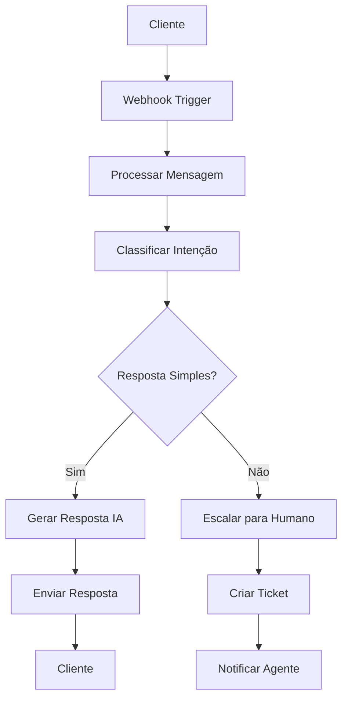

# Chatbot de Suporte ao Cliente

Este exemplo demonstra como criar um chatbot inteligente para suporte ao cliente usando IA no n8n.

## Visão Geral

O chatbot de suporte automatiza respostas a perguntas frequentes, direciona tickets para agentes humanos quando necessário e fornece informações básicas sobre produtos e serviços.

## Arquitetura do Sistema



## Configuração do Workflow

### 1. Webhook Trigger
Configure o trigger para receber mensagens:

```javascript
// Configuração do Webhook
{
  "httpMethod": "POST",
  "path": "chatbot",
  "responseMode": "responseNode",
  "options": {
    "responseHeaders": {
      "Content-Type": "application/json"
    }
  }
}
```

### 2. Processamento da Mensagem
Extraia e valide dados da mensagem:

```javascript
// Function Node: Processar Mensagem
const input = $input.first().json;

// Validar dados obrigatórios
if (!input.message || !input.userId) {
  throw new Error('Mensagem e userId são obrigatórios');
}

// Limpar e normalizar mensagem
const cleanMessage = input.message.trim().toLowerCase();

// Extrair contexto
const context = {
  userId: input.userId,
  timestamp: new Date().toISOString(),
  sessionId: input.sessionId || generateSessionId(),
  previousMessages: input.history || []
};

return {
  message: cleanMessage,
  context: context,
  originalInput: input
};
```

### 3. Classificação de Intenção
Use IA para classificar a intenção do usuário:

```javascript
// OpenAI Chat Node: Classificar Intenção
const systemPrompt = `
Você é um classificador de intenções para um chatbot de suporte.
Classifique a mensagem do usuário em uma das seguintes categorias:

- product_info: Perguntas sobre produtos
- pricing: Perguntas sobre preços
- technical_support: Problemas técnicos
- billing: Questões de cobrança
- general_inquiry: Perguntas gerais
- escalation: Precisa de atendimento humano

Responda apenas com a categoria, sem explicações.
`;

const userMessage = $input.first().json.message;

return {
  systemPrompt: systemPrompt,
  userMessage: userMessage,
  model: "gpt-3.5-turbo",
  temperature: 0.1
};
```

### 4. Geração de Resposta
Crie respostas baseadas na intenção classificada:

```javascript
// Function Node: Gerar Resposta Baseada na Intenção
const intent = $input.first().json.intent;
const message = $input.all()[1].json.message;
const context = $input.all()[1].json.context;

// Base de conhecimento
const knowledgeBase = {
  product_info: {
    prompt: "Forneça informações detalhadas sobre produtos da empresa",
    examples: [
      "Quais são os recursos do produto X?",
      "Como funciona o produto Y?",
      "Qual a diferença entre os planos?"
    ]
  },
  pricing: {
    prompt: "Forneça informações sobre preços e planos",
    examples: [
      "Quanto custa o plano básico?",
      "Há desconto para pagamento anual?",
      "Quais são as opções de pagamento?"
    ]
  },
  technical_support: {
    prompt: "Ajude com problemas técnicos básicos",
    examples: [
      "Como resetar minha senha?",
      "O sistema está lento, o que fazer?",
      "Não consigo fazer login"
    ]
  }
};

const intentConfig = knowledgeBase[intent] || knowledgeBase.general_inquiry;

return {
  systemPrompt: `Você é um assistente de suporte ao cliente. ${intentConfig.prompt}`,
  userMessage: message,
  context: context,
  intent: intent,
  shouldEscalate: intent === 'escalation' || intent === 'billing'
};
```

### 5. Escalação para Humano
Quando necessário, crie ticket para atendimento humano:

```javascript
// Function Node: Criar Ticket
const shouldEscalate = $input.first().json.shouldEscalate;
const context = $input.all()[1].json.context;
const message = $input.all()[1].json.message;

if (shouldEscalate) {
  // Criar ticket no sistema
  const ticket = {
    id: generateTicketId(),
    userId: context.userId,
    message: message,
    intent: $input.first().json.intent,
    priority: determinePriority($input.first().json.intent),
    status: 'open',
    createdAt: new Date().toISOString(),
    assignedTo: null
  };
  
  return {
    action: 'create_ticket',
    ticket: ticket,
    response: "Sua solicitação foi encaminhada para nossa equipe. Você receberá uma resposta em breve."
  };
} else {
  return {
    action: 'ai_response',
    response: $input.first().json.response
  };
}
```

## Implementação Detalhada

### Base de Conhecimento
Mantenha uma base de conhecimento estruturada:

```javascript
// Estrutura da base de conhecimento
const knowledgeBase = {
  products: {
    "produto-a": {
      name: "Produto A",
      description: "Solução completa para pequenas empresas",
      features: ["Recurso 1", "Recurso 2", "Recurso 3"],
      pricing: "R$ 99/mês",
      faq: [
        {
          question: "Como funciona o Produto A?",
          answer: "O Produto A é uma solução completa que..."
        }
      ]
    }
  },
  common_issues: {
    "login-problem": {
      title: "Problemas de Login",
      solutions: [
        "Verifique se o email está correto",
        "Tente resetar sua senha",
        "Limpe o cache do navegador"
      ]
    }
  }
};
```

### Sistema de Escalação
Implemente regras para escalação:

```javascript
// Função para determinar prioridade
function determinePriority(intent) {
  const priorityMap = {
    'billing': 'high',
    'technical_support': 'medium',
    'product_info': 'low',
    'pricing': 'low',
    'general_inquiry': 'low',
    'escalation': 'high'
  };
  
  return priorityMap[intent] || 'medium';
}

// Função para gerar ID único
function generateTicketId() {
  return 'TKT-' + Date.now() + '-' + Math.random().toString(36).substr(2, 9);
}
```

### Integração com Sistemas Externos

#### Notificação de Agentes
```javascript
// Slack Node: Notificar Agente
const ticket = $input.first().json.ticket;

return {
  channel: "#suporte",
  text: `Novo ticket criado: ${ticket.id}`,
  blocks: [
    {
      type: "section",
      text: {
        type: "mrkdwn",
        text: `*Novo Ticket: ${ticket.id}*\nUsuário: ${ticket.userId}\nPrioridade: ${ticket.priority}\nMensagem: ${ticket.message}`
      }
    },
    {
      type: "actions",
      elements: [
        {
          type: "button",
          text: {
            type: "plain_text",
            text: "Atender"
          },
          value: ticket.id,
          action_id: "attend_ticket"
        }
      ]
    }
  ]
};
```

#### Armazenamento de Conversas
```javascript
// HTTP Request Node: Salvar Conversa
const conversation = {
  sessionId: $input.first().json.context.sessionId,
  userId: $input.first().json.context.userId,
  messages: [
    {
      role: "user",
      content: $input.first().json.message,
      timestamp: new Date().toISOString()
    },
    {
      role: "assistant",
      content: $input.first().json.response,
      timestamp: new Date().toISOString()
    }
  ]
};

return {
  method: "POST",
  url: "https://api.exemplo.com/conversations",
  body: conversation,
  headers: {
    "Content-Type": "application/json",
    "Authorization": "Bearer {{ $env.API_TOKEN }}"
  }
};
```

## Métricas e Analytics

### Coleta de Métricas
```javascript
// Function Node: Coletar Métricas
const metrics = {
  timestamp: new Date().toISOString(),
  sessionId: $input.first().json.context.sessionId,
  intent: $input.first().json.intent,
  responseTime: Date.now() - $input.first().json.context.timestamp,
  escalated: $input.first().json.shouldEscalate,
  userSatisfaction: null // Será preenchido posteriormente
};

return {
  ...$input.first().json,
  metrics: metrics
};
```

### Dashboard de Performance
```javascript
// Agregação de métricas
const metrics = $input.all().map(item => item.json.metrics);

const analytics = {
  totalConversations: metrics.length,
  escalationRate: metrics.filter(m => m.escalated).length / metrics.length,
  averageResponseTime: metrics.reduce((sum, m) => sum + m.responseTime, 0) / metrics.length,
  intentDistribution: metrics.reduce((acc, m) => {
    acc[m.intent] = (acc[m.intent] || 0) + 1;
    return acc;
  }, {})
};

return analytics;
```

## Boas Práticas

### Segurança
1. **Valide todas as entradas** do usuário
2. **Sanitize dados** antes de processar
3. **Implemente rate limiting** para evitar spam
4. **Use HTTPS** para todas as comunicações

### Performance
1. **Cache respostas frequentes** para reduzir latência
2. **Implemente timeout** para operações de IA
3. **Use conexões persistentes** para APIs externas
4. **Monitore uso de recursos** da IA

### Experiência do Usuário
1. **Forneça feedback imediato** para ações do usuário
2. **Mantenha contexto** entre mensagens
3. **Ofereça opções claras** para escalação
4. **Teste com usuários reais** regularmente

## Recursos Relacionados

- **[OpenAI Chat Node](../nodes-ia/openai-chat)** - Node para IA conversacional
- **[Memory Manager](../nodes-ia/memory-manager)** - Gerenciamento de contexto
- **[Output Parser](../nodes-ia/output-parser)** - Processamento de respostas
- **[Sentiment Analysis](../nodes-ia/sentiment-analysis)** - Análise de sentimento
- **[Workflow Tool](../nodes-ia/workflow-tool)** - Integração com workflows 