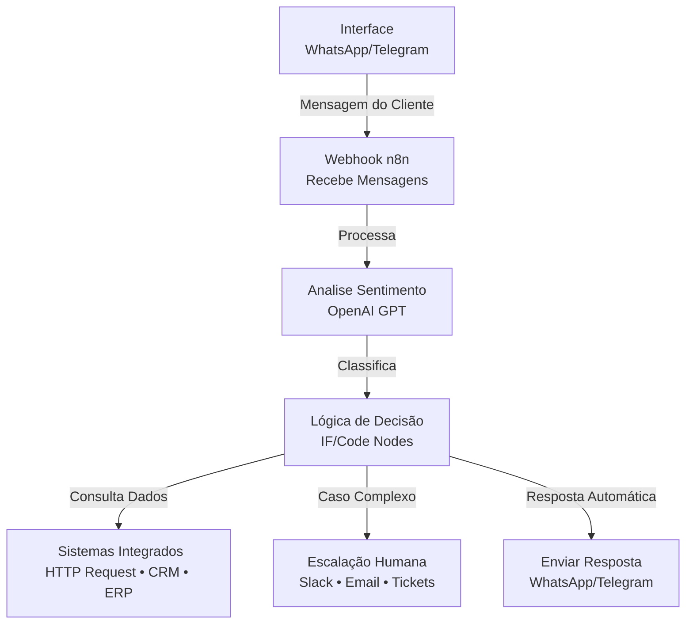
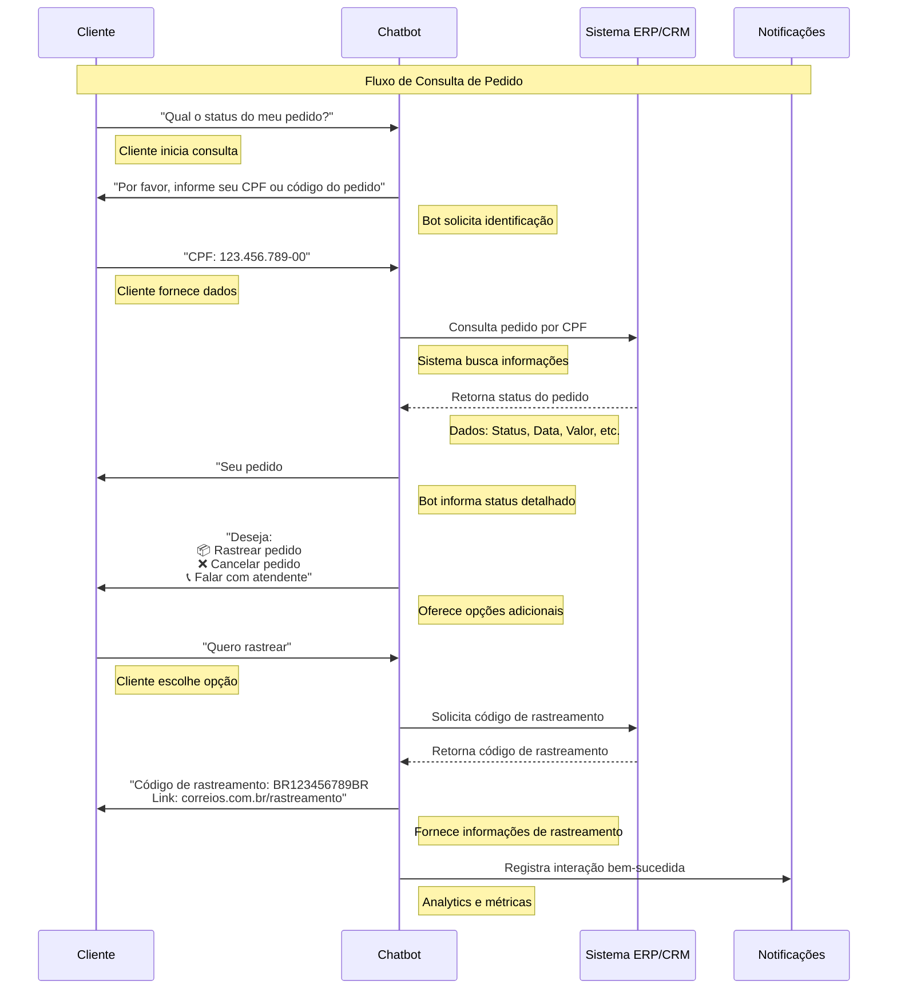
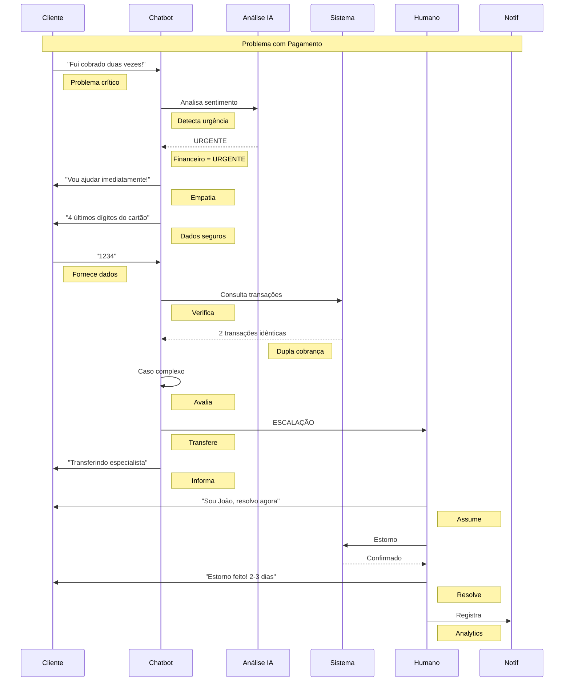
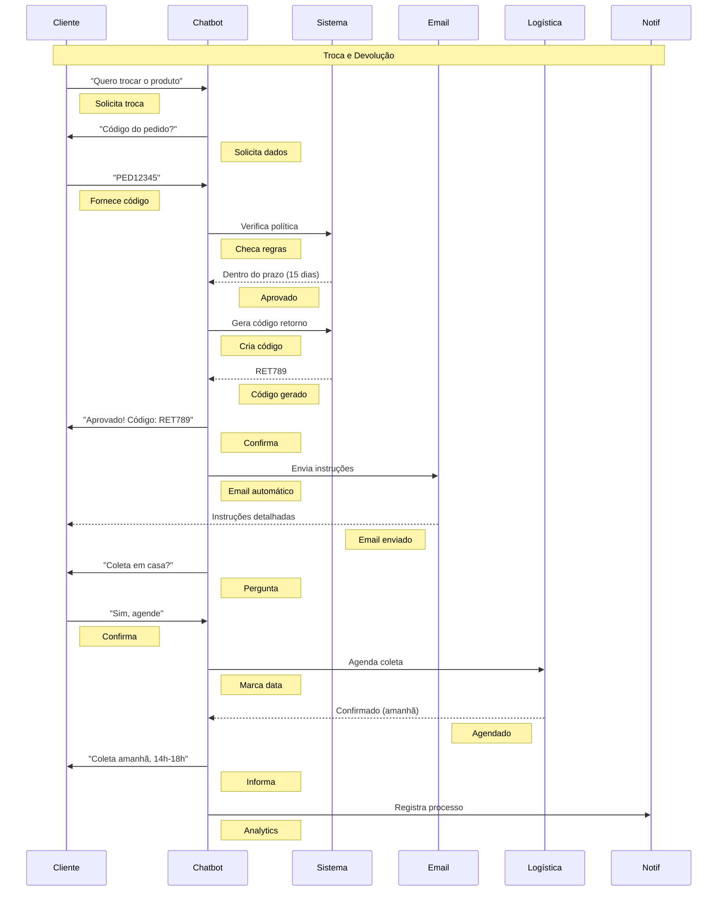
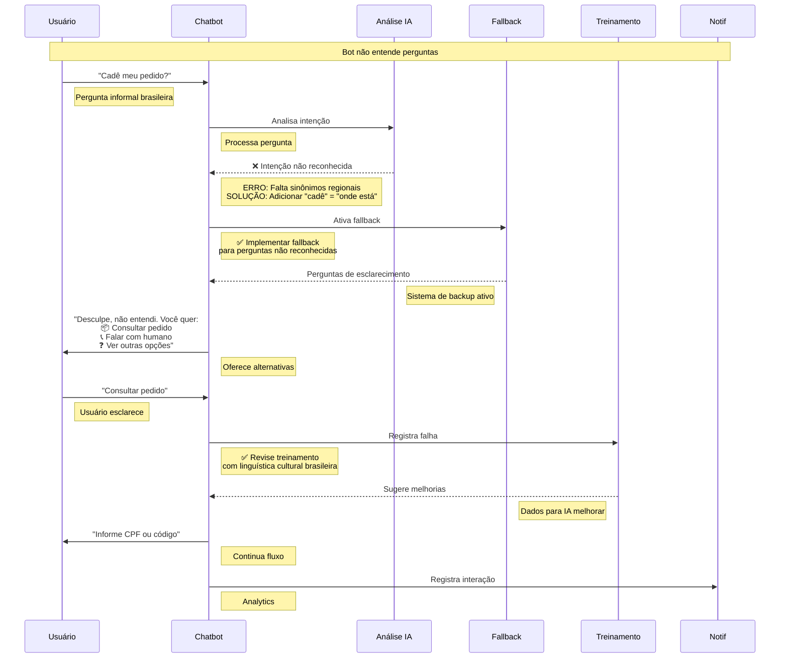
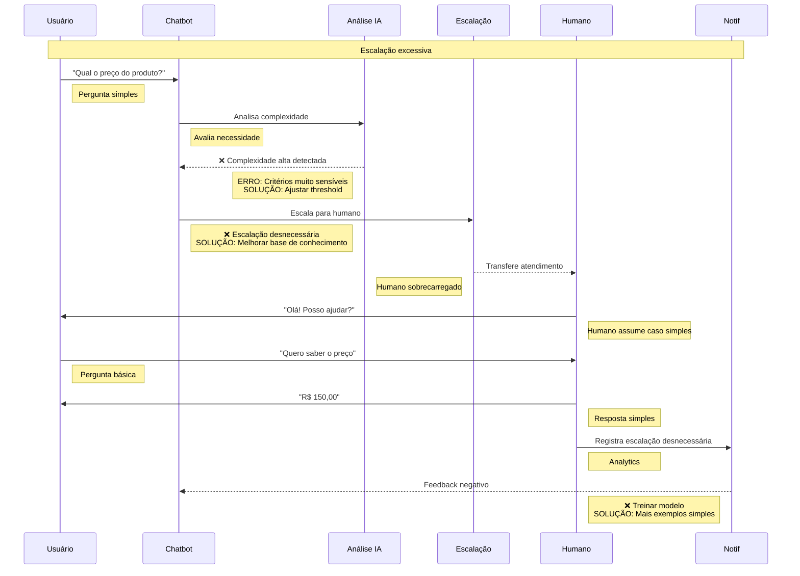
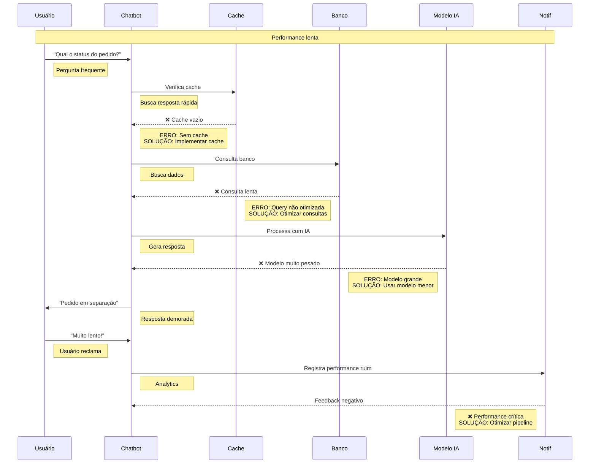

#chatbot-de-suporte-com-ia no n8n: Atendimento Inteligente e Escalável

Este guia ensina como criar chatbots inteligentes para atendimento ao cliente usando n8n, com automação de atendimento, integração com WhatsApp Business API, análise de sentimento, compliance LGPD e recursos avançados para empresas brasileiras que buscam eficiência e escalabilidade.

:::warning **Validação em Andamento**
<IonicIcon name="time-outline" style={{ fontSize: '16px', color: '#cor-f59e0b-este-workflow está sendo validado tecnicamente e será testado em breve.**

**Próximos passos:**
- <IonicIcon name="checkmark-circle-outline" style={{ fontSize: '16px', color: '#cor-10b981-configuraes-tcnicas revisadas
- <IonicIcon name="refresh-outline" style={{ fontSize: '16px', color: '#cor-3b82f6-validao-prtica em ambiente de testes
- <IonicIcon name="videocam-outline" style={{ fontSize: '16px', color: '#cor-8b5cf6-vdeo-de demonstração e validação será publicado em breve**
- <IonicIcon name="list-outline" style={{ fontSize: '16px', color: '#cor-f59e0b-checklist-de implementação será atualizado

**Status atual:** Documentação completa e funcional, aguardando validação final em produção.
:::

Este guia ensina como criar chatbots inteligentes para atendimento ao cliente usando n8n, com recursos avançados como escalação automática, análise de sentimento e integração com sistemas brasileiros de atendimento.

#ionicicon-namecheckmark-circle-outline-style-fontsize-24px color: '#cor-ea4b71-pr-requisitos-tcnicos

Antes de começar, certifique-se de ter:

**Conhecimento Básico:**
- Conceitos de APIs REST e webhooks
- Noções de JavaScript para personalização de lógica
- Familiaridade com fluxos de trabalho visuais

**Infraestrutura Necessária:**
- Instância n8n configurada (versão 1.0+)
- Credenciais configuradas para:
  - OpenAI API (gpt-3.5-turbo ou superior)
  - WhatsApp Business API ou Telegram Bot API
  - Slack Workspace com permissões de bot
  - Sistema CRM/ERP com API disponível

**Recursos de Desenvolvimento:**
- Acesso a ambiente de testes
- Documentação das APIs que serão integradas
- Base de conhecimento da empresa para treinamento

:::tip **Dica de Preparação**
Configure todas as credenciais necessárias antes de iniciar a implementação. Isso evita interrupções durante o desenvolvimento e facilita os testes.
:::

#ionicicon-namechatbubble-ellipses-outline-style-fontsize-24px color: '#cor-ea4b71-caso-de Uso: E-commerce

Imagine um e-commerce brasileiro que recebe centenas de perguntas diárias sobre produtos, pedidos e problemas técnicos. Um chatbot inteligente pode:

- **Reduzir 70% da carga** do atendimento humano
- **Responder 24/7** sem interrupções
- **Escalar automaticamente** casos complexos para humanos
- **Analisar sentimento** para priorizar atendimentos urgentes
- **Integrar com sistemas** brasileiros como WhatsApp Business API

#ionicicon-nameconstruct-outline-style-fontsize-24px color: '#cor-ea4b71-arquitetura-do Sistema

O chatbot de suporte segue uma arquitetura em camadas com fluxo de dados inteligente:



#checkpoint-de-validao-arquitetura

**Teste seu entendimento:**
- [ ] Consigo explicar o fluxo de dados entre os componentes
- [ ] Entendo a função de cada camada da arquitetura
- [ ] Sei identificar onde cada integração acontece

**Se algum ponto não estiver claro, revise a seção anterior antes de continuar.**

#ionicicon-namehammer-outline-style-fontsize-24px color: '#cor-ea4b71-implementao-passo a Passo

<details>
<summary>Implementação Passo a Passo</summary>

#passo-1-configurar-webhook-para Receber Mensagens

Configure um **Webhook** para receber mensagens do WhatsApp ou Telegram com segurança:

#configurao-bsica-do-webhook-json
{
  "node": "n8n-nodes-base.webhook",
  "parameters": {
    "httpMethod": "POST",
    "path": "chatbot",
    "responseMode": "responseNode",
    "options": {
      "responseHeaders": {
        "entries": [
          {
            "name": "Content-Type",
            "value": "application/json"
          },
          {
            "name": "Access-Control-Allow-Origin",
            "value": "*"
          }
        ]
      }
    }
  }
}
```

#opes-de-autenticao-para-produo

**Opção A - Autenticação por Header (Recomendada para APIs customizadas):**

```json
{
  "node": "n8n-nodes-base.webhook",
  "parameters": {
    "httpMethod": "POST",
    "path": "chatbot",
    "responseMode": "responseNode",
    "authentication": "headerAuth",
    "options": {
      "authentication": {
        "headerName": "Authorization",
        "expectedValue": "Bearer {{ $env.WEBHOOK_TOKEN }}"
      },
      "responseHeaders": {
        "entries": [
          {
            "name": "Content-Type",
            "value": "application/json"
          }
        ]
      }
    }
  }
}
```

**Opção B - Validação de Assinatura (Recomendada para WhatsApp/Telegram):**

```json
{
  "node": "n8n-nodes-base.webhook",
  "parameters": {
    "httpMethod": "POST",
    "path": "chatbot",
    "responseMode": "responseNode",
    "options": {
      "authentication": "webhookSignature",
      "signatureAlgorithm": "sha256",
      "secretKey": "{{ $env.WEBHOOK_SECRET }}",
      "responseHeaders": {
        "entries": [
          {
            "name": "Content-Type",
            "value": "application/json"
          }
        ]
      }
    }
  }
}
```

#estruturas-de-dados-esperadas-whatsapp Business API:**
```json
{
  "object": "whatsapp_business_account",
  "entry": [{
    "changes": [{
      "value": {
        "messages": [{
          "from": "5511999999999",
          "text": {"body": "Mensagem do usuário"},
          "timestamp": "1234567890"
        }]
      }
    }]
  }]
}
```

**Telegram Bot API:**
```json
{
  "update_id": 123456789,
  "message": {
    "message_id": 1,
    "from": {"id": 123456, "first_name": "João"},
    "chat": {"id": 123456, "type": "private"},
    "text": "Mensagem do usuário"
  }
}
```

#validao-de-funcionamento-teste-seu webhook com dados simulados:

```bash
#teste-bsico-do-webhook-curl -X POST https://seu-n8n.com/webhook/chatbot \
  -H "Content-Type: application/json" \
  -d '{"message": "teste", "from": "usuario_teste"}'
```

**Resposta esperada:**
```json
{
  "message": "Mensagem processada com sucesso",
  "status": "ok"
}
```

:::tip **Dica de Segurança**
Configure variáveis de ambiente para tokens e secrets. Nunca hardcode credenciais no código.
:::

#n-respond-to-webhook-para Respostas Customizadas

Após processar a mensagem, use o nó "Respond to Webhook" para enviar respostas estruturadas:

```json
{
  "node": "n8n-nodes-base.respondToWebhook",
  "parameters": {
    "respondWith": "json",
    "responseBody": {
      "message": "Mensagem processada com sucesso",
      "status": "ok",
      "timestamp": "={{ new Date().toISOString() }}",
      "sessionId": "={{ $json.sessionId }}"
    },
    "options": {
      "responseHeaders": {
        "entries": [
          {
            "name": "Content-Type",
            "value": "application/json"
          }
        ]
      }
    }
  }
}
```

#passo-2-validao-e-sanitizao de Dados

Antes de processar a mensagem, valide e sanitize os dados de entrada:

```json
{
  "node": "n8n-nodes-base.code",
  "parameters": {
    "code": `
    // Extrair dados da mensagem baseado na plataforma
    let messageData = {};
    
    if ($json.object === 'whatsapp_business_account') {
      // WhatsApp Business API
      const entry = $json.entry[0];
      const change = entry.changes[0];
      const message = change.value.messages[0];
      
      messageData = {
        platform: 'whatsapp',
        message: message.text.body,
        from: message.from,
        timestamp: message.timestamp,
        messageId: message.id
      };
    } else if ($json.message) {
      // Telegram Bot API
      messageData = {
        platform: 'telegram',
        message: $json.message.text,
        from: $json.message.from.id,
        timestamp: $json.message.date,
        messageId: $json.message.message_id,
        firstName: $json.message.from.first_name
      };
    } else {
      throw new Error('Formato de mensagem não reconhecido');
    }
    
    // Sanitização básica
    const sanitizedMessage = messageData.message.replace(/[<>]/g, '');
    
    // Validação de telefone brasileiro (WhatsApp)
    if (messageData.platform === 'whatsapp') {
      const phoneRegex = /^55[1-9]{2}[9]?[0-9]{8}$/;
      const isValidPhone = phoneRegex.test(messageData.from);
      if (!isValidPhone) {
        throw new Error('Número de telefone inválido');
      }
    }
    
    // Verificar conteúdo suspeito
    const suspiciousWords = ['script', 'javascript', 'eval', 'exec', 'alert'];
    const hasSuspiciousContent = suspiciousWords.some(word => 
      sanitizedMessage.toLowerCase().includes(word)
    );
    
    if (hasSuspiciousContent) {
      throw new Error('Conteúdo suspeito detectado');
    }
    
    // Rate limiting básico (implementar com Redis em produção)
    const sessionId = messageData.from + '_' + Math.floor(Date.now() / 60000);
    
    return {
      ...messageData,
      message: sanitizedMessage,
      sessionId,
      timestamp: new Date().toISOString()
    };
    `
  }
}
```

#passo-3-implementar-anlise-de Sentimento

Use o **OpenAI** node para análise de sentimento com configuração validada:

```json
{
  "node": "n8n-nodes-base.openAi",
  "parameters": {
    "resource": "chat",
    "operation": "complete",
    "prompt": {
      "messages": {
        "values": [
          {
            "role": "system",
            "content": "Analise o sentimento da mensagem do cliente considerando o contexto brasileiro. INDICADORES NEGATIVOS: palavras como 'péssimo', 'horrível', 'irritado', 'reclamação', uso excessivo de pontos de exclamação, menções a problemas financeiros. INDICADORES URGENTES: problemas com medicamentos, questões de segurança, reclamações sobre valores altos, clientes idosos. Responda apenas: POSITIVO, NEUTRO, NEGATIVO ou URGENTE"
          },
          {
            "role": "user",
            "content": "={{ $json.body.message }}"
          }
        ]
      }
    },
    "options": {
      "maxTokens": 10,
      "temperature": 0.1
    }
  }
}
```

#passo-4-lgica-de-deciso com IF Node

Configure decisões baseadas no sentimento com estrutura validada:

```json
{
  "node": "n8n-nodes-base.if",
  "parameters": {
    "conditions": {
      "conditions": [
        {
          "id": "urgent",
          "leftValue": "={{ $('Analise_Sentimento').item.json.choices[0].message.content }}",
          "rightValue": "URGENTE",
          "operator": {
            "type": "string",
            "operation": "equals"
          }
        },
        {
          "id": "negative",
          "leftValue": "={{ $('Analise_Sentimento').item.json.choices[0].message.content }}",
          "rightValue": "NEGATIVO",
          "operator": {
            "type": "string",
            "operation": "equals"
          }
        }
      ],
      "combineOperation": "any"
    }
  }
}
```

#passo-5-integrao-com-sistemas

Use **HTTP Request** para consultar dados:

```json
{
  "node": "n8n-nodes-base.httpRequest",
  "parameters": {
    "url": "={{ $credentials.crm.url }}/api/pedidos/{{ $json.customerId }}",
    "method": "GET",
    "authentication": "genericCredentialType",
    "genericAuthType": "httpHeaderAuth",
    "sendHeaders": true,
    "headerParameters": {
      "parameters": [
        {
          "name": "Authorization",
          "value": "Bearer {{ $credentials.crm.token }}"
        }
      ]
    }
  }
}
```

#passo-6-monitoramento-e-logging

Implemente logging estruturado para monitorar o funcionamento do chatbot:

```json
{
  "node": "n8n-nodes-base.code",
  "parameters": {
    "code": `
    // Log estruturado para monitoramento
    const logEntry = {
      timestamp: new Date().toISOString(),
      sessionId: $json.sessionId,
      platform: $json.platform,
      from: $json.from,
      message: $json.message.substring(0, 100), // Primeiros 100 chars
      sentiment: $('Analise_Sentimento').item.json.choices[0].message.content,
      escalated: $json.escalated || false,
      processingTime: Date.now() - new Date($json.timestamp).getTime(),
      status: 'success'
    };
    
    // Em produção, enviar para sistema de logging (ELK, CloudWatch, etc.)
    console.log('Chatbot Log:', JSON.stringify(logEntry));
    
    // Retornar dados para próximo node
    return {
      ...$json,
      logEntry
    };
    `
  }
}
```

#configurao-de-alertas-configure-alertas para situações críticas:

```json
{
  "node": "n8n-nodes-base.code",
  "parameters": {
    "code": `
    const sentiment = $('Analise_Sentimento').item.json.choices[0].message.content;
    const message = $json.message;
    
    // Alertas para situações críticas
    const alerts = [];
    
    if (sentiment === 'URGENTE') {
      alerts.push({
        type: 'urgent',
        message: 'Cliente com problema urgente detectado',
        data: { from: $json.from, message: message }
      });
    }
    
    if (message.toLowerCase().includes('procon') || message.toLowerCase().includes('reclamação')) {
      alerts.push({
        type: 'complaint',
        message: 'Possível reclamação Procon detectada',
        data: { from: $json.from, message: message }
      });
    }
    
    if (message.toLowerCase().includes('cancelar') && message.toLowerCase().includes('pedido')) {
      alerts.push({
        type: 'cancellation',
        message: 'Tentativa de cancelamento detectada',
        data: { from: $json.from, message: message }
      });
    }
    
    return {
      ...$json,
      alerts
    };
    `
  }
}
```

:::tip **Dica de Monitoramento**
Configure dashboards para acompanhar métricas como tempo de resposta, taxa de escalação e satisfação do cliente.
:::

</details>

#checkpoint-de-validao-implementao

**Teste seu entendimento:**
- [ ] Consigo configurar cada node com os parâmetros corretos
- [ ] Entendo como os dados fluem entre os nodes
- [ ] Sei ajustar as configurações para meu caso específico

**Se algum ponto não estiver claro, revise a seção anterior antes de continuar.**

<details>
<summary>Workflow Completo</summary>

#workflow-principal-chatbot-inteligente-mermaid
graph TD
    A[<IonicIcon name="chatbubble-ellipses-outline" /> Webhook<br/>Recebe Mensagem] -->|Processa| B[<IonicIcon name="analytics-outline" /> Analise Sentimento<br/>OpenAI GPT]
    B --> C{<IonicIcon name="alert-circle-outline" /> Urgente?}
    C -->|Sim| D[<IonicIcon name="alert-outline" /> Escalação Imediata<br/>Prioridade Máxima]
    C -->|Não| E[<IonicIcon name="chatbubbles-outline" /> Processar Pergunta<br/>Lógica de Decisão]
    E --> F[<IonicIcon name="search-outline" /> Consultar Dados<br/>HTTP Request]
    F --> G{<IonicIcon name="bulb-outline" /> Resposta Encontrada?}
    G -->|Sim| H[<IonicIcon name="send-outline" /> Enviar Resposta<br/>WhatsApp/Telegram]
    G -->|Não| I[<IonicIcon name="people-outline" /> Escalar para Humano<br/>Caso Complexo]
    D --> J[<IonicIcon name="notifications-outline" /> Notificar Supervisor<br/>Slack/Email]
    I --> K[<IonicIcon name="ticket-outline" /> Criar Ticket<br/>Sistema de Suporte]
    H --> L[<IonicIcon name="document-text-outline" /> Registrar Interação<br/>Analytics]
    
    style A fill:#cor-e3f2fd-style-b-fill#cor-f3e5f5-style-c-fill#cor-fff3e0-style-d-fill#cor-ffebee-style-e-fill#cor-e8f5e8-style-f-fill#cor-f1f8e9-style-g-fill#cor-fff8e1-style-h-fill#cor-e0f2f1-style-i-fill#cor-fce4ec-style-j-fill#cor-fafafa-style-k-fill#cor-f3e5f5-style-l-fill#cor-e8eaf6

#workflow-de-escalao-mermaid-graph TD
    A[<IonicIcon name="alert-outline" /> Detectar Escalação<br/>Caso Complexo] -->|Analisa| B[<IonicIcon name="analytics-outline" /> Análise de Criticidade<br/>Define Prioridade]
    B -->|Seleciona| C[<IonicIcon name="person-outline" /> Selecionar Agente<br/>Especialista Adequado]
    C -->|Notifica| D[<IonicIcon name="logo-slack" /> Enviar para Slack<br/>Canal de Suporte]
    D -->|Complementa| E[<IonicIcon name="mail-outline" /> Enviar Email<br/>Notificação Formal]
    E -->|Registra| F[<IonicIcon name="ticket-outline" /> Criar Ticket CRM<br/>Sistema de Gestão]
    F -->|Informa| G[<IonicIcon name="chatbubble-ellipses-outline" /> Notificar Cliente<br/>Status Atualizado]
    
    style A fill:#cor-ffebee-style-b-fill#cor-fff3e0-style-c-fill#cor-e8f5e8-style-d-fill#cor-e3f2fd-style-e-fill#cor-f3e5f5-style-f-fill#cor-f1f8e9-style-g-fill#cor-e0f2f1-details-details-summaryintegraes de Comunicação</summary>

#whatsapp-business-api-json
  "node": "n8n-nodes-base.httpRequest",
  "parameters": {
    "url": "https://graph.facebook.com/v18.0/{{ $credentials.whatsapp.phoneNumberId }}/messages",
    "method": "POST",
    "headers": {
      "Authorization": "Bearer {{ $credentials.whatsapp.accessToken }}",
      "Content-Type": "application/json"
    },
    "body": {
      "messaging_product": "whatsapp",
      "to": "{{ $json.customerPhone }}",
      "type": "text",
      "text": {
        "body": "{{ $json.response }}"
      }
    }
  }
}
```

#sistema-de-tickets-zendeskservicenow-json
{
  "node": "n8n-nodes-base.httpRequest",
  "parameters": {
    "url": "{{ $credentials.zendesk.url }}/api/v2/tickets.json",
    "method": "POST",
    "headers": {
      "Authorization": "Basic {{ $credentials.zendesk.token }}",
      "Content-Type": "application/json"
    },
    "body": {
      "ticket": {
        "subject": "Escalação Chatbot - {{ $json.customerName }}",
        "description": "{{ $json.conversation }}",
        "priority": "{{ $json.priority }}",
        "tags": ["chatbot", "escalação", "{{ $json.category }}"]
      }
    }
  }
}
```

</details>

<details>
<summary>Configurações Avançadas</summary>

#prompts-otimizados-para-portugus-javascript
// Prompt do Sistema para OpenAI
const systemPrompt = `
Você é um assistente virtual especializado em atendimento ao cliente para e-commerce brasileiro.

REGRAS IMPORTANTES:
1. Use linguagem formal mas amigável
2. Sempre confirme informações antes de dar respostas definitivas
3. Para problemas de pagamento, peça dados de forma segura
4. Para reclamações, demonstre empatia e ofereça soluções
5. Use emojis moderadamente para tornar a conversa mais humana
6. Sempre ofereça alternativas quando possível

CAPACIDADES:
- Consultar produtos e preços
- Verificar status de pedidos
- Explicar políticas de troca e devolução
- Abrir tickets de suporte
- Escalar casos complexos para humanos

EXEMPLOS DE RESPOSTAS:
- "Entendo sua situação, vou verificar isso para você..."
- "Para sua segurança, preciso confirmar alguns dados..."
- "Vou escalar seu caso para um atendente especializado..."
`;

// Prompt para Análise de Sentimento
const sentimentPrompt = `
Analise o sentimento do cliente considerando o contexto brasileiro:

INDICADORES NEGATIVOS:
- Palavras como "péssimo", "horrível", "irritado", "reclamação"
- Uso excessivo de pontos de exclamação
- Menções a problemas financeiros ou tempo perdido
- Referências a processos judiciais ou Procon

INDICADORES URGENTES:
- Problemas com medicamentos ou produtos essenciais
- Questões de segurança ou dados pessoais
- Reclamações sobre valores altos ou cobranças indevidas
- Clientes idosos ou com necessidades especiais

Responda apenas: POSITIVO, NEUTRO, NEGATIVO ou URGENTE
`;
```

#configurao-de-horrios-javascript Verificar Horário de Atendimento
const checkBusinessHours = {
  "node": "n8n-nodes-base.code",
  "parameters": {
    "code": `
    const now = new Date();
    const hour = now.getHours();
    const day = now.getDay(); // 0 = Domingo, 1 = Segunda...
    
    // Horário comercial: Segunda a Sexta, 8h às 18h
    const isBusinessHours = day >= 1 && day <= 5 && hour >= 8 && hour < 18;
    
    // Fins de semana e feriados: apenas chatbot básico
    const isWeekend = day === 0 || day === 6;
    
    return {
      isBusinessHours,
      isWeekend,
      currentTime: now.toLocaleString('pt-BR'),
      message: isBusinessHours ? 
        "Atendimento humano disponível" : 
        "Atendimento apenas por chatbot"
    };
    `
  }
};
```

</details>

#ionicicon-nameshield-checkmark-outline-style-fontsize-24px color: '#cor-ea4b71-consideraes-de Segurança e LGPD

#tratamento-de-dados-pessoais-o chatbot processa informações sensíveis dos clientes. Implemente estas práticas:

**Minimização de Dados:**
- Armazene apenas dados necessários para o atendimento
- Configure retenção automática (max. 30 dias para logs)
- Criptografe dados em trânsito e em repouso

**Consentimento e Transparência:**
- Informe sobre coleta de dados na primeira interação
- Permita opt-out a qualquer momento
- Mantenha registro de consentimentos

**Segurança Técnica:**
- Use HTTPS para todas as comunicações
- Implemente rate limiting nos webhooks
- Valide e sanitize todas as entradas de dados
- Configure logs de auditoria para acesso aos dados

#implementao-de-segurana-javascript Validação de Dados de Entrada
const validateInput = {
  "node": "n8n-nodes-base.code",
  "parameters": {
    "code": `
    const message = $json.body.message;
    const phone = $json.body.phone;
    
    // Sanitização básica
    const sanitizedMessage = message.replace(/[<>]/g, '');
    
    // Validação de telefone brasileiro
    const phoneRegex = /^\+55\s?\(?[1-9]{2}\)?\s?[9]?[0-9]{4}-?[0-9]{4}$/;
    const isValidPhone = phoneRegex.test(phone);
    
    // Verificar conteúdo suspeito
    const suspiciousWords = ['script', 'javascript', 'eval', 'exec'];
    const hasSuspiciousContent = suspiciousWords.some(word => 
      sanitizedMessage.toLowerCase().includes(word)
    );
    
    if (hasSuspiciousContent) {
      throw new Error('Conteúdo suspeito detectado');
    }
    
    return {
      message: sanitizedMessage,
      phone: isValidPhone ? phone : null,
      timestamp: new Date().toISOString(),
      sessionId: $json.body.sessionId
    };
    `
  }
};
```

#ionicicon-namestats-chart-outline-style-fontsize-24px color: '#cor-ea4b71-monitoramento-e Analytics

#mtricas-importantes-taxa-de Resolução**: % de casos resolvidos pelo chatbot
- **Tempo de Resposta**: Tempo médio para primeira resposta
- **Satisfação do Cliente**: NPS após interação com chatbot
- **Taxa de Escalação**: % de casos que precisam de humano
- **Custo por Interação**: Custo total vs. interações humanas

#dashboard-de-monitoramento-details-summarydashboard de Monitoramento</summary>

```javascript
// Coletar Métricas
const collectMetrics = {
  "node": "n8n-nodes-base.code",
  "parameters": {
    "code": `
    const metrics = {
      timestamp: new Date().toISOString(),
      sessionId: $json.sessionId,
      customerId: $json.customerId,
      messageCount: $json.messageCount,
      sentiment: $json.sentiment,
      resolutionTime: $json.resolutionTime,
      escalated: $json.escalated,
      satisfaction: $json.satisfaction
    };
    
    // Enviar para sistema de analytics
    return metrics;
    `
  }
};
```

</details>

#ionicicon-namelist-outline-style-fontsize-24px color: '#cor-ea4b71-casos-de Uso Específicos

#id-1-consulta-de-pedido-fluxo
1. Cliente pergunta sobre pedido
2. Bot solicita CPF ou código do pedido
3. Sistema consulta ERP/CRM
4. Bot retorna status detalhado
5. Oferece opções adicionais (rastreamento, cancelamento)



#id-2-problema-com-pagamento-fluxo
1. Cliente relata problema de pagamento
2. Análise de sentimento detecta urgência
3. Bot coleta dados de forma segura
4. Sistema verifica transação
5. Se complexo, escala imediatamente para humano



#id-3-troca-e-devoluo-fluxo
1. Cliente solicita troca/devolução
2. Bot verifica política e prazo
3. Gera código de retorno
4. Envia instruções por email
5. Agenda coleta se necessário



#checkpoint-de-validao-casos de Uso

**Teste seu entendimento:**
- [ ] Consigo implementar cada fluxo específico
- [ ] Entendo como adaptar para meu negócio
- [ ] Sei configurar as integrações necessárias

**Se algum ponto não estiver claro, revise a seção anterior antes de continuar.**

#ionicicon-namewarning-outline-style-fontsize-24px color: '#cor-ea4b71-troubleshooting

#problemas-comuns-bot-no-entende perguntas**
- Revise o treinamento com dados brasileiros
- Adicione sinônimos e variações regionais
- Implemente fallback para perguntas não reconhecidas



**Escalação excessiva**
- Ajuste os critérios de escalação
- Melhore a base de conhecimento
- Treine o modelo com mais exemplos



**Performance lenta**
- Implemente cache de respostas frequentes
- Otimize consultas ao banco de dados
- Use modelos menores para desenvolvimento



#ionicicon-namearrow-forward-outline-style-fontsize-24px color: '#cor-ea4b71-prximos-passos

:::tip **Dica Importante**
Comece com um chatbot simples e vá adicionando funcionalidades gradualmente. Teste extensivamente com usuários reais antes de implementar em produção.
:::

1. **Implemente o workflow básico** com webhook e análise de sentimento
2. **Adicione integrações** com seus sistemas existentes
3. **Otimize as configurações** baseado no feedback dos usuários
4. **Implemente monitoramento** para acompanhar a performance
5. **Expanda para outros canais** conforme necessário

#checkpoint-final-de-validao-antes de implementar em produção:**
- [ ] Testei todos os fluxos em ambiente de desenvolvimento
- [ ] Configurei todas as credenciais necessárias
- [ ] Implementei tratamento de erros adequado
- [ ] Configurei monitoramento e alertas
- [ ] Treinei a equipe de suporte para casos escalados
- [ ] Documentei procedimentos de emergência

**Se algum item não estiver completo, revise as seções correspondentes.**

#ionicicon-namelibrary-outline-style-fontsize-24px color: '#cor-ea4b71-recursos-adicionais

- [Integração com WhatsApp Business API](/integracoes/app-nodes/communication)
- [Sistemas de CRM e ERP](/integracoes/app-nodes)
- [Compliance LGPD para Chatbots](/privacidade-seguranca/lgpd-compliance)
- [Templates de Workflow para Chatbots](https://n8n.io/workflows/?categories=25)

---

