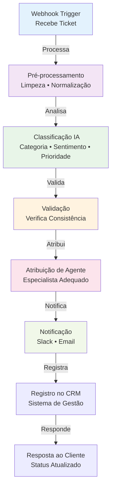
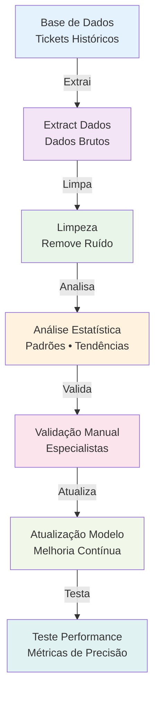

---
sidebar_position: 4
title: "Classificação Automática de Dados com IA no n8n: Suporte e Atendimento Inteligente"
description: Automatize a classificação de dados e tickets usando IA no n8n, com priorização inteligente, análise de sentimento e integração para empresas brasileiras.
keywords: [n8n, classificação, dados, ia, machine learning, categorização, sentimento, tickets, automação inteligente, suporte Brasil, priorização, automação de tickets, workflow inteligente]
---

# Classificação Automática de Dados com IA no n8n: Suporte e Atendimento Inteligente

Este guia ensina como implementar sistemas de classificação automática de dados e tickets usando IA no n8n, com priorização inteligente, análise de sentimento, automação de suporte e integração com sistemas brasileiros para empresas que buscam eficiência operacional.

## Caso de Uso: Sistema de Tickets de Suporte

Imagine uma empresa brasileira que recebe centenas de tickets de suporte diariamente por diferentes canais (email, WhatsApp, portal). Um sistema de classificação automática pode:

- **Categorizar automaticamente** tickets por tipo de problema
- **Priorizar atendimentos** baseado na urgência e sentimento
- **Rotear para especialistas** corretos automaticamente
- **Reduzir tempo de resposta** em 60%
- **Melhorar satisfação** do cliente

## Tipos de Classificação

### 1. Classificação por Categoria
- **Técnico**: Problemas de sistema, bugs, configurações
- **Comercial**: Vendas, preços, produtos
- **Financeiro**: Pagamentos, reembolsos, cobranças
- **Operacional**: Logística, entrega, estoque

### 2. Análise de Sentimento
- **Positivo**: Cliente satisfeito, elogios
- **Neutro**: Consultas simples, informações
- **Negativo**: Reclamações, insatisfação
- **Urgente**: Problemas críticos, emergências

### 3. Priorização Automática
- **Alta**: Problemas críticos, clientes VIP
- **Média**: Problemas normais, tempo padrão
- **Baixa**: Consultas simples, informações

## Implementação Passo a Passo

<details>
<summary>Implementação Passo a Passo</summary>

### Passo 1: Configurar Pipeline de Dados

Configure o workflow para receber e processar dados:

```json
{
  "node": "n8n-nodes-base.webhook",
  "parameters": {
    "httpMethod": "POST",
    "path": "classificar-ticket",
    "responseMode": "responseNode",
    "options": {
      "responseHeaders": {
        "Content-Type": "application/json"
      }
    }
  }
}
```

### Passo 2: Pré-processamento de Texto

Implemente limpeza e normalização do texto:

```javascript
// Node de Pré-processamento
const preprocessText = {
  "node": "n8n-nodes-base.code",
  "parameters": {
    "code": `
    const text = $json.message || $json.content || '';
    
    // Limpeza básica
    let cleanedText = text
      .toLowerCase()
      .replace(/[^\w\s\u00C0-\u017F]/g, ' ') // Remove caracteres especiais, mantém acentos
      .replace(/\s+/g, ' ') // Remove espaços múltiplos
      .trim();
    
    // Normalização de termos brasileiros
    const brazilianTerms = {
      'problema': 'problema',
      'erro': 'erro', 
      'bug': 'problema',
      'falha': 'problema',
      'não funciona': 'problema',
      'pagamento': 'financeiro',
      'dinheiro': 'financeiro',
      'cobrança': 'financeiro',
      'entrega': 'operacional',
      'frete': 'operacional',
      'produto': 'comercial',
      'preço': 'comercial'
    };
    
    // Substituir termos
    Object.entries(brazilianTerms).forEach(([term, replacement]) => {
      cleanedText = cleanedText.replace(new RegExp(term, 'g'), replacement);
    });
    
    return {
      originalText: text,
      cleanedText: cleanedText,
      wordCount: cleanedText.split(' ').length,
      hasUrgency: /urgente|crítico|emergência|problema grave/i.test(text)
    };
    `
  }
};
```

### Passo 3: Classificação com IA

Configure o modelo de classificação:

```json
{
  "node": "n8n-nodes-langchain.llmchain",
  "parameters": {
    "model": "gpt-4",
    "prompt": `
    Você é um especialista em classificação de tickets de suporte para empresas brasileiras.
    
    Analise o seguinte ticket e classifique-o:
    
    TEXTO: {{ $json.cleanedText }}
    
    CLASSIFICAÇÕES NECESSÁRIAS:
    
    1. CATEGORIA (responda apenas uma):
    - TÉCNICO: Problemas de sistema, bugs, configurações, erros técnicos
    - COMERCIAL: Vendas, produtos, preços, catálogo, promoções
    - FINANCEIRO: Pagamentos, reembolsos, cobranças, valores, cartão
    - OPERACIONAL: Entrega, logística, estoque, frete, rastreamento
    
    2. SENTIMENTO (responda apenas uma):
    - POSITIVO: Cliente satisfeito, elogios, agradecimentos
    - NEUTRO: Consultas simples, pedidos de informação, neutro
    - NEGATIVO: Reclamações, insatisfação, problemas
    - URGENTE: Problemas críticos, emergências, muito irritado
    
    3. PRIORIDADE (responda apenas uma):
    - ALTA: Problemas críticos, clientes VIP, urgências
    - MÉDIA: Problemas normais, tempo padrão de resposta
    - BAIXA: Consultas simples, informações básicas
    
    Responda no formato JSON:
    {
      "categoria": "TÉCNICO|COMERCIAL|FINANCEIRO|OPERACIONAL",
      "sentimento": "POSITIVO|NEUTRO|NEGATIVO|URGENTE",
      "prioridade": "ALTA|MÉDIA|BAIXA",
      "confianca": 0.85,
      "palavras_chave": ["problema", "sistema", "erro"]
    }
    `,
    "outputParser": "structured"
  }
}
```

### Passo 4: Pós-processamento e Validação

Implemente validação e ajustes finais:

```javascript
// Node de Validação e Ajustes
const postProcessClassification = {
  "node": "n8n-nodes-base.code",
  "parameters": {
    "code": `
    const classification = $json;
    const preprocess = $('Preprocess Text').first().json;
    
    // Ajustar prioridade baseado em indicadores de urgência
    let adjustedPriority = classification.prioridade;
    if (preprocess.hasUrgency || classification.sentimento === 'URGENTE') {
      adjustedPriority = 'ALTA';
    }
    
    // Ajustar categoria baseado em palavras-chave específicas
    const text = preprocess.cleanedText;
    if (text.includes('pagamento') || text.includes('dinheiro') || text.includes('cobrança')) {
      classification.categoria = 'FINANCEIRO';
    }
    
    // Calcular score de confiança
    const confidenceScore = Math.min(classification.confianca * 100, 100);
    
    return {
      ...classification,
      prioridade: adjustedPriority,
      confianca: confidenceScore,
      timestamp: new Date().toISOString(),
      metadata: {
        wordCount: preprocess.wordCount,
        hasUrgency: preprocess.hasUrgency,
        processingTime: Date.now() - $json.startTime
      }
    };
    `
  }
};
```

</details>

<details>
<summary>Workflow Completo</summary>



</details>

### Workflow de Treinamento



## Configurações Avançadas

### Prompts Especializados por Categoria

```javascript
// Prompt para Tickets Técnicos
const technicalPrompt = `
Analise este ticket técnico para uma empresa brasileira:

TEXTO: {{ $json.text }}

CLASSIFICAÇÕES TÉCNICAS:
- SISTEMA: Problemas de login, interface, performance
- INFRAESTRUTURA: Servidores, rede, conectividade  
- DADOS: Problemas com informações, sincronização
- INTEGRAÇÃO: APIs, webhooks, sistemas externos
- CONFIGURAÇÃO: Setup, personalização, permissões

URGÊNCIA TÉCNICA:
- CRÍTICO: Sistema inacessível, perda de dados
- ALTO: Funcionalidade principal afetada
- MÉDIO: Funcionalidade secundária afetada
- BAIXO: Melhoria, sugestão, dúvida

Responda em JSON com categoria_tecnica e urgencia_tecnica.
`;

// Prompt para Análise de Sentimento Brasileira
const sentimentPrompt = `
Analise o sentimento considerando o contexto brasileiro:

INDICADORES CULTURAIS:
- "Poxa", "Nossa": Frustração leve
- "Péssimo", "Horrível": Insatisfação forte
- "Obrigado", "Valeu": Satisfação
- "Procon", "Direitos": Potencial escalação
- "Urgente", "Crítico": Emergência

CONTEXTO BRASILEIRO:
- Problemas com PIX: Alta urgência
- Problemas com CPF/CNPJ: Alta urgência
- Problemas com NFe: Média urgência
- Reclamações sobre frete: Média urgência

Responda: POSITIVO, NEUTRO, NEGATIVO, URGENTE
`;
```

### Sistema de Aprendizado Contínuo

```javascript
// Coletar Feedback para Melhorar Classificação
const feedbackSystem = {
  "node": "n8n-nodes-base.code",
  "parameters": {
    "code": `
    const feedback = {
      ticketId: $json.ticketId,
      originalClassification: $json.classification,
      agentFeedback: $json.agentFeedback,
      correctCategory: $json.correctCategory,
      correctPriority: $json.correctPriority,
      timestamp: new Date().toISOString()
    };
    
    // Armazenar para análise e melhoria do modelo
    // Enviar para sistema de analytics
    return feedback;
    `
  }
};
```

## Casos de Uso Específicos

### 1. E-commerce Brasileiro

**Cenário:** Classificar tickets de clientes de e-commerce

**Categorias:**
- **Produto**: Dúvidas sobre produtos, disponibilidade
- **Pedido**: Status, rastreamento, cancelamento
- **Pagamento**: PIX, cartão, boleto, problemas
- **Entrega**: Frete, prazo, localização
- **Técnico**: Problemas no site, app, conta

### 2. SaaS Brasileiro

**Cenário:** Classificar tickets de clientes de software

**Categorias:**
- **Funcionalidade**: Como usar, configurações
- **Bug**: Problemas técnicos, erros
- **Integração**: APIs, webhooks, conectores
- **Faturamento**: Planos, cobrança, upgrade
- **Suporte**: Treinamento, documentação

### 3. Banco Digital

**Cenário:** Classificar tickets bancários

**Categorias:**
- **Conta**: Abertura, fechamento, dados
- **Pagamento**: PIX, TED, DOC, boleto
- **Cartão**: Limite, bloqueio, fatura
- **Investimento**: Aplicações, resgates
- **Segurança**: Fraude, acesso, recuperação

## Monitoramento e Métricas

### KPIs Importantes

- **Precisão da Classificação**: % de tickets classificados corretamente
- **Tempo de Processamento**: Tempo médio para classificar
- **Taxa de Reclassificação**: % de tickets reclassificados por agentes
- **Satisfação do Cliente**: NPS após resolução
- **Tempo de Resolução**: Tempo médio para resolver por categoria

### Dashboard de Analytics

```javascript
// Métricas de Performance
const performanceMetrics = {
  "node": "n8n-nodes-base.code",
  "parameters": {
    "code": `
    const metrics = {
      date: new Date().toISOString().split('T')[0],
      totalTickets: $json.totalTickets,
      accuracy: $json.accuracy,
      avgProcessingTime: $json.avgProcessingTime,
      categoryDistribution: $json.categoryDistribution,
      sentimentDistribution: $json.sentimentDistribution,
      priorityDistribution: $json.priorityDistribution
    };
    
    // Enviar para sistema de analytics
    return metrics;
    `
  }
};
```

## Troubleshooting

### Problemas Comuns

**Classificação Incorreta**
- Revise o treinamento com dados brasileiros
- Adicione mais exemplos para categorias problemáticas
- Implemente feedback loop para correção

**Performance Lenta**
- Use modelos menores para desenvolvimento
- Implemente cache de classificações similares
- Otimize o pré-processamento de texto

**Overfitting**
- Use validação cruzada
- Teste com dados não vistos
- Implemente regularização nos prompts

## Próximos Passos

1. **Implemente classificação básica** com categorias simples
2. **Adicione análise de sentimento** e priorização
3. **Integre com sistema de tickets** (Zendesk, ServiceNow)
4. **Implemente feedback loop** para melhoria contínua
5. **Adicione classificação multilíngue** se necessário
6. **Expanda para outros tipos** de dados (emails, reviews)

## Recursos Adicionais

- [Integração com Sistemas de CRM](/integracoes-br/financeiro/crm-integration)
- [Análise de Sentimento Avançada](/advanced-ai/nodes-ia/sentiment-analysis)
- [Templates de Workflow para Classificação](https://n8n.io/workflows/?categories=25)
- [Compliance LGPD para Processamento de Dados](/privacidade-seguranca/lgpd-compliance)

---

**💡 Dica:** Comece com poucas categorias bem definidas e expanda gradualmente. Colete feedback dos agentes para melhorar continuamente a precisão da classificação.

