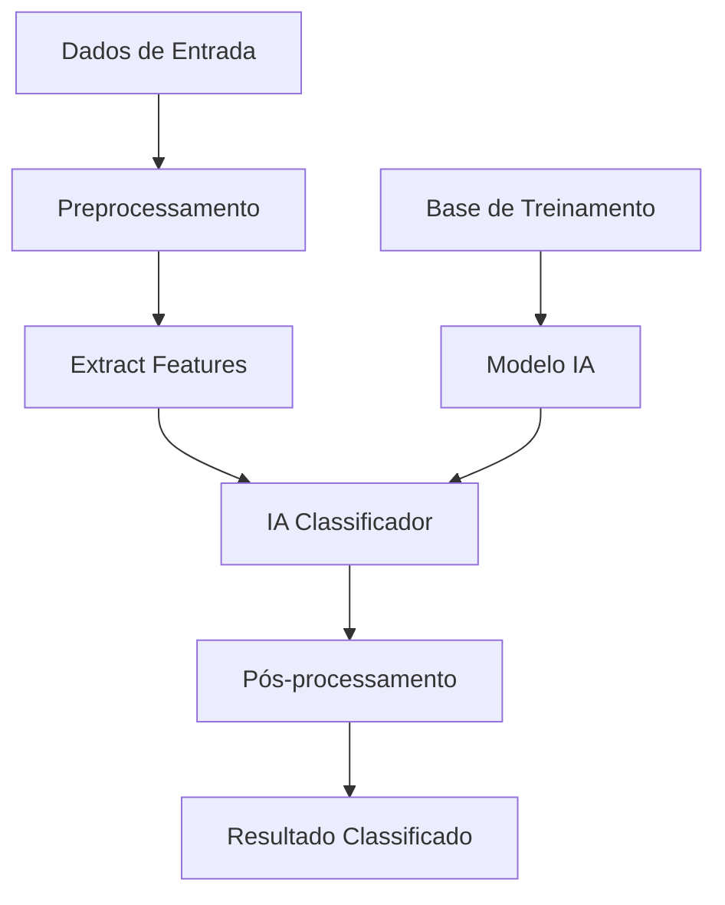

# Classificação Automática de Dados

Este exemplo demonstra como implementar um sistema de classificação automática de dados usando IA no n8n.

## Visão Geral

O sistema de classificação automática categoriza dados de entrada (textos, imagens, documentos) em classes predefinidas, facilitando organização, filtragem e processamento posterior.

## Arquitetura do Sistema



## Configuração do Workflow

### 1. Trigger de Dados
Configure o trigger para receber dados para classificação:

```javascript
// Webhook Trigger: Receber Dados
{
  "httpMethod": "POST",
  "path": "classify",
  "responseMode": "responseNode",
  "options": {
    "responseHeaders": {
      "Content-Type": "application/json"
    }
  }
}
```

### 2. Preprocessamento
Prepare os dados para classificação:

```javascript
// Function Node: Preprocessamento
const input = $input.first().json;

// Validar entrada
if (!input.content) {
  throw new Error('Conteúdo é obrigatório para classificação');
}

// Limpar e normalizar texto
const cleanContent = input.content
  .trim()
  .toLowerCase()
  .replace(/[^\w\s]/g, ' ')
  .replace(/\s+/g, ' ');

// Extrair metadados
const metadata = {
  contentType: input.type || 'text',
  language: detectLanguage(cleanContent),
  length: cleanContent.length,
  wordCount: cleanContent.split(' ').length,
  timestamp: new Date().toISOString()
};

return {
  content: cleanContent,
  metadata: metadata,
  originalInput: input
};
```

### 3. Classificação com IA
Use IA para classificar o conteúdo:

```javascript
// OpenAI Chat Node: Classificação
const systemPrompt = `
Você é um classificador especializado. Analise o conteúdo fornecido e classifique em uma das seguintes categorias:

- business: Conteúdo relacionado a negócios, empresas, mercado
- technology: Tecnologia, software, hardware, inovação
- health: Saúde, medicina, bem-estar
- education: Educação, ensino, aprendizado
- entertainment: Entretenimento, cultura, lazer
- sports: Esportes, atividades físicas
- politics: Política, governo, sociedade
- science: Ciência, pesquisa, descobertas

Responda apenas com a categoria, sem explicações.
`;

const userMessage = $input.first().json.content;

return {
  systemPrompt: systemPrompt,
  userMessage: userMessage,
  model: "gpt-3.5-turbo",
  temperature: 0.1
};
```

### 4. Pós-processamento
Processe e valide os resultados:

```javascript
// Function Node: Pós-processamento
const classification = $input.first().json.classification;
const metadata = $input.all()[1].json.metadata;
const content = $input.all()[1].json.content;

// Validar classificação
const validCategories = [
  'business', 'technology', 'health', 'education',
  'entertainment', 'sports', 'politics', 'science'
];

if (!validCategories.includes(classification)) {
  throw new Error(`Classificação inválida: ${classification}`);
}

// Calcular confiança baseada em características
const confidence = calculateConfidence(content, classification, metadata);

// Adicionar metadados de classificação
const result = {
  classification: classification,
  confidence: confidence,
  metadata: {
    ...metadata,
    classifiedAt: new Date().toISOString(),
    model: "gpt-3.5-turbo"
  },
  content: content
};

return result;
```

## Implementação Detalhada

### Sistema de Confiança
Implemente cálculo de confiança para classificações:

```javascript
// Função para calcular confiança
function calculateConfidence(content, classification, metadata) {
  let confidence = 0.5; // Base
  
  // Fatores que aumentam confiança
  if (metadata.wordCount > 50) confidence += 0.1;
  if (metadata.wordCount > 200) confidence += 0.1;
  
  // Palavras-chave específicas
  const keywords = {
    business: ['empresa', 'negócio', 'mercado', 'investimento', 'lucro'],
    technology: ['software', 'tecnologia', 'programação', 'digital', 'inovação'],
    health: ['saúde', 'médico', 'tratamento', 'bem-estar', 'fitness'],
    education: ['ensino', 'aprendizado', 'escola', 'universidade', 'curso']
  };
  
  const categoryKeywords = keywords[classification] || [];
  const keywordMatches = categoryKeywords.filter(keyword => 
    content.includes(keyword)
  ).length;
  
  confidence += (keywordMatches / categoryKeywords.length) * 0.3;
  
  return Math.min(confidence, 1.0);
}
```

### Classificação Multi-label
Para casos que precisam de múltiplas classificações:

```javascript
// Function Node: Classificação Multi-label
const content = $input.first().json.content;

// Definir categorias e suas características
const categories = {
  urgency: {
    high: ['urgente', 'crítico', 'emergência', 'imediato'],
    medium: ['importante', 'prioridade', 'atenção'],
    low: ['normal', 'rotina', 'padrão']
  },
  sentiment: {
    positive: ['bom', 'excelente', 'ótimo', 'positivo'],
    neutral: ['neutro', 'normal', 'padrão'],
    negative: ['ruim', 'problema', 'negativo', 'crítico']
  },
  complexity: {
    simple: ['básico', 'simples', 'fácil'],
    moderate: ['intermediário', 'moderado'],
    complex: ['complexo', 'avançado', 'difícil']
  }
};

// Classificar em múltiplas dimensões
const classifications = {};

for (const [dimension, options] of Object.entries(categories)) {
  let bestMatch = null;
  let bestScore = 0;
  
  for (const [option, keywords] of Object.entries(options)) {
    const score = keywords.filter(keyword => 
      content.includes(keyword)
    ).length / keywords.length;
    
    if (score > bestScore) {
      bestScore = score;
      bestMatch = option;
    }
  }
  
  classifications[dimension] = {
    category: bestMatch,
    confidence: bestScore
  };
}

return {
  content: content,
  classifications: classifications,
  timestamp: new Date().toISOString()
};
```

### Classificação Hierárquica
Para sistemas com categorias aninhadas:

```javascript
// Function Node: Classificação Hierárquica
const content = $input.first().json.content;

// Estrutura hierárquica de categorias
const hierarchy = {
  technology: {
    software: ['programação', 'desenvolvimento', 'aplicação'],
    hardware: ['computador', 'dispositivo', 'equipamento'],
    ai: ['inteligência artificial', 'machine learning', 'automação']
  },
  business: {
    finance: ['dinheiro', 'investimento', 'finanças'],
    marketing: ['publicidade', 'vendas', 'promoção'],
    operations: ['processo', 'operacional', 'gestão']
  }
};

// Classificação em dois níveis
const primaryClassification = await classifyPrimary(content);
const secondaryClassification = await classifySecondary(content, primaryClassification);

return {
  content: content,
  classification: {
    primary: primaryClassification,
    secondary: secondaryClassification,
    fullPath: `${primaryClassification}/${secondaryClassification}`
  }
};
```

## Casos de Uso Específicos

### Classificação de Emails
```javascript
// Function Node: Classificar Email
const email = $input.first().json;

// Extrair componentes do email
const subject = email.subject || '';
const body = email.body || '';
const sender = email.from || '';

// Análise de componentes
const analysis = {
  subject: await classifyText(subject),
  body: await classifyText(body),
  sender: await classifySender(sender),
  urgency: detectUrgency(subject + ' ' + body),
  spam: detectSpam(email)
};

// Classificação final
const finalClassification = determineFinalClassification(analysis);

return {
  emailId: email.id,
  classification: finalClassification,
  analysis: analysis,
  timestamp: new Date().toISOString()
};
```

### Classificação de Documentos
```javascript
// Function Node: Classificar Documento
const document = $input.first().json;

// Extrair texto do documento
const text = extractText(document.content);
const metadata = extractMetadata(document);

// Classificação por tipo
const documentType = classifyDocumentType(metadata);
const contentCategory = await classifyContent(text);
const securityLevel = determineSecurityLevel(document);

return {
  documentId: document.id,
  classification: {
    type: documentType,
    category: contentCategory,
    security: securityLevel
  },
  metadata: metadata,
  processedAt: new Date().toISOString()
};
```

### Classificação de Imagens
```javascript
// Function Node: Classificar Imagem
const image = $input.first().json;

// Extrair características da imagem
const features = await extractImageFeatures(image.url);
const metadata = extractImageMetadata(image);

// Classificação usando IA de visão
const classification = await classifyImage(features);

return {
  imageId: image.id,
  classification: classification,
  features: features,
  metadata: metadata,
  processedAt: new Date().toISOString()
};
```

## Sistema de Feedback

### Aprendizado Supervisionado
```javascript
// Function Node: Coletar Feedback
const classification = $input.first().json;
const feedback = $input.all()[1].json;

// Estrutura de feedback
const feedbackData = {
  originalClassification: classification.classification,
  userCorrection: feedback.correctClassification,
  confidence: classification.confidence,
  content: classification.content,
  timestamp: new Date().toISOString(),
  user: feedback.userId
};

// Salvar para treinamento futuro
return {
  action: 'save_feedback',
  data: feedbackData
};
```

### Métricas de Performance
```javascript
// Function Node: Calcular Métricas
const classifications = $input.all().map(item => item.json);

const metrics = {
  totalClassifications: classifications.length,
  accuracy: calculateAccuracy(classifications),
  averageConfidence: calculateAverageConfidence(classifications),
  categoryDistribution: calculateDistribution(classifications),
  processingTime: calculateAverageProcessingTime(classifications)
};

return {
  metrics: metrics,
  timestamp: new Date().toISOString()
};
```

## Boas Práticas

### Qualidade dos Dados
1. **Valide dados de entrada** antes da classificação
2. **Normalize formatos** para consistência
3. **Trate casos extremos** adequadamente
4. **Documente regras** de classificação

### Performance
1. **Cache classificações frequentes** para reduzir latência
2. **Implemente batch processing** para grandes volumes
3. **Monitore uso de recursos** da IA
4. **Otimize prompts** para melhor precisão

### Manutenção
1. **Colete feedback** dos usuários
2. **Atualize categorias** conforme necessário
3. **Retreine modelos** periodicamente
4. **Monitore drift** de dados

## Recursos Relacionados

- **[OpenAI Chat Node](../nodes-ia/openai-chat)** - Classificação com IA
- **[Output Parser](../nodes-ia/output-parser)** - Processamento de resultados
- **[Sentiment Analysis](../nodes-ia/sentiment-analysis)** - Análise de sentimento
- **[Memory Manager](../nodes-ia/memory-manager)** - Contexto de classificação
- **[Workflow Tool](../nodes-ia/workflow-tool)** - Integração com workflows 