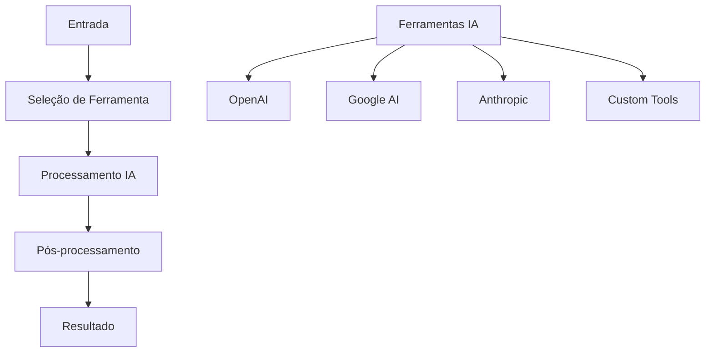

# Ferramentas de IA

Este exemplo demonstra como integrar e utilizar diversas ferramentas de IA no n8n para automatizar tarefas complexas.

## Visão Geral

As ferramentas de IA permitem expandir as capacidades do n8n com funcionalidades avançadas como análise de imagem, processamento de linguagem natural, geração de código e muito mais.

## Arquitetura do Sistema



## Configuração do Workflow

### 1. Trigger de Ferramenta
Configure o trigger para receber solicitações de ferramentas:

```javascript
// Webhook Trigger: Receber Solicitação
{
  "httpMethod": "POST",
  "path": "ai-tools",
  "responseMode": "responseNode",
  "options": {
    "responseHeaders": {
      "Content-Type": "application/json"
    }
  }
}
```

### 2. Seleção de Ferramenta
Determine qual ferramenta usar baseado na solicitação:

```javascript
// Function Node: Selecionar Ferramenta
const input = $input.first().json;

// Validar entrada
if (!input.tool || !input.data) {
  throw new Error('Ferramenta e dados são obrigatórios');
}

// Mapear ferramentas disponíveis
const availableTools = {
  'image-analysis': 'openai-vision',
  'text-generation': 'openai-chat',
  'code-generation': 'openai-code',
  'translation': 'google-translate',
  'sentiment-analysis': 'openai-sentiment',
  'summarization': 'openai-summarize',
  'classification': 'openai-classify'
};

// Validar ferramenta
if (!availableTools[input.tool]) {
  throw new Error(`Ferramenta não disponível: ${input.tool}`);
}

// Preparar configuração
const toolConfig = {
  tool: input.tool,
  provider: availableTools[input.tool],
  data: input.data,
  options: input.options || {},
  context: input.context || {}
};

return {
  toolConfig: toolConfig,
  originalInput: input
};
```

### 3. Processamento com Ferramenta
Execute a ferramenta selecionada:

```javascript
// Function Node: Processar com Ferramenta
const toolConfig = $input.first().json.toolConfig;

// Roteamento para ferramenta específica
switch (toolConfig.tool) {
  case 'image-analysis':
    return await processImageAnalysis(toolConfig);
  case 'text-generation':
    return await processTextGeneration(toolConfig);
  case 'code-generation':
    return await processCodeGeneration(toolConfig);
  case 'translation':
    return await processTranslation(toolConfig);
  case 'sentiment-analysis':
    return await processSentimentAnalysis(toolConfig);
  case 'summarization':
    return await processSummarization(toolConfig);
  case 'classification':
    return await processClassification(toolConfig);
  default:
    throw new Error(`Ferramenta não implementada: ${toolConfig.tool}`);
}
```

### 4. Pós-processamento
Processe e valide os resultados:

```javascript
// Function Node: Pós-processamento
const result = $input.first().json;
const toolConfig = $input.all()[1].json.toolConfig;

// Validar resultado
const validation = validateResult(result, toolConfig.tool);

// Formatar saída
const formattedResult = formatResult(result, toolConfig);

// Adicionar metadados
const finalResult = {
  result: formattedResult,
  metadata: {
    tool: toolConfig.tool,
    provider: toolConfig.provider,
    processedAt: new Date().toISOString(),
    validation: validation
  },
  originalRequest: toolConfig
};

return finalResult;
```

## Implementação Detalhada

### Análise de Imagem
```javascript
// Function Node: Análise de Imagem
async function processImageAnalysis(config) {
  const imageUrl = config.data.imageUrl;
  const analysisType = config.options.analysisType || 'general';
  
  // Configurar prompt baseado no tipo de análise
  const prompts = {
    'general': 'Descreva esta imagem em detalhes',
    'objects': 'Liste todos os objetos visíveis nesta imagem',
    'text': 'Extraia todo o texto visível nesta imagem',
    'faces': 'Analise as pessoas e expressões faciais nesta imagem',
    'scene': 'Descreva a cena e o ambiente nesta imagem'
  };
  
  const prompt = prompts[analysisType] || prompts.general;
  
  // Usar OpenAI Vision
  const visionResult = await callOpenAIVision(imageUrl, prompt);
  
  return {
    analysisType: analysisType,
    description: visionResult.description,
    objects: visionResult.objects || [],
    text: visionResult.text || '',
    confidence: visionResult.confidence || 0.8
  };
}

// Função para chamar OpenAI Vision
async function callOpenAIVision(imageUrl, prompt) {
  // Implementar chamada para OpenAI Vision API
  const response = await fetch('https://api.openai.com/v1/chat/completions', {
    method: 'POST',
    headers: {
      'Authorization': `Bearer ${process.env.OPENAI_API_KEY}`,
      'Content-Type': 'application/json'
    },
    body: JSON.stringify({
      model: 'gpt-4-vision-preview',
      messages: [
        {
          role: 'user',
          content: [
            { type: 'text', text: prompt },
            { type: 'image_url', image_url: { url: imageUrl } }
          ]
        }
      ],
      max_tokens: 500
    })
  });
  
  const data = await response.json();
  return {
    description: data.choices[0].message.content,
    confidence: 0.9
  };
}
```

### Geração de Código
```javascript
// Function Node: Geração de Código
async function processCodeGeneration(config) {
  const requirements = config.data.requirements;
  const language = config.options.language || 'javascript';
  const framework = config.options.framework || '';
  
  // Construir prompt para geração de código
  const prompt = `
Gere código ${language}${framework ? ` usando ${framework}` : ''} para:
${requirements}

Requisitos:
- Código funcional e bem documentado
- Seguir boas práticas da linguagem
- Incluir comentários explicativos
- Tratar erros adequadamente
`;

  // Usar OpenAI para geração
  const codeResult = await callOpenAIChat(prompt);
  
  // Extrair código da resposta
  const code = extractCodeFromResponse(codeResult);
  
  return {
    language: language,
    framework: framework,
    code: code,
    explanation: codeResult.explanation,
    requirements: requirements
  };
}

// Função para extrair código da resposta
function extractCodeFromResponse(response) {
  const codeBlocks = response.match(/```[\w]*\n([\s\S]*?)```/g);
  if (codeBlocks) {
    return codeBlocks.map(block => 
      block.replace(/```[\w]*\n/, '').replace(/```$/, '')
    ).join('\n\n');
  }
  return response;
}
```

### Tradução de Texto
```javascript
// Function Node: Tradução de Texto
async function processTranslation(config) {
  const text = config.data.text;
  const targetLanguage = config.options.targetLanguage || 'en';
  const sourceLanguage = config.options.sourceLanguage || 'auto';
  
  // Usar Google Translate API
  const translationResult = await callGoogleTranslate(text, targetLanguage, sourceLanguage);
  
  return {
    originalText: text,
    translatedText: translationResult.translatedText,
    sourceLanguage: translationResult.detectedSourceLanguage,
    targetLanguage: targetLanguage,
    confidence: translationResult.confidence
  };
}

// Função para chamar Google Translate
async function callGoogleTranslate(text, targetLang, sourceLang) {
  const response = await fetch(`https://translation.googleapis.com/language/translate/v2?key=${process.env.GOOGLE_API_KEY}`, {
    method: 'POST',
    headers: {
      'Content-Type': 'application/json'
    },
    body: JSON.stringify({
      q: text,
      target: targetLang,
      source: sourceLang === 'auto' ? undefined : sourceLang
    })
  });
  
  const data = await response.json();
  return {
    translatedText: data.data.translations[0].translatedText,
    detectedSourceLanguage: data.data.translations[0].detectedSourceLanguage,
    confidence: 0.9
  };
}
```

### Análise de Sentimento
```javascript
// Function Node: Análise de Sentimento
async function processSentimentAnalysis(config) {
  const text = config.data.text;
  const analysisType = config.options.analysisType || 'general';
  
  // Configurar prompt para análise de sentimento
  const prompts = {
    'general': 'Analise o sentimento deste texto (positivo, negativo, neutro)',
    'detailed': 'Forneça uma análise detalhada do sentimento com score de -1 a 1',
    'emotions': 'Identifique as emoções presentes neste texto',
    'aspects': 'Analise o sentimento por aspectos específicos mencionados'
  };
  
  const prompt = prompts[analysisType] || prompts.general;
  
  // Usar OpenAI para análise
  const sentimentResult = await callOpenAIChat(`${prompt}\n\nTexto: ${text}`);
  
  // Extrair informações estruturadas
  const analysis = parseSentimentResult(sentimentResult, analysisType);
  
  return {
    text: text,
    analysisType: analysisType,
    sentiment: analysis.sentiment,
    score: analysis.score,
    emotions: analysis.emotions,
    aspects: analysis.aspects
  };
}

// Função para analisar resultado de sentimento
function parseSentimentResult(result, type) {
  const analysis = {
    sentiment: 'neutral',
    score: 0,
    emotions: [],
    aspects: {}
  };
  
  // Implementar parsing baseado no tipo de análise
  if (type === 'detailed') {
    const scoreMatch = result.match(/score[:\s]*([-]?\d*\.?\d*)/i);
    if (scoreMatch) {
      analysis.score = parseFloat(scoreMatch[1]);
      analysis.sentiment = analysis.score > 0.1 ? 'positive' : 
                          analysis.score < -0.1 ? 'negative' : 'neutral';
    }
  }
  
  return analysis;
}
```

## Casos de Uso Específicos

### Processamento de Documentos
```javascript
// Function Node: Processar Documento
const document = $input.first().json.document;
const processingType = $input.first().json.processingType;

// Roteamento para diferentes tipos de processamento
const processors = {
  'extract-text': extractTextFromDocument,
  'summarize': summarizeDocument,
  'classify': classifyDocument,
  'extract-entities': extractEntitiesFromDocument,
  'translate': translateDocument
};

const processor = processors[processingType];
if (!processor) {
  throw new Error(`Processador não disponível: ${processingType}`);
}

const result = await processor(document);

return {
  documentId: document.id,
  processingType: processingType,
  result: result,
  processedAt: new Date().toISOString()
};
```

### Análise de Dados
```javascript
// Function Node: Analisar Dados
const data = $input.first().json.data;
const analysisType = $input.first().json.analysisType;

// Configurar análise baseada no tipo
const analysisConfig = {
  'trends': {
    tool: 'openai-chat',
    prompt: 'Identifique tendências nos dados fornecidos'
  },
  'patterns': {
    tool: 'openai-chat',
    prompt: 'Encontre padrões nos dados fornecidos'
  },
  'insights': {
    tool: 'openai-chat',
    prompt: 'Extraia insights valiosos dos dados'
  },
  'recommendations': {
    tool: 'openai-chat',
    prompt: 'Forneça recomendações baseadas nos dados'
  }
};

const config = analysisConfig[analysisType];
if (!config) {
  throw new Error(`Tipo de análise não suportado: ${analysisType}`);
}

// Executar análise
const analysisResult = await executeAnalysis(data, config);

return {
  data: data,
  analysisType: analysisType,
  result: analysisResult,
  timestamp: new Date().toISOString()
};
```

### Geração de Conteúdo
```javascript
// Function Node: Gerar Conteúdo
const contentRequest = $input.first().json;
const contentType = contentRequest.contentType;

// Configurar geradores de conteúdo
const contentGenerators = {
  'email': generateEmailContent,
  'report': generateReportContent,
  'social': generateSocialContent,
  'blog': generateBlogContent,
  'description': generateDescriptionContent
};

const generator = contentGenerators[contentType];
if (!generator) {
  throw new Error(`Gerador não disponível: ${contentType}`);
}

const generatedContent = await generator(contentRequest);

return {
  contentType: contentType,
  content: generatedContent,
  metadata: {
    generatedAt: new Date().toISOString(),
    wordCount: countWords(generatedContent),
    tone: analyzeTone(generatedContent)
  }
};
```

## Sistema de Cache e Otimização

### Cache de Resultados
```javascript
// Function Node: Cache de Ferramentas
const toolConfig = $input.first().json.toolConfig;
const cacheKey = generateCacheKey(toolConfig);

// Verificar cache
if (toolCache.has(cacheKey)) {
  const cached = toolCache.get(cacheKey);
  if (Date.now() - cached.timestamp < 3600000) { // 1 hora
    return {
      ...cached.result,
      fromCache: true
    };
  }
}

// Executar ferramenta
const result = await executeTool(toolConfig);

// Salvar no cache
toolCache.set(cacheKey, {
  result: result,
  timestamp: Date.now()
});

return {
  ...result,
  fromCache: false
};
```

### Rate Limiting
```javascript
// Function Node: Rate Limiting
const toolConfig = $input.first().json.toolConfig;
const rateLimiter = getRateLimiter(toolConfig.provider);

// Verificar rate limit
if (rateLimiter.isLimited()) {
  throw new Error(`Rate limit excedido para ${toolConfig.provider}`);
}

// Executar com rate limiting
const result = await executeWithRateLimit(toolConfig, rateLimiter);

return result;
```

## Métricas e Monitoramento

### Métricas de Uso
```javascript
// Function Node: Coletar Métricas
const toolConfig = $input.first().json.toolConfig;
const result = $input.all()[1].json.result;

const metrics = {
  tool: toolConfig.tool,
  provider: toolConfig.provider,
  processingTime: Date.now() - toolConfig.startTime,
  success: !result.error,
  cacheHit: result.fromCache || false,
  tokensUsed: result.tokensUsed || 0,
  cost: calculateCost(toolConfig.provider, result.tokensUsed)
};

return {
  metrics: metrics,
  result: result
};
```

### Análise de Performance
```javascript
// Function Node: Analisar Performance
const metrics = $input.all().map(item => item.json.metrics);

const performanceAnalysis = {
  totalRequests: metrics.length,
  averageProcessingTime: calculateAverage(metrics, 'processingTime'),
  successRate: calculateSuccessRate(metrics),
  mostUsedTools: getMostUsedTools(metrics),
  costAnalysis: analyzeCosts(metrics)
};

return {
  analysis: performanceAnalysis,
  timestamp: new Date().toISOString()
};
```

## Boas Práticas

### Segurança
1. **Valide todas as entradas** antes do processamento
2. **Implemente rate limiting** para evitar abuso
3. **Use variáveis de ambiente** para chaves de API
4. **Monitore uso de recursos** da IA

### Performance
1. **Implemente cache** para resultados frequentes
2. **Use processamento assíncrono** para operações longas
3. **Otimize prompts** para reduzir tokens
4. **Monitore latência** das ferramentas

### Manutenção
1. **Documente ferramentas** e seus parâmetros
2. **Monitore qualidade** dos resultados
3. **Atualize prompts** baseado em feedback
4. **Teste regularmente** todas as ferramentas

## Recursos Relacionados

- **[OpenAI Chat Node](../nodes-ia/openai-chat)** - Chat com IA
- **[Memory Manager](../nodes-ia/memory-manager)** - Gerenciamento de contexto
- **[Output Parser](../nodes-ia/output-parser)** - Processamento de saída
- **[Workflow Tool](../nodes-ia/workflow-tool)** - Integração com workflows
- **[AI Agent](../nodes-ia/ai-agent)** - Agentes inteligentes 