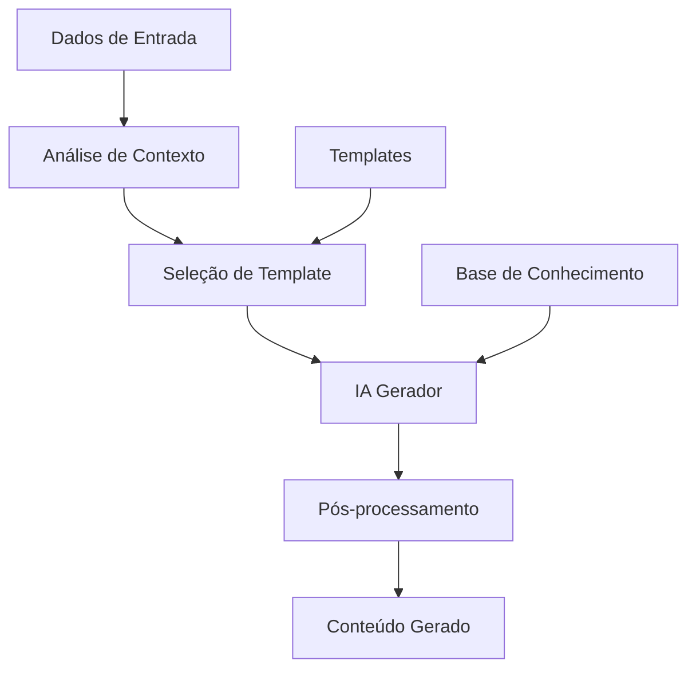

# Geração Automática de Conteúdo

Este exemplo demonstra como implementar um sistema de geração automática de conteúdo usando IA no n8n.

## Visão Geral

O sistema de geração de conteúdo automatiza a criação de textos, relatórios, descrições e outros tipos de conteúdo baseado em dados de entrada e parâmetros específicos.

## Arquitetura do Sistema



## Configuração do Workflow

### 1. Trigger de Dados
Configure o trigger para receber dados para geração:

```javascript
// Webhook Trigger: Receber Dados
{
  "httpMethod": "POST",
  "path": "generate-content",
  "responseMode": "responseNode",
  "options": {
    "responseHeaders": {
      "Content-Type": "application/json"
    }
  }
}
```

### 2. Análise de Contexto
Analise os dados de entrada para determinar o tipo de conteúdo:

```javascript
// Function Node: Análise de Contexto
const input = $input.first().json;

// Validar dados obrigatórios
if (!input.data || !input.contentType) {
  throw new Error('Dados e tipo de conteúdo são obrigatórios');
}

// Analisar contexto
const context = {
  contentType: input.contentType, // 'email', 'report', 'description', 'social'
  targetAudience: input.audience || 'general',
  tone: input.tone || 'professional',
  language: input.language || 'pt-BR',
  length: input.length || 'medium',
  data: input.data,
  requirements: input.requirements || []
};

// Determinar template baseado no contexto
const template = selectTemplate(context);

return {
  context: context,
  template: template,
  originalInput: input
};
```

### 3. Geração com IA
Use IA para gerar o conteúdo:

```javascript
// OpenAI Chat Node: Geração de Conteúdo
const context = $input.first().json.context;
const template = $input.first().json.template;

// Construir prompt baseado no template
const systemPrompt = buildSystemPrompt(context, template);
const userMessage = buildUserMessage(context);

return {
  systemPrompt: systemPrompt,
  userMessage: userMessage,
  model: "gpt-4",
  temperature: 0.7,
  maxTokens: getMaxTokens(context.length)
};
```

### 4. Pós-processamento
Processe e refine o conteúdo gerado:

```javascript
// Function Node: Pós-processamento
const generatedContent = $input.first().json.content;
const context = $input.all()[1].json.context;

// Validar e limpar conteúdo
const cleanedContent = cleanContent(generatedContent);

// Aplicar formatação específica
const formattedContent = applyFormatting(cleanedContent, context);

// Validar requisitos
const validation = validateContent(formattedContent, context.requirements);

return {
  content: formattedContent,
  metadata: {
    contentType: context.contentType,
    generatedAt: new Date().toISOString(),
    model: "gpt-4",
    validation: validation
  },
  context: context
};
```

## Implementação Detalhada

### Sistema de Templates
Implemente templates para diferentes tipos de conteúdo:

```javascript
// Função para selecionar template
function selectTemplate(context) {
  const templates = {
    email: {
      subject: "Assunto do email baseado em {{data}}",
      body: "Olá {{recipient}},\n\n{{content}}\n\nAtenciosamente,\n{{sender}}"
    },
    report: {
      title: "Relatório: {{title}}",
      summary: "Resumo executivo:\n{{summary}}",
      details: "Detalhes:\n{{details}}",
      recommendations: "Recomendações:\n{{recommendations}}"
    },
    social: {
      post: "{{content}}\n\n#{{hashtags}}",
      caption: "{{description}}\n\n{{callToAction}}"
    },
    description: {
      product: "{{productName}} - {{description}}\n\nCaracterísticas:\n{{features}}\n\nPreço: {{price}}",
      service: "{{serviceName}} oferece {{description}}.\n\nBenefícios:\n{{benefits}}"
    }
  };
  
  return templates[context.contentType] || templates.description;
}

// Função para construir prompt do sistema
function buildSystemPrompt(context, template) {
  const basePrompt = `Você é um especialista em criação de conteúdo ${context.contentType}.`;
  const tonePrompt = `Use um tom ${context.tone} e linguagem ${context.language}.`;
  const audiencePrompt = `O conteúdo é para ${context.audience}.`;
  const lengthPrompt = `Gere conteúdo com ${context.length} extensão.`;
  
  return `${basePrompt} ${tonePrompt} ${audiencePrompt} ${lengthPrompt}`;
}
```

### Geração de Emails
```javascript
// Function Node: Gerar Email
const data = $input.first().json.data;
const context = $input.first().json.context;

// Estrutura de dados para email
const emailData = {
  recipient: data.recipient,
  sender: data.sender,
  subject: data.subject,
  content: data.content,
  callToAction: data.callToAction
};

// Gerar email usando template
const email = generateEmail(emailData, context);

return {
  email: email,
  metadata: {
    type: 'email',
    recipient: data.recipient,
    generatedAt: new Date().toISOString()
  }
};

function generateEmail(data, context) {
  return {
    to: data.recipient,
    from: data.sender,
    subject: data.subject,
    body: data.content,
    callToAction: data.callToAction
  };
}
```

### Geração de Relatórios
```javascript
// Function Node: Gerar Relatório
const data = $input.first().json.data;
const context = $input.first().json.context;

// Estruturar dados do relatório
const reportData = {
  title: data.title,
  summary: data.summary,
  details: data.details,
  metrics: data.metrics,
  recommendations: data.recommendations
};

// Gerar relatório
const report = generateReport(reportData, context);

return {
  report: report,
  metadata: {
    type: 'report',
    title: data.title,
    generatedAt: new Date().toISOString()
  }
};

function generateReport(data, context) {
  return {
    title: data.title,
    executiveSummary: data.summary,
    detailedAnalysis: data.details,
    keyMetrics: data.metrics,
    recommendations: data.recommendations,
    generatedAt: new Date().toISOString()
  };
}
```

### Geração de Conteúdo para Redes Sociais
```javascript
// Function Node: Gerar Conteúdo Social
const data = $input.first().json.data;
const context = $input.first().json.context;

// Gerar conteúdo para diferentes plataformas
const socialContent = {
  linkedin: generateLinkedInPost(data, context),
  twitter: generateTwitterPost(data, context),
  instagram: generateInstagramPost(data, context),
  facebook: generateFacebookPost(data, context)
};

return {
  socialContent: socialContent,
  metadata: {
    type: 'social',
    platforms: Object.keys(socialContent),
    generatedAt: new Date().toISOString()
  }
};

function generateLinkedInPost(data, context) {
  return {
    text: `${data.title}\n\n${data.content}\n\n${data.callToAction}`,
    hashtags: data.hashtags || [],
    maxLength: 1300
  };
}

function generateTwitterPost(data, context) {
  return {
    text: `${data.content}\n\n${data.hashtags.join(' ')}`,
    hashtags: data.hashtags || [],
    maxLength: 280
  };
}
```

## Casos de Uso Específicos

### Geração de Descrições de Produtos
```javascript
// Function Node: Gerar Descrição de Produto
const product = $input.first().json.product;
const context = $input.first().json.context;

// Extrair características do produto
const features = product.features || [];
const benefits = product.benefits || [];
const specifications = product.specifications || {};

// Gerar descrição estruturada
const description = {
  title: `${product.name} - ${product.tagline}`,
  overview: generateOverview(product),
  features: generateFeaturesList(features),
  benefits: generateBenefitsList(benefits),
  specifications: generateSpecifications(specifications),
  callToAction: generateCallToAction(product)
};

return {
  description: description,
  metadata: {
    productId: product.id,
    generatedAt: new Date().toISOString()
  }
};
```

### Geração de Relatórios de Vendas
```javascript
// Function Node: Gerar Relatório de Vendas
const salesData = $input.first().json.salesData;
const period = $input.first().json.period;

// Analisar dados de vendas
const analysis = analyzeSalesData(salesData, period);

// Gerar relatório
const report = {
  period: period,
  summary: generateSalesSummary(analysis),
  trends: generateSalesTrends(analysis),
  topProducts: generateTopProducts(analysis),
  recommendations: generateSalesRecommendations(analysis)
};

return {
  report: report,
  metadata: {
    type: 'sales_report',
    period: period,
    generatedAt: new Date().toISOString()
  }
};
```

### Geração de Conteúdo de Marketing
```javascript
// Function Node: Gerar Conteúdo de Marketing
const campaign = $input.first().json.campaign;
const targetAudience = $input.first().json.targetAudience;

// Gerar conteúdo para campanha
const marketingContent = {
  emailSequence: generateEmailSequence(campaign, targetAudience),
  socialPosts: generateSocialPosts(campaign, targetAudience),
  landingPage: generateLandingPage(campaign, targetAudience),
  ads: generateAds(campaign, targetAudience)
};

return {
  marketingContent: marketingContent,
  metadata: {
    campaignId: campaign.id,
    targetAudience: targetAudience,
    generatedAt: new Date().toISOString()
  }
};
```

## Sistema de Validação

### Validação de Conteúdo
```javascript
// Function Node: Validar Conteúdo
const content = $input.first().json.content;
const requirements = $input.first().json.requirements;

// Validar requisitos
const validation = {
  length: validateLength(content, requirements.length),
  tone: validateTone(content, requirements.tone),
  keywords: validateKeywords(content, requirements.keywords),
  grammar: validateGrammar(content),
  plagiarism: await checkPlagiarism(content)
};

// Calcular score geral
const overallScore = calculateOverallScore(validation);

return {
  content: content,
  validation: validation,
  score: overallScore,
  isValid: overallScore >= 0.8
};
```

### Sistema de Feedback
```javascript
// Function Node: Coletar Feedback
const generatedContent = $input.first().json.content;
const feedback = $input.all()[1].json.feedback;

// Estrutura de feedback
const feedbackData = {
  contentId: generatedContent.id,
  originalContent: generatedContent.content,
  userFeedback: feedback.rating,
  userComments: feedback.comments,
  improvements: feedback.improvements,
  timestamp: new Date().toISOString()
};

// Salvar feedback para melhoria
return {
  action: 'save_feedback',
  data: feedbackData
};
```

## Otimização de Performance

### Cache de Templates
```javascript
// Function Node: Cache de Templates
const templateKey = $input.first().json.templateKey;
const template = $input.first().json.template;

// Verificar cache
if (templateCache.has(templateKey)) {
  return templateCache.get(templateKey);
}

// Gerar novo template
const generatedTemplate = await generateTemplate(template);
templateCache.set(templateKey, generatedTemplate);

return generatedTemplate;
```

### Processamento em Lote
```javascript
// Function Node: Processamento em Lote
const contentRequests = $input.all();

// Processar múltiplos conteúdos
const results = [];
for (const request of contentRequests) {
  const result = await generateContent(request.json);
  results.push(result);
}

return results;
```

## Boas Práticas

### Qualidade do Conteúdo
1. **Valide conteúdo gerado** antes de usar
2. **Implemente verificações** de gramática e estilo
3. **Use templates consistentes** para manter qualidade
4. **Colete feedback** dos usuários

### Performance
1. **Cache templates frequentes** para reduzir latência
2. **Implemente rate limiting** para APIs de IA
3. **Use processamento assíncrono** para grandes volumes
4. **Monitore uso de tokens** da IA

### Manutenção
1. **Atualize templates** regularmente
2. **Monitore qualidade** do conteúdo gerado
3. **Ajuste prompts** baseado em feedback
4. **Documente padrões** de conteúdo

## Recursos Relacionados

- **[OpenAI Chat Node](../nodes-ia/openai-chat)** - Geração com IA
- **[Output Parser](../nodes-ia/output-parser)** - Processamento de saída
- **[Memory Manager](../nodes-ia/memory-manager)** - Contexto de geração
- **[Workflow Tool](../nodes-ia/workflow-tool)** - Integração com workflows
- **[Sentiment Analysis](../nodes-ia/sentiment-analysis)** - Análise de tom 