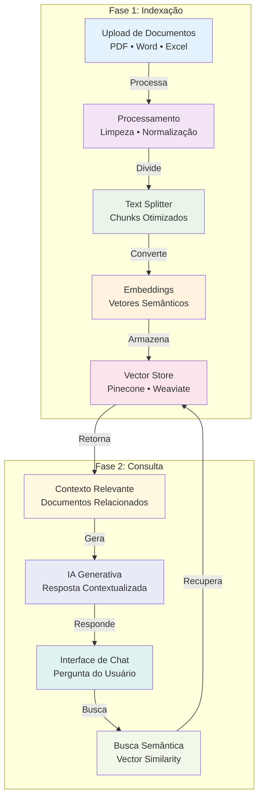
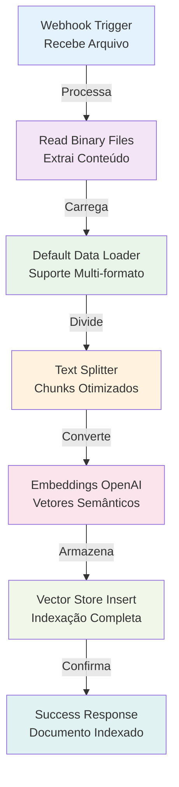
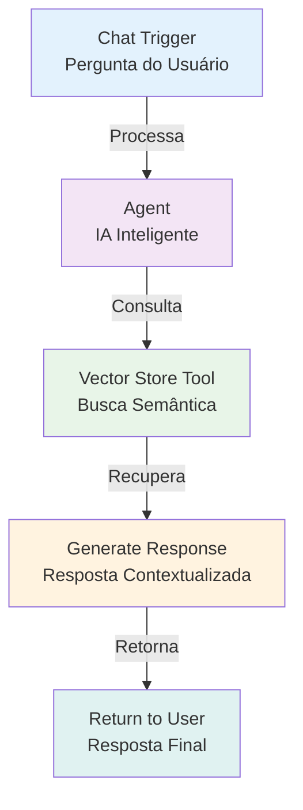

# <ion-icon name="grid-outline" style={{ fontSize: '24px', color: '#ea4b71' }}></ion-icon> RAG com Arquivos - Sistema de Busca Inteligente

Este guia ensina como implementar **RAG (Retrieval-Augmented Generation)** com arquivos no n8n para criar sistemas de busca inteligente que podem responder perguntas baseadas em documentos específicos da sua empresa.

## O que é RAG?

RAG (Retrieval-Augmented Generation) é uma técnica que combina modelos de linguagem com fontes de dados externas para gerar respostas mais precisas e contextualizadas. Em vez de depender apenas do conhecimento interno do modelo, o RAG recupera documentos relevantes para fundamentar as respostas em conhecimento atualizado e específico do domínio.

## Caso de Uso: Assistente de Documentação Empresarial

Imagine uma empresa brasileira que possui milhares de documentos internos (manuais, políticas, procedimentos) e precisa de um assistente que possa responder perguntas específicas sobre esses documentos. O RAG permite criar um sistema que:

- **Indexa automaticamente** todos os documentos da empresa
- **Busca semanticamente** informações relevantes
- **Gera respostas precisas** baseadas no contexto específico
- **Mantém compliance** com dados sensíveis da empresa

## Arquitetura do Workflow

O workflow RAG com arquivos segue uma arquitetura em duas fases principais:



## Implementação Passo a Passo

<details>
<summary>Implementação Passo a Passo</summary>

### Passo 1: Configurar o Vector Store

Primeiro, configure um vector store para armazenar os embeddings dos seus documentos:

```json
{
  "node": "n8n-nodes-langchain.vectorstoreinmemory",
  "operation": "Insert Documents",
  "parameters": {
    "embeddingModel": "text-embedding-ada-002",
    "chunkSize": 1000,
    "chunkOverlap": 200
  }
}
```

### Passo 2: Processar Documentos

Use o **Default Data Loader** para processar diferentes tipos de arquivo:

```json
{
  "node": "n8n-nodes-langchain.documentdefaultdataloader",
  "parameters": {
    "filePath": "{{ $json.filePath }}",
    "textSplitter": "RecursiveCharacterTextSplitter",
    "chunkSize": 1000,
    "chunkOverlap": 200
  }
}
```

### Passo 3: Configurar o Agente RAG

Configure um agente que usa o vector store como ferramenta:

```json
{
  "node": "n8n-nodes-langchain.agent",
  "parameters": {
    "model": "gpt-4",
    "tools": [
      {
        "type": "vectorStore",
        "description": "Busca informações nos documentos da empresa",
        "limit": 5,
        "includeMetadata": true
      }
    ]
  }
}
```

</details>

<details>
<summary>Workflow Completo</summary>



</details>

### Workflow 2: Interface de Chat



## Configurações Recomendadas

### Para Documentos Brasileiros

- **Embedding Model**: `text-embedding-3-large` (melhor para português)
- **Chunk Size**: 500-1000 caracteres
- **Chunk Overlap**: 200 caracteres
- **Metadata**: Incluir informações como departamento, data, autor

### Para Compliance LGPD

- **Criptografia**: Habilitar criptografia no vector store
- **Retenção**: Configurar políticas de retenção de dados
- **Acesso**: Implementar controle de acesso baseado em roles

## Exemplo Prático: Manual de Procedimentos

Vamos implementar um sistema para um manual de procedimentos de uma empresa brasileira:

### 1. Estrutura de Dados

```json
{
  "documento": "Manual de Procedimentos RH",
  "departamento": "Recursos Humanos",
  "versao": "2024.1",
  "dataAtualizacao": "2024-01-15",
  "autor": "Equipe RH",
  "tags": ["procedimentos", "rh", "compliance"]
}
```

### 2. Prompts Otimizados

```javascript
// Prompt para busca
const searchPrompt = `
Você é um assistente especializado em procedimentos empresariais brasileiros.
Responda baseado APENAS nos documentos fornecidos.
Se não encontrar informação específica, indique claramente.
Use linguagem formal e profissional adequada ao ambiente corporativo brasileiro.
`;

// Prompt para resposta
const responsePrompt = `
Baseado nos documentos recuperados, forneça uma resposta clara e estruturada:
1. Resposta direta à pergunta
2. Referência ao documento fonte
3. Contexto adicional relevante
4. Próximos passos se aplicável
`;
```

## Monitoramento e Otimização

### Métricas Importantes

- **Taxa de Recuperação**: Quantas perguntas encontram documentos relevantes
- **Precisão das Respostas**: Avaliação da qualidade das respostas
- **Tempo de Resposta**: Performance do sistema
- **Uso de Tokens**: Custos de operação

### Otimizações

1. **Ajustar Chunk Size**: Teste diferentes tamanhos para seu tipo de documento
2. **Melhorar Metadata**: Adicione tags e categorias mais específicas
3. **Refinar Prompts**: Otimize os prompts para seu contexto específico
4. **Implementar Cache**: Cache respostas frequentes para reduzir custos

## Troubleshooting

### Problemas Comuns

**Respostas Genéricas**
- Verifique se o vector store tem dados suficientes
- Ajuste o número de chunks retornados
- Melhore a qualidade dos prompts

**Performance Lenta**
- Use embedding models menores para desenvolvimento
- Implemente cache de embeddings
- Otimize o tamanho dos chunks

**Dados Sensíveis Expostos**
- Configure filtros de metadata
- Implemente controle de acesso
- Use criptografia no vector store

## Próximos Passos

1. **Implemente o workflow básico** com documentos de teste
2. **Adicione seus documentos** e teste com perguntas reais
3. **Otimize as configurações** baseado no feedback dos usuários
4. **Implemente monitoramento** para acompanhar a performance
5. **Expanda para outros tipos** de documento conforme necessário

## Recursos Adicionais

- [Tutorial de IA](/advanced-ai/tutorial-ai)
- [Templates de Workflow RAG](https://n8n.io/workflows/?categories=25)
- [Compliance LGPD](/privacidade-seguranca/lgpd-compliance)

---

**💡 Dica:** Comece com um conjunto pequeno de documentos para testar e validar o sistema antes de escalar para toda a documentação da empresa.
