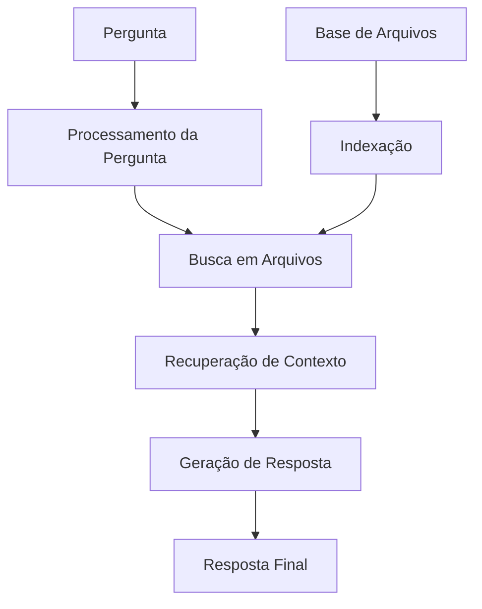

# RAG com Arquivos

Este exemplo demonstra como implementar um sistema de Retrieval-Augmented Generation (RAG) que utiliza arquivos como base de conhecimento no n8n.

## Visão Geral

O sistema RAG combina recuperação de informações relevantes de arquivos com geração de respostas usando IA, permitindo respostas precisas baseadas em documentos específicos.

## Arquitetura do Sistema



## Configuração do Workflow

### 1. Trigger de Pergunta
Configure o trigger para receber perguntas:

```javascript
// Webhook Trigger: Receber Pergunta
{
  "httpMethod": "POST",
  "path": "rag-query",
  "responseMode": "responseNode",
  "options": {
    "responseHeaders": {
      "Content-Type": "application/json"
    }
  }
}
```

### 2. Processamento da Pergunta
Prepare a pergunta para busca:

```javascript
// Function Node: Processar Pergunta
const input = $input.first().json;

// Validar entrada
if (!input.question) {
  throw new Error('Pergunta é obrigatória');
}

// Limpar e normalizar pergunta
const cleanQuestion = input.question
  .trim()
  .toLowerCase()
  .replace(/[^\w\s]/g, ' ');

// Extrair palavras-chave
const keywords = extractKeywords(cleanQuestion);

// Determinar tipo de busca
const searchType = determineSearchType(cleanQuestion);

return {
  originalQuestion: input.question,
  processedQuestion: cleanQuestion,
  keywords: keywords,
  searchType: searchType,
  context: input.context || {}
};
```

### 3. Busca em Arquivos
Implemente busca semântica nos arquivos:

```javascript
// Function Node: Buscar em Arquivos
const question = $input.first().json.processedQuestion;
const keywords = $input.first().json.keywords;
const searchType = $input.first().json.searchType;

// Configurar busca
const searchConfig = {
  query: question,
  keywords: keywords,
  filters: {
    fileType: searchType.fileType,
    dateRange: searchType.dateRange,
    categories: searchType.categories
  },
  limit: 5, // Top 5 resultados
  threshold: 0.7 // Similaridade mínima
};

// Executar busca
const searchResults = await searchFiles(searchConfig);

// Processar resultados
const relevantDocs = processSearchResults(searchResults);

return {
  question: question,
  searchResults: relevantDocs,
  searchConfig: searchConfig,
  timestamp: new Date().toISOString()
};
```

### 4. Recuperação de Contexto
Extraia contexto relevante dos documentos:

```javascript
// Function Node: Recuperar Contexto
const searchResults = $input.first().json.searchResults;
const question = $input.first().json.question;

// Extrair trechos relevantes
const relevantSnippets = [];
for (const doc of searchResults) {
  const snippets = extractRelevantSnippets(doc.content, question);
  relevantSnippets.push({
    documentId: doc.id,
    documentTitle: doc.title,
    snippets: snippets,
    relevance: doc.relevance
  });
}

// Combinar contexto
const combinedContext = combineContext(relevantSnippets);

return {
  question: question,
  context: combinedContext,
  sources: relevantSnippets,
  contextLength: combinedContext.length
};
```

### 5. Geração de Resposta
Use IA para gerar resposta baseada no contexto:

```javascript
// OpenAI Chat Node: Gerar Resposta RAG
const question = $input.first().json.question;
const context = $input.first().json.context;
const sources = $input.first().json.sources;

// Construir prompt RAG
const systemPrompt = `
Você é um assistente especializado que responde perguntas baseado no contexto fornecido.
Use apenas as informações fornecidas no contexto para responder.
Se a informação não estiver no contexto, indique que não tem a informação necessária.
Sempre cite as fontes quando possível.
`;

const userMessage = `
Contexto:
${context}

Pergunta: ${question}

Responda baseado apenas no contexto fornecido.
`;

return {
  systemPrompt: systemPrompt,
  userMessage: userMessage,
  model: "gpt-4",
  temperature: 0.3,
  maxTokens: 1000
};
```

## Implementação Detalhada

### Sistema de Indexação
Implemente indexação de arquivos para busca eficiente:

```javascript
// Function Node: Indexar Arquivo
const file = $input.first().json.file;

// Extrair texto do arquivo
const text = await extractText(file.content);
const metadata = extractMetadata(file);

// Dividir em chunks
const chunks = splitIntoChunks(text, 1000); // 1000 caracteres por chunk

// Criar embeddings para cada chunk
const embeddings = [];
for (const chunk of chunks) {
  const embedding = await createEmbedding(chunk);
  embeddings.push({
    text: chunk,
    embedding: embedding,
    metadata: metadata
  });
}

// Salvar no índice
const indexData = {
  fileId: file.id,
  fileName: file.name,
  chunks: embeddings,
  metadata: metadata,
  indexedAt: new Date().toISOString()
};

return {
  action: 'index_file',
  data: indexData
};
```

### Busca Semântica
```javascript
// Função para busca semântica
async function searchFiles(config) {
  // Criar embedding da pergunta
  const queryEmbedding = await createEmbedding(config.query);
  
  // Buscar documentos similares
  const similarDocs = await findSimilarDocuments(queryEmbedding, config);
  
  // Filtrar por relevância
  const relevantDocs = similarDocs.filter(doc => 
    doc.similarity >= config.threshold
  );
  
  // Ordenar por relevância
  return relevantDocs.sort((a, b) => b.similarity - a.similarity);
}

// Função para encontrar documentos similares
async function findSimilarDocuments(queryEmbedding, config) {
  const results = [];
  
  // Buscar no índice
  const indexedDocs = await getIndexedDocuments();
  
  for (const doc of indexedDocs) {
    for (const chunk of doc.chunks) {
      const similarity = calculateCosineSimilarity(queryEmbedding, chunk.embedding);
      
      if (similarity >= config.threshold) {
        results.push({
          id: doc.fileId,
          title: doc.fileName,
          content: chunk.text,
          similarity: similarity,
          metadata: chunk.metadata
        });
      }
    }
  }
  
  return results;
}
```

### Extração de Contexto Relevante
```javascript
// Função para extrair trechos relevantes
function extractRelevantSnippets(content, question) {
  const sentences = content.split(/[.!?]+/).filter(s => s.trim());
  const relevantSnippets = [];
  
  for (const sentence of sentences) {
    const relevance = calculateRelevance(sentence, question);
    if (relevance > 0.5) {
      relevantSnippets.push({
        text: sentence.trim(),
        relevance: relevance
      });
    }
  }
  
  // Retornar top 3 trechos mais relevantes
  return relevantSnippets
    .sort((a, b) => b.relevance - a.relevance)
    .slice(0, 3);
}

// Função para calcular relevância
function calculateRelevance(text, question) {
  const questionWords = question.toLowerCase().split(' ');
  const textWords = text.toLowerCase().split(' ');
  
  let matches = 0;
  for (const word of questionWords) {
    if (textWords.includes(word)) {
      matches++;
    }
  }
  
  return matches / questionWords.length;
}
```

## Casos de Uso Específicos

### RAG com Documentos PDF
```javascript
// Function Node: Processar PDF
const pdfFile = $input.first().json.file;

// Extrair texto do PDF
const text = await extractTextFromPDF(pdfFile.content);

// Dividir em seções
const sections = splitIntoSection(text);

// Processar cada seção
const processedSections = [];
for (const section of sections) {
  const processed = {
    title: extractTitle(section),
    content: section,
    pageNumber: extractPageNumber(section),
    metadata: extractMetadata(section)
  };
  processedSections.push(processed);
}

return {
  fileId: pdfFile.id,
  fileName: pdfFile.name,
  sections: processedSections,
  totalPages: processedSections.length
};
```

### RAG com Documentos Word
```javascript
// Function Node: Processar Documento Word
const wordFile = $input.first().json.file;

// Extrair texto e estrutura
const document = await extractFromWord(wordFile.content);

// Processar estrutura hierárquica
const processedDocument = {
  title: document.title,
  sections: document.sections.map(section => ({
    heading: section.heading,
    content: section.content,
    level: section.level
  })),
  tables: document.tables,
  images: document.images
};

return {
  fileId: wordFile.id,
  fileName: wordFile.name,
  document: processedDocument
};
```

### RAG com Planilhas Excel
```javascript
// Function Node: Processar Planilha Excel
const excelFile = $input.first().json.file;

// Extrair dados da planilha
const workbook = await extractFromExcel(excelFile.content);

// Processar cada planilha
const processedSheets = [];
for (const sheet of workbook.sheets) {
  const processed = {
    name: sheet.name,
    headers: sheet.headers,
    data: sheet.data,
    summary: generateSheetSummary(sheet)
  };
  processedSheets.push(processed);
}

return {
  fileId: excelFile.id,
  fileName: excelFile.name,
  sheets: processedSheets
};
```

## Sistema de Cache

### Cache de Embeddings
```javascript
// Function Node: Cache de Embeddings
const text = $input.first().json.text;
const cacheKey = generateCacheKey(text);

// Verificar cache
if (embeddingCache.has(cacheKey)) {
  return embeddingCache.get(cacheKey);
}

// Criar novo embedding
const embedding = await createEmbedding(text);
embeddingCache.set(cacheKey, embedding);

return embedding;
```

### Cache de Busca
```javascript
// Function Node: Cache de Resultados de Busca
const query = $input.first().json.query;
const cacheKey = generateSearchCacheKey(query);

// Verificar cache
if (searchCache.has(cacheKey)) {
  const cached = searchCache.get(cacheKey);
  if (Date.now() - cached.timestamp < 3600000) { // 1 hora
    return cached.results;
  }
}

// Executar busca
const results = await performSearch(query);
searchCache.set(cacheKey, {
  results: results,
  timestamp: Date.now()
});

return results;
```

## Métricas e Monitoramento

### Métricas de Performance
```javascript
// Function Node: Coletar Métricas
const startTime = Date.now();
const query = $input.first().json.query;
const results = $input.all()[1].json.results;

const metrics = {
  query: query,
  processingTime: Date.now() - startTime,
  resultsCount: results.length,
  averageRelevance: calculateAverageRelevance(results),
  cacheHit: $input.all()[2].json.cacheHit || false
};

return {
  metrics: metrics,
  results: results
};
```

### Análise de Qualidade
```javascript
// Function Node: Analisar Qualidade
const question = $input.first().json.question;
const answer = $input.first().json.answer;
const sources = $input.first().json.sources;

const qualityAnalysis = {
  answerLength: answer.length,
  sourceCount: sources.length,
  averageSourceRelevance: calculateAverageRelevance(sources),
  answerCompleteness: assessCompleteness(answer, question),
  sourceDiversity: calculateSourceDiversity(sources)
};

return {
  analysis: qualityAnalysis,
  question: question,
  answer: answer
};
```

## Boas Práticas

### Qualidade dos Dados
1. **Valide arquivos de entrada** antes do processamento
2. **Implemente limpeza de texto** adequada
3. **Use chunking inteligente** para preservar contexto
4. **Monitore qualidade** dos embeddings

### Performance
1. **Implemente cache** para embeddings e buscas
2. **Use indexação eficiente** para grandes volumes
3. **Otimize tamanho de chunks** para seu caso de uso
4. **Monitore latência** de busca e geração

### Manutenção
1. **Atualize índice** quando arquivos mudam
2. **Monitore drift** de embeddings
3. **Colete feedback** sobre qualidade das respostas
4. **Ajuste parâmetros** baseado em métricas

## Recursos Relacionados

- **[OpenAI Chat Node](../nodes-ia/openai-chat)** - Geração de respostas
- **[Memory Manager](../nodes-ia/memory-manager)** - Gerenciamento de contexto
- **[Output Parser](../nodes-ia/output-parser)** - Processamento de saída
- **[Workflow Tool](../nodes-ia/workflow-tool)** - Integração com workflows
- **[AI Agent](../nodes-ia/ai-agent)** - Agentes inteligentes 