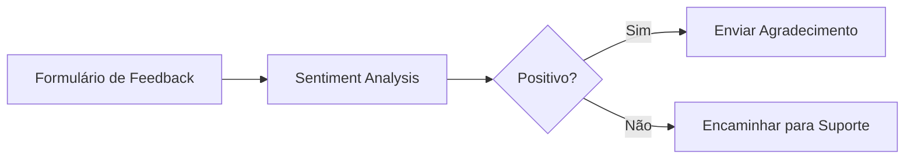

#ionicicon-nameanalytics-outline-style-fontsize-24px color: '#cor-ea4b71-node-sentiment Analysis

O node **Sentiment Analysis** permite analisar o sentimento de textos usando modelos de IA avançados. Este node é especialmente útil para análise de feedback de clientes, monitoramento de redes sociais e compreensão de sentimentos em comunicações.

#o-que-voc-encontrar-aqui

Esta documentação abrange:

- **Configuração do node**: Como configurar modelos de análise de sentimento
- **Parâmetros de entrada**: Formatos de texto aceitos e pré-processamento
- **Interpretação de resultados**: Como entender as pontuações de sentimento
- **Casos de uso práticos**: Exemplos reais de aplicação
- **Integração com workflows**: Como usar em automações complexas

#conceitos-fundamentais

#anlise-de-sentimento-a-anlise de sentimento é uma técnica de processamento de linguagem natural que identifica e extrai informações subjetivas de textos. O node pode classificar sentimentos como:

- **Positivo**: Textos com conotação favorável
- **Negativo**: Textos com conotação desfavorável  
- **Neutro**: Textos sem polaridade clara

#pontuao-de-sentimento-o-node retorna uma pontuação entre -1 e 1, onde:
- **1.0**: Extremamente positivo
- **0.0**: Neutro
- **-1.0**: Extremamente negativo

#configurao-bsica

#parmetros-principais-1-modelo-de IA**: Escolha entre diferentes modelos disponíveis
2. **Texto de Entrada**: Campo contendo o texto para análise
3. **Idioma**: Especifique o idioma do texto (opcional)
4. **Confiança Mínima**: Define o limite de confiança para resultados

#exemplo-de-configurao-json
  "model": "openai-gpt-4",
  "inputField": "{{ $json.text }}",
  "language": "pt-BR",
  "minConfidence": 0.7
}
```

#casos-de-uso

#anlise-de-feedback-de-clientes



#monitoramento-de-redes-sociais-mermaid
graph LR
    A[API Twitter] --> B[Sentiment Analysis]
    B --> C[Alertas Negativos]
    B --> D[Relatórios Diários]
```

#prximos-passos-anlise-de Dados](/logica-e-dados/data/agregacoes-estatisticas) - Processar resultados
- [Alertas e Notificações](/usando-n8n/monitoring/configurar-alertas) - Configurar alertas
- [Integração com APIs](/integracoes/builtin-nodes/http-requests/http-request) - Conectar sistemas
- [Workflows Avançados](/advanced-ai/exemplos-casos/classificacao-dados) - Ver exemplos práticos

#recursos-relacionados-ai-agentadvanced-ainodes-iaai-agent - Agentes de IA completos
- [OpenAI Chat](/advanced-ai/nodes-ia/openai-chat) - Chat com IA
- [Expressões n8n](/logica-e-dados/expressoes) - Processar resultados
- [Tratamento de Erros](/logica-e-dados/flow-logic/error-handling) - Lidar com falhas 
