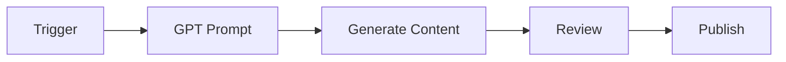

# <ion-icon name="sparkles-outline" style={{ fontSize: '32px', color: '#ea4b71' }}></ion-icon> IA e Machine Learning

Explore as integrações de inteligência artificial e machine learning disponíveis no n8n. Estas integrações permitem automatizar processos complexos usando IA, processamento de linguagem natural e análise de dados avançada.

:::tip **Dica Pro**
Comece com integrações simples como **OpenAI GPT-3.5** para entender o conceito, depois evolua para modelos mais avançados como GPT-4 e Claude.
:::

---

## <ion-icon name="star-outline" style={{ fontSize: '24px', color: '#ea4b71' }}></ion-icon> Integrações Principais

### <ion-icon name="logo-openai" style={{ fontSize: '20px', color: '#10b981' }}></ion-icon> OpenAI
A integração mais popular para IA generativa.

| Serviço | Descrição | Casos de Uso |
|---------|-----------|--------------|
| **GPT-4** | Modelo de linguagem avançado | Chatbots inteligentes, análise complexa |
| **GPT-3.5** | Modelo rápido e econômico | Automação de texto, suporte |
| **DALL-E** | Geração de imagens | Criação de conteúdo visual |
| **Whisper** | Transcrição de áudio | Processamento de áudio |
| **Embeddings** | Vetores de texto | Busca semântica, clustering |

**Casos de Uso:**
- Chatbots inteligentes
- Geração de conteúdo
- Análise de sentimentos
- Tradução automática
- Resumo de documentos

### <ion-icon name="chatbubble-ellipses-outline" style={{ fontSize: '20px', color: '#10b981' }}></ion-icon> Anthropic Claude
Assistente IA focado em segurança e precisão.

| Modelo | Descrição | Melhor Para |
|--------|-----------|-------------|
| **Claude 3 Opus** | Modelo mais avançado | Análise complexa, pesquisa |
| **Claude 3 Sonnet** | Equilibrio performance/custo | Desenvolvimento, análise |
| **Claude 3 Haiku** | Modelo rápido e econômico | Tarefas simples, prototipagem |

**Casos de Uso:**
- Análise de documentos complexos
- Geração de código
- Pesquisa e síntese
- Assistente de produtividade

### <ion-icon name="logo-google" style={{ fontSize: '20px', color: '#10b981' }}></ion-icon> Google AI
Serviços de IA do Google Cloud.

| Serviço | Descrição | Aplicação |
|---------|-----------|-----------|
| **Vertex AI** | Plataforma unificada de ML | Modelos customizados |
| **Gemini** | Modelo multimodal | Análise de texto e imagem |
| **PaLM** | Modelo de linguagem | Processamento de texto |
| **Vision AI** | Análise de imagens | OCR, classificação |
| **Speech-to-Text** | Reconhecimento de fala | Transcrição automática |

**Casos de Uso:**
- Análise de imagens em massa
- Processamento de documentos
- Automação de atendimento
- Análise de vídeos

### <ion-icon name="logo-microsoft" style={{ fontSize: '20px', color: '#10b981' }}></ion-icon> Azure AI
Serviços cognitivos da Microsoft.

| Serviço | Descrição | Funcionalidade |
|---------|-----------|----------------|
| **Cognitive Services** | APIs de IA | Visão, linguagem, fala |
| **OpenAI Service** | GPT no Azure | Modelos de linguagem |
| **Computer Vision** | Análise visual | OCR, análise de imagem |
| **Language Understanding** | NLP | Processamento de linguagem |
| **Speech Services** | Processamento de fala | TTS, STT |

**Casos de Uso:**
- Análise de documentos empresariais
- Chatbots corporativos
- Processamento de formulários
- Análise de feedback

---

## <ion-icon name="code-slash-outline" style={{ fontSize: '24px', color: '#ea4b71' }}></ion-icon> Frameworks e Ferramentas

### <ion-icon name="layers-outline" style={{ fontSize: '20px', color: '#10b981' }}></ion-icon> LangChain
Framework para desenvolvimento de aplicações com LLMs.

| Componente | Descrição | Uso |
|------------|-----------|-----|
| **Chains** | Sequências de operações | Workflows de IA |
| **Agents** | Agentes autônomos | Automação inteligente |
| **Memory** | Gerenciamento de contexto | Conversas persistentes |
| **Tools** | Ferramentas customizadas | Integração com APIs |
| **Vector Stores** | Armazenamento de embeddings | Busca semântica |

### <ion-icon name="cube-outline" style={{ fontSize: '20px', color: '#10b981' }}></ion-icon> Hugging Face
Plataforma de modelos de machine learning.

| Recurso | Descrição | Aplicação |
|---------|-----------|-----------|
| **Transformers** | Modelos de NLP | Processamento de texto |
| **Datasets** | Conjuntos de dados | Treinamento de modelos |
| **Spaces** | Aplicações de IA | Deploy de modelos |
| **Inference API** | APIs de inferência | Predições em tempo real |

### <ion-icon name="search-outline" style={{ fontSize: '20px', color: '#10b981' }}></ion-icon> Pinecone
Banco de dados vetorial para aplicações de IA.

| Funcionalidade | Descrição | Benefício |
|----------------|-----------|-----------|
| **Vector Search** | Busca semântica | Encontra conteúdo similar |
| **Metadata Filtering** | Filtros avançados | Busca precisa |
| **Real-time Updates** | Atualizações em tempo real | Dados sempre atualizados |

---

## <ion-icon name="bulb-outline" style={{ fontSize: '24px', color: '#ea4b71' }}></ion-icon> Casos de Uso Práticos

### <ion-icon name="chatbubble-outline" style={{ fontSize: '20px', color: '#10b981' }}></ion-icon> 1. Chatbot Inteligente


**Fluxo:**
1. Recebe mensagem via webhook
2. Processa com GPT para gerar resposta
3. Envia resposta para o canal

### <ion-icon name="document-text-outline" style={{ fontSize: '20px', color: '#10b981' }}></ion-icon> 2. Análise de Documentos


**Fluxo:**
1. Upload de documento
2. Extração de texto
3. Análise com Claude
4. Armazenamento do resumo

### <ion-icon name="create-outline" style={{ fontSize: '20px', color: '#10b981' }}></ion-icon> 3. Geração de Conteúdo



**Fluxo:**
1. Trigger baseado em calendário
2. Geração de conteúdo com GPT
3. Revisão automática
4. Publicação em plataformas

---

## <ion-icon name="settings-outline" style={{ fontSize: '24px', color: '#ea4b71' }}></ion-icon> Configuração

### <ion-icon name="key-outline" style={{ fontSize: '20px', color: '#10b981' }}></ion-icon> Credenciais Necessárias

#### OpenAI
```json
{
  "apiKey": "sk-...",
  "organization": "org-..."
}
```

#### Anthropic
```json
{
  "apiKey": "sk-ant-..."
}
```

#### Google AI
```json
{
  "serviceAccountKey": "...",
  "projectId": "..."
}
```

### <ion-icon name="environment-outline" style={{ fontSize: '20px', color: '#10b981' }}></ion-icon> Variáveis de Ambiente
```bash
# OpenAI
OPENAI_API_KEY=sk-...
OPENAI_ORGANIZATION=org-...

# Anthropic
ANTHROPIC_API_KEY=sk-ant-...

# Google AI
GOOGLE_APPLICATION_CREDENTIALS=path/to/key.json
```

---

## <ion-icon name="warning-outline" style={{ fontSize: '24px', color: '#ea4b71' }}></ion-icon> Considerações Importantes

### <ion-icon name="card-outline" style={{ fontSize: '20px', color: '#10b981' }}></ion-icon> Custos

| Serviço | Custo | Observação |
|---------|-------|------------|
| **OpenAI GPT-4** | ~$0.03/1K tokens | Modelo mais avançado |
| **Claude 3 Opus** | ~$0.015/1K tokens | Boa relação custo-benefício |
| **Google AI** | Variável | Depende do serviço |

### <ion-icon name="speedometer-outline" style={{ fontSize: '20px', color: '#10b981' }}></ion-icon> Rate Limits

| Serviço | Limite | Período |
|---------|--------|---------|
| **OpenAI** | 3,500 requests/min | GPT-4 |
| **Anthropic** | 500 requests/min | Claude |
| **Google AI** | Depende do serviço | Variável |

### <ion-icon name="shield-checkmark-outline" style={{ fontSize: '20px', color: '#10b981' }}></ion-icon> Segurança

:::warning **Atenção**
- Nunca exponha API keys no código
- Use variáveis de ambiente
- Implemente validação de entrada
- Monitore uso de tokens
:::

---

## <ion-icon name="trending-up-outline" style={{ fontSize: '24px', color: '#ea4b71' }}></ion-icon> Melhores Práticas

### <ion-icon name="create-outline" style={{ fontSize: '20px', color: '#10b981' }}></ion-icon> 1. Otimização de Prompts

- Seja específico e claro
- Use few-shot examples
- Defina formato de saída
- Implemente validação

### <ion-icon name="brain-outline" style={{ fontSize: '20px', color: '#10b981' }}></ion-icon> 2. Gerenciamento de Contexto

- Use memory para conversas
- Implemente token counting
- Limpe contexto antigo
- Cache respostas comuns

### <ion-icon name="alert-circle-outline" style={{ fontSize: '20px', color: '#10b981' }}></ion-icon> 3. Tratamento de Erros

- Implemente retry logic
- Fallback para modelos alternativos
- Log de erros detalhado
- Monitoramento de performance

---

## <ion-icon name="arrow-forward-circle-outline" style={{ fontSize: '24px', color: '#ea4b71' }}></ion-icon> Próximos Passos

1. **Configure credenciais** para as integrações desejadas
2. **Teste com prompts simples** para entender as capacidades
3. **Implemente casos de uso básicos** como chatbots
4. **Evolua para workflows complexos** com múltiplas integrações

---

> <ion-icon name="quote-outline" style={{ fontSize: '16px', color: '#6b7280' }}></ion-icon> **Pronto para automatizar com IA?** Comece com uma integração simples e evolua gradualmente!
>
> Para mais detalhes sobre cada integração, visite a [documentação oficial do n8n](https://docs.n8n.io/integrations/). 