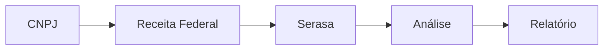

:::info
<ion-icon name="shield-checkmark-outline" style={{ fontSize: '18px', color: '#17a2b8' }}></ion-icon> Esta página da documentação foi validada tecnicamente e didaticamente.
:::

# Serviços Brasileiros no n8n: Integrações, Compliance e Casos de Uso

Explore as integrações específicas para o mercado brasileiro no n8n. Descubra como automatizar processos com serviços governamentais, financeiros, localização, compliance LGPD e acesse exemplos práticos para empresas nacionais.

:::tip **Dica Pro**
Comece com integrações simples como **ViaCEP** para validação de endereços, depois evolua para serviços mais complexos como PIX e NFe.
:::

---

## <ion-icon name="card-outline" style={{ fontSize: '24px', color: '#ea4b71' }}></ion-icon> Integrações Financeiras

### <ion-icon name="wallet-outline" style={{ fontSize: '24px', color: '#ea4b71' }}></ion-icon> PIX - Pagamentos Instantâneos
Sistema de pagamentos instantâneos do Banco Central.

| Serviço | Descrição | Casos de Uso |
|---------|-----------|--------------|
| **PIX API** | API oficial do Banco Central | E-commerce, cobrança |
| **PIX QR Code** | Geração e leitura de QR codes | Pagamentos móveis |
| **PIX Webhook** | Notificações de transações | Conciliação automática |
| **PIX Estático** | QR codes fixos | Cobrança recorrente |
| **PIX Dinâmico** | QR codes com valor variável | Pagamentos únicos |

**Casos de Uso:**
- E-commerce com PIX
- Cobrança automática
- Conciliação bancária
- Monitoramento de pagamentos
- Relatórios financeiros

### <ion-icon name="document-text-outline" style={{ fontSize: '24px', color: '#ea4b71' }}></ion-icon> NFe - Nota Fiscal Eletrônica
Sistema de emissão de notas fiscais eletrônicas.

| Serviço | Descrição | Funcionalidade |
|---------|-----------|----------------|
| **NFe.io** | API para emissão de NFe | Emissão automática |
| **NFe Gov** | API oficial da SEFAZ | Validação oficial |
| **NFe Automática** | Emissão em lote | Processamento em massa |
| **NFe Validação** | Validação de documentos | Compliance fiscal |
| **NFe Cancelamento** | Cancelamento automático | Gestão de erros |

**Casos de Uso:**
- Emissão automática de NFe
- Integração com e-commerce
- Relatórios fiscais
- Compliance fiscal
- Auditoria fiscal

### <ion-icon name="receipt-outline" style={{ fontSize: '24px', color: '#ea4b71' }}></ion-icon> Boletos Bancários
Sistema de cobrança bancária.

| Serviço | Descrição | Aplicação |
|---------|-----------|-----------|
| **Boleto API** | Geração de boletos | Cobrança bancária |
| **Boleto Registro** | Registro automático | Compliance bancário |
| **Boleto Retorno** | Processamento de retornos | Conciliação |
| **Boleto Vencimento** | Gestão de vencimentos | Controle financeiro |

**Casos de Uso:**
- Cobrança recorrente
- Gestão de inadimplência
- Conciliação bancária
- Relatórios de recebimento

---

## <ion-icon name="business-outline" style={{ fontSize: '24px', color: '#ea4b71' }}></ion-icon> Serviços Governamentais

### <ion-icon name="library-outline" style={{ fontSize: '24px', color: '#ea4b71' }}></ion-icon> Receita Federal
Consultas e validações de documentos.

| Serviço | Descrição | Uso |
|---------|-----------|-----|
| **CNPJ** | Consulta de CNPJ | Validação de empresas |
| **CPF** | Validação de CPF | Verificação de pessoas |
| **Situação Cadastral** | Status de empresas | Due diligence |
| **Quadro Socios** | Informações de sócios | Análise empresarial |
| **CNAE** | Classificação de atividades | Categorização |

**Casos de Uso:**
- Validação de clientes
- Due diligence
- Compliance
- Relatórios empresariais
- Análise de mercado

### <ion-icon name="trending-up-outline" style={{ fontSize: '24px', color: '#ea4b71' }}></ion-icon> Banco Central
APIs oficiais do Banco Central.

| Serviço | Descrição | Dados |
|---------|-----------|-------|
| **Taxa Selic** | Taxa básica de juros | Indicadores econômicos |
| **Câmbio** | Taxas de câmbio | Cotação de moedas |
| **Indicadores** | Indicadores econômicos | Análise macroeconômica |
| **Bancos** | Lista de bancos | Validação bancária |
| **Cooperativas** | Lista de cooperativas | Instituições financeiras |

**Casos de Uso:**
- Relatórios financeiros
- Análise econômica
- Compliance bancário
- Monitoramento de indicadores

### <ion-icon name="car-outline" style={{ fontSize: '24px', color: '#ea4b71' }}></ion-icon> Correios
Serviços postais e de rastreamento.

| Serviço | Descrição | Funcionalidade |
|---------|-----------|----------------|
| **CEP** | Consulta de CEP | Validação de endereços |
| **Rastreamento** | Rastreamento de encomendas | Logística |
| **Frete** | Cálculo de frete | Precificação |
| **Endereços** | Validação de endereços | Qualidade de dados |
| **SEDEX/PAC** | Serviços de entrega | Logística |

**Casos de Uso:**
- E-commerce
- Logística
- Rastreamento de vendas
- Gestão de entregas
- Validação de endereços

---

## <ion-icon name="location-outline" style={{ fontSize: '24px', color: '#ea4b71' }}></ion-icon> Localização e Geografia

### <ion-icon name="map-outline" style={{ fontSize: '24px', color: '#ea4b71' }}></ion-icon> ViaCEP
API gratuita para consulta de CEPs.

| Funcionalidade | Descrição | Aplicação |
|----------------|-----------|-----------|
| **CEP por Endereço** | Busca por endereço | Preenchimento automático |
| **Endereço por CEP** | Busca por CEP | Validação de CEPs |
| **Validação** | Validação de CEPs | Qualidade de dados |
| **Formatação** | Formatação de endereços | Padronização |

**Casos de Uso:**
- Validação de endereços
- Preenchimento automático
- E-commerce
- Logística
- CRM

### <ion-icon name="navigate-outline" style={{ fontSize: '24px', color: '#ea4b71' }}></ion-icon> Google Maps Brasil
Serviços de localização adaptados ao Brasil.

| Serviço | Descrição | Funcionalidade |
|---------|-----------|----------------|
| **Geocoding** | Conversão de endereços | Coordenadas geográficas |
| **Reverse Geocoding** | Endereços por coordenadas | Localização inversa |
| **Distâncias** | Cálculo de distâncias | Otimização de rotas |
| **Rotas** | Planejamento de rotas | Logística |
| **Places** | Busca de lugares | POIs brasileiros |

**Casos de Uso:**
- Logística
- Delivery
- Field service
- Análise de mercado
- Otimização de rotas

---

## <ion-icon name="shield-checkmark-outline" style={{ fontSize: '24px', color: '#ea4b71' }}></ion-icon> Segurança e Compliance

### <ion-icon name="shield-outline" style={{ fontSize: '24px', color: '#ea4b71' }}></ion-icon> Serasa
Consultas de crédito e informações comerciais.

| Serviço | Descrição | Dados |
|---------|-----------|-------|
| **Score de Crédito** | Pontuação de crédito | Análise de risco |
| **Protestos** | Consulta de protestos | Histórico legal |
| **Cheques** | Consulta de cheques | Histórico bancário |
| **Restrições** | Restrições financeiras | Compliance |
| **Relatórios** | Relatórios comerciais | Due diligence |

**Casos de Uso:**
- Análise de crédito
- Due diligence
- Gestão de risco
- Compliance
- Relatórios comerciais

### <ion-icon name="checkmark-circle-outline" style={{ fontSize: '24px', color: '#ea4b71' }}></ion-icon> SPC Brasil
Sistema de proteção ao crédito.

| Serviço | Descrição | Funcionalidade |
|---------|-----------|----------------|
| **Consulta SPC** | Consulta de inadimplência | Análise de risco |
| **Inclusão** | Inclusão de inadimplentes | Gestão de inadimplência |
| **Exclusão** | Exclusão automática | Limpeza de cadastro |
| **Relatórios** | Relatórios de inadimplência | Análise financeira |

**Casos de Uso:**
- Gestão de crédito
- Análise de risco
- Compliance
- Relatórios financeiros

---

## <ion-icon name="bulb-outline" style={{ fontSize: '24px', color: '#ea4b71' }}></ion-icon> Casos de Uso Práticos

### <ion-icon name="cart-outline" style={{ fontSize: '24px', color: '#ea4b71' }}></ion-icon> 1. E-commerce Completo


**Fluxo:**
1. Recebe pedido do e-commerce
2. Valida dados do cliente
3. Gera cobrança PIX
4. Emite NFe automaticamente
5. Envia para correios
6. Notifica cliente

### <ion-icon name="sync-outline" style={{ fontSize: '24px', color: '#ea4b71' }}></ion-icon> 2. Conciliação Bancária


**Fluxo:**
1. Recebe notificação PIX
2. Valida transação
3. Concilia com pedidos
4. Atualiza sistema
5. Gera relatório

### <ion-icon name="search-outline" style={{ fontSize: '24px', color: '#ea4b71' }}></ion-icon> 3. Due Diligence Automatizada



**Fluxo:**
1. Recebe CNPJ para análise
2. Consulta Receita Federal
3. Consulta Serasa
4. Analisa dados
5. Gera relatório

---

## <ion-icon name="settings-outline" style={{ fontSize: '24px', color: '#ea4b71' }}></ion-icon> Configuração

### <ion-icon name="key-outline" style={{ fontSize: '24px', color: '#ea4b71' }}></ion-icon> Credenciais Necessárias

#### PIX API
```json
{
  "clientId": "...",
  "clientSecret": "...",
  "certificate": "path/to/cert.p12"
}
```

#### NFe.io
```json
{
  "apiKey": "...",
  "environment": "production"
}
```

#### Receita Federal
```json
{
  "cnpj": "...",
  "senha": "..."
}
```

### <ion-icon name="environment-outline" style={{ fontSize: '24px', color: '#ea4b71' }}></ion-icon> Variáveis de Ambiente
```bash
# PIX
PIX_CLIENT_ID=...
PIX_CLIENT_SECRET=...
PIX_CERTIFICATE_PATH=...

# NFe
NFE_API_KEY=...

# Receita Federal
RECEITA_CNPJ=...
RECEITA_SENHA=...
```

---

## <ion-icon name="warning-outline" style={{ fontSize: '24px', color: '#ea4b71' }}></ion-icon> Considerações Importantes

### <ion-icon name="document-text-outline" style={{ fontSize: '24px', color: '#ea4b71' }}></ion-icon> Compliance Legal

| Legislação | Aplicação | Requisitos |
|------------|-----------|------------|
| **LGPD** | Proteção de dados | Consentimento, segurança |
| **Marco Civil** | Internet | Neutralidade, privacidade |
| **Normas BC** | PIX | Segurança, compliance |
| **Legislação Fiscal** | NFe | Validação, armazenamento |

### <ion-icon name="speedometer-outline" style={{ fontSize: '24px', color: '#ea4b71' }}></ion-icon> Rate Limits

| Serviço | Limite | Período |
|---------|--------|---------|
| **PIX API** | 100 requests/min | Por minuto |
| **Receita Federal** | 1 request/seg | Por segundo |
| **ViaCEP** | 10 requests/seg | Por segundo |
| **Correios** | 50 requests/min | Por minuto |

### <ion-icon name="shield-checkmark-outline" style={{ fontSize: '24px', color: '#ea4b71' }}></ion-icon> Segurança

:::warning **Atenção**
- Use certificados digitais válidos
- Implemente criptografia
- Monitore acessos
- Mantenha logs de auditoria
:::

---

## <ion-icon name="trending-up-outline" style={{ fontSize: '24px', color: '#ea4b71' }}></ion-icon> Melhores Práticas

### <ion-icon name="checkmark-circle-outline" style={{ fontSize: '24px', color: '#ea4b71' }}></ion-icon> 1. Validação de Dados

- Sempre valide CNPJ/CPF
- Verifique endereços via CEP
- Implemente validação de PIX
- Confirme dados antes de emitir NFe

### <ion-icon name="alert-circle-outline" style={{ fontSize: '24px', color: '#ea4b71' }}></ion-icon> 2. Tratamento de Erros

- Implemente retry logic
- Log de erros detalhado
- Fallback para processos manuais
- Monitoramento de falhas

### <ion-icon name="speedometer-outline" style={{ fontSize: '24px', color: '#ea4b71' }}></ion-icon> 3. Performance

- Cache consultas frequentes
- Implemente rate limiting
- Use webhooks quando possível
- Otimize consultas em lote

---

## <ion-icon name="arrow-forward-circle-outline" style={{ fontSize: '24px', color: '#ea4b71' }}></ion-icon> Próximos Passos

1. **Identifique necessidades** específicas do seu negócio
2. **Configure credenciais** para os serviços necessários
3. **Teste integrações** em ambiente de desenvolvimento
4. **Implemente workflows** básicos primeiro
5. **Evolua para automações complexas**

---

> <ion-icon name="quote-outline" style={{ fontSize: '16px', color: '#6b7280' }}></ion-icon> **Pronto para automatizar processos brasileiros?** Comece com validações simples e evolua para workflows complexos!
>
> Para mais detalhes sobre cada integração, visite a [documentação oficial do n8n](https://docs.n8n.io/integrations/). 