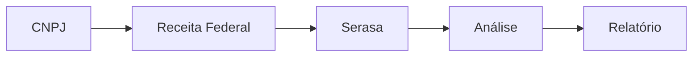

---
sidebar_position: 3
title: "Serviços Brasileiros no n8n: Integrações, Compliance e Casos de Uso"
description: Integrações específicas para o mercado brasileiro no n8n, compliance nacional, exemplos práticos e automação de processos locais.
keywords: [n8n, serviços brasileiros, integrações Brasil, compliance nacional, automação de processos, exemplos de automação, APIs nacionais, compliance LGPD]
---

:::info
<IonicIcon name="shield-checkmark-outline" style={{ fontSize: '18px', color: '#cor-17a2b8-esta-pgina da documentação foi validada tecnicamente e didaticamente.
:::

#servios-brasileiros-no-n8n-integraes Compliance e Casos de Uso

Explore as integrações específicas para o mercado brasileiro no n8n. Descubra como automatizar processos com serviços governamentais, financeiros, localização, compliance LGPD e acesse exemplos práticos para empresas nacionais.

:::tip **Dica Pro**
Comece com integrações simples como **ViaCEP** para validação de endereços, depois evolua para serviços mais complexos como PIX e NFe.
:::

---

#ionicicon-namecard-outline-style-fontsize-24px color: '#cor-ea4b71-integraes-financeiras

#ionicicon-namewallet-outline-style-fontsize-24px color: '#cor-ea4b71-pix Pagamentos Instantâneos
Sistema de pagamentos instantâneos do Banco Central.

| Serviço | Descrição | Casos de Uso |
|---------|-----------|--------------|
| **PIX API** | API oficial do Banco Central | E-commerce, cobrança |
| **PIX QR Code** | Geração e leitura de QR codes | Pagamentos móveis |
| **PIX Webhook** | Notificações de transações | Conciliação automática |
| **PIX Estático** | QR codes fixos | Cobrança recorrente |
| **PIX Dinâmico** | QR codes com valor variável | Pagamentos únicos |

**Casos de Uso:**
- E-commerce com PIX
- Cobrança automática
- Conciliação bancária
- Monitoramento de pagamentos
- Relatórios financeiros

#ionicicon-namedocument-text-outline-style-fontsize-24px color: '#cor-ea4b71-nfe Nota Fiscal Eletrônica
Sistema de emissão de notas fiscais eletrônicas.

| Serviço | Descrição | Funcionalidade |
|---------|-----------|----------------|
| **NFe.io** | API para emissão de NFe | Emissão automática |
| **NFe Gov** | API oficial da SEFAZ | Validação oficial |
| **NFe Automática** | Emissão em lote | Processamento em massa |
| **NFe Validação** | Validação de documentos | Compliance fiscal |
| **NFe Cancelamento** | Cancelamento automático | Gestão de erros |

**Casos de Uso:**
- Emissão automática de NFe
- Integração com e-commerce
- Relatórios fiscais
- Compliance fiscal
- Auditoria fiscal

#ionicicon-namereceipt-outline-style-fontsize-24px color: '#cor-ea4b71-boletos-bancrios
Sistema de cobrança bancária.

| Serviço | Descrição | Aplicação |
|---------|-----------|-----------|
| **Boleto API** | Geração de boletos | Cobrança bancária |
| **Boleto Registro** | Registro automático | Compliance bancário |
| **Boleto Retorno** | Processamento de retornos | Conciliação |
| **Boleto Vencimento** | Gestão de vencimentos | Controle financeiro |

**Casos de Uso:**
- Cobrança recorrente
- Gestão de inadimplência
- Conciliação bancária
- Relatórios de recebimento

---

#ionicicon-namebusiness-outline-style-fontsize-24px color: '#cor-ea4b71-servios-governamentais

#ionicicon-namelibrary-outline-style-fontsize-24px color: '#cor-ea4b71-receita-federal
Consultas e validações de documentos.

| Serviço | Descrição | Uso |
|---------|-----------|-----|
| **CNPJ** | Consulta de CNPJ | Validação de empresas |
| **CPF** | Validação de CPF | Verificação de pessoas |
| **Situação Cadastral** | Status de empresas | Due diligence |
| **Quadro Socios** | Informações de sócios | Análise empresarial |
| **CNAE** | Classificação de atividades | Categorização |

**Casos de Uso:**
- Validação de clientes
- Due diligence
- Compliance
- Relatórios empresariais
- Análise de mercado

#ionicicon-nametrending-up-outline-style-fontsize-24px color: '#cor-ea4b71-banco-central
APIs oficiais do Banco Central.

| Serviço | Descrição | Dados |
|---------|-----------|-------|
| **Taxa Selic** | Taxa básica de juros | Indicadores econômicos |
| **Câmbio** | Taxas de câmbio | Cotação de moedas |
| **Indicadores** | Indicadores econômicos | Análise macroeconômica |
| **Bancos** | Lista de bancos | Validação bancária |
| **Cooperativas** | Lista de cooperativas | Instituições financeiras |

**Casos de Uso:**
- Relatórios financeiros
- Análise econômica
- Compliance bancário
- Monitoramento de indicadores

#ionicicon-namecar-outline-style-fontsize-24px color: '#cor-ea4b71-correios-servios postais e de rastreamento.

| Serviço | Descrição | Funcionalidade |
|---------|-----------|----------------|
| **CEP** | Consulta de CEP | Validação de endereços |
| **Rastreamento** | Rastreamento de encomendas | Logística |
| **Frete** | Cálculo de frete | Precificação |
| **Endereços** | Validação de endereços | Qualidade de dados |
| **SEDEX/PAC** | Serviços de entrega | Logística |

**Casos de Uso:**
- E-commerce
- Logística
- Rastreamento de vendas
- Gestão de entregas
- Validação de endereços

---

#ionicicon-namelocation-outline-style-fontsize-24px color: '#cor-ea4b71-localizao-e Geografia

#ionicicon-namemap-outline-style-fontsize-24px color: '#cor-ea4b71-viacep-api gratuita para consulta de CEPs.

| Funcionalidade | Descrição | Aplicação |
|----------------|-----------|-----------|
| **CEP por Endereço** | Busca por endereço | Preenchimento automático |
| **Endereço por CEP** | Busca por CEP | Validação de CEPs |
| **Validação** | Validação de CEPs | Qualidade de dados |
| **Formatação** | Formatação de endereços | Padronização |

**Casos de Uso:**
- Validação de endereços
- Preenchimento automático
- E-commerce
- Logística
- CRM

#ionicicon-namenavigate-outline-style-fontsize-24px color: '#cor-ea4b71-google-maps Brasil
Serviços de localização adaptados ao Brasil.

| Serviço | Descrição | Funcionalidade |
|---------|-----------|----------------|
| **Geocoding** | Conversão de endereços | Coordenadas geográficas |
| **Reverse Geocoding** | Endereços por coordenadas | Localização inversa |
| **Distâncias** | Cálculo de distâncias | Otimização de rotas |
| **Rotas** | Planejamento de rotas | Logística |
| **Places** | Busca de lugares | POIs brasileiros |

**Casos de Uso:**
- Logística
- Delivery
- Field service
- Análise de mercado
- Otimização de rotas

---

#ionicicon-nameshield-checkmark-outline-style-fontsize-24px color: '#cor-ea4b71-segurana-e Compliance

#ionicicon-nameshield-outline-style-fontsize-24px color: '#cor-ea4b71-serasa-consultas de crédito e informações comerciais.

| Serviço | Descrição | Dados |
|---------|-----------|-------|
| **Score de Crédito** | Pontuação de crédito | Análise de risco |
| **Protestos** | Consulta de protestos | Histórico legal |
| **Cheques** | Consulta de cheques | Histórico bancário |
| **Restrições** | Restrições financeiras | Compliance |
| **Relatórios** | Relatórios comerciais | Due diligence |

**Casos de Uso:**
- Análise de crédito
- Due diligence
- Gestão de risco
- Compliance
- Relatórios comerciais

#ionicicon-namecheckmark-circle-outline-style-fontsize-24px color: '#cor-ea4b71-spc-brasil
Sistema de proteção ao crédito.

| Serviço | Descrição | Funcionalidade |
|---------|-----------|----------------|
| **Consulta SPC** | Consulta de inadimplência | Análise de risco |
| **Inclusão** | Inclusão de inadimplentes | Gestão de inadimplência |
| **Exclusão** | Exclusão automática | Limpeza de cadastro |
| **Relatórios** | Relatórios de inadimplência | Análise financeira |

**Casos de Uso:**
- Gestão de crédito
- Análise de risco
- Compliance
- Relatórios financeiros

---

#ionicicon-namebulb-outline-style-fontsize-24px color: '#cor-ea4b71-casos-de Uso Práticos

#ionicicon-namecart-outline-style-fontsize-24px color: '#cor-ea4b71-1-e-commerce Completo


**Fluxo:**
1. Recebe pedido do e-commerce
2. Valida dados do cliente
3. Gera cobrança PIX
4. Emite NFe automaticamente
5. Envia para correios
6. Notifica cliente

#ionicicon-namesync-outline-style-fontsize-24px color: '#cor-ea4b71-2-conciliao Bancária


**Fluxo:**
1. Recebe notificação PIX
2. Valida transação
3. Concilia com pedidos
4. Atualiza sistema
5. Gera relatório

#ionicicon-namesearch-outline-style-fontsize-24px color: '#cor-ea4b71-3-due Diligence Automatizada



**Fluxo:**
1. Recebe CNPJ para análise
2. Consulta Receita Federal
3. Consulta Serasa
4. Analisa dados
5. Gera relatório

---

#ionicicon-namesettings-outline-style-fontsize-24px color: '#cor-ea4b71-configurao

#ionicicon-namekey-outline-style-fontsize-24px color: '#cor-ea4b71-credenciais-necessrias

#pix-api-json-clientid "...",
  "clientSecret": "...",
  "certificate": "path/to/cert.p12"
}
```

#nfeio-json-apikey
  "environment": "production"
}
```

#receita-federal-json-cnpj "...",
  "senha": "..."
}
```

#ionicicon-nameenvironment-outline-style-fontsize-24px color: '#cor-ea4b71-variveis-de Ambiente
```bash
#pix-pixclientid-pixclientsecret-pixcertificatepath

#nfe-nfeapikey

#receita-federal-receitacnpj-receitasenha

---

#ionicicon-namewarning-outline-style-fontsize-24px color: '#cor-ea4b71-consideraes-importantes

#ionicicon-namedocument-text-outline-style-fontsize-24px color: '#cor-ea4b71-compliance-legal

| Legislação | Aplicação | Requisitos |
|------------|-----------|------------|
| **LGPD** | Proteção de dados | Consentimento, segurança |
| **Marco Civil** | Internet | Neutralidade, privacidade |
| **Normas BC** | PIX | Segurança, compliance |
| **Legislação Fiscal** | NFe | Validação, armazenamento |

#ionicicon-namespeedometer-outline-style-fontsize-24px color: '#cor-ea4b71-rate-limits

| Serviço | Limite | Período |
|---------|--------|---------|
| **PIX API** | 100 requests/min | Por minuto |
| **Receita Federal** | 1 request/seg | Por segundo |
| **ViaCEP** | 10 requests/seg | Por segundo |
| **Correios** | 50 requests/min | Por minuto |

#ionicicon-nameshield-checkmark-outline-style-fontsize-24px color: '#cor-ea4b71-segurana-warning **Atenção**
- Use certificados digitais válidos
- Implemente criptografia
- Monitore acessos
- Mantenha logs de auditoria
:::

---

#ionicicon-nametrending-up-outline-style-fontsize-24px color: '#cor-ea4b71-melhores-prticas

#ionicicon-namecheckmark-circle-outline-style-fontsize-24px color: '#cor-ea4b71-1-validao de Dados

- Sempre valide CNPJ/CPF
- Verifique endereços via CEP
- Implemente validação de PIX
- Confirme dados antes de emitir NFe

#ionicicon-namealert-circle-outline-style-fontsize-24px color: '#cor-ea4b71-2-tratamento de Erros

- Implemente retry logic
- Log de erros detalhado
- Fallback para processos manuais
- Monitoramento de falhas

#ionicicon-namespeedometer-outline-style-fontsize-24px color: '#cor-ea4b71-3-performance

- Cache consultas frequentes
- Implemente rate limiting
- Use webhooks quando possível
- Otimize consultas em lote

---

#ionicicon-namearrow-forward-circle-outline-style-fontsize-24px color: '#cor-ea4b71-prximos-passos

1. **Identifique necessidades** específicas do seu negócio
2. **Configure credenciais** para os serviços necessários
3. **Teste integrações** em ambiente de desenvolvimento
4. **Implemente workflows** básicos primeiro
5. **Evolua para automações complexas**

---

> <IonicIcon name="quote-outline" style={{ fontSize: '16px', color: '#cor-6b7280-pronto-para automatizar processos brasileiros?** Comece com validações simples e evolua para workflows complexos!
>
> Para mais detalhes sobre cada integração, visite a [documentação oficial do n8n](https://docs.n8n.io/integrations/). 
