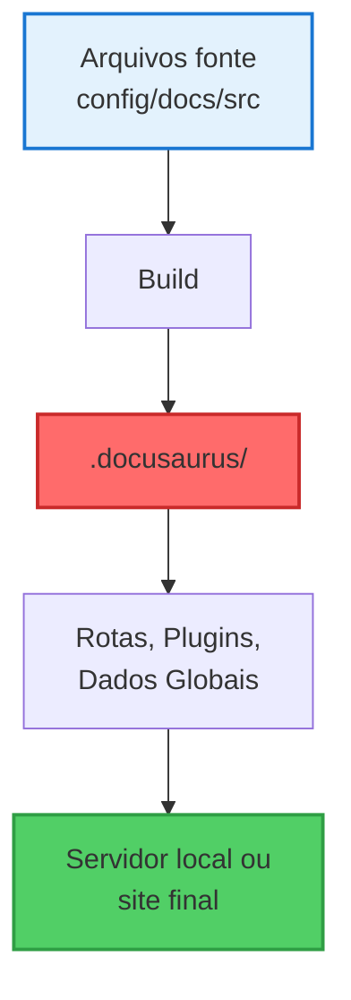

import IonicIcon from '@site/src/components/IonicIcon';

# <IonicIcon name="code-working-outline" size={32} color="#ea4b71" /> Entendendo o Diretório .docusaurus

## <IonicIcon name="help-circle-outline" size={24} color="#ea4b71" /> O que é?

O diretório `.docusaurus` é uma pasta gerada automaticamente sempre que o site é executado localmente (`npm start`) ou construído para produção (`npm run build`). Ele armazena artefatos técnicos essenciais para o funcionamento do site — como rotas, registros de plugins, dados globais e configurações compiladas.

:::warning Importante
**Não edite arquivos dentro do .docusaurus.** Tudo será sobrescrito em cada build.
:::

---

## <IonicIcon name="time-outline" size={24} color="#ea4b71" /> Quando e como ele é gerado?

O `.docusaurus` é regenerado automaticamente em três situações comuns:

| Ação | O que acontece |
|------|----------------|
| `npm start` | Gera a pasta e mantém atualizada com hot reload |
| `npm run build` | Recria do zero, otimizada para produção |
| `npm run clear` | Remove .docusaurus; será recriada ao rodar novamente |

---

## <IonicIcon name="folder-outline" size={24} color="#ea4b71" /> Estrutura interna: o que tem lá dentro?

### **Arquivos comuns**

| Arquivo | Função |
|---------|--------|
| `routes.js` | Define rotas do site |
| `registry.js` | Lista todos os componentes React usados |
| `globalData.json` | Dados globais compartilhados entre plugins e temas |
| `client-modules.js` | Scripts do cliente usados pelo site |
| `codeTranslations.json` | Traduções reutilizáveis para internacionalização |
| `site-metadata.json` | Informações básicas sobre o site |

### **Diretórios por plugin**

| Caminho | Descrição |
|---------|-----------|
| `docusaurus-plugin-content-docs/` | Conteúdo gerado da pasta `docs/` |
| `docusaurus-plugin-content-pages/` | Dados de páginas personalizadas |
| `docusaurus-plugin-debug/` (dev only) | Ferramentas de debug |

---

## <IonicIcon name="git-branch-outline" size={24} color="#ea4b71" /> Fluxo de Geração (Visual)



---

## <IonicIcon name="terminal-outline" size={24} color="#ea4b71" /> Comandos úteis

```bash
npm start        # Gera e atualiza .docusaurus (modo dev)
npm run build    # Cria versão final do site
npm run clear    # Limpa o diretório .docusaurus
npm run serve    # Executa o site localmente após o build
```

---

## <IonicIcon name="checkmark-circle-outline" size={24} color="#ea4b71" /> Boas práticas

### **Ignore no Git**

O diretório `.docusaurus` deve estar no `.gitignore`.

```gitignore
.docusaurus/
build/
.cache/
```

### **Não use diretamente**

Evite importar arquivos dessa pasta — use apenas as APIs do Docusaurus.

### **Em caso de erro estranho**

Execute:

```bash
npm run clear
npm install
npm start
```

---

## <IonicIcon name="document-text-outline" size={24} color="#ea4b71" /> Exemplo de arquivos

### **routes.js**
```javascript
export default [
  { path: '/', component: ComponentCreator('/', 'abc'), exact: true },
  { path: '/blog', component: ComponentCreator('/blog', 'def'), exact: true }
];
```

### **globalData.json**
```json
{
  "docusaurus-plugin-content-docs": {
    "default": {
      "versions": [{ "name": "current", "label": "Next", "isLast": true }]
    }
  }
}
```

---

## <IonicIcon name="bulb-outline" size={24} color="#ea4b71" /> Conclusão

O `.docusaurus` é uma engrenagem essencial — mas invisível — do seu site. Não precisa se preocupar com ele no dia a dia, desde que:

- Os arquivos do projeto estejam organizados
- O `docusaurus.config.ts` esteja bem configurado
- Você use os comandos recomendados conforme necessário

---

> <span style={{fontSize: '18px', fontWeight: 'bold'}}>**O .docusaurus é uma engrenagem essencial — mas invisível — do seu site. Deixe o Docusaurus gerenciar automaticamente!**</span>

---

:::tip Curiosidade técnica
Quer entender como tudo funciona por trás dos bastidores? Explore o conteúdo dessa pasta em modo de desenvolvimento — mas sem alterar nada por lá 😉
::: 