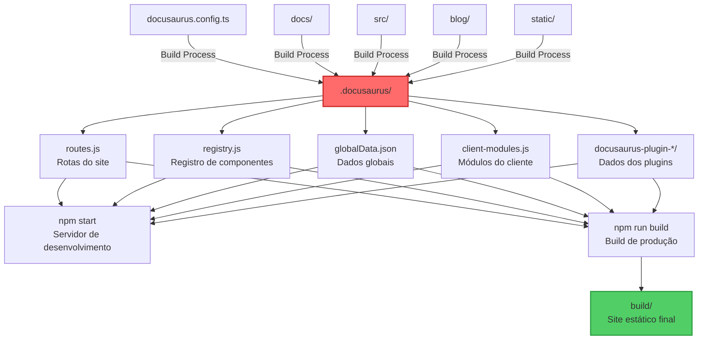

# Entendendo o diretório .docusaurus

## O que é o diretório .docusaurus?

O diretório `.docusaurus` é uma pasta temporária gerada automaticamente pelo Docusaurus durante o processo de build ou quando você executa o servidor de desenvolvimento. Este diretório contém arquivos compilados e metadados necessários para o funcionamento do seu site.

:::warning Importante
**Nunca edite manualmente os arquivos dentro do diretório `.docusaurus`!** 
Eles são regenerados automaticamente a cada build e suas alterações serão perdidas.
:::

## Como o .docusaurus é gerado?

O processo de geração do `.docusaurus` segue este fluxo:



## Estrutura do diretório .docusaurus

### Arquivos principais

| Arquivo | Descrição |
|---------|-----------|
| `routes.js` | Define todas as rotas do site, mapeando URLs para componentes |
| `registry.js` | Registro de todos os componentes React utilizados |
| `routesChunkNames.json` | Mapeamento de rotas para chunks do webpack |
| `codeTranslations.json` | Traduções de código para internacionalização |
| `docusaurus.config.mjs` | Versão compilada da configuração do Docusaurus |
| `globalData.json` | Dados globais disponíveis em todo o site |
| `i18n.json` | Configurações de internacionalização |
| `site-metadata.json` | Metadados do site |
| `client-manifest.json` | Manifesto dos arquivos do cliente |
| `client-modules.js` | Módulos JavaScript do cliente |
| `site-storage.json` | Dados de armazenamento do site |

### Diretórios de plugins

- `docusaurus-plugin-content-docs/`: Dados processados da documentação
- `docusaurus-plugin-content-pages/`: Dados das páginas customizadas
- `docusaurus-plugin-debug/`: Informações de debug (apenas em desenvolvimento)

## Quando o .docusaurus é criado?

1. **Durante o desenvolvimento** (`npm start`):
- Criado na primeira execução
- Atualizado automaticamente com hot reload

2. **Durante o build** (`npm run build`):
- Recriado completamente
- Otimizado para produção

3. **Após limpar** (`npm run clear`):
- Removido completamente
- Recriado na próxima execução

## Comandos relacionados

```bash
# Inicia o servidor de desenvolvimento (cria/atualiza .docusaurus)
npm start

# Build de produção (recria .docusaurus)
npm run build

# Limpa todos os artefatos de build, incluindo .docusaurus
npm run clear

# Serve o build de produção localmente
npm run serve
```

## Boas práticas

### 1. Adicione ao .gitignore

O diretório `.docusaurus` sempre deve estar no `.gitignore`:

```gitignore
# Production
build/
.docusaurus/
.cache/
```

### 2. Resolução de problemas

Se você encontrar erros estranhos durante o desenvolvimento:

```bash
# 1. Pare o servidor (Ctrl+C)
# 2. Limpe os artefatos
npm run clear
# 3. Reinstale as dependências (se necessário)
npm install
# 4. Inicie novamente
npm start
```

### 3. Não confie no conteúdo

- Os arquivos em `.docusaurus` são gerados e podem mudar entre versões
- Não importe diretamente destes arquivos em seu código
- Use as APIs oficiais do Docusaurus

## Exemplo de conteúdo gerado

### routes.js (exemplo simplificado)
```javascript
export default [
{
path: '/',
component: ComponentCreator('/','deb'),
exact: true
},
{
path: '/blog',
component: ComponentCreator('/blog','3d6'),
exact: true
},
// ... mais rotas
]
```

### globalData.json (exemplo simplificado)
```json
{
"docusaurus-plugin-content-docs": {
"default": {
"path": "/",
"versions": [{
"name": "current",
"label": "Next",
"isLast": true,
"path": "/",
"mainDocId": "intro"
}]
}
}
}
```

## Conclusão

O diretório `.docusaurus` é essencial para o funcionamento do Docusaurus, mas deve ser tratado como um detalhe de implementação. Concentre-se em:

1. Manter seus arquivos fonte organizados
2. Configurar corretamente o `docusaurus.config.ts`
3. Deixar o Docusaurus gerenciar o `.docusaurus` automaticamente

:::tip Dica
Se você está curioso sobre como o Docusaurus funciona internamente, explore o conteúdo do `.docusaurus` em modo de desenvolvimento, mas lembre-se: é apenas para fins educacionais!
::: 