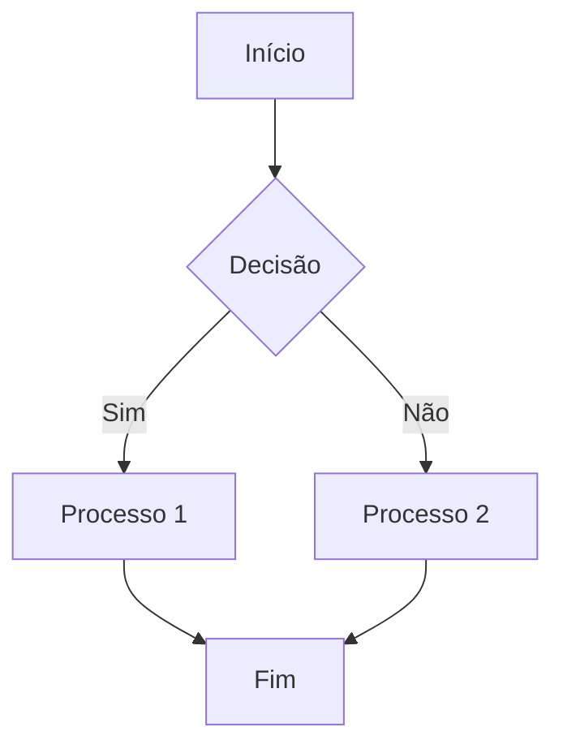

# <IonicIcon name="brush-outline" size={32} color="#ea4b71" /> Guia de Estilo para Contribuição

:::tip[Por que um Guia de Estilo é importante?]
Um guia de estilo garante que toda a documentação tenha uma voz, estrutura e aparência consistentes. Isso não apenas cria uma experiência de leitura profissional e agradável, mas também facilita a colaboração, pois todas as pessoas que contribuem partem dos mesmos princípios. Seguir este guia é fundamental para manter a alta qualidade do nosso conteúdo.
:::

---

## <IonicIcon name="chatbubble-outline" size={24} color="#ea4b71" /> Tom de Voz e Estratégia
- <IonicIcon name="people-outline" size={16} color="#6b7280" /> **Conversacional e Direto**: Use "você" para se dirigir diretamente à pessoa que está lendo. Mantenha as frases claras e objetivas.
- <IonicIcon name="target-outline" size={16} color="#6b7280" /> **Foco em Resultados**: Conecte os conceitos técnicos a resultados práticos, como produtividade, eficiência e soluções de negócio.
- <IonicIcon name="shield-checkmark-outline" size={16} color="#6b7280" /> **Transparência Total**: Seja claro sobre limitações, pré-requisitos e trade-offs. A honestidade gera confiança.

## <IonicIcon name="heart-outline" size={24} color="#ea4b71" /> Linguagem Inclusiva e Acessível
A inclusão é um pilar desta documentação. O objetivo é criar um ambiente onde todas as pessoas se sintam bem-vindas e capazes de compreender o conteúdo.

### <IonicIcon name="checkmark-circle-outline" size={20} color="#10b981" /> Práticas Essenciais
1. <IonicIcon name="people-circle-outline" size={16} color="#6b7280" /> **Use Termos Neutros**: Em vez de usar o masculino como genérico, opte por termos neutros.
- **Errado**: "o desenvolvedor", "o usuário"
- **Correto**: "a pessoa desenvolvedora", "quem usa o n8n", "a equipe"
2. <IonicIcon name="chatbubbles-outline" size={16} color="#6b7280" /> **Evite Jargões Desnecessários**: Se um termo técnico for inevitável, explique-o na primeira vez que aparecer.
- **Exemplo**: "É preciso configurar o webhook (um 'gancho' que notifica o n8n sobre eventos) para receber os dados."
3. <IonicIcon name="accessibility-outline" size={16} color="#6b7280" /> **Priorize a Acessibilidade**:
- Escreva frases curtas e use a voz ativa.
- Garanta que as imagens tenham texto alternativo (alt-text).
- Não use "@" ou "x" para neutralizar palavras (ex: "usuárix"), pois isso prejudica a leitura por softwares de acessibilidade.

### <IonicIcon name="library-outline" size={20} color="#10b981" /> Referências Importantes
Mantenha-se atualizado com guias de referência sobre o tema:
- <IonicIcon name="document-text-outline" size={16} color="#6b7280" /> **[Manual de Comunicação Inclusiva do Senado Federal](https://www12.senado.leg.br/institucional/relacoespublicas/manual-de-comunicacao-inclusiva)**
- <IonicIcon name="globe-outline" size={16} color="#6b7280" /> **[Guia de Linguagem Inclusiva do EIGE (inglês)](https://eige.europa.eu/publications/guidelines-gender-neutral-language)**

## <IonicIcon name="grid-outline" size={24} color="#ea4b71" /> Estrutura e Formatação
A consistência visual ajuda na leitura e na localização das informações.

### <IonicIcon name="alert-circle-outline" size={20} color="#10b981" /> Admonitions
Use os **Admonitions** para destacar informações importantes. Eles substituem os antigos `blockquotes` de introdução.

| Tipo | Uso |
| :--- | :--- |
| `:::note` | Para informações gerais ou neutras. |
| `:::tip` | Para dicas, sugestões ou boas práticas. Use no início de cada página para resumir o propósito. |
| `:::info` | Para informações que complementam o conteúdo principal. |
| `:::warning` | Para alertas sobre potenciais problemas, como _breaking changes_ ou ações destrutivas. |
| `:::danger` | Para avisos críticos de segurança ou ações que podem causar perda de dados irreparável. |

**Exemplo de uso:**
```markdown
:::tip[O que você vai aprender aqui?]
Nesta seção, você vai descobrir como instalar o n8n em diferentes ambientes...
:::
```

### <IonicIcon name="text-outline" size={20} color="#10b981" /> Títulos e Ícones
- **Formato**: `Título da Seção`
- **Exemplo**: `## Primeiros Passos`

### <IonicIcon name="list-outline" size={20} color="#10b981" /> Listas e Tópicos
Use listas (com marcadores ou números) sempre que possível para quebrar blocos de texto e facilitar a leitura.

### <IonicIcon name="navigate-outline" size={20} color="#10b981" /> Navegação no Rodapé
Todo arquivo deve ter links de navegação para o índice e para as seções anterior e seguinte.

## <IonicIcon name="grid-outline" size={24} color="#ea4b71" /> Padrão de Tabelas para Catálogo de Integrações
Para garantir consistência, as tabelas do catálogo devem usar ícones para identificar os tipos de nós.

### <IonicIcon name="construct-outline" size={20} color="#10b981" /> Estrutura da Tabela
```markdown
| Categoria | Integração | Tipo | Custo | Descrição |
| :--- | :--- | :---: | :---: | :--- |
| **Nome da Categoria** | **[Nome da Integração](link)** | Regular / Trigger / Core Node | `$` | Descrição clara e objetiva. |
```

### <IonicIcon name="checkbox-outline" size={20} color="#10b981" /> Regras Específicas
1. <IonicIcon name="link-outline" size={16} color="#6b7280" /> **Coluna "Integração"**: Nome da integração em **negrito** e como link.
2. <IonicIcon name="shapes-outline" size={16} color="#6b7280" /> **Coluna "Tipo"**: Use texto simples para indicar o tipo (Regular, Trigger, Core Node).
3. <IonicIcon name="card-outline" size={16} color="#6b7280" /> **Coluna "Custo"**: Use backticks para destacar (`$`, `$$`, `$$$`, `Open Source`) e centralize a coluna.
4. <IonicIcon name="folder-outline" size={16} color="#6b7280" /> **Coluna "Categoria"**: Nome em **negrito** apenas na primeira linha da categoria.

### <IonicIcon name="information-circle-outline" size={20} color="#10b981" /> Legenda de Ícones
- <IonicIcon name="extension-puzzle-outline" size={16} color="#6b7280" /> **Regular**: Integração padrão do n8n.
- <IonicIcon name="flash-outline" size={16} color="#6b7280" /> **Trigger**: Pode iniciar workflows automaticamente.
- <IonicIcon name="hardware-chip-outline" size={16} color="#6b7280" /> **Core Node**: Funcionalidade essencial do n8n.
- <IonicIcon name="heart-outline" size={16} color="#6b7280" /> **Open Source**: Software livre ou auto-hospedado.

### <IonicIcon name="document-outline" size={20} color="#10b981" /> Exemplo Completo
```markdown
| Categoria | Integração | Tipo | Custo | Descrição |
| :--- | :--- | :---: | :---: | :--- |
| **CI/CD & Repositórios** | **[GitHub](https://n8n.io/integrations/github)** | Regular / Trigger / Core | `$` | Hospedagem de código, automação e integração contínua. |
| | **[GitLab](https://n8n.io/integrations/gitlab)** | Regular / Trigger / Core | `$` | Repositórios Git, CI/CD e automação. |
| **Cloud & Infraestrutura** | **[Docker](https://n8n.io/integrations/docker)** | Regular | `Open Source` | Gerenciamento e automação de containers. |
```

## <IonicIcon name="checkbox-outline" size={24} color="#ea4b71" /> Checklist de Qualidade
Antes de finalizar uma contribuição, faça esta verificação rápida:

- <IonicIcon name="square-outline" size={16} color="#6b7280" /> **Tom de Voz**: O texto está direto, claro e focado em resultados?
- <IonicIcon name="square-outline" size={16} color="#6b7280" /> **Linguagem Inclusiva**: Foram usados termos neutros e acessíveis?
- <IonicIcon name="square-outline" size={16} color="#6b7280" /> **Estrutura**: A página usa um `Admonition` na introdução?
- <IonicIcon name="square-outline" size={16} color="#6b7280" /> **Ícones**: O título da página e as seções usam o componente `<Icon />`?
- <IonicIcon name="square-outline" size={16} color="#6b7280" /> **Tabelas**: Seguem o novo padrão com ícones?
- <IonicIcon name="square-outline" size={16} color="#6b7280" /> **Navegação**: Os links de navegação no rodapé estão corretos?

## <IonicIcon name="color-palette-outline" size={24} color="#ea4b71" /> Componentes Visuais e Interativos
Para enriquecer o conteúdo e melhorar a experiência de quem lê, utilize os componentes interativos do Docusaurus.

### <IonicIcon name="albums-outline" size={20} color="#10b981" /> Abas (Tabs)
Use abas para agrupar conteúdos que são alternativos entre si, como exemplos de código para diferentes sistemas operacionais ou configurações.

**Exemplo de Uso:**
```markdown
import Tabs from '@theme/Tabs';
import TabItem from '@theme/TabItem';

<Tabs groupId="operating-systems">
<TabItem value="win" label="Windows">
Conteúdo específico para Windows.
</TabItem>
<TabItem value="mac" label="macOS">
Conteúdo específico para macOS.
</TabItem>
<TabItem value="linux" label="Linux">
Conteúdo específico para Linux.
</TabItem>
</Tabs>
```

### <IonicIcon name="radio-button-on-outline" size={20} color="#10b981" /> Botões (Buttons)
Use botões para criar links de call-to-action (CTA) que se destacam no texto.

**Exemplo de Uso:**
```html
<a href="/docs/03-primeiros-passos/instalacao-e-deploy" className="button button--primary">
Comece a Instalar
</a>
<a href="/docs/05-catalogo-de-integracoes/visao-geral" className="button button--secondary" style={{marginLeft: '10px'}}>
Ver Integrações
</a>
```
**Resultado:**

<a className="button button--primary" href="#">Comece a Instalar</a>
<a className="button button--secondary" href="#" style={{marginLeft: '10px'}}>Ver Integrações</a>


### <IonicIcon name="git-network-outline" size={20} color="#10b981" /> Diagramas (Mermaid)
Use diagramas para ilustrar fluxos, arquiteturas ou processos complexos de forma visual.

**Exemplo de Uso:**
```markdown

```

--- 