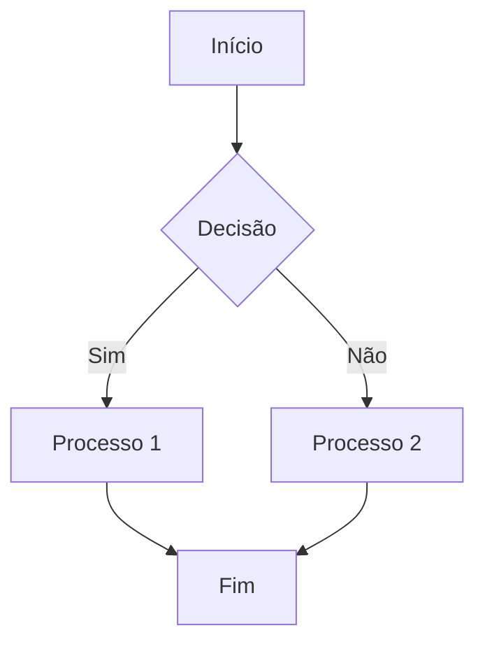

import { Icon } from '@iconify/react';

# <Icon icon="ph:paint-brush-duotone" width="32" style={{ marginBottom: '-5px' }} /> Guia de Estilo para Contribuição

:::tip[Por que um Guia de Estilo é importante?]
Um guia de estilo garante que toda a documentação tenha uma voz, estrutura e aparência consistentes. Isso não apenas cria uma experiência de leitura profissional e agradável, mas também facilita a colaboração, pois todas as pessoas que contribuem partem dos mesmos princípios. Seguir este guia é fundamental para manter a alta qualidade do nosso conteúdo.
:::

---

## Tom de Voz e Estratégia
- **Conversacional e Direto**: Use "você" para se dirigir diretamente à pessoa que está lendo. Mantenha as frases claras e objetivas.
- **Foco em Resultados**: Conecte os conceitos técnicos a resultados práticos, como produtividade, eficiência e soluções de negócio.
- **Transparência Total**: Seja claro sobre limitações, pré-requisitos e trade-offs. A honestidade gera confiança.

## Linguagem Inclusiva e Acessível
A inclusão é um pilar desta documentação. O objetivo é criar um ambiente onde todas as pessoas se sintam bem-vindas e capazes de compreender o conteúdo.

### Práticas Essenciais
1. **Use Termos Neutros**: Em vez de usar o masculino como genérico, opte por termos neutros.
   - <Icon icon="ph:x-circle-duotone" color="red" width="20" style={{ marginBottom: '-4px' }} /> **Errado**: "o desenvolvedor", "o usuário"
   - <Icon icon="ph:check-circle-duotone" color="green" width="20" style={{ marginBottom: '-4px' }} /> **Correto**: "a pessoa desenvolvedora", "quem usa o n8n", "a equipe"
2. **Evite Jargões Desnecessários**: Se um termo técnico for inevitável, explique-o na primeira vez que aparecer.
   - **Exemplo**: "É preciso configurar o webhook (um 'gancho' que notifica o n8n sobre eventos) para receber os dados."
3. **Priorize a Acessibilidade**:
   - Escreva frases curtas e use a voz ativa.
   - Garanta que as imagens tenham texto alternativo (alt-text).
   - Não use "@" ou "x" para neutralizar palavras (ex: "usuárix"), pois isso prejudica a leitura por softwares de acessibilidade.

### Referências Importantes
Mantenha-se atualizado com guias de referência sobre o tema:
- **[Manual de Comunicação Inclusiva do Senado Federal](https://www12.senado.leg.br/institucional/relacoespublicas/manual-de-comunicacao-inclusiva)**
- **[Guia de Linguagem Inclusiva do EIGE (inglês)](https://eige.europa.eu/publications/guidelines-gender-neutral-language)**

## Estrutura e Formatação
A consistência visual ajuda na leitura e na localização das informações.

### Admonitions
Use os **Admonitions** para destacar informações importantes. Eles substituem os antigos `blockquotes` de introdução.

| Tipo | Uso |
| :--- | :--- |
| `:::note` | Para informações gerais ou neutras. |
| `:::tip` | Para dicas, sugestões ou boas práticas. Use no início de cada página para resumir o propósito. |
| `:::info` | Para informações que complementam o conteúdo principal. |
| `:::warning` | Para alertas sobre potenciais problemas, como _breaking changes_ ou ações destrutivas. |
| `:::danger` | Para avisos críticos de segurança ou ações que podem causar perda de dados irreparável. |

**Exemplo de uso:**
```markdown
:::tip[O que você vai aprender aqui?]
Nesta seção, você vai descobrir como instalar o n8n em diferentes ambientes...
:::
```

### Títulos e Ícones
Todo título de página deve começar com um ícone relevante do **[Iconify](https://icon-sets.iconify.design/)**, usando o componente `<Icon />`.

- **Formato**: `<Icon icon="prefix:icon-name" /> Título da Seção`
- **Exemplo**: `## <Icon icon="ph:rocket-duotone" /> Primeiros Passos`

### Listas e Tópicos
Use listas (com marcadores ou números) sempre que possível para quebrar blocos de texto e facilitar a leitura.

### Navegação no Rodapé
Todo arquivo deve ter links de navegação para o índice e para as seções anterior e seguinte.

## Padrão de Tabelas para Catálogo de Integrações
Para garantir consistência, as tabelas do catálogo devem usar ícones para identificar os tipos de nós.

### Estrutura da Tabela
```markdown
| Categoria | Integração | Tipo | Custo | Descrição |
| :--- | :--- | :---: | :---: | :--- |
| **Nome da Categoria** | **[Nome da Integração](link)** | <Icon icon="ph:plugs-duotone" title="Regular" /> <Icon icon="ph:plugs-connected-duotone" title="Trigger" /> <Icon icon="ph:star-duotone" title="Core Node" /> | `$` | Descrição clara e objetiva. |
```

### Regras Específicas
1. **Coluna "Integração"**: Nome da integração em **negrito** e como link.
2. **Coluna "Tipo"**: Use os componentes `<Icon />` com `title` para acessibilidade.
3. **Coluna "Custo"**: Use backticks para destacar (`$`, `$$`, `$$$`, `<Icon icon="ph:plant-duotone" title="Open Source" />`) e centralize a coluna.
4. **Coluna "Categoria"**: Nome em **negrito** apenas na primeira linha da categoria.

### Legenda de Ícones
- <Icon icon="ph:plugs-duotone" /> **Regular**: Integração padrão do n8n.
- <Icon icon="ph:plugs-connected-duotone" /> **Trigger**: Pode iniciar workflows automaticamente.
- <Icon icon="ph:star-duotone" /> **Core Node**: Funcionalidade essencial do n8n.
- <Icon icon="ph:plant-duotone" /> **Open Source**: Software livre ou auto-hospedado.

### Exemplo Completo
```markdown
| Categoria | Integração | Tipo | Custo | Descrição |
| :--- | :--- | :---: | :---: | :--- |
| **CI/CD & Repositórios** | **[GitHub](https://n8n.io/integrations/github)** | <Icon icon="ph:plugs-duotone" title="Regular" /> <Icon icon="ph:plugs-connected-duotone" title="Trigger" /> <Icon icon="ph:star-duotone" title="Core Node" /> | `$` | Hospedagem de código, automação e integração contínua. |
| | **[GitLab](https://n8n.io/integrations/gitlab)** | <Icon icon="ph:plugs-duotone" title="Regular" /> <Icon icon="ph:plugs-connected-duotone" title="Trigger" /> <Icon icon="ph:star-duotone" title="Core Node" /> | `$` | Repositórios Git, CI/CD e automação. |
| **Cloud & Infraestrutura** | **[Docker](https://n8n.io/integrations/docker)** | <Icon icon="ph:plugs-duotone" title="Regular" /> | <Icon icon="ph:plant-duotone" title="Open Source" /> | Gerenciamento e automação de containers. |
```

## Checklist de Qualidade
Antes de finalizar uma contribuição, faça esta verificação rápida:

- [ ] **Tom de Voz**: O texto está direto, claro e focado em resultados?
- [ ] **Linguagem Inclusiva**: Foram usados termos neutros e acessíveis?
- [ ] **Estrutura**: A página usa um `Admonition` na introdução?
- [ ] **Ícones**: O título da página e as seções usam o componente `<Icon />`?
- [ ] **Tabelas**: Seguem o novo padrão com ícones?
- [ ] **Navegação**: Os links de navegação no rodapé estão corretos?

## Componentes Visuais e Interativos
Para enriquecer o conteúdo e melhorar a experiência de quem lê, utilize os componentes interativos do Docusaurus.

### Abas (Tabs)
Use abas para agrupar conteúdos que são alternativos entre si, como exemplos de código para diferentes sistemas operacionais ou configurações.

**Exemplo de Uso:**
```markdown
import Tabs from '@theme/Tabs';
import TabItem from '@theme/TabItem';

<Tabs groupId="operating-systems">
  <TabItem value="win" label="Windows">
    Conteúdo específico para Windows.
  </TabItem>
  <TabItem value="mac" label="macOS">
    Conteúdo específico para macOS.
  </TabItem>
  <TabItem value="linux" label="Linux">
    Conteúdo específico para Linux.
  </TabItem>
</Tabs>
```

### Botões (Buttons)
Use botões para criar links de call-to-action (CTA) que se destacam no texto.

**Exemplo de Uso:**
```html
<a href="/docs/03-primeiros-passos/instalacao-e-deploy" className="button button--primary">
  Comece a Instalar
</a>
<a href="/docs/05-catalogo-de-integracoes/visao-geral" className="button button--secondary" style={{marginLeft: '10px'}}>
  Ver Integrações
</a>
```
**Resultado:**

<a className="button button--primary" href="#">Comece a Instalar</a>
<a className="button button--secondary" href="#" style={{marginLeft: '10px'}}>Ver Integrações</a>


### Diagramas (Mermaid)
Use diagramas para ilustrar fluxos, arquiteturas ou processos complexos de forma visual.

**Exemplo de Uso:**
```markdown

```

--- 