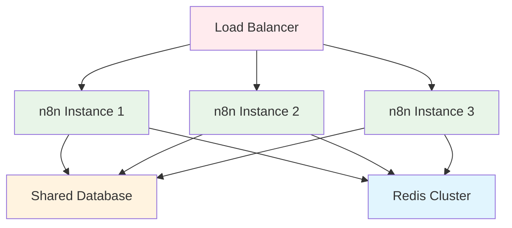
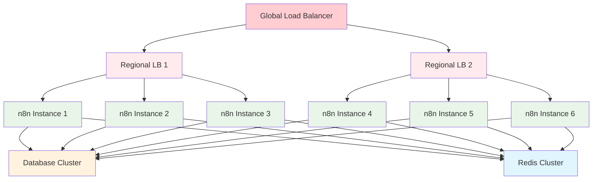

# <ion-icon name="document-outline" style={{ fontSize: '32px', color: '#ea4b71' }}></ion-icon> Clustering

Este documento explica como **implementar clustering** para alta disponibilidade do n8n, incluindo configuração de múltiplas instâncias, balanceamento de carga inteligente, sincronização de dados, failover automático, e arquiteturas distribuídas que garantem operação contínua mesmo com falhas de hardware ou software, proporcionando disponibilidade enterprise-grade para automações críticas de negócio.

## <ion-icon name="school-outline" style={{ fontSize: '24px', color: '#ea4b71' }}></ion-icon> O que você vai aprender

- Arquiteturas de cluster para n8n
- Configuração de múltiplas instâncias
- Balanceamento de carga inteligente
- Failover automático
- Monitoramento de cluster

---

## <ion-icon name="chevron-forward-outline" style={{ fontSize: '24px', color: '#ea4b71' }}></ion-icon> Por que usar Clustering?

### Benefícios do Clustering

**Sem Clustering (Instância Única):**

- ❌ **Ponto único de falha** - Se o servidor cair, tudo para
- ❌ **Limitação de recursos** - Apenas um servidor disponível
- ❌ **Sem escalabilidade** - Não pode distribuir carga
- ❌ **Downtime durante manutenção** - Atualizações param o serviço

**Com Clustering (Múltiplas Instâncias):**

- ✅ **Alta disponibilidade** - Falhas não afetam o serviço
- ✅ **Escalabilidade horizontal** - Adicione servidores conforme necessário
- ✅ **Balanceamento de carga** - Distribui requisições automaticamente
- ✅ **Zero downtime** - Manutenção sem interrupção
- ✅ **Performance melhorada** - Múltiplos servidores processando

### Quando Usar Clustering

**Use clustering quando:**

- Precisa de **99.9%+ de disponibilidade**
- Tem **muitos usuários simultâneos**
- Processa **workflows críticos de negócio**
- Quer **escalabilidade automática**
- Precisa de **manutenção sem downtime**

---

## <ion-icon name="grid-outline" style={{ fontSize: '24px', color: '#ea4b71' }}></ion-icon> Arquiteturas de Cluster

### Topologia Básica



### Arquitetura Avançada



---

## <ion-icon name="settings-outline" style={{ fontSize: '24px', color: '#ea4b71' }}></ion-icon> Configuração de Múltiplas Instâncias

### Configuração Base

#### **Instância Principal (Main)**

```bash
# <ion-icon name="settings-outline" style={{ fontSize: '32px', color: '#ea4b71' }}></ion-icon> Configuração para instância principal
EXECUTIONS_PROCESS=main
EXECUTIONS_MODE=regular

# <ion-icon name="git-branch-outline" style={{ fontSize: '32px', color: '#ea4b71' }}></ion-icon> Este worker processa:
# <ion-icon name="sparkles-outline" style={{ fontSize: '32px', color: '#ea4b71' }}></ion-icon> - Execuções manuais
# <ion-icon name="git-network-outline" style={{ fontSize: '32px', color: '#ea4b71' }}></ion-icon> - Webhooks
# <ion-icon name="grid-outline" style={{ fontSize: '32px', color: '#ea4b71' }}></ion-icon> - Interface de usuário
# <ion-icon name="git-branch-outline" style={{ fontSize: '32px', color: '#ea4b71' }}></ion-icon> - Gerenciamento de workflows
```

#### **Instâncias de Execução**

```bash
# <ion-icon name="settings-outline" style={{ fontSize: '32px', color: '#ea4b71' }}></ion-icon> Configuração para instâncias de execução
EXECUTIONS_PROCESS=worker
EXECUTIONS_MODE=regular

# <ion-icon name="git-branch-outline" style={{ fontSize: '32px', color: '#ea4b71' }}></ion-icon> Este worker processa apenas:
# <ion-icon name="git-branch-outline" style={{ fontSize: '32px', color: '#ea4b71' }}></ion-icon> - Execuções de workflows
# <ion-icon name="git-branch-outline" style={{ fontSize: '32px', color: '#ea4b71' }}></ion-icon> - Jobs da fila
# <ion-icon name="bug-outline" style={{ fontSize: '32px', color: '#ea4b71' }}></ion-icon> - Retry de falhas
```

### Docker Compose com Cluster

```yaml
version: '3.8'

services:
  # Load Balancer
  nginx:
    image: nginx:alpine
    restart: unless-stopped
    ports:
      - "80:80"
      - "443:443"
    volumes:
      - ./nginx.conf:/etc/nginx/nginx.conf
      - ./ssl:/etc/nginx/ssl
    depends_on:
      - n8n-main
      - n8n-worker-1
      - n8n-worker-2
    networks:
      - n8n_network

  # Instância principal
  n8n-main:
    image: n8nio/n8n:latest
    restart: unless-stopped
    environment:
      - EXECUTIONS_PROCESS=main
      - EXECUTIONS_MODE=regular
      - REDIS_URL=redis://redis:6379
      - DB_TYPE=postgresdb
      - DB_POSTGRESDB_HOST=postgres
      - DB_POSTGRESDB_DATABASE=n8n
      - DB_POSTGRESDB_USER=n8n
      - DB_POSTGRESDB_PASSWORD=${DB_PASSWORD}
      - N8N_ENCRYPTION_KEY=${N8N_ENCRYPTION_KEY}
      - N8N_PROTOCOL=https
      - N8N_HOST=seudominio.com
    depends_on:
      - postgres
      - redis
    networks:
      - n8n_network

  # Instâncias de execução
  n8n-worker-1:
    image: n8nio/n8n:latest
    restart: unless-stopped
    environment:
      - EXECUTIONS_PROCESS=worker
      - EXECUTIONS_MODE=regular
      - REDIS_URL=redis://redis:6379
      - DB_TYPE=postgresdb
      - DB_POSTGRESDB_HOST=postgres
      - DB_POSTGRESDB_DATABASE=n8n
      - DB_POSTGRESDB_USER=n8n
      - DB_POSTGRESDB_PASSWORD=${DB_PASSWORD}
      - N8N_ENCRYPTION_KEY=${N8N_ENCRYPTION_KEY}
    depends_on:
      - postgres
      - redis
    networks:
      - n8n_network

  n8n-worker-2:
    image: n8nio/n8n:latest
    restart: unless-stopped
    environment:
      - EXECUTIONS_PROCESS=worker
      - EXECUTIONS_MODE=regular
      - REDIS_URL=redis://redis:6379
      - DB_TYPE=postgresdb
      - DB_POSTGRESDB_HOST=postgres
      - DB_POSTGRESDB_DATABASE=n8n
      - DB_POSTGRESDB_USER=n8n
      - DB_POSTGRESDB_PASSWORD=${DB_PASSWORD}
      - N8N_ENCRYPTION_KEY=${N8N_ENCRYPTION_KEY}
    depends_on:
      - postgres
      - redis
    networks:
      - n8n_network

  # Banco de dados compartilhado
  postgres:
    image: postgres:15
    restart: unless-stopped
    environment:
      - POSTGRES_DB=n8n
      - POSTGRES_USER=n8n
      - POSTGRES_PASSWORD=${DB_PASSWORD}
    volumes:
      - postgres_data:/var/lib/postgresql/data
    networks:
      - n8n_network

  # Redis compartilhado
  redis:
    image: redis:7-alpine
    restart: unless-stopped
    command: redis-server --appendonly yes
    volumes:
      - redis_data:/data
    networks:
      - n8n_network

volumes:
  postgres_data:
  redis_data:

networks:
  n8n_network:
    driver: bridge
```

---

## <ion-icon name="chevron-forward-outline" style={{ fontSize: '24px', color: '#ea4b71' }}></ion-icon> Balanceamento de Carga

### Configuração Nginx

#### **nginx.conf para Cluster**

```nginx
events {
    worker_connections 1024;
}

http {
    # Upstream para instâncias n8n
    upstream n8n_backend {
        # Instância principal
        server n8n-main:5678 max_fails=3 fail_timeout=30s;
        
        # Instâncias de execução
        server n8n-worker-1:5678 max_fails=3 fail_timeout=30s;
        server n8n-worker-2:5678 max_fails=3 fail_timeout=30s;
        
        # Health check
        keepalive 32;
    }

    # Rate limiting
    limit_req_zone $binary_remote_addr zone=api:10m rate=10r/s;
    limit_req_zone $binary_remote_addr zone=webhook:10m rate=30r/s;

    # Gzip compression
    gzip on;
    gzip_vary on;
    gzip_min_length 1024;
    gzip_types text/plain text/css application/json application/javascript;

    server {
        listen 80;
        server_name seudominio.com;
        return 301 https://$server_name$request_uri;
    }

    server {
        listen 443 ssl http2;
        server_name seudominio.com;

        # SSL Configuration
        ssl_certificate /etc/nginx/ssl/cert.pem;
        ssl_certificate_key /etc/nginx/ssl/key.pem;
        ssl_protocols TLSv1.2 TLSv1.3;
        ssl_ciphers ECDHE-RSA-AES256-GCM-SHA512:DHE-RSA-AES256-GCM-SHA512;
        ssl_prefer_server_ciphers off;
        ssl_session_cache shared:SSL:10m;

        # Security Headers
        add_header Strict-Transport-Security "max-age=31536000; includeSubDomains" always;
        add_header X-Frame-Options DENY always;
        add_header X-Content-Type-Options nosniff always;
        add_header X-XSS-Protection "1; mode=block" always;

        # API endpoints com rate limiting
        location /api/ {
            limit_req zone=api burst=20 nodelay;
            proxy_pass http://n8n_backend;
            proxy_set_header Host $host;
            proxy_set_header X-Real-IP $remote_addr;
            proxy_set_header X-Forwarded-For $proxy_add_x_forwarded_for;
            proxy_set_header X-Forwarded-Proto $scheme;
            
            # Health check
            proxy_next_upstream error timeout invalid_header http_500 http_502 http_503 http_504;
        }

        # Webhook endpoints com rate limiting
        location /webhook/ {
            limit_req zone=webhook burst=50 nodelay;
            proxy_pass http://n8n_backend;
            proxy_set_header Host $host;
            proxy_set_header X-Real-IP $remote_addr;
            proxy_set_header X-Forwarded-For $proxy_add_x_forwarded_for;
            proxy_set_header X-Forwarded-Proto $scheme;
            proxy_read_timeout 120s;
            
            # Health check
            proxy_next_upstream error timeout invalid_header http_500 http_502 http_503 http_504;
        }

        # Configuração geral
        location / {
            proxy_pass http://n8n_backend;
            proxy_set_header Host $host;
            proxy_set_header X-Real-IP $remote_addr;
            proxy_set_header X-Forwarded-For $proxy_add_x_forwarded_for;
            proxy_set_header X-Forwarded-Proto $scheme;
            proxy_set_header X-Forwarded-Host $host;
            proxy_set_header X-Forwarded-Port $server_port;

            # WebSocket support
            proxy_http_version 1.1;
            proxy_set_header Upgrade $http_upgrade;
            proxy_set_header Connection "upgrade";
            
            # Health check
            proxy_next_upstream error timeout invalid_header http_500 http_502 http_503 http_504;
        }
    }
}
```

### HAProxy (Alternativa)

#### **haproxy.cfg**

```bash
global
    log /dev/log local0
    log /dev/log local1 notice
    chroot /var/lib/haproxy
    stats socket /run/haproxy/admin.sock mode 660 level admin expose-fd listeners
    stats timeout 30s
    user haproxy
    group haproxy
    daemon

defaults
    log     global
    mode    http
    option  httplog
    option  dontlognull
    timeout connect 5000
    timeout client  50000
    timeout server  50000

frontend n8n_frontend
    bind *:80
    bind *:443 ssl crt /etc/ssl/certs/n8n.pem
    redirect scheme https if !{ ssl_fc }
    
    # ACLs para diferentes tipos de tráfego
    acl is_api path_beg /api/
    acl is_webhook path_beg /webhook/
    
    # Rate limiting
    stick-table type ip size 100k expire 30s store http_req_rate(10s)
    http-request track-sc0 src
    http-request deny deny_status 429 if { sc_http_req_rate(0) gt 10 }
    
    default_backend n8n_backend

backend n8n_backend
    balance roundrobin
    option httpchk GET /healthz
    http-check expect status 200
    
    # Instâncias n8n
    server n8n-main n8n-main:5678 check maxconn 100
    server n8n-worker-1 n8n-worker-1:5678 check maxconn 100
    server n8n-worker-2 n8n-worker-2:5678 check maxconn 100
    
    # Configurações de failover
    option redispatch
    retries 3
    timeout connect 5s
    timeout server 30s
```

---

## <ion-icon name="bug-outline" style={{ fontSize: '24px', color: '#ea4b71' }}></ion-icon> Failover Automático

### Health Checks

#### **Endpoint de Health Check**

```bash
# <ion-icon name="settings-outline" style={{ fontSize: '32px', color: '#ea4b71' }}></ion-icon> Configurar endpoint de health check
N8N_HEALTH_CHECK_ENDPOINT=/healthz
N8N_HEALTH_CHECK_TIMEOUT=5000
N8N_HEALTH_CHECK_INTERVAL=30000
```

#### **Script de Health Check**

```bash
#!/bin/bash
# <ion-icon name="document-outline" style={{ fontSize: '32px', color: '#ea4b71' }}></ion-icon> health-check.sh

N8N_HOST="localhost"
N8N_PORT="5678"
HEALTH_ENDPOINT="/healthz"

# <ion-icon name="document-outline" style={{ fontSize: '32px', color: '#ea4b71' }}></ion-icon> Verificar se n8n está respondendo
if curl -f -s "http://$N8N_HOST:$N8N_PORT$HEALTH_ENDPOINT" > /dev/null; then
    echo "OK: n8n está saudável"
    exit 0
else
    echo "ERROR: n8n não está respondendo"
    exit 1
fi
```

### Monitoramento de Failover

#### **Script de Monitoramento**

```bash
#!/bin/bash
# <ion-icon name="document-outline" style={{ fontSize: '32px', color: '#ea4b71' }}></ion-icon> monitor-cluster.sh

# <ion-icon name="key-outline" style={{ fontSize: '32px', color: '#ea4b71' }}></ion-icon> Configurações
CLUSTER_NODES=("n8n-main" "n8n-worker-1" "n8n-worker-2")
WEBHOOK_URL="https://hooks.slack.com/services/YOUR/WEBHOOK/URL"

# <ion-icon name="document-outline" style={{ fontSize: '32px', color: '#ea4b71' }}></ion-icon> Verificar cada nó
for node in "${CLUSTER_NODES[@]}"; do
    if ! docker exec $node curl -f -s "http://localhost:5678/healthz" > /dev/null; then
        echo "ALERTA: Nó $node não está respondendo!"
        
        # Enviar notificação
        curl -X POST $WEBHOOK_URL \
          -H "Content-type: application/json" \
          -d "{\"text\":\"🚨 Nó $node não está respondendo!\"}"
        
        # Tentar reiniciar o container
        docker restart $node
    else
        echo "OK: Nó $node está saudável"
    fi
done
```

---

## <ion-icon name="cloud-outline" style={{ fontSize: '24px', color: '#ea4b71' }}></ion-icon> Kubernetes Deployment

### Deployment Completo

#### **n8n-deployment.yaml**

```yaml
apiVersion: apps/v1
kind: Deployment
metadata:
  name: n8n-main
  labels:
    app: n8n
    component: main
spec:
  replicas: 1
  selector:
    matchLabels:
      app: n8n
      component: main
  template:
    metadata:
      labels:
        app: n8n
        component: main
    spec:
      containers:
      - name: n8n
        image: n8nio/n8n:latest
        ports:
        - containerPort: 5678
        env:
        - name: EXECUTIONS_PROCESS
          value: "main"
        - name: EXECUTIONS_MODE
          value: "regular"
        - name: REDIS_URL
          value: "redis://redis-service:6379"
        - name: DB_TYPE
          value: "postgresdb"
        - name: DB_POSTGRESDB_HOST
          value: "postgres-service"
        - name: DB_POSTGRESDB_DATABASE
          value: "n8n"
        - name: DB_POSTGRESDB_USER
          valueFrom:
            secretKeyRef:
              name: n8n-secrets
              key: db-user
        - name: DB_POSTGRESDB_PASSWORD
          valueFrom:
            secretKeyRef:
              name: n8n-secrets
              key: db-password
        - name: N8N_ENCRYPTION_KEY
          valueFrom:
            secretKeyRef:
              name: n8n-secrets
              key: encryption-key
        - name: N8N_PROTOCOL
          value: "https"
        - name: N8N_HOST
          value: "seudominio.com"
        resources:
          requests:
            memory: "512Mi"
            cpu: "250m"
          limits:
            memory: "2Gi"
            cpu: "1000m"
        livenessProbe:
          httpGet:
            path: /healthz
            port: 5678
          initialDelaySeconds: 30
          periodSeconds: 10
        readinessProbe:
          httpGet:
            path: /healthz
            port: 5678
          initialDelaySeconds: 5
          periodSeconds: 5
---
apiVersion: apps/v1
kind: Deployment
metadata:
  name: n8n-worker
  labels:
    app: n8n
    component: worker
spec:
  replicas: 3
  selector:
    matchLabels:
      app: n8n
      component: worker
  template:
    metadata:
      labels:
        app: n8n
        component: worker
    spec:
      containers:
      - name: n8n
        image: n8nio/n8n:latest
        ports:
        - containerPort: 5678
        env:
        - name: EXECUTIONS_PROCESS
          value: "worker"
        - name: EXECUTIONS_MODE
          value: "regular"
        - name: REDIS_URL
          value: "redis://redis-service:6379"
        - name: DB_TYPE
          value: "postgresdb"
        - name: DB_POSTGRESDB_HOST
          value: "postgres-service"
        - name: DB_POSTGRESDB_DATABASE
          value: "n8n"
        - name: DB_POSTGRESDB_USER
          valueFrom:
            secretKeyRef:
              name: n8n-secrets
              key: db-user
        - name: DB_POSTGRESDB_PASSWORD
          valueFrom:
            secretKeyRef:
              name: n8n-secrets
              key: db-password
        - name: N8N_ENCRYPTION_KEY
          valueFrom:
            secretKeyRef:
              name: n8n-secrets
              key: encryption-key
        resources:
          requests:
            memory: "512Mi"
            cpu: "250m"
          limits:
            memory: "2Gi"
            cpu: "1000m"
        livenessProbe:
          httpGet:
            path: /healthz
            port: 5678
          initialDelaySeconds: 30
          periodSeconds: 10
        readinessProbe:
          httpGet:
            path: /healthz
            port: 5678
          initialDelaySeconds: 5
          periodSeconds: 5
```

#### **n8n-service.yaml**

```yaml
apiVersion: v1
kind: Service
metadata:
  name: n8n-service
  labels:
    app: n8n
spec:
  selector:
    app: n8n
  ports:
  - port: 5678
    targetPort: 5678
    protocol: TCP
  type: ClusterIP
```

#### **n8n-ingress.yaml**

```yaml
apiVersion: networking.k8s.io/v1
kind: Ingress
metadata:
  name: n8n-ingress
  annotations:
    kubernetes.io/ingress.class: "nginx"
    cert-manager.io/cluster-issuer: "letsencrypt-prod"
    nginx.ingress.kubernetes.io/ssl-redirect: "true"
    nginx.ingress.kubernetes.io/force-ssl-redirect: "true"
spec:
  tls:
  - hosts:
    - seudominio.com
    secretName: n8n-tls
  rules:
  - host: seudominio.com
    http:
      paths:
      - path: /
        pathType: Prefix
        backend:
          service:
            name: n8n-service
            port:
              number: 5678
```

---

## <ion-icon name="chevron-forward-outline" style={{ fontSize: '24px', color: '#ea4b71' }}></ion-icon> Monitoramento de Cluster

### Métricas Essenciais

#### **Script de Monitoramento**

```bash
#!/bin/bash
# <ion-icon name="document-outline" style={{ fontSize: '32px', color: '#ea4b71' }}></ion-icon> monitor-cluster-metrics.sh

echo "=== Métricas do Cluster n8n ==="
echo

# <ion-icon name="person-outline" style={{ fontSize: '32px', color: '#ea4b71' }}></ion-icon> Status dos containers
echo "1. Status dos Containers:"
docker ps --filter "name=n8n" --format "table {{.Names}}\t{{.Status}}\t{{.Ports}}"
echo

# <ion-icon name="school-outline" style={{ fontSize: '32px', color: '#ea4b71' }}></ion-icon> Uso de recursos
echo "2. Uso de Recursos:"
docker stats --no-stream --format "table {{.Container}}\t{{.CPUPerc}}\t{{.MemUsage}}\t{{.NetIO}}"
echo

# <ion-icon name="bug-outline" style={{ fontSize: '32px', color: '#ea4b71' }}></ion-icon> Logs de erro recentes
echo "3. Logs de Erro (últimas 10 linhas):"
docker logs --tail 10 n8n-main 2>&1 | grep -E "(ERROR|WARN)" || echo "Nenhum erro encontrado"
echo

# <ion-icon name="document-outline" style={{ fontSize: '32px', color: '#ea4b71' }}></ion-icon> Health checks
echo "4. Health Checks:"
for container in n8n-main n8n-worker-1 n8n-worker-2; do
    if docker exec $container curl -f -s "http://localhost:5678/healthz" > /dev/null; then
        echo "✅ $container: Saudável"
    else
        echo "❌ $container: Não respondendo"
    fi
done
echo

# <ion-icon name="analytics-outline" style={{ fontSize: '32px', color: '#ea4b71' }}></ion-icon> Métricas Redis
echo "5. Métricas Redis:"
echo "Jobs na fila: $(redis-cli llen n8n:queue:jobs)"
echo "Webhooks na fila: $(redis-cli llen n8n:queue:webhooks)"
echo "Jobs processados: $(redis-cli get n8n:stats:processed || echo '0')"
echo "Jobs falharam: $(redis-cli get n8n:stats:failed || echo '0')"
```

### Alertas Automáticos

#### **Configuração de Alertas**

```bash
#!/bin/bash
# <ion-icon name="warning-outline" style={{ fontSize: '32px', color: '#ea4b71' }}></ion-icon> cluster-alerts.sh

# <ion-icon name="key-outline" style={{ fontSize: '32px', color: '#ea4b71' }}></ion-icon> Configurações
WEBHOOK_URL="https://hooks.slack.com/services/YOUR/WEBHOOK/URL"
ALERT_THRESHOLD_CPU=80
ALERT_THRESHOLD_MEMORY=85
ALERT_THRESHOLD_QUEUE=1000

# <ion-icon name="document-outline" style={{ fontSize: '32px', color: '#ea4b71' }}></ion-icon> Verificar CPU
CPU_USAGE=$(docker stats --no-stream --format "{{.CPUPerc}}" n8n-main | sed 's/%//')
if (( $(echo "$CPU_USAGE > $ALERT_THRESHOLD_CPU" | bc -l) )); then
    curl -X POST $WEBHOOK_URL \
      -H "Content-type: application/json" \
      -d "{\"text\":\"⚠️ CPU alta: ${CPU_USAGE}%\"}"
fi

# <ion-icon name="sparkles-outline" style={{ fontSize: '32px', color: '#ea4b71' }}></ion-icon> Verificar memória
MEMORY_USAGE=$(docker stats --no-stream --format "{{.MemPerc}}" n8n-main | sed 's/%//')
if (( $(echo "$MEMORY_USAGE > $ALERT_THRESHOLD_MEMORY" | bc -l) )); then
    curl -X POST $WEBHOOK_URL \
      -H "Content-type: application/json" \
      -d "{\"text\":\"⚠️ Memória alta: ${MEMORY_USAGE}%\"}"
fi

# <ion-icon name="document-outline" style={{ fontSize: '32px', color: '#ea4b71' }}></ion-icon> Verificar fila
QUEUE_SIZE=$(redis-cli llen n8n:queue:jobs)
if [ $QUEUE_SIZE -gt $ALERT_THRESHOLD_QUEUE ]; then
    curl -X POST $WEBHOOK_URL \
      -H "Content-type: application/json" \
      -d "{\"text\":\"⚠️ Fila muito grande: $QUEUE_SIZE jobs\"}"
fi
```

---

## <ion-icon name="bug-outline" style={{ fontSize: '24px', color: '#ea4b71' }}></ion-icon> Troubleshooting

### Problemas Comuns

#### **Instância não inicia**

```bash
# <ion-icon name="document-outline" style={{ fontSize: '32px', color: '#ea4b71' }}></ion-icon> Verificar logs
docker logs n8n-main

# <ion-icon name="document-outline" style={{ fontSize: '32px', color: '#ea4b71' }}></ion-icon> Verificar variáveis de ambiente
docker exec n8n-main env | grep -E "(DB_|REDIS_|N8N_)"

# <ion-icon name="document-outline" style={{ fontSize: '32px', color: '#ea4b71' }}></ion-icon> Verificar conectividade com banco
docker exec n8n-main nc -zv postgres 5432

# <ion-icon name="server-outline" style={{ fontSize: '32px', color: '#ea4b71' }}></ion-icon> Verificar conectividade com Redis
docker exec n8n-main nc -zv redis 6379
```

#### **Load balancer não distribui carga**

```bash
# <ion-icon name="settings-outline" style={{ fontSize: '32px', color: '#ea4b71' }}></ion-icon> Verificar configuração nginx
nginx -t

# <ion-icon name="document-outline" style={{ fontSize: '32px', color: '#ea4b71' }}></ion-icon> Verificar upstream
curl -I http://n8n-main:5678/healthz
curl -I http://n8n-worker-1:5678/healthz
curl -I http://n8n-worker-2:5678/healthz

# <ion-icon name="document-outline" style={{ fontSize: '32px', color: '#ea4b71' }}></ion-icon> Verificar logs nginx
tail -f /var/log/nginx/error.log
```

#### **Falhas de failover**

```bash
# <ion-icon name="document-outline" style={{ fontSize: '32px', color: '#ea4b71' }}></ion-icon> Verificar health checks
for node in n8n-main n8n-worker-1 n8n-worker-2; do
    echo "=== $node ==="
    docker exec $node curl -f http://localhost:5678/healthz
    echo
done

# <ion-icon name="document-outline" style={{ fontSize: '32px', color: '#ea4b71' }}></ion-icon> Verificar conectividade entre nós
docker network inspect n8n_network
```

---

## <ion-icon name="chevron-forward-outline" style={{ fontSize: '24px', color: '#ea4b71' }}></ion-icon> Checklist de Produção

### Configuração

- [ ] Múltiplas instâncias configuradas
- [ ] Load balancer configurado
- [ ] Health checks implementados
- [ ] Failover automático testado
- [ ] Banco de dados compartilhado configurado

### Performance

- [ ] Balanceamento de carga funcionando
- [ ] Timeouts configurados adequadamente
- [ ] Rate limiting aplicado
- [ ] Monitoramento ativo
- [ ] Alertas configurados

### Monitoramento

- [ ] Métricas sendo coletadas
- [ ] Logs centralizados
- [ ] Alertas funcionando
- [ ] Dashboard de monitoramento
- [ ] Backup de configurações

### Segurança

- [ ] SSL/TLS configurado
- [ ] Acesso restrito por IP
- [ ] Secrets gerenciados adequadamente
- [ ] Logs de auditoria ativos
- [ ] Backup e recuperação testados

---

## <ion-icon name="arrow-forward-circle-outline" style={{ fontSize: '24px', color: '#ea4b71' }}></ion-icon> Próximos Passos

Agora que você configurou o clustering:

1. **[Load Balancing](./load-balancing)** - Configure balanceamento de carga avançado
2. **[Performance](./performance)** - Otimize performance do cluster
3. **[Segurança](../seguranca/autenticacao)** - Configure autenticação avançada
4. **[Backup e Recovery](../seguranca/backup-recovery)** - Implemente estratégias de backup

---

:::tip **Dica Pro**
Configure pelo menos 3 instâncias para alta disponibilidade real. Monitore a distribuição de carga e ajuste conforme necessário.
:::

:::warning **Importante**
Sempre teste o failover em ambiente de desenvolvimento antes de aplicar em produção. Falhas de failover podem causar interrupção total do serviço.
:::
