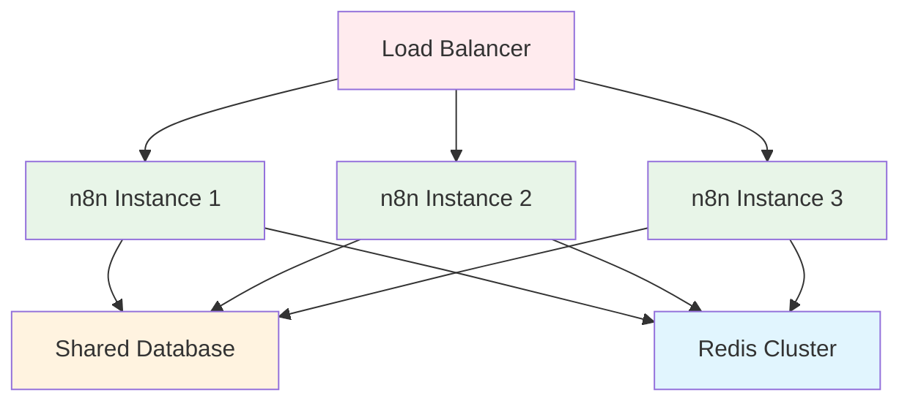

import IonicIcon from '@site/src/components/IonicIcon';

# <IonicIcon name="trending-up-outline" size={32} color="#ea4b71" /> Escalonamento

Esta seção contém guias completos para **escalar n8n em produção** com alta disponibilidade, performance otimizada e tolerância a falhas. Aprenda a implementar clustering, balanceamento de carga, otimização de performance e arquiteturas distribuídas para operações empresariais críticas.

## <IonicIcon name="school-outline" size={24} color="#ea4b71" /> O que você vai encontrar

### <IonicIcon name="trending-up-outline" size={20} color="#10b981" /> [Load Balancing](./load-balancing)

**Balanceamento de carga para n8n em produção**

- <IonicIcon name="construct-outline" size={16} color="#6b7280" /> Configuração de nginx como load balancer
- <IonicIcon name="server-outline" size={16} color="#6b7280" /> Estratégias de distribuição de carga
- <IonicIcon name="refresh-outline" size={16} color="#6b7280" /> Health checks e failover
- <IonicIcon name="analytics-outline" size={16} color="#6b7280" /> Monitoramento de performance
- <IonicIcon name="shield-checkmark-outline" size={16} color="#6b7280" /> Configurações de segurança

<IonicIcon name="arrow-forward-outline" size={16} color="#ea4b71" /> **[Ver guia completo →](./load-balancing)**

### <IonicIcon name="server-outline" size={20} color="#10b981" /> [Clustering](./clustering)

**Implementação de clustering para alta disponibilidade**

- <IonicIcon name="server-outline" size={16} color="#6b7280" /> Arquiteturas de cluster para n8n
- <IonicIcon name="construct-outline" size={16} color="#6b7280" /> Configuração de múltiplas instâncias
- <IonicIcon name="trending-up-outline" size={16} color="#6b7280" /> Balanceamento de carga inteligente
- <IonicIcon name="refresh-outline" size={16} color="#6b7280" /> Failover automático
- <IonicIcon name="analytics-outline" size={16} color="#6b7280" /> Monitoramento de cluster

<IonicIcon name="arrow-forward-outline" size={16} color="#ea4b71" /> **[Ver guia completo →](./clustering)**

### <IonicIcon name="speedometer-outline" size={20} color="#10b981" /> [Otimização de Performance](./performance)

**Técnicas avançadas para máxima eficiência**

- <IonicIcon name="construct-outline" size={16} color="#6b7280" /> Configuração de workers otimizada
- <IonicIcon name="settings-outline" size={16} color="#6b7280" /> Ajuste de timeouts e limites
- <IonicIcon name="server-outline" size={16} color="#6b7280" /> Otimização de banco de dados
- <IonicIcon name="hardware-chip-outline" size={16} color="#6b7280" /> Gerenciamento de memória
- <IonicIcon name="analytics-outline" size={16} color="#6b7280" /> Monitoramento de performance

<IonicIcon name="arrow-forward-outline" size={16} color="#ea4b71" /> **[Ver guia completo →](./performance)**

---

## <IonicIcon name="checkmark-circle-outline" size={24} color="#ea4b71" /> Por que Escalar?

### <IonicIcon name="flash-outline" size={20} color="#10b981" /> Benefícios do Escalonamento

**Sem Escalonamento:**
- ❌ **Ponto único de falha** - Se o servidor cair, tudo para
- ❌ **Limitação de performance** - Apenas um servidor processando
- ❌ **Sem escalabilidade** - Não pode adicionar servidores
- ❌ **Downtime durante manutenção** - Atualizações param o serviço
- ❌ **Experiência ruim** - Sistema lento com muitos usuários

**Com Escalonamento:**
- ✅ **Alta disponibilidade** - Falhas não afetam o serviço
- ✅ **Performance melhorada** - Múltiplos servidores processando
- ✅ **Escalabilidade horizontal** - Adicione servidores conforme necessário
- ✅ **Zero downtime** - Manutenção sem interrupção
- ✅ **Experiência fluida** - Sistema sempre responsivo

### <IonicIcon name="server-outline" size={20} color="#10b981" /> Quando Escalar

**Considere escalar quando:**
- Tem **muitos usuários simultâneos**
- Precisa de **99.9%+ de disponibilidade**
- Processa **workflows críticos de negócio**
- Quer **escalabilidade automática**
- Precisa de **manutenção sem downtime**
- Workflows demoram **mais de 30 segundos**

---

## <IonicIcon name="construct-outline" size={24} color="#ea4b71" /> Arquitetura de Escalonamento

### <IonicIcon name="trending-up-outline" size={20} color="#10b981" /> Visão Geral da Arquitetura

### <IonicIcon name="server-outline" size={20} color="#10b981" /> Componentes Principais

#### **Load Balancer**
- **Nginx/HAProxy** - Distribui requisições entre instâncias
- **Health Checks** - Monitora saúde das instâncias
- **Failover** - Remove instâncias com problemas automaticamente

#### **Instâncias n8n**
- **Worker Principal** - Interface de usuário e gerenciamento
- **Workers de Execução** - Processamento de workflows
- **Configuração Compartilhada** - Banco de dados e Redis

#### **Infraestrutura Compartilhada**
- **Banco de Dados** - PostgreSQL com replicação
- **Redis Cluster** - Filas e cache distribuído
- **Monitoramento** - Métricas e alertas centralizados

---

## <IonicIcon name="rocket-outline" size={24} color="#ea4b71" /> Guia de Implementação

### <IonicIcon name="construct-outline" size={20} color="#10b981" /> Ordem Recomendada

1. **[Load Balancing](./load-balancing)** - Configure balanceamento de carga básico
2. **[Clustering](./clustering)** - Implemente múltiplas instâncias
3. **[Performance](./performance)** - Otimize para máxima eficiência
4. **[Monitoramento](../monitoring)** - Configure alertas e métricas

### <IonicIcon name="server-outline" size={20} color="#10b981" /> Pré-requisitos

- <IonicIcon name="logo-docker" size={16} color="#6b7280" /> **Docker** e **Docker Compose** instalados
- <IonicIcon name="server-outline" size={16} color="#6b7280" /> **Pelo menos 4GB de RAM** disponível
- <IonicIcon name="hardware-chip-outline" size={16} color="#6b7280" /> **2+ vCPUs** para processamento
- <IonicIcon name="cloud-outline" size={16} color="#6b7280" /> **Domínio** configurado com SSL
- <IonicIcon name="shield-checkmark-outline" size={16} color="#6b7280" /> **Backup** configurado

---

## <IonicIcon name="analytics-outline" size={24} color="#ea4b71" /> Monitoramento e Alertas

### <IonicIcon name="speedometer-outline" size={20} color="#10b981" /> Métricas Essenciais

- **CPU e Memória** - Uso de recursos por instância
- **Tempo de Execução** - Performance dos workflows
- **Taxa de Erro** - Estabilidade do sistema
- **Conexões Ativas** - Carga distribuída
- **Filas Redis** - Status do processamento

### <IonicIcon name="notifications-outline" size={20} color="#10b981" /> Alertas Recomendados

- **CPU > 80%** - Alta utilização de processamento
- **Memória > 85%** - Pouca memória disponível
- **Taxa de Erro > 5%** - Muitas falhas
- **Tempo de Execução > 60s** - Workflows lentos
- **Instância Offline** - Falha de servidor

---

## <IonicIcon name="checkmark-circle-outline" size={24} color="#ea4b71" /> Checklist de Produção

### <IonicIcon name="server-outline" size={20} color="#10b981" /> Configuração

- [ ] Load balancer configurado
- [ ] Múltiplas instâncias ativas
- [ ] Banco de dados compartilhado
- [ ] Redis cluster funcionando
- [ ] SSL/TLS configurado

### <IonicIcon name="rocket-outline" size={20} color="#10b981" /> Performance

- [ ] Workers otimizados
- [ ] Timeouts configurados
- [ ] Rate limiting aplicado
- [ ] Monitoramento ativo
- [ ] Alertas funcionando

### <IonicIcon name="shield-checkmark-outline" size={20} color="#10b981" /> Segurança

- [ ] Acesso restrito por IP
- [ ] Secrets gerenciados
- [ ] Logs de auditoria
- [ ] Backup configurado
- [ ] Recuperação testada

---

## <IonicIcon name="arrow-forward-outline" size={24} color="#ea4b71" /> Próximos Passos

Agora que você entende o escalonamento:

1. **[Load Balancing](./load-balancing)** - Comece com balanceamento de carga
2. **[Clustering](./clustering)** - Implemente múltiplas instâncias
3. **[Performance](./performance)** - Otimize para máxima eficiência
4. **[Segurança](../seguranca/autenticacao)** - Configure autenticação avançada

---

:::tip **Dica Pro**
Comece com uma configuração simples de 2-3 instâncias e escale conforme necessário. Monitore sempre a performance e ajuste as configurações.
:::

:::warning **Importante**
Sempre teste o escalonamento em ambiente de desenvolvimento antes de aplicar em produção. Falhas de configuração podem causar interrupção total do serviço.
::: 
