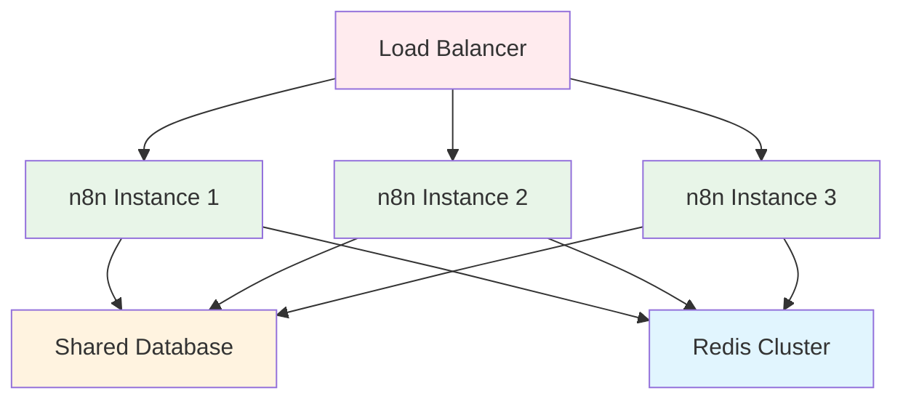

:::info
<ion-icon name="shield-checkmark-outline" style={{ fontSize: '18px', color: '#17a2b8' }}></ion-icon> Esta página da documentação foi validada tecnicamente e didaticamente.
:::

# <ion-icon name="document-outline" style={{ fontSize: '24px', color: '#ea4b71' }}></ion-icon> Escalonamento

Esta seção contém guias completos para **escalar n8n em produção** com alta disponibilidade, performance otimizada e tolerância a falhas. Aprenda a implementar clustering, balanceamento de carga, otimização de performance e arquiteturas distribuídas para operações empresariais críticas.

## <ion-icon name="sparkles-outline" style={{ fontSize: '24px', color: '#ea4b71' }}></ion-icon> O que você vai encontrar

### [Load Balancing](./load-balancing)

**Balanceamento de carga para n8n em produção**

- Configuração de nginx como load balancer
- Estratégias de distribuição de carga
- Health checks e failover
- Monitoramento de performance
- Configurações de segurança

 **[Ver guia completo →](./load-balancing)**

### [Clustering](./clustering)

**Implementação de clustering para alta disponibilidade**

- Arquiteturas de cluster para n8n
- Configuração de múltiplas instâncias
- Balanceamento de carga inteligente
- Failover automático
- Monitoramento de cluster

 **[Ver guia completo →](./clustering)**

### [Otimização de Performance](./performance)

**Técnicas avançadas para máxima eficiência**

- Configuração de workers otimizada
- Ajuste de timeouts e limites
- Otimização de banco de dados
- Gerenciamento de memória
- Monitoramento de performance

 **[Ver guia completo →](./performance)**

---

## <ion-icon name="chevron-forward-outline" style={{ fontSize: '24px', color: '#ea4b71' }}></ion-icon> Por que Escalar?

### Benefícios do Escalonamento

**Sem Escalonamento:**

- ❌ **Ponto único de falha** - Se o servidor cair, tudo para
- ❌ **Limitação de performance** - Apenas um servidor processando
- ❌ **Sem escalabilidade** - Não pode adicionar servidores
- ❌ **Downtime durante manutenção** - Atualizações param o serviço
- ❌ **Experiência ruim** - Sistema lento com muitos usuários

**Com Escalonamento:**

- ✅ **Alta disponibilidade** - Falhas não afetam o serviço
- ✅ **Performance melhorada** - Múltiplos servidores processando
- ✅ **Escalabilidade horizontal** - Adicione servidores conforme necessário
- ✅ **Zero downtime** - Manutenção sem interrupção
- ✅ **Experiência fluida** - Sistema sempre responsivo

### Quando Escalar

**Considere escalar quando:**

- Tem **muitos usuários simultâneos**
- Precisa de **99.9%+ de disponibilidade**
- Processa **workflows críticos de negócio**
- Quer **escalabilidade automática**
- Precisa de **manutenção sem downtime**
- Workflows demoram **mais de 30 segundos**

---

## <ion-icon name="grid-outline" style={{ fontSize: '24px', color: '#ea4b71' }}></ion-icon> Arquitetura de Escalonamento

### Visão Geral da Arquitetura

### Componentes Principais

#### **Load Balancer**

- **Nginx/HAProxy** - Distribui requisições entre instâncias
- **Health Checks** - Monitora saúde das instâncias
- **Failover** - Remove instâncias com problemas automaticamente

#### **Instâncias n8n**

- **Worker Principal** - Interface de usuário e gerenciamento
- **Workers de Execução** - Processamento de workflows
- **Configuração Compartilhada** - Banco de dados e Redis

#### **Infraestrutura Compartilhada**

- **Banco de Dados** - PostgreSQL com replicação
- **Redis Cluster** - Filas e cache distribuído
- **Monitoramento** - Métricas e alertas centralizados

---

## <ion-icon name="document-text-outline" style={{ fontSize: '24px', color: '#ea4b71' }}></ion-icon> Guia de Implementação

### Ordem Recomendada

1. **[Load Balancing](./load-balancing)** - Configure balanceamento de carga básico
2. **[Clustering](./clustering)** - Implemente múltiplas instâncias
3. **[Performance](./performance)** - Otimize para máxima eficiência
4. **[Monitoramento](../seguranca/monitoring)** - Configure alertas e métricas

### Pré-requisitos

- **Docker** e **Docker Compose** instalados
- **Pelo menos 4GB de RAM** disponível
- **2+ vCPUs** para processamento
- **Domínio** configurado com SSL
- **Backup** configurado

---

## <ion-icon name="warning-outline" style={{ fontSize: '24px', color: '#ea4b71' }}></ion-icon> Monitoramento e Alertas

### Métricas Essenciais

- **CPU e Memória** - Uso de recursos por instância
- **Tempo de Execução** - Performance dos workflows
- **Taxa de Erro** - Estabilidade do sistema
- **Conexões Ativas** - Carga distribuída
- **Filas Redis** - Status do processamento

### Alertas Recomendados

- **CPU > 80%** - Alta utilização de processamento
- **Memória > 85%** - Pouca memória disponível
- **Taxa de Erro > 5%** - Muitas falhas
- **Tempo de Execução > 60s** - Workflows lentos
- **Instância Offline** - Falha de servidor

---

## <ion-icon name="chevron-forward-outline" style={{ fontSize: '24px', color: '#ea4b71' }}></ion-icon> Checklist de Produção

### Configuração

- [ ] Load balancer configurado
- [ ] Múltiplas instâncias ativas
- [ ] Banco de dados compartilhado
- [ ] Redis cluster funcionando
- [ ] SSL/TLS configurado

### Performance

- [ ] Workers otimizados
- [ ] Timeouts configurados
- [ ] Rate limiting aplicado
- [ ] Monitoramento ativo
- [ ] Alertas funcionando

### Segurança

- [ ] Acesso restrito por IP
- [ ] Secrets gerenciados
- [ ] Logs de auditoria
- [ ] Backup configurado
- [ ] Recuperação testada

---

## <ion-icon name="arrow-forward-circle-outline" style={{ fontSize: '24px', color: '#ea4b71' }}></ion-icon> Próximos Passos

Agora que você entende o escalonamento:

1. **[Load Balancing](./load-balancing)** - Comece com balanceamento de carga
2. **[Clustering](./clustering)** - Implemente múltiplas instâncias
3. **[Performance](./performance)** - Otimize para máxima eficiência
4. **[Segurança](../seguranca/autenticacao)** - Configure autenticação avançada

---

:::tip **Dica Pro**
Comece com uma configuração simples de 2-3 instâncias e escale conforme necessário. Monitore sempre a performance e ajuste as configurações.
:::

:::warning **Importante**
Sempre teste o escalonamento em ambiente de desenvolvimento antes de aplicar em produção. Falhas de configuração podem causar interrupção total do serviço.
:::
