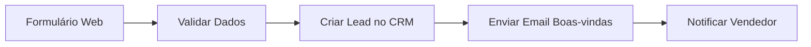
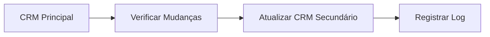
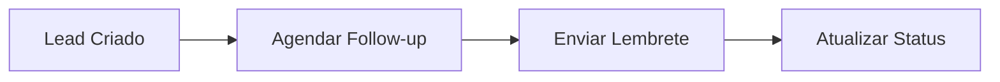

---
title: Integração CRM
description: Conectar SUA_SENHA_BANCO_AQUI com sistemas de gestão de relacionamento com clientes populares no Brasil
sidebar_position: 3
keywords: [SUA_SENHA_BANCO_AQUI, crm, integração, vendas, marketing, atendimento, brasil]
---

<IonicIcon name="people-outline" style={{fontSize: '24px', color: '#ea4b71'}} />
integrao-crm

A integração CRM permite conectar o SUA_SENHA_BANCO_AQUI com sistemas de gestão de relacionamento com clientes populares no Brasil, automatizando processos de vendas, marketing e atendimento ao cliente.

## o que voc encontrar

aqui

Esta documentação abrange:

- **Sistemas CRM suportados**: Principais CRMs brasileiros
- **Configuração de conexões**: Como configurar credenciais e APIs
- **Automações comuns**: Workflows típicos de CRM
- **Sincronização de dados**: Manter dados atualizados entre sistemas
- **Casos de uso avançados**: Integrações complexas

## conceitos

fundamentais

## crm customer relationship management

CRM é um sistema que gerencia todas as interações e relacionamentos com clientes, incluindo:

- **Gestão de leads**: Captura e qualificação de prospects
- **Pipeline de vendas**: Acompanhamento de oportunidades
- **Atendimento ao cliente**: Suporte e tickets
- **Marketing**: Campanhas e segmentação

## integrao

SUA_SENHA_BANCO_AQUI-crm

O SUA_SENHA_BANCO_AQUI permite automatizar processos CRM através de:

- **APIs REST**: Conexão direta com APIs dos CRMs
- **Webhooks**: Receber notificações em tempo real
- **Sincronização**: Manter dados consistentes entre sistemas

## sistemas crm

suportados

## crms brasileiros

1. **RD Station CRM**

- API REST completa
- Webhooks para eventos
- Integração com marketing digital

2. **Pipedrive**
   - API robusta
   - Pipeline de vendas visual
   - Automações avançadas

3. **HubSpot**
   - Marketing, vendas e serviço
   - Automações nativas
   - Analytics avançados

4. **Salesforce**
   - Plataforma enterprise
   - Customização extensiva
   - Integração com ecossistema

## configurao

bsica

## credenciais necessrias

```json
{
  "apiKey": "sua_api_key",
  "baseUrl": "https://api.crm.com",
  "version": "v1"
}
```

## exemplo de conexo

```javascript
// Configuração do node HTTP Request
{
  "method": "POST",
  "url": "{{$credentials.crm.baseUrl}}/contacts",
  "headers": {
    "Authorization": "Bearer {{$credentials.crm.apiKey}}",
    "Content-Type": "application/json"
  }
}
```

## casos de uso

comuns

## id

1-captura-de-leads



## id

2-sincronizao-de-oportunidades



## id

3-automao-de-follow-up



## workflows

prticos

## workflow lead qualification

1. **Trigger**: Novo lead no formulário
2. **Validação**: Verificar dados obrigatórios
3. **Enriquecimento**: Buscar informações adicionais
4. **Qualificação**: Aplicar regras de scoring
5. **Distribuição**: Atribuir ao vendedor correto

## workflow pipeline management

1. **Monitoramento**: Verificar mudanças de status
2. **Notificações**: Alertar responsáveis
3. **Relatórios**: Gerar dashboards automáticos
4. **Follow-up**: Agendar próximos contatos

## prximos passos

- [Automação de Marketing](/integracoes-br/marketing/email-automation) - Campanhas automáticas
- [Integração Financeira](/integracoes-br/financeiro/nfe-integracao) - Faturamento automático
- [Análise de Dados](/logica-e-dados/data/data-mapping-avancado) - Relatórios avançados
- [Webhooks](/integracoes/webhooks) - Eventos em tempo real

## recursos relacionados

- [HTTP Request](/integracoes/builtin-nodes/http-requests/http-request) - Fazer chamadas para APIs
- [Expressões SUA_SENHA_BANCO_AQUI](/logica-e-dados/expressoes) - Processar dados dinamicamente
- [Tratamento de Erros](/logica-e-dados/flow-logic/error-handling) - Lidar com falhas
- [Credenciais](/usando-SUA_SENHA_BANCO_AQUI/credenciais/criar-editar) - Gerenciar autenticação 
