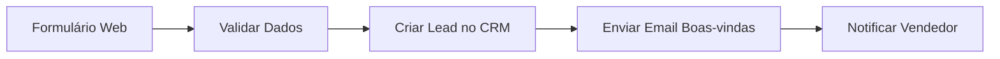
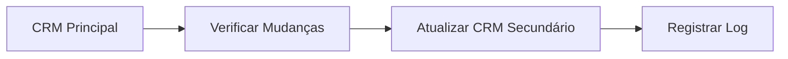
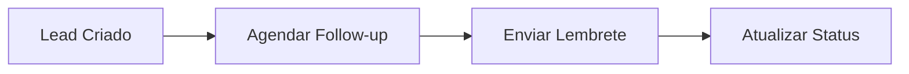

# <ion-icon name="people-outline" style={{ fontSize: '24px', color: '#ea4b71' }}></ion-icon> Integração CRM

A integração CRM permite conectar o n8n com sistemas de gestão de relacionamento com clientes populares no Brasil, automatizando processos de vendas, marketing e atendimento ao cliente.

## O que você encontrará aqui

Esta documentação abrange:

- **Sistemas CRM suportados**: Principais CRMs brasileiros
- **Configuração de conexões**: Como configurar credenciais e APIs
- **Automações comuns**: Workflows típicos de CRM
- **Sincronização de dados**: Manter dados atualizados entre sistemas
- **Casos de uso avançados**: Integrações complexas

## Conceitos Fundamentais

### CRM (Customer Relationship Management)

CRM é um sistema que gerencia todas as interações e relacionamentos com clientes, incluindo:

- **Gestão de leads**: Captura e qualificação de prospects
- **Pipeline de vendas**: Acompanhamento de oportunidades
- **Atendimento ao cliente**: Suporte e tickets
- **Marketing**: Campanhas e segmentação

### Integração n8n-CRM

O n8n permite automatizar processos CRM através de:

- **APIs REST**: Conexão direta com APIs dos CRMs
- **Webhooks**: Receber notificações em tempo real
- **Sincronização**: Manter dados consistentes entre sistemas

## Sistemas CRM Suportados

### CRMs Brasileiros

1. **RD Station CRM**
   - API REST completa
   - Webhooks para eventos
   - Integração com marketing digital

2. **Pipedrive**
   - API robusta
   - Pipeline de vendas visual
   - Automações avançadas

3. **HubSpot**
   - Marketing, vendas e serviço
   - Automações nativas
   - Analytics avançados

4. **Salesforce**
   - Plataforma enterprise
   - Customização extensiva
   - Integração com ecossistema

## Configuração Básica

### Credenciais Necessárias

```json
{
  "apiKey": "sua_api_key",
  "baseUrl": "https://api.crm.com",
  "version": "v1"
}
```

### Exemplo de Conexão

```javascript
// Configuração do node HTTP Request
{
  "method": "POST",
  "url": "{{ $credentials.crm.baseUrl }}/contacts",
  "headers": {
    "Authorization": "Bearer {{ $credentials.crm.apiKey }}",
    "Content-Type": "application/json"
  }
}
```

## Casos de Uso Comuns

### 1. Captura de Leads



### 2. Sincronização de Oportunidades



### 3. Automação de Follow-up



## Workflows Práticos

### Workflow: Lead Qualification

1. **Trigger**: Novo lead no formulário
2. **Validação**: Verificar dados obrigatórios
3. **Enriquecimento**: Buscar informações adicionais
4. **Qualificação**: Aplicar regras de scoring
5. **Distribuição**: Atribuir ao vendedor correto

### Workflow: Pipeline Management

1. **Monitoramento**: Verificar mudanças de status
2. **Notificações**: Alertar responsáveis
3. **Relatórios**: Gerar dashboards automáticos
4. **Follow-up**: Agendar próximos contatos

## Próximos Passos

- [Automação de Marketing](/integracoes-br/marketing/email-automation) - Campanhas automáticas
- [Integração Financeira](/integracoes-br/financeiro/nfe-integracao) - Faturamento automático
- [Análise de Dados](/logica-e-dados/data/agregacoes-estatisticas) - Relatórios avançados
- [Webhooks](/integracoes/webhooks) - Eventos em tempo real

## Recursos Relacionados

- [HTTP Request](/integracoes/builtin-nodes/http-requests/http-request) - Fazer chamadas para APIs
- [Expressões n8n](/logica-e-dados/expressoes) - Processar dados dinamicamente
- [Tratamento de Erros](/logica-e-dados/flow-logic/error-handling) - Lidar com falhas
- [Credenciais](/usando-n8n/credenciais/criar-editar) - Gerenciar autenticação 