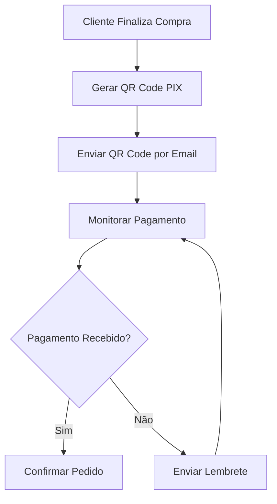
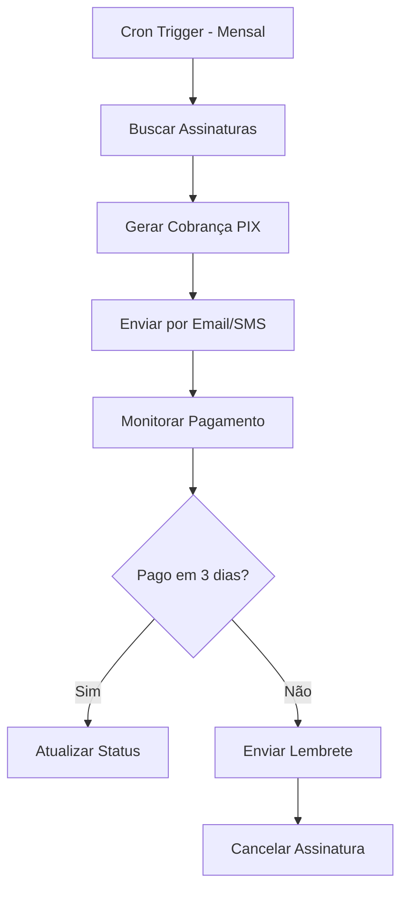
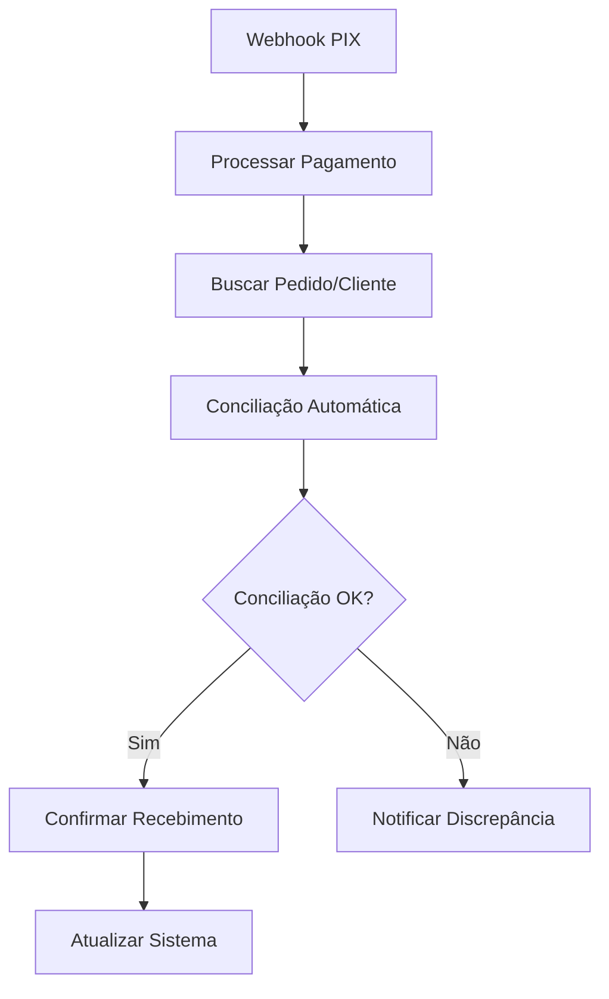
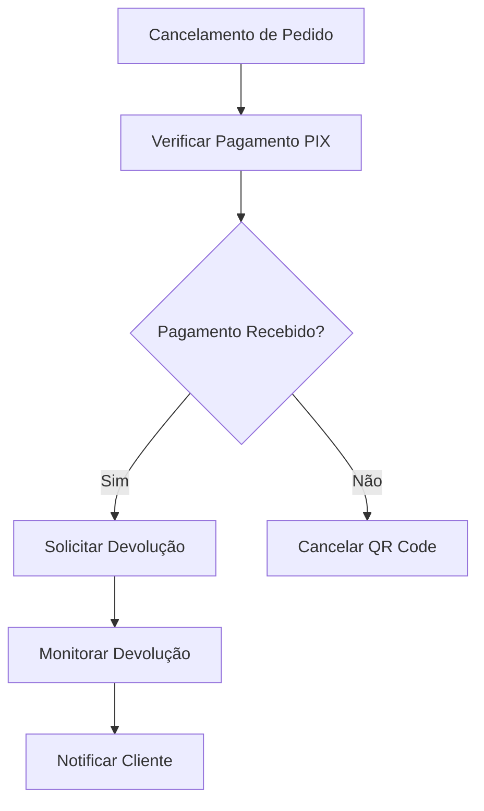
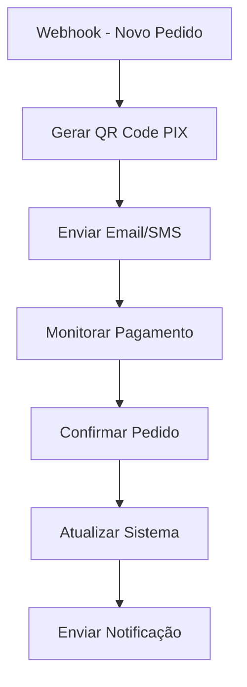

<IonicIcon name="card-outline" style={{fontSize: '24px', color: '#ea4b71'}} />
integrao-pix

O **PIX** é o sistema de pagamentos instantâneos do Banco Central do Brasil, e a integração com SUA_SENHA_BANCO_AQUI permite automatizar processos financeiros, criar workflows de pagamento e gerenciar transações de forma eficiente e segura.

## Configuração Inicial

```json
{
  "banco": "banco_do_brasil",
  "client_id": "seu_client_id",
  "client_secret": "SEU_CLIENT_SECRET_AQUI",
  "certificate_path": "/path/to/certificate.p12",
  "certificate_password": "senha_certificado"
}
```

## Nós Disponíveis

### 1. PIX QR Code Generator

Gera QR Codes PIX para pagamentos.

**Configuração básica:**
```json
{
  "banco": "banco_do_brasil",
  "chave_pix": "empresa@exemplo.com",
  "valor": 100.50,
  "beneficiario": "Empresa Exemplo LTDA",
  "cidade": "São Paulo",
  "txid": "12345"
}
```

**Configuração avançada:**

```json
{
  "banco": "{{$json.banco}}",
  "chave_pix": "{{$json.chave_pix}}",
  "valor": "{{$json.valor}}",
  "beneficiario": "{{$json.beneficiario}}",
  "cidade": "{{$json.cidade}}",
  "descricao": "{{$json.descricao}}",
  "tipo_qr": "dinamico",
  "expiracao": 3600
}
```

### 2. PIX Payment Checker

Verifica se um pagamento PIX foi recebido.

**Configuração:**

```json
{
  "banco": "banco_do_brasil",
  "txid": "{{$json.txid}}",
  "data_inicio": "{{$now.subtract(1, 'hour')}}",
  "data_fim": "{{$now}}"
}
```

### 3. PIX Webhook Receiver

Recebe notificações de pagamentos PIX via webhook.

**Configuração:**

```json
{
  "webhook_url": "https://seu-dominio.com/webhook/pix",
  "eventos": ["pix_recebido", "pix_devolvido"],
  "filtros": {
    "valor_minimo": 10.00,
    "valor_maximo": 10000.00
  }
}
```

## Casos de Uso Práticos

### 1. E-commerce com PIX

**Cenário:** Sistema de pagamento PIX para loja online.



**Configuração do QR Code:**

```json
{
  "banco": "banco_do_brasil",
  "chave_pix": "vendas@empresa.com",
  "valor": "{{$json.valor_total}}",
  "beneficiario": "Empresa LTDA",
  "cidade": "São Paulo",
  "descricao": "Pedido #{{$json.pedido_id}}",
  "tipo_qr": "dinamico",
  "expiracao": 1800
}
```

**Configuração do Monitoramento:**

```javascript
// Code Node - Verificar pagamento
const txid = $json.txid;
const valor = $json.valor;

// Verificar no banco
const pagamento = await verificarPix(txid, valor);

if (pagamento.status === 'CONCLUIDA') {
  return {
    status: 'pago',
    txid: pagamento.txid,
    valor: pagamento.valor,
    data_pagamento: pagamento.data
  };
} else {
  return {
    status: 'pendente',
    txid: txid
  };
}
```

### 2. Sistema de Cobrança Automatizada

**Cenário**: Cobrança automática de assinaturas via PIX.



**Configuração da Cobrança:**

```json
{
  "banco": "{{$json.banco}}",
  "chave_pix": "{{$json.chave_pix}}",
  "valor": "{{$json.valor_mensalidade}}",
  "beneficiario": "Empresa LTDA",
  "descricao": "Mensalidade {{$json.plano}} - {{$json.cliente}}",
  "tipo_qr": "dinamico",
  "expiracao": 259200  // 3 dias
}
```

### 3. Conciliação Bancária PIX

**Cenário:** Conciliação automática de pagamentos PIX com sistema interno.



**Configuração da Conciliação:**

```javascript
// Code Node - Conciliação
const pixData = $json;
const pedidos = await buscarPedidosPorValor(pixData.valor);

// Encontrar pedido correspondente
const pedido = pedidos.find(p => 
  p.valor === pixData.valor && 
  p.status === 'pendente' &&
  p.data_criacao >= pixData.data.subtract(1, 'day')
);

if (pedido) {
  return {
    status: 'conciliado',
    pedido_id: pedido.id,
    pix_txid: pixData.txid,
    valor: pixData.valor,
    data_pagamento: pixData.data
  };
} else {
  return {
    status: 'nao_conciliado',
    pix_txid: pixData.txid,
    valor: pixData.valor,
    data_pagamento: pixData.data
  };
}
```

### 4. Sistema de Devolução PIX

**Cenário**: Devolução automática de pagamentos em caso de cancelamento.



**Configuração da Devolução:**

```json
{
  "banco": "banco_do_brasil",
  "txid_original": "{{$json.txid_original}}",
  "valor_devolucao": "{{$json.valor_devolucao}}",
  "motivo": "Cancelamento de pedido",
  "chave_pix_devolucao": "{{$json.chave_pix_cliente}}"
}
```

## Expressões e Data Mapping

### QR Codes Dinâmicos

```javascript
// QR Code com dados dinâmicos
{
  "banco": "{{$json.banco}}",
  "chave_pix": "{{$json.chave_pix}}",
  "valor": "{{$json.valor}}",
  "beneficiario": "{{$json.beneficiario}}",
  "descricao": "{{$json.tipo}} - {{$json.cliente}}",
  "tipo_qr": "dinamico",
  "expiracao": "{{$json.expiracao_horas * 3600}}"
}
```

### Verificação de Pagamentos

```javascript
// Verificar pagamento com retry
const maxTentativas = 10;
const intervalo = 30000; // 30 segundos

for (let i = 0; i < maxTentativas; i++) {
  const pagamento = await verificarPix($json.txid);
  
  if (pagamento.status === 'CONCLUIDA') {
    return {
      status: 'pago',
      tentativas: i + 1,
      data_pagamento: pagamento.data
    };
  }

  if (i < maxTentativas - 1) {
    await new Promise(resolve => setTimeout(resolve, intervalo));
  }
}

return {
  status: 'timeout',
  tentativas: maxTentativas
};
```

## Tratamento de Erros

### Erros Comuns

**Erro: "QR Code expirado"**

- Gere novo QR Code
- Aumente tempo de expiração
- Implemente renovação automática

**Erro: "Pagamento não encontrado"**

- Verifique TXID
- Aguarde sincronização bancária
- Implemente retry com delay

**Erro: "Valor divergente"**

- Verifique valores no sistema
- Implemente tolerância
- Log detalhado para auditoria

### Estratégia de Retry

```javascript
// Estratégia de retry para PIX
const retryConfig = {
  maxTries: 5,
  initialDelay: 5000,
  maxDelay: 60000,
  backoffMultiplier: 2
};

let delay = retryConfig.initialDelay;

for (let attempt = 1; attempt <= retryConfig.maxTries; attempt++) {
  try {
    const result = await verificarPix(txid);
    return result;
  } catch (error) {
    if (attempt === retryConfig.maxTries) {
      throw error;
    }
    
    await new Promise(resolve => setTimeout(resolve, delay));
    delay = Math.min(delay * retryConfig.backoffMultiplier, retryConfig.maxDelay);
  }
}
```

## Boas Práticas

### 1. Segurança

- **Use HTTPS** para todas as comunicações
- **Valide certificados** bancários
- **Implemente rate limiting** nas APIs
- **Log todas as transações** para auditoria
- **Use chaves PIX seguras** (aleatórias)

### 2. Performance

```javascript
// Cache de verificações PIX
const cacheKey = `pix_${txid}`;
const cached = await cache.get(cacheKey);

if (cached && cached.timestamp > $now.subtract(5, 'minutes')) {
  return cached.data;
}

const result = await verificarPix(txid);
await cache.set(cacheKey, {
  data: result,
  timestamp: $now
});

return result;
```

### 3. Monitoramento

```javascript
// Métricas de PIX
const metrics = {
  total_transacoes: $json.total,
  valor_total: $json.valor_total,
  taxa_sucesso: $json.sucessos / $json.total,
  tempo_medio_pagamento: $json.tempo_medio,
  timestamp: $now
};

await enviarMetricas(metrics);
```

### 4. Compliance

- **Respeite LGPD** no tratamento de dados
- **Mantenha logs** por 5 anos (regulamentação bancária)
- **Implemente auditoria** completa
- **Use certificados** digitais válidos

## Troubleshooting

### Problemas Comuns

**Erro: "Certificado inválido"**

- Verifique validade do certificado
- Confirme senha do certificado
- Renove certificado se necessário

**Erro: "API rate limit"**

- Implemente delays entre requisições
- Use cache para dados não críticos
- Distribua carga entre múltiplas contas

**Erro: "QR Code não gerado"**

- Verifique dados obrigatórios
- Confirme chave PIX válida
- Teste com valores menores

### Debugging Detalhado

```javascript
// Log detalhado para debugging
console.log('PIX Debug:', {
  txid: $json.txid,
  valor: $json.valor,
  banco: $json.banco,
  timestamp: $now,
  status: 'verificando'
});
```

## Integração com Outros Nós

### Fluxo Completo



### Exemplo de Workflow Completo

```javascript
// 1. Webhook - Novo pedido
{
  "url": "/webhook/pedido",
  "method": "POST"
}

// 2. Code Node - Processar pedido
const pedido = $json;
const qrCodeData = {
  banco: 'banco_do_brasil',
  chave_pix: 'vendas@empresa.com',
  valor: pedido.valor_total,
  beneficiario: 'Empresa LTDA',
  descricao: `Pedido #${pedido.id} - ${pedido.cliente}`,
  tipo_qr: 'dinamico',
  expiracao: 3600
};

return qrCodeData;

// 3. PIX - Gerar QR Code
{
  "banco": "{{$json.banco}}",
  "chave_pix": "{{$json.chave_pix}}",
  "valor": "{{$json.valor}}",
  "beneficiario": "{{$json.beneficiario}}",
  "descricao": "{{$json.descricao}}",
  "tipo_qr": "{{$json.tipo_qr}}",
  "expiracao": "{{$json.expiracao}}"
}

// 4. Email - Enviar QR Code
{
  "to": "{{$('Webhook').json.cliente_email}}",
  "subject": "Pagamento PIX - Pedido #{{$('Webhook').json.id}}",
  "html": `
    <h2>Pagamento PIX</h2>
    <p>Valor: R$ {{$json.valor}}</p>
    
  `
}

// 5. Wait Node - Aguardar pagamento
{
  "waitFor": "duration",
  "duration": 300000  // 5 minutos
}

// 6. PIX - Verificar pagamento
{
  "banco": "{{$('Code Node').json.banco}}",
  "txid": "{{$('PIX QR Code').json.txid}}"
}
```

## Referências

- **[Conciliação Bancária](./conciliacao-bancaria)** - Conciliação automatizada
- **[NFE Integração](./nfe-integracao)** - Integração com notas fiscais
- **[HTTP Request](../../integracoes/builtin-nodes/http-requests/http-request)** - APIs bancárias
- **[Webhook Trigger](../../integracoes/trigger-nodes/event-based/webhook-trigger)** - Notificações PIX

---

:::warning **Nota de Atenção**
Esta documentação está em processo de validação. Os exemplos práticos e configurações de nós apresentados precisam ser testados e validados em ambientes reais. A intenção é sempre fornecer práticas e exemplos que funcionem corretamente em produção. Se encontrar inconsistências ou problemas, por favor, reporte para que possamos melhorar a qualidade da documentação.
:::

> **O conhecimento compartilhado em vídeo é uma das formas mais eficazes de aprender automação. Cada tutorial, cada dica, cada caso de uso ajuda a construir uma comunidade mais forte e capacitada.**
