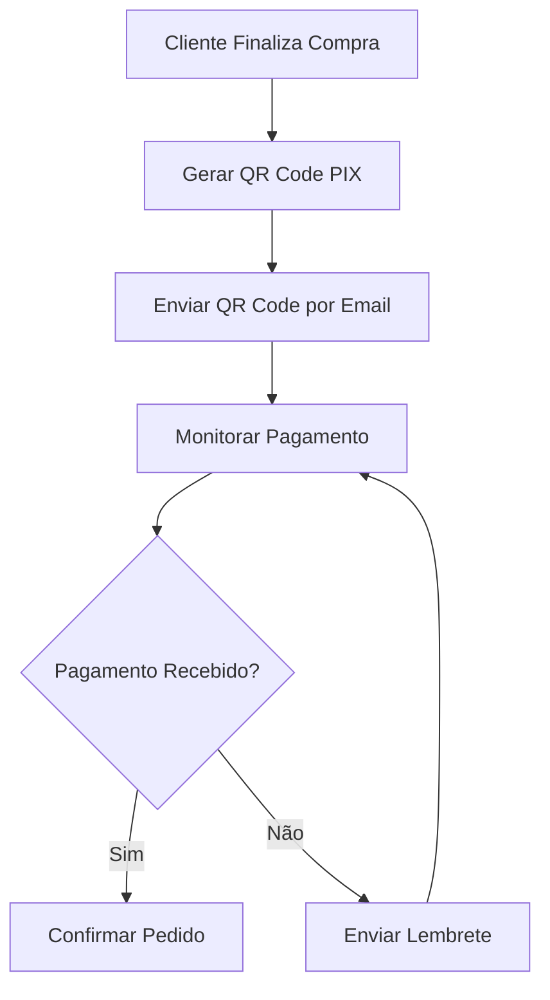
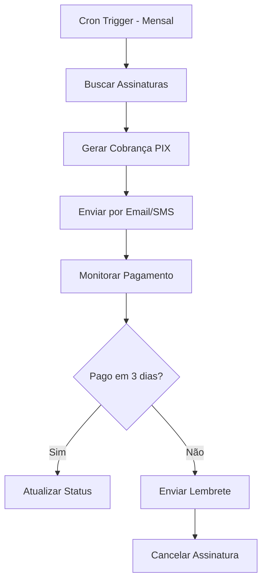
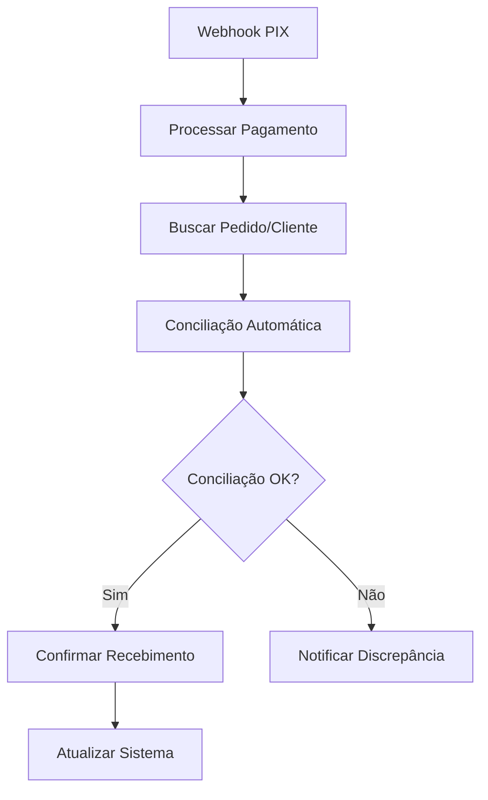
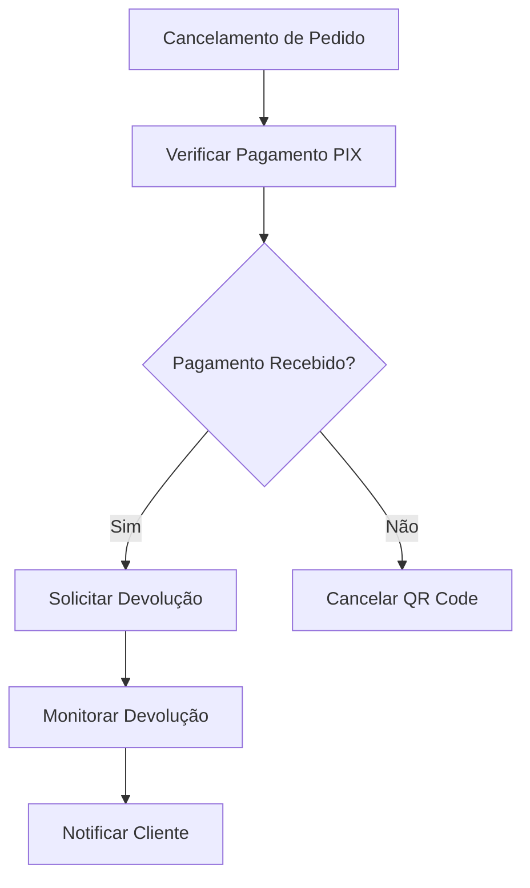

---
sidebar_position: 1
title: Integração PIX
description: Como integrar n8n com PIX para automação de pagamentos brasileiros
keywords: [n8n, pix, pagamentos, brasil, financeiro, automação, qr code, banco]
---

#ionicicon-namecard-outline-style-fontsize-24px color: '#cor-ea4b71-integrao-pix

O **PIX** é o sistema de pagamentos instantâneos do Banco Central do Brasil, e a integração com n8n permite automatizar processos financeiros, criar workflows de pagamento e gerenciar transações de forma eficiente e segura.

#ionicicon-nameinformation-circle-outline-style-fontsize-24px color: '#cor-ea4b71-viso-geral

A integração n8n-PIX oferece:

- **Geração automática de QR Codes** para pagamentos
- **Verificação de recebimentos** em tempo real
- **Conciliação bancária automatizada** com PIX
- **Integração com e-commerces** brasileiros
- **Webhooks para notificações** de pagamentos
- **Relatórios financeiros** automatizados

#ionicicon-namesettings-outline-style-fontsize-24px color: '#cor-ea4b71-configurao

#id-1-configurar-conta-bancria-para usar PIX com n8n, você precisa:

1. **Conta bancária habilitada para PIX**
2. **Chave PIX cadastrada** (CPF, CNPJ, email, telefone ou chave aleatória)
3. **Acesso à API do banco** (se disponível)
4. **Certificados digitais** (para APIs bancárias)

#id-2-apis-bancrias-disponveis-bancos com APIs PIX:**
- **Banco do Brasil** - API PIX
- **Itaú** - API PIX
- **Bradesco** - API PIX
- **Santander** - API PIX
- **Caixa Econômica** - API PIX
- **Nubank** - API PIX

#id-3-configurar-credenciais-json
  "banco": "banco_do_brasil",
  "client_id": "seu_client_id",
  "client_secret": "seu_client_secret",
  "certificate_path": "/path/to/certificate.p12",
  "certificate_password": "senha_certificado"
}
```

#ionicicon-namecode-outline-style-fontsize-24px color: '#cor-ea4b71-ns-disponveis

#id-1-pix-qr-code-generator

Gera QR Codes PIX para pagamentos.

**Configuração básica:**
```json
{
  "banco": "banco_do_brasil",
  "chave_pix": "empresa@exemplo.com",
  "valor": 100.50,
  "beneficiario": "Empresa Exemplo LTDA",
  "cidade": "São Paulo",
  "descricao": "Pedido #cor-12345-configurao-avanada
```json
{
  "banco": "{{ $json.banco }}",
  "chave_pix": "{{ $json.chave_pix }}",
  "valor": "{{ $json.valor }}",
  "beneficiario": "{{ $json.beneficiario }}",
  "cidade": "{{ $json.cidade }}",
  "descricao": "{{ $json.descricao }}",
  "tipo_qr": "dinamico",
  "expiracao": 3600
}
```

#id-2-pix-payment-checker-verifica se um pagamento PIX foi recebido.

**Configuração:**
```json
{
  "banco": "banco_do_brasil",
  "txid": "{{ $json.txid }}",
  "data_inicio": "{{ $now.subtract(1, 'hour') }}",
  "data_fim": "{{ $now }}"
}
```

#id-3-pix-webhook-receiver-recebe notificações de pagamentos PIX via webhook.

**Configuração:**
```json
{
  "webhook_url": "https://seu-dominio.com/webhook/pix",
  "eventos": ["pix_recebido", "pix_devolvido"],
  "filtros": {
    "valor_minimo": 10.00,
    "valor_maximo": 10000.00
  }
}
```

#ionicicon-nameconstruct-outline-style-fontsize-24px color: '#cor-ea4b71-casos-de Uso Práticos

#id-1-e-commerce-com-pix-cenrio Sistema de pagamento PIX para loja online.



**Configuração do QR Code:**
```json
{
  "banco": "banco_do_brasil",
  "chave_pix": "vendas@empresa.com",
  "valor": "{{ $json.valor_total }}",
  "beneficiario": "Empresa LTDA",
  "cidade": "São Paulo",
  "descricao": "Pedido #jsonpedidoid-tipoqr-dinamico-expiracao 1800
}
```

**Configuração do Monitoramento:**
```javascript
// Code Node - Verificar pagamento
const txid = $json.txid;
const valor = $json.valor;

// Verificar no banco
const pagamento = await verificarPix(txid, valor);

if (pagamento.status === 'CONCLUIDA') {
  return {
    status: 'pago',
    txid: pagamento.txid,
    valor: pagamento.valor,
    data_pagamento: pagamento.data
  };
} else {
  return {
    status: 'pendente',
    txid: txid
  };
}
```

#id-2-sistema-de-cobrana-automatizada

**Cenário**: Cobrança automática de assinaturas via PIX.



**Configuração da Cobrança:**
```json
{
  "banco": "{{ $json.banco }}",
  "chave_pix": "{{ $json.chave_pix }}",
  "valor": "{{ $json.valor_mensalidade }}",
  "beneficiario": "Empresa LTDA",
  "descricao": "Mensalidade {{ $json.plano }} - {{ $json.cliente }}",
  "tipo_qr": "dinamico",
  "expiracao": 259200  // 3 dias
}
```

#id-3-conciliao-bancria-pix-cenrio Conciliação automática de pagamentos PIX com sistema interno.



**Configuração da Conciliação:**
```javascript
// Code Node - Conciliação
const pixData = $json;
const pedidos = await buscarPedidosPorValor(pixData.valor);

// Encontrar pedido correspondente
const pedido = pedidos.find(p => 
  p.valor === pixData.valor && 
  p.status === 'pendente' &&
  p.data_criacao >= pixData.data.subtract(1, 'day')
);

if (pedido) {
  return {
    status: 'conciliado',
    pedido_id: pedido.id,
    pix_txid: pixData.txid,
    valor: pixData.valor,
    data_pagamento: pixData.data
  };
} else {
  return {
    status: 'nao_conciliado',
    pix_txid: pixData.txid,
    valor: pixData.valor,
    data_pagamento: pixData.data
  };
}
```

#id-4-sistema-de-devoluo-pix

**Cenário**: Devolução automática de pagamentos em caso de cancelamento.



**Configuração da Devolução:**
```json
{
  "banco": "banco_do_brasil",
  "txid_original": "{{ $json.txid_original }}",
  "valor_devolucao": "{{ $json.valor_devolucao }}",
  "motivo": "Cancelamento de pedido",
  "chave_pix_devolucao": "{{ $json.chave_pix_cliente }}"
}
```

#ionicicon-nameflash-outline-style-fontsize-24px color: '#cor-ea4b71-expresses-e Data Mapping

#qr-codes-dinmicos-javascript QR Code com dados dinâmicos
{
  "banco": "{{ $json.banco }}",
  "chave_pix": "{{ $json.chave_pix }}",
  "valor": "{{ $json.valor }}",
  "beneficiario": "{{ $json.beneficiario }}",
  "descricao": "{{ $json.tipo }} #jsonid-jsoncliente }}",
  "tipo_qr": "dinamico",
  "expiracao": "{{ $json.expiracao_horas * 3600 }}"
}
```

#verificao-de-pagamentos-javascript Verificar pagamento com retry
const maxTentativas = 10;
const intervalo = 30000; // 30 segundos

for (let i = 0; i < maxTentativas; i++) {
  const pagamento = await verificarPix($json.txid);
  
  if (pagamento.status === 'CONCLUIDA') {
    return {
      status: 'pago',
      tentativas: i + 1,
      data_pagamento: pagamento.data
    };
  }
  
  if (i < maxTentativas - 1) {
    await new Promise(resolve => setTimeout(resolve, intervalo));
  }
}

return {
  status: 'timeout',
  tentativas: maxTentativas
};
```

#ionicicon-namewarning-outline-style-fontsize-24px color: '#cor-ea4b71-tratamento-de Erros

#erros-comuns-pix-erro-qr Code expirado"**
- Gere novo QR Code
- Aumente tempo de expiração
- Implemente renovação automática

**Erro: "Pagamento não encontrado"**
- Verifique TXID
- Aguarde sincronização bancária
- Implemente retry com delay

**Erro: "Valor divergente"**
- Verifique valores no sistema
- Implemente tolerância
- Log detalhado para auditoria

#retry-strategy-javascript-estratgia de retry para PIX
const retryConfig = {
  maxTries: 5,
  initialDelay: 5000,
  maxDelay: 60000,
  backoffMultiplier: 2
};

let delay = retryConfig.initialDelay;

for (let attempt = 1; attempt <= retryConfig.maxTries; attempt++) {
  try {
    const result = await verificarPix(txid);
    return result;
  } catch (error) {
    if (attempt === retryConfig.maxTries) {
      throw error;
    }
    
    await new Promise(resolve => setTimeout(resolve, delay));
    delay = Math.min(delay * retryConfig.backoffMultiplier, retryConfig.maxDelay);
  }
}
```

#ionicicon-namespeedometer-outline-style-fontsize-24px color: '#cor-ea4b71-boas-prticas

#id-1-segurana-use-https para todas as comunicações
- **Valide certificados** bancários
- **Implemente rate limiting** nas APIs
- **Log todas as transações** para auditoria
- **Use chaves PIX seguras** (aleatórias)

#id-2-performance-javascript-cache de verificações PIX
const cacheKey = `pix_${txid}`;
const cached = await cache.get(cacheKey);

if (cached && cached.timestamp > $now.subtract(5, 'minutes')) {
  return cached.data;
}

const result = await verificarPix(txid);
await cache.set(cacheKey, {
  data: result,
  timestamp: $now
});

return result;
```

#id-3-monitoramento-javascript-mtricas de PIX
const metrics = {
  total_transacoes: $json.total,
  valor_total: $json.valor_total,
  taxa_sucesso: $json.sucessos / $json.total,
  tempo_medio_pagamento: $json.tempo_medio,
  timestamp: $now
};

await enviarMetricas(metrics);
```

#id-4-compliance-respeite-lgpd no tratamento de dados
- **Mantenha logs** por 5 anos (regulamentação bancária)
- **Implemente auditoria** completa
- **Use certificados** digitais válidos

#ionicicon-namehelp-circle-outline-style-fontsize-24px color: '#cor-ea4b71-troubleshooting

#problemas-comuns-erro-certificado-invlido
- Verifique validade do certificado
- Confirme senha do certificado
- Renove certificado se necessário

**Erro: "API rate limit"**
- Implemente delays entre requisições
- Use cache para dados não críticos
- Distribua carga entre múltiplas contas

**Erro: "QR Code não gerado"**
- Verifique dados obrigatórios
- Confirme chave PIX válida
- Teste com valores menores

#cor-debugging-javascript-log-detalhado para debugging
console.log('PIX Debug:', {
  txid: $json.txid,
  valor: $json.valor,
  banco: $json.banco,
  timestamp: $now,
  status: 'verificando'
});
```

#ionicicon-namelink-outline-style-fontsize-24px color: '#cor-ea4b71-integrao-com Outros Nós

#fluxo-completo-mermaid-graph-td
    A[Webhook - Novo Pedido] --> B[Gerar QR Code PIX]
    B --> C[Enviar Email/SMS]
    C --> D[Monitorar Pagamento]
    D --> E[Confirmar Pedido]
    E --> F[Atualizar Sistema]
    F --> G[Enviar Notificação]
```

#exemplo-de-workflow-completo-javascript
// 1. Webhook - Novo pedido
{
  "url": "/webhook/pedido",
  "method": "POST"
}

// 2. Code Node - Processar pedido
const pedido = $json;
const qrCodeData = {
  banco: 'banco_do_brasil',
  chave_pix: 'vendas@empresa.com',
  valor: pedido.valor_total,
  beneficiario: 'Empresa LTDA',
  descricao: `Pedido #pedidoid-pedidocliente-tipoqr-dinamico
  expiracao: 3600
};

return qrCodeData;

// 3. PIX - Gerar QR Code
{
  "banco": "{{ $json.banco }}",
  "chave_pix": "{{ $json.chave_pix }}",
  "valor": "{{ $json.valor }}",
  "beneficiario": "{{ $json.beneficiario }}",
  "descricao": "{{ $json.descricao }}",
  "tipo_qr": "{{ $json.tipo_qr }}",
  "expiracao": "{{ $json.expiracao }}"
}

// 4. Email - Enviar QR Code
{
  "to": "{{ $('Webhook').json.cliente_email }}",
  "subject": "Pagamento PIX - Pedido #webhookjsonid-html-h2pagamento PIX</h2>
    <p>Valor: R$ {{ $json.valor }}</p>
    
  `
}

// 5. Wait Node - Aguardar pagamento
{
  "waitFor": "duration",
  "duration": 300000  // 5 minutos
}

// 6. PIX - Verificar pagamento
{
  "banco": "{{ $('Code Node').json.banco }}",
  "txid": "{{ $('PIX QR Code').json.txid }}"
}
```

#ionicicon-namedocument-text-outline-style-fontsize-24px color: '#cor-ea4b71-referncias **[Conciliação Bancária](../financeiro/conciliacao-bancaria)** - Conciliação automatizada
- **[NFE Integração](../financeiro/nfe-integracao)** - Integração com notas fiscais
- **[HTTP Request](../../integracoes/builtin-nodes/http-requests/http-request)** - APIs bancárias
- **[Webhook Trigger](../../integracoes/trigger-nodes/event-based/webhook-trigger)** - Notificações PIX

---

:::warning **Nota de Atenção**
Esta documentação está em processo de validação. Os exemplos práticos e configurações de nós apresentados precisam ser testados e validados em ambientes reais. A intenção é sempre fornecer práticas e exemplos que funcionem corretamente em produção. Se encontrar inconsistências ou problemas, por favor, reporte para que possamos melhorar a qualidade da documentação.
:::

> <IonicIcon name="bulb-outline" style={{ fontSize: '18px', color: '#cor-ea4b71-dica-use a integração PIX para modernizar seus processos financeiros. Lembre-se de sempre implementar logs detalhados e monitoramento para garantir a segurança e rastreabilidade das transações.

