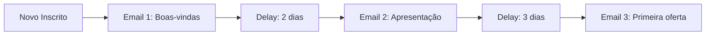
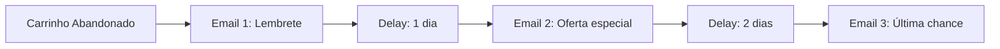
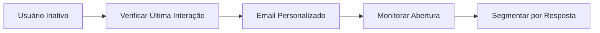

# <ion-icon name="mail-outline" style={{ fontSize: '24px', color: '#ea4b71' }}></ion-icon> Automação de Email

A automação de email permite criar campanhas inteligentes e personalizadas, automatizando o envio de mensagens baseado em comportamentos, eventos e segmentação de audiência.

## O que você encontrará aqui

Esta documentação abrange:

- **Plataformas de email**: Principais serviços brasileiros
- **Configuração de campanhas**: Setup de automações
- **Segmentação**: Como segmentar audiências
- **Templates**: Criação de emails personalizados
- **Analytics**: Métricas e relatórios

## Conceitos Fundamentais

### Automação de Email Marketing

A automação de email permite:

- **Campanhas baseadas em eventos**: Envio automático por ações
- **Sequências de nurture**: Fluxos de relacionamento
- **Segmentação dinâmica**: Personalização por comportamento
- **A/B Testing**: Otimização de campanhas
- **Analytics avançados**: Métricas de performance

### Tipos de Automação

1. **Welcome Series**: Boas-vindas para novos inscritos
2. **Abandoned Cart**: Recuperação de carrinhos abandonados
3. **Re-engagement**: Reativação de usuários inativos
4. **Birthday/Anniversary**: Celebrações personalizadas
5. **Educational**: Conteúdo educativo e informativo

## Plataformas Suportadas

### Serviços Brasileiros

1. **RD Station**
   - Automações nativas
   - Integração com CRM
   - Analytics avançados

2. **Mailchimp**
   - Interface intuitiva
   - Templates responsivos
   - Automações visuais

3. **ActiveCampaign**
   - Automações complexas
   - Segmentação avançada
   - Integração com vendas

4. **ConvertKit**
   - Foco em criadores de conteúdo
   - Automações simples
   - Templates otimizados

## Configuração Básica

### Credenciais Necessárias

```json
{
  "apiKey": "sua_api_key",
  "accountId": "seu_account_id",
  "baseUrl": "https://api.plataforma.com"
}
```

### Exemplo de Automação

```javascript
// Configuração de workflow de boas-vindas
{
  "trigger": "new_subscriber",
  "delay": "1_hour",
  "template": "welcome_series_1",
  "conditions": [
    {
      "field": "source",
      "operator": "equals",
      "value": "website_form"
    }
  ]
}
```

## Casos de Uso Comuns

### 1. Sequência de Boas-vindas



### 2. Recuperação de Carrinho



### 3. Re-engagement



## Workflows Práticos

### Workflow: Onboarding de Clientes

1. **Trigger**: Cliente faz primeira compra
2. **Email 1**: Confirmação e próximos passos
3. **Email 2**: Tutorial de uso do produto
4. **Email 3**: Solicitar feedback
5. **Email 4**: Oferta de produtos relacionados

### Workflow: Nurture de Leads

1. **Trigger**: Lead se inscreve no blog
2. **Email 1**: Boas-vindas e conteúdo gratuito
3. **Email 2**: Apresentação da empresa
4. **Email 3**: Casos de sucesso
5. **Email 4**: Agendamento de demonstração

## Segmentação Avançada

### Critérios de Segmentação

- **Comportamento**: Aberturas, cliques, compras
- **Demográficos**: Idade, localização, empresa
- **Engajamento**: Frequência de interação
- **Histórico**: Produtos comprados, páginas visitadas
- **Preferências**: Categorias de interesse

### Exemplo de Segmentação

```javascript
{
  "segment": "high_value_customers",
  "conditions": [
    {
      "field": "total_purchases",
      "operator": "greater_than",
      "value": 1000
    },
    {
      "field": "last_purchase_date",
      "operator": "within_last",
      "value": "30_days"
    }
  ]
}
```

## Templates e Personalização

### Variáveis Dinâmicas

```html
<h1>Olá {{ first_name }}!</h1>
<p>Vimos que você se interessou por {{ product_name }}.</p>
<p>Como cliente desde {{ join_date }}, você tem {{ loyalty_points }} pontos.</p>
```

### Responsividade

- **Mobile-first**: Design otimizado para dispositivos móveis
- **Compatibilidade**: Testado em diferentes clientes de email
- **Acessibilidade**: Seguindo padrões WCAG
- **Performance**: Otimização de imagens e código

## Analytics e Métricas

### KPIs Principais

- **Taxa de Abertura**: Percentual de emails abertos
- **Taxa de Clique**: Percentual de cliques em links
- **Taxa de Conversão**: Conversões geradas por campanha
- **Taxa de Cancelamento**: Unsubscribes por campanha
- **ROI**: Retorno sobre investimento

### Relatórios Automáticos

```javascript
// Configuração de relatório semanal
{
  "schedule": "weekly",
  "metrics": [
    "open_rate",
    "click_rate", 
    "conversion_rate",
    "revenue_generated"
  ],
  "recipients": ["marketing@empresa.com"]
}
```

## Próximos Passos

- [Integração WhatsApp](/integracoes-br/communication/whatsapp) - Campanhas multicanal
- [Integração CRM](/integracoes-br/financeiro/crm-integration) - Gestão de leads
- [Análise de Dados](/logica-e-dados/data/agregacoes-estatisticas) - Relatórios avançados
- [A/B Testing](/logica-e-dados/data/data-mapping-avancado) - Otimização de campanhas

## Recursos Relacionados

- [HTTP Request](/integracoes/builtin-nodes/http-requests/http-request) - Fazer chamadas para APIs
- [Expressões n8n](/logica-e-dados/expressoes) - Personalizar conteúdo
- [Tratamento de Erros](/logica-e-dados/flow-logic/error-handling) - Lidar com falhas
- [Monitoramento](/usando-n8n/monitoring/configurar-alertas) - Alertas de performance 