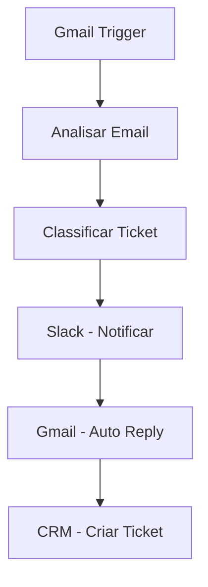
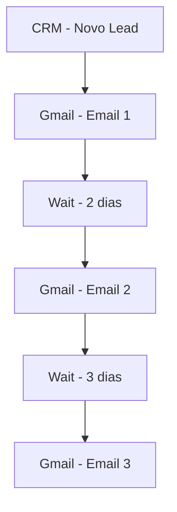
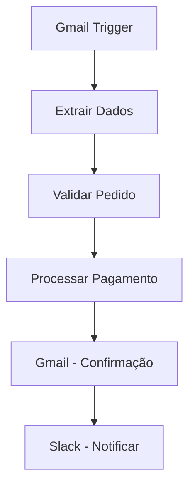
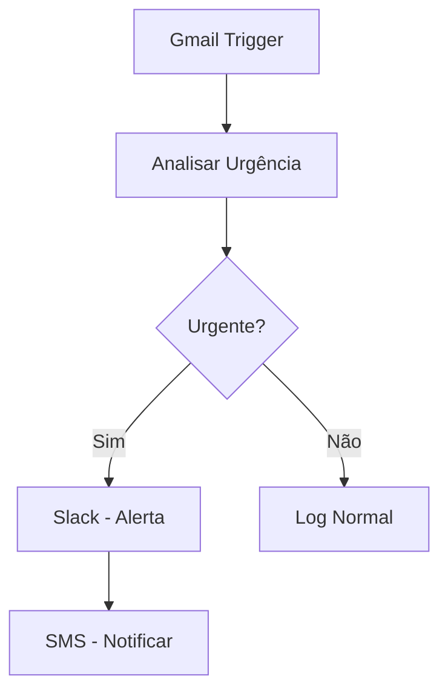

---
sidebar_position: 2
title: Integração Gmail
description: Como integrar n8n com Gmail para automação de emails e comunicação
keywords: [n8n, gmail, email, integração, automação, comunicação, google]
---

#ionicicon-namemail-outline-style-fontsize-24px color: '#cor-ea4b71-integrao-gmail

O **Gmail** é a plataforma de email mais utilizada no mundo, e a integração com n8n permite automatizar processos de comunicação, criar workflows de email marketing e gerenciar correspondências de forma inteligente.

#ionicicon-nameinformation-circle-outline-style-fontsize-24px color: '#cor-ea4b71-viso-geral

A integração n8n-Gmail oferece:

- **Envio automático de emails** baseado em eventos
- **Processamento de emails recebidos** com filtros inteligentes
- **Automação de respostas** e follow-ups
- **Integração com CRM** e sistemas de vendas
- **Email marketing automatizado** com personalização
- **Monitoramento de caixa de entrada** e alertas

#ionicicon-namesettings-outline-style-fontsize-24px color: '#cor-ea4b71-configurao

#id-1-configurar-google-cloud-project

1. Acesse [console.cloud.google.com](https://console.cloud.google.com)
2. Crie um novo projeto ou selecione um existente
3. Ative a **Gmail API**
4. Configure a tela de consentimento OAuth

#id-2-criar-credenciais-oauth-20

1. Vá para **"APIs & Services" > "Credentials"**
2. Clique em **"Create Credentials" > "OAuth 2.0 Client IDs"**
3. Configure o tipo de aplicação (Web application)
4. Adicione URIs de redirecionamento autorizados
5. Copie o **Client ID** e **Client Secret**

#id-3-configurar-credenciais-no-n8n

1. No n8n, vá para **Settings > Credentials**
2. Clique em **"Add Credential"**
3. Selecione **"Gmail"**
4. Insira o Client ID e Client Secret
5. Autorize o acesso à conta Gmail

#id-4-permisses-necessrias-o-app solicitará as seguintes permissões:

- **Read and send emails** - Ler e enviar emails
- **Manage drafts and send emails** - Gerenciar rascunhos
- **View and modify but not delete your email** - Visualizar e modificar emails
- **View your email address** - Visualizar endereço de email

#ionicicon-namecode-outline-style-fontsize-24px color: '#cor-ea4b71-ns-disponveis

#id-1-gmail-trigger-dispara-workflows baseado em eventos do Gmail.

**Eventos disponíveis:**
- `messageReceived` - Novo email recebido
- `messageSent` - Email enviado
- `draftCreated` - Rascunho criado
- `labelAdded` - Label adicionada

**Configuração:**
```json
{
  "event": "messageReceived",
  "filters": {
    "from": "cliente@exemplo.com",
    "subject": "pedido",
    "hasAttachment": true
  }
}
```

#id-2-send-email-envia-emails através do Gmail.

**Configuração básica:**
```json
{
  "to": "destinatario@exemplo.com",
  "subject": "Confirmação de Pedido",
  "text": "Seu pedido foi confirmado com sucesso!",
  "html": "<h1>Pedido Confirmado</h1><p>Obrigado pela compra!</p>"
}
```

**Configuração avançada:**
```json
{
  "to": "{{ $json.email }}",
  "cc": "gerente@empresa.com",
  "bcc": "admin@empresa.com",
  "subject": "Pedido #jsonpedidoid-jsonstatus }}",
  "html": "{{ $('Template Node').json.html_template }}",
  "attachments": [
    {
      "name": "fatura.pdf",
      "data": "{{ $binary.fatura.data }}"
    }
  ]
}
```

#id-3-get-emails-busca-emails da caixa de entrada com filtros.

**Configuração:**
```json
{
  "query": "from:cliente@exemplo.com subject:pedido",
  "maxResults": 10,
  "includeAttachments": true
}
```

#id-4-reply-to-email-responde automaticamente a emails.

**Configuração:**
```json
{
  "messageId": "{{ $json.id }}",
  "text": "Recebemos sua mensagem e responderemos em breve.",
  "html": "<p>Obrigado pelo contato!</p>"
}
```

#ionicicon-nameconstruct-outline-style-fontsize-24px color: '#cor-ea4b71-casos-de Uso Práticos

#id-1-sistema-de-suporte-automatizado

**Cenário**: Processamento automático de tickets de suporte via email.



**Configuração do Trigger:**
```json
{
  "event": "messageReceived",
  "filters": {
    "to": "suporte@empresa.com",
    "subject": "suporte OR ajuda OR problema"
  }
}
```

**Configuração da Auto-Resposta:**
```json
{
  "messageId": "{{ $json.id }}",
  "html": `
    <h2>Ticket Recebido</h2>
    <p>Olá {{ $json.from.name }},</p>
    <p>Recebemos sua solicitação de suporte e criamos o ticket #jsonticketid-p-pstrongassuntostrong-jsonsubject }}</p>
    <p><strong>Prioridade:</strong> {{ $json.prioridade }}</p>
    <p>Nossa equipe entrará em contato em até 24 horas.</p>
    <p>Atenciosamente,<br>Equipe de Suporte</p>
  `
}
```

#id-2-email-marketing-automatizado-cenrio Sequência de emails para leads qualificados.



**Configuração do Email:**
```json
{
  "to": "{{ $json.email }}",
  "subject": "{{ $json.nome }}, conheça nossa solução!",
  "html": `
    <div style="font-family: Arial, sans-serif;">
      <h1>Olá {{ $json.nome }}!</h1>
      <p>Obrigado por se interessar pela nossa solução.</p>
      <p>Baseado no seu perfil, acreditamos que podemos ajudar com:</p>
      <ul>
        <li>{{ $json.interesse_1 }}</li>
        <li>{{ $json.interesse_2 }}</li>
      </ul>
      <p><a href="{{ $json.link_demo }}">Agendar Demonstração</a></p>
    </div>
  `
}
```

#id-3-processamento-de-pedidos-cenrio Confirmação automática de pedidos recebidos por email.



**Configuração da Extração:**
```javascript
// Code Node - Extrair dados do email
const emailBody = $json.body;
const pedidoRegex = /pedido[:\s]*#di-const-valorregex-valorsrsddi

const pedidoMatch = emailBody.match(pedidoRegex);
const valorMatch = emailBody.match(valorRegex);

return {
  pedido_id: pedidoMatch ? pedidoMatch[1] : null,
  valor: valorMatch ? parseFloat(valorMatch[1].replace(',', '.')) : null,
  cliente_email: $json.from.email,
  cliente_nome: $json.from.name,
  status: 'pendente'
};
```

#id-4-monitoramento-de-caixa-de Entrada

**Cenário**: Alertas quando emails importantes são recebidos.



**Configuração do Filtro:**
```json
{
  "event": "messageReceived",
  "filters": {
    "subject": "urgente OR emergência OR crítico",
    "from": "gerente@empresa.com OR diretor@empresa.com"
  }
}
```

#ionicicon-nameflash-outline-style-fontsize-24px color: '#cor-ea4b71-expresses-e Data Mapping

#emails-dinmicos-javascript-email personalizado baseado em dados
{
  "to": "{{ $json.email }}",
  "subject": "{{ $json.nome }}, seu pedido #jsonpedidoid-foi-processado-html `
    <h1>Olá {{ $json.nome }}!</h1>
    <p>Seu pedido foi processado com sucesso.</p>
    <p><strong>Valor:</strong> R$ {{ $json.valor.toFixed(2) }}</p>
    <p><strong>Prazo de entrega:</strong> {{ $json.prazo_entrega }}</p>
  `
}
```

#templates-condicionais-javascript-template baseado no status
const template = $json.status === 'aprovado' 
  ? $('Template Aprovado').json.html
  : $('Template Pendente').json.html;

return {
  "to": $json.email,
  "subject": `Pedido ${$json.status.toUpperCase()}`,
  "html": template
};
```

#filtros-dinmicos-javascript-filtro baseado em horário
const hora = $now.getHours();
const filtroHora = hora >= 9 && hora <= 18 ? 'normal' : 'urgente';

return {
  "query": `from:cliente@exemplo.com subject:${filtroHora}`,
  "maxResults": 5
};
```

#ionicicon-namewarning-outline-style-fontsize-24px color: '#cor-ea4b71-tratamento-de Erros

#retry-para-falhas-de-envio

```javascript
// Configuração de retry
{
  "maxTries": 3,
  "waitBetweenTries": 5000,
  "continueOnFail": false
}
```

#fallback-para-outros-canais-mermaid
graph TD
    A[Gmail - Send Email] --> B{Sucesso?}
    B -->|Não| C[Slack - Notificar]
    B -->|Sim| D[Log Success]
    C --> E[SMS - Enviar]
```

#ionicicon-namespeedometer-outline-style-fontsize-24px color: '#cor-ea4b71-boas-prticas

#id-1-organizao-de-labels **Automação** - Emails processados automaticamente
- **Suporte** - Tickets de suporte
- **Vendas** - Leads e oportunidades
- **Financeiro** - Faturas e pagamentos
- **Urgente** - Requer atenção imediata

#id-2-templates-de-email-html
<!DOCTYPE html>
<html>
<head>
    <meta charset="UTF-8">
    <title>{{ subject }}</title>
</head>
<body style="font-family: Arial, sans-serif; line-height: 1.6;">
    <div style="max-width: 600px; margin: 0 auto; padding: 20px;">
        <header style="background: #cor-f8f9fa-padding-20px-text-align-center
            <h1 style="color: #cor-333-empresanome-h1-header-main style="padding: 20px;">
            {{ conteudo }}
        </main>
        
        <footer style="background: #cor-f8f9fa-padding-20px-text-align-center font-size: 12px; color: #cor-666-p-footertexto-p-footer
    </div>
</body>
</html>
```

#id-3-rate-limiting-javascript Respeitar limites do Gmail
{
  "maxEmailsPerDay": 500,
  "waitBetweenEmails": 1000,  // 1 segundo
  "batchSize": 10
}
```

#id-4-privacidade-e-compliance Não envie dados sensíveis por email
- Respeite leis de proteção de dados (LGPD)
- Implemente unsubscribe em emails marketing
- Monitore logs de envio

#ionicicon-namehelp-circle-outline-style-fontsize-24px color: '#cor-ea4b71-troubleshooting

#problemas-comuns-erro-invalid-credentials
- Verifique se as credenciais OAuth estão corretas
- Reautorize o acesso à conta Gmail
- Confirme se o app tem as permissões necessárias

**Erro: "Quota exceeded"**
- Reduza a frequência de envio
- Implemente rate limiting
- Use contas diferentes para diferentes tipos de email

**Erro: "Message not found"**
- Verifique se o messageId está correto
- Confirme se o email ainda existe na caixa de entrada
- Use IDs relativos em vez de absolutos

#cor-debugging-javascript-log-para debugging
console.log('Gmail Debug:', {
  to: $json.to,
  subject: $json.subject,
  timestamp: $now,
  status: 'sending'
});
```

#ionicicon-namelink-outline-style-fontsize-24px color: '#cor-ea4b71-integrao-com Outros Nós

#fluxo-completo-mermaid-graph-td
    A[Gmail Trigger] --> B[Code Node - Processar]
    B --> C[Database - Salvar]
    C --> D[Slack - Notificar]
    D --> E[Gmail - Responder]
    E --> F[CRM - Atualizar]
```

#exemplo-de-workflow-completo-javascript
// 1. Gmail Trigger - Novo email
{
  "event": "messageReceived",
  "filters": {
    "to": "vendas@empresa.com"
  }
}

// 2. Code Node - Extrair lead
const email = $json;
const lead = {
  nome: email.from.name,
  email: email.from.email,
  telefone: extrairTelefone(email.body),
  interesse: extrairInteresse(email.subject),
  origem: 'email',
  data_recebimento: $now
};

return lead;

// 3. Database - Salvar lead
{
  "operation": "insert",
  "table": "leads",
  "data": $json
}

// 4. Slack - Notificar equipe
{
  "channel": "#vendas-text-novo-lead via email: ${$json.nome} (${$json.email})`
}

// 5. Gmail - Auto-resposta
{
  "messageId": "{{ $('Gmail Trigger').json.id }}",
  "html": `
    <p>Olá {{ $json.nome }},</p>
    <p>Recebemos sua mensagem e entraremos em contato em breve!</p>
  `
}
```

#ionicicon-namedocument-text-outline-style-fontsize-24px color: '#cor-ea4b71-referncias **[Gmail Trigger](../../integracoes/trigger-nodes/app-triggers/gmail-trigger)** - Triggers baseados em eventos do Gmail
- **[Code Node](../../integracoes/builtin-nodes/core-nodes/code)** - Processamento customizado de emails
- **[Database Nodes](../../integracoes/builtin-nodes/data-processing)** - Armazenamento de dados de email
- **[Error Handling](../../logica-e-dados/flow-logic/error-handling)** - Tratamento de erros em workflows

---

:::warning **Nota de Atenção**
Esta documentação está em processo de validação. Os exemplos práticos e configurações de nós apresentados precisam ser testados e validados em ambientes reais. A intenção é sempre fornecer práticas e exemplos que funcionem corretamente em produção. Se encontrar inconsistências ou problemas, por favor, reporte para que possamos melhorar a qualidade da documentação.
:::

> <IonicIcon name="bulb-outline" style={{ fontSize: '18px', color: '#cor-ea4b71-dica-use a integração Gmail para criar workflows de comunicação automatizados que melhoram a experiência do cliente e aumentam a eficiência da sua equipe. Lembre-se de sempre testar seus templates de email antes de usar em produção.

