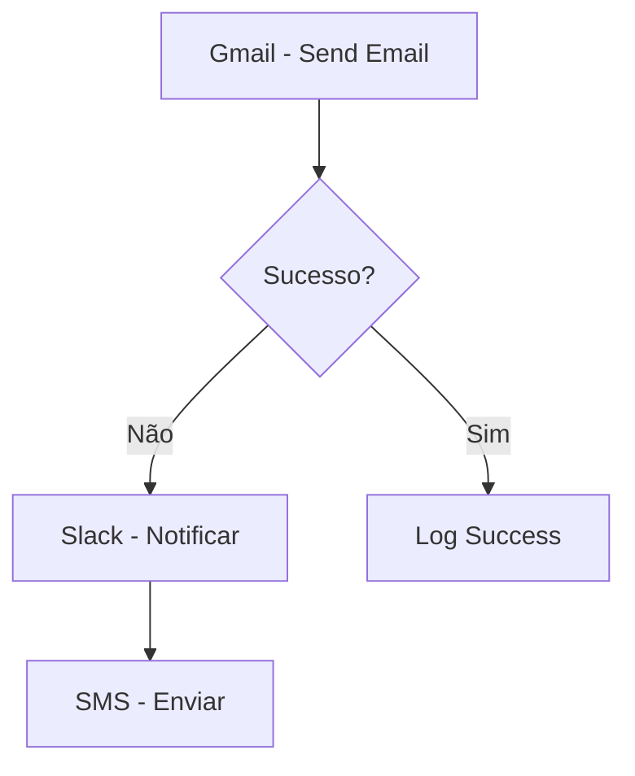
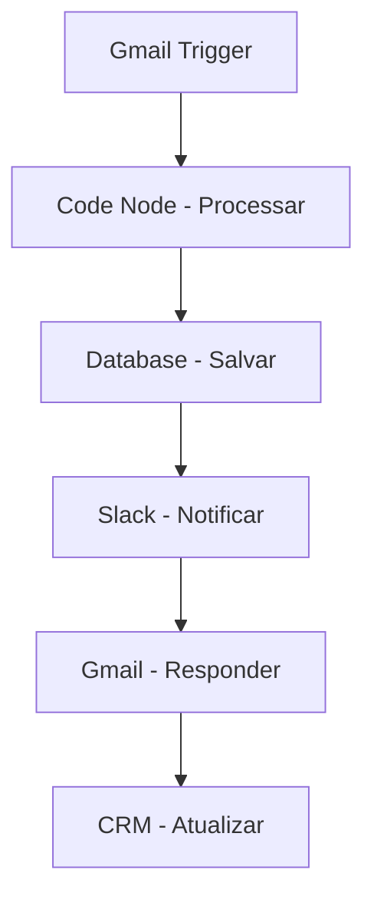

<IonicIcon name="mail-outline" style={{fontSize: '24px', color: '#ea4b71'}} />

# Integração Gmail

O **Gmail** é a plataforma de email mais utilizada no mundo, e a integração com n8n permite automatizar processos de comunicação, criar workflows de email marketing e gerenciar correspondências de forma inteligente.

<IonicIcon name="information-circle-outline" style={{fontSize: '24px', color: '#ea4b71'}} />

## Configuração

### 1. Configurar Credenciais no Google Cloud

1. Vá para **"APIs & Services" > "Credentials"**
2. Clique em **"Create Credentials" > "OAuth 2.0 Client IDs"**
3. Configure o tipo de aplicação (Web application)
4. Adicione URIs de redirecionamento autorizados
5. Copie o **Client ID** e **Client Secret**

### 2. Configurar Credenciais no n8n

1. No n8n, vá para **Settings > Credentials**
2. Clique em **"Add Credential"**
3. Selecione **"Gmail"**
4. Insira o Client ID e Client Secret
5. Autorize o acesso à conta Gmail

### 3. Permissões Necessárias

O app solicitará as seguintes permissões:

- **Read and send emails** - Ler e enviar emails
- **Manage drafts and send emails** - Gerenciar rascunhos
- **View and modify but not delete your email** - Visualizar e modificar emails
- **View your email address** - Visualizar endereço de email

<IonicIcon name="code-outline" style={{fontSize: '24px', color: '#ea4b71'}} />

## Nodes Disponíveis

### 1. Gmail Trigger

Monitora eventos do Gmail em tempo real.

**Configuração básica:**

```json
{
  "event": "messageReceived",
  "filters": {
    "from": "cliente@exemplo.com",
    "subject": "pedido",
    "hasAttachment": true
  }
}
```

### 2. Send Email

Envia emails através do Gmail.

**Configuração básica:**

```json
{
  "to": "destinatario@exemplo.com",
  "subject": "Confirmação de Pedido",
  "text": "Seu pedido foi confirmado com sucesso!",
  "html": "<h1>Pedido Confirmado</h1><p>Obrigado pela compra!</p>"
}
```

**Configuração avançada:**

```json
{
  "to": "{{$json.email}}",
  "cc": "gerente@empresa.com",
  "bcc": "admin@empresa.com",
  "subject": "Pedido {{$json.pedido_id}} - {{$json.status}}",
  "html": "{{$('Template Node').json.html_template}}",
  "attachments": [
    {
      "name": "fatura.pdf",
      "data": "{{$binary.fatura.data}}"
    }
  ]
}
```

### 3. Get Emails

Busca emails da caixa de entrada com filtros.

**Configuração:**

```json
{
  "query": "from:cliente@exemplo.com subject:pedido",
  "maxResults": 10,
  "includeAttachments": true
}
```

### 4. Reply to Email

Responde automaticamente a emails.

**Configuração:**

```json
{
  "messageId": "{{$json.id}}",
  "text": "Recebemos sua mensagem e responderemos em breve.",
  "html": "<p>Obrigado pelo contato!</p>"
}
```

<IonicIcon name="construct-outline" style={{fontSize: '24px', color: '#ea4b71'}} />

## Casos de Uso Práticos

### 1. Sistema de Suporte Automatizado

**Cenário**: Processamento automático de tickets de suporte via email.


**Configuração do Trigger:**

```json
{
  "event": "messageReceived",
  "filters": {
    "to": "suporte@empresa.com",
    "subject": "suporte OR ajuda OR problema"
  }
}
```

**Configuração da Auto-Resposta:**

```json
{
  "messageId": "{{$json.id}}",
  "html": `
    <h2>Ticket Recebido</h2>
    <p>Olá {{$json.from.name}},</p>
    <p>Recebemos sua solicitação de suporte e criamos o ticket #{{$json.ticket_id}}</p>
    <p><strong>Assunto:</strong> {{$json.subject}}</p>
    <p><strong>Prioridade:</strong> {{$json.prioridade}}</p>
    <p>Nossa equipe entrará em contato em até 24 horas.</p>
    <p>Atenciosamente,<br>Equipe de Suporte</p>
  `
}
```

### 2. Email Marketing Automatizado

**Cenário**: Sequência de emails para leads qualificados.


**Configuração do Email:**

```json
{
  "to": "{{$json.email}}",
  "subject": "{{$json.nome}}, conheça nossa solução!",
  "html": `
    <div style="font-family: Arial, sans-serif;">
      <h1>Olá {{$json.nome}}!</h1>
      <p>Obrigado por se interessar pela nossa solução.</p>
      <p>Baseado no seu perfil, acreditamos que podemos ajudar com:</p>
      <ul>
        <li>{{$json.interesse_1}}</li>
        <li>{{$json.interesse_2}}</li>
      </ul>
      <p><a href="{{$json.link_demo}}">Agendar Demonstração</a></p>
    </div>
  `
}
```

### 3. Processamento de Pedidos

**Cenário**: Confirmação automática de pedidos recebidos por email.


**Configuração da Extração:**

```javascript
// Code Node - Extrair dados do email
const emailBody = $json.body;
const pedidoRegex = /pedido[:\s]*#(\d+)/i;
const valorRegex = /valor[:\s]*R?\$?\s*([\d,]+)/i;

const pedidoMatch = emailBody.match(pedidoRegex);
const valorMatch = emailBody.match(valorRegex);

return {
  pedido_id: pedidoMatch ? pedidoMatch[1] : null,
  valor: valorMatch ? parseFloat(valorMatch[1].replace(',', '.')) : null,
  cliente_email: $json.from.email,
  cliente_nome: $json.from.name,
  status: 'pendente'
};
```

### 4. Monitoramento de Caixa de Entrada

**Cenário**: Alertas quando emails importantes são recebidos.


**Configuração do Filtro:**

```json
{
  "event": "messageReceived",
  "filters": {
    "subject": "urgente OR emergência OR crítico",
    "from": "gerente@empresa.com OR diretor@empresa.com"
  }
}
```

<IonicIcon name="flash-outline" style={{fontSize: '24px', color: '#ea4b71'}} />

## Expressões e Data Mapping

### Emails Dinâmicos

```javascript
// Email personalizado baseado em dados
{
  "to": "{{$json.email}}",
  "subject": "{{$json.nome}}, seu pedido #{{$json.pedido_id}} foi processado",
  "html": `
    <h1>Olá {{$json.nome}}!</h1>
    <p>Seu pedido foi processado com sucesso.</p>
    <p><strong>Valor:</strong> R$ {{$json.valor.toFixed(2)}}</p>
    <p><strong>Prazo de entrega:</strong> {{$json.prazo_entrega}}</p>
  `
}
```

### Templates Condicionais

```javascript
// Template baseado no status
const template = $json.status === 'aprovado' 
  ? $('Template Aprovado').json.html
  : $('Template Pendente').json.html;

return {
  "to": $json.email,
  "subject": `Pedido ${$json.status.toUpperCase()}`,
  "html": template
};
```

### Filtros Dinâmicos

```javascript
// Filtro baseado em horário
const hora = $now.getHours();
const filtroHora = hora >= 9 && hora <= 18 ? 'normal' : 'urgente';

return {
  "query": `from:cliente@exemplo.com subject:${filtroHora}`,
  "maxResults": 5
};
```

<IonicIcon name="warning-outline" style={{fontSize: '24px', color: '#ea4b71'}} />

## Tratamento de Erros

### Retry para Falhas de Envio

```javascript
// Configuração de retry
{
  "maxTries": 3,
  "waitBetweenTries": 5000,
  "continueOnFail": false
}
```

### Fallback para Outros Canais



<IonicIcon name="speedometer-outline" style={{fontSize: '24px', color: '#ea4b71'}} />

## Boas Práticas

### 1. Organização de Labels

- **Automação** - Emails processados automaticamente
- **Suporte** - Tickets de suporte
- **Vendas** - Leads e oportunidades
- **Financeiro** - Faturas e pagamentos
- **Urgente** - Requer atenção imediata

### 2. Templates de Email HTML

```html
<!DOCTYPE html>
<html>
<head>
    <meta charset="UTF-8">
    <title>{{subject}}</title>
</head>
<body style="font-family: Arial, sans-serif; line-height: 1.6;">
    <div style="max-width: 600px; margin: 0 auto; padding: 20px;">
        <header style="background-color: #f8f9fa; padding: 20px;">
            <h1>{{empresa_nome}}</h1>
        </header>
        <main style="padding: 20px;">
            {{conteudo}}
        </main>
        <footer style="background-color: #f8f9fa; padding: 20px; text-align: center;">
            <p>{{texto_footer}}</p>
        </footer>
    </div>
</body>
</html>
```

### 3. Rate Limiting

```javascript
// Respeitar limites do Gmail
{
  "maxEmailsPerDay": 500,
  "waitBetweenEmails": 1000,  // 1 segundo
  "batchSize": 10
}
```

### 4. Privacidade e Compliance

- Não envie dados sensíveis por email
- Respeite leis de proteção de dados (LGPD)
- Implemente unsubscribe em emails marketing
- Monitore logs de envio

<IonicIcon name="help-circle-outline" style={{fontSize: '24px', color: '#ea4b71'}} />

## Troubleshooting

### Problemas Comuns

**Erro: "Invalid credentials"**
- Verifique se as credenciais OAuth estão corretas
- Reautorize o acesso à conta Gmail
- Confirme se o app tem as permissões necessárias

**Erro: "Quota exceeded"**
- Reduza a frequência de envio
- Implemente rate limiting
- Use contas diferentes para diferentes tipos de email

**Erro: "Message not found"**
- Verifique se o messageId está correto
- Confirme se o email ainda existe na caixa de entrada
- Use IDs relativos em vez de absolutos

### Debugging

```javascript
// Para debugging
console.log('Gmail Debug:', {
  to: $json.to,
  subject: $json.subject,
  timestamp: $now,
  status: 'sending'
});
```

<IonicIcon name="link-outline" style={{fontSize: '24px', color: '#ea4b71'}} />

## Integração com Outros Nós

### Fluxo Completo



### Exemplo de Workflow Completo

```javascript
// 1. Gmail Trigger - Novo email
{
  "event": "messageReceived",
  "filters": {
    "to": "vendas@empresa.com"
  }
}

// 2. Code Node - Extrair lead
const email = $json;
const lead = {
  nome: email.from.name,
  email: email.from.email,
  telefone: extrairTelefone(email.body),
  interesse: extrairInteresse(email.subject),
  origem: 'email',
  data_recebimento: $now
};

return lead;

// 3. Database - Salvar lead
{
  "operation": "insert",
  "table": "leads",
  "data": $json
}

// 4. Slack - Notificar equipe
{
  "channel": "#vendas",
  "text": "Novo lead via email: ${$json.nome} (${$json.email})"
}

// 5. Gmail - Auto-resposta
{
  "messageId": "{{$('Gmail Trigger').json.id}}",
  "html": `
    <p>Olá {{$json.nome}},</p>
    <p>Recebemos sua mensagem e entraremos em contato em breve!</p>
  `
}
```

<IonicIcon name="document-text-outline" style={{fontSize: '24px', color: '#ea4b71'}} />

## Referências

- **[Gmail Trigger](../../integracoes/trigger-nodes/app-triggers/gmail-trigger)** - Triggers baseados em eventos do Gmail
- **[Code Node](../../integracoes/builtin-nodes/core-nodes/code)** - Processamento customizado de emails
- **[Database Nodes](../../integracoes/builtin-nodes/data-processing)** - Armazenamento de dados de email
- **[Error Handling](../../logica-e-dados/flow-logic/error-handling)** - Tratamento de erros em workflows

---

:::warning **Nota de Atenção**
Esta documentação está em processo de validação. Os exemplos práticos e configurações de nós apresentados precisam ser testados e validados em ambientes reais. A intenção é sempre fornecer práticas e exemplos que funcionem corretamente em produção. Se encontrar inconsistências ou problemas, por favor, reporte para que possamos melhorar a qualidade da documentação.
:::

> <IonicIcon name="bulb-outline" style={{fontSize: '18px', color: '#ea4b71'}} />
