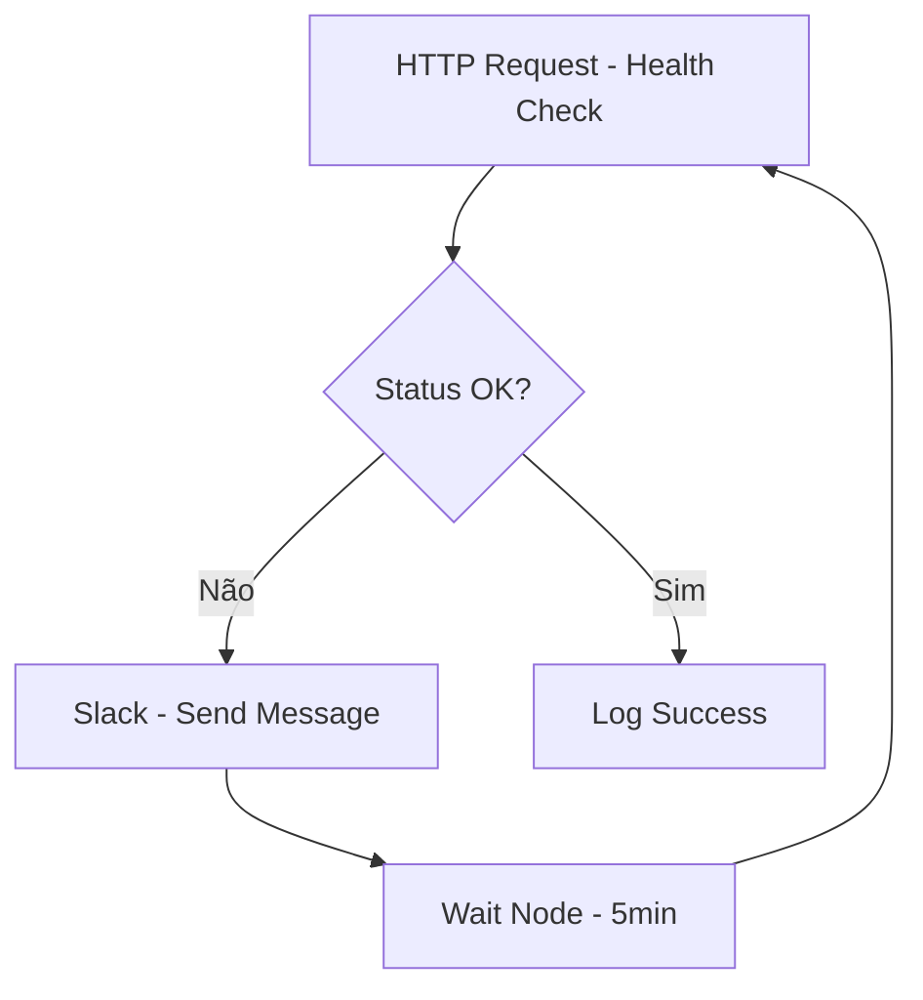
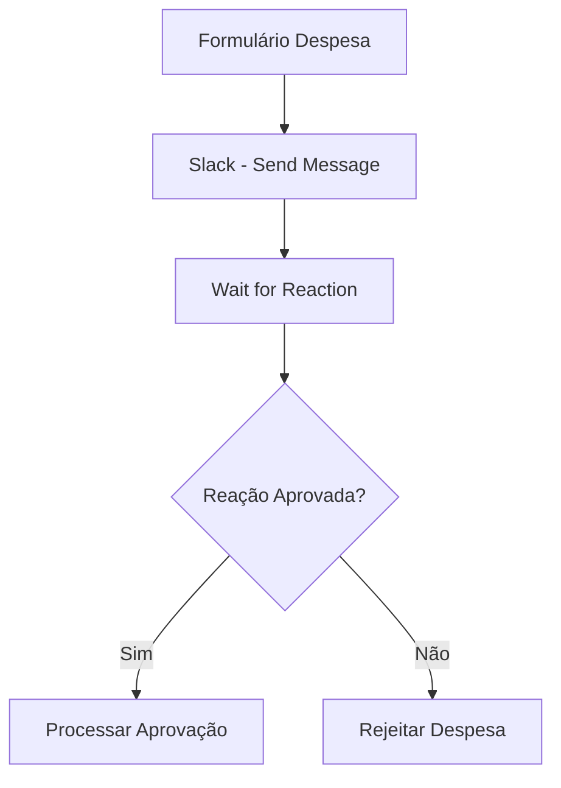
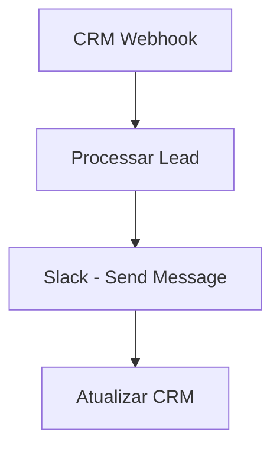
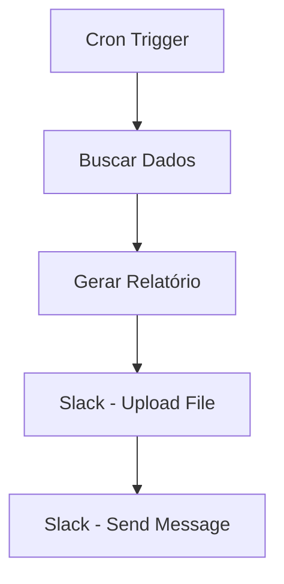
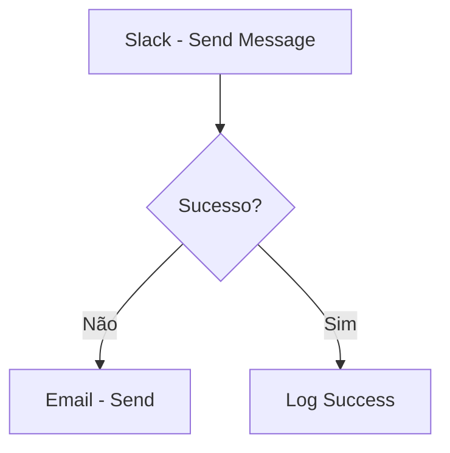
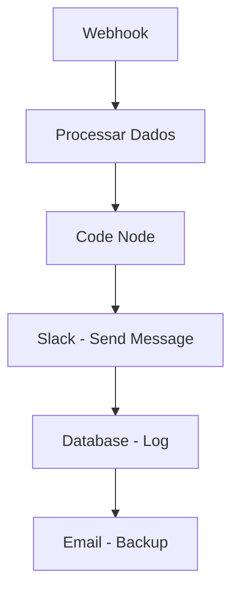

# <ion-icon name="chatbubbles-outline" style={{ fontSize: '24px', color: '#ea4b71' }}></ion-icon> Integração Slack

O **Slack** é uma das plataformas de comunicação mais populares para equipes, e a integração com n8n permite automatizar notificações, criar bots inteligentes e melhorar a colaboração através de workflows automatizados.

## <ion-icon name="information-circle-outline" style={{ fontSize: '24px', color: '#ea4b71' }}></ion-icon> Visão Geral

A integração n8n-Slack oferece:

- **Envio automático de mensagens** para canais e usuários
- **Criação de bots inteligentes** para automação de tarefas
- **Notificações baseadas em eventos** de sistemas externos
- **Integração com workflows de aprovação** e processos de negócio
- **Monitoramento e alertas** em tempo real
- **Sincronização de dados** entre Slack e outros sistemas

## <ion-icon name="settings-outline" style={{ fontSize: '24px', color: '#ea4b71' }}></ion-icon> Configuração

### 1. Criar App no Slack

1. Acesse [api.slack.com/apps](https://api.slack.com/apps)
2. Clique em **"Create New App"**
3. Escolha **"From scratch"**
4. Digite o nome do app e selecione o workspace

### 2. Configurar Permissões (OAuth Scopes)

Adicione os seguintes escopos:

**Bot Token Scopes:**
- `chat:write` - Enviar mensagens
- `chat:write.public` - Enviar para canais públicos
- `channels:read` - Ler informações de canais
- `users:read` - Ler informações de usuários
- `channels:join` - Entrar em canais
- `files:write` - Enviar arquivos

**User Token Scopes:**
- `chat:write` - Enviar mensagens como usuário

### 3. Instalar App no Workspace

1. Vá para **"OAuth & Permissions"**
2. Clique em **"Install to Workspace"**
3. Autorize o app
4. Copie o **Bot User OAuth Token**

### 4. Configurar Credenciais no n8n

1. No n8n, vá para **Settings > Credentials**
2. Clique em **"Add Credential"**
3. Selecione **"Slack"**
4. Cole o Bot Token
5. Teste a conexão

## <ion-icon name="code-outline" style={{ fontSize: '24px', color: '#ea4b71' }}></ion-icon> Nós Disponíveis

### 1. Slack Trigger

Dispara workflows baseados em eventos do Slack.

**Eventos disponíveis:**
- `message` - Nova mensagem em canal
- `reaction_added` - Reação adicionada
- `user_joined_channel` - Usuário entrou no canal
- `file_shared` - Arquivo compartilhado
- `channel_created` - Canal criado

**Configuração:**
```json
{
  "event": "message",
  "channel": "C1234567890",
  "filters": {
    "user": "U1234567890",
    "text": "alert"
  }
}
```

### 2. Send Message

Envia mensagens para canais ou usuários.

**Tipos de mensagem:**
- **Text**: Mensagem simples
- **Blocks**: Mensagem estruturada com blocos
- **Attachments**: Mensagem com anexos

**Exemplo básico:**
```json
{
  "channel": "#geral",
  "text": "Olá! Esta é uma mensagem automática do n8n."
}
```

**Exemplo com blocos:**
```json
{
  "channel": "#alertas",
  "blocks": [
    {
      "type": "header",
      "text": {
        "type": "plain_text",
        "text": "🚨 Alerta do Sistema"
      }
    },
    {
      "type": "section",
      "text": {
        "type": "mrkdwn",
        "text": "*Erro detectado:* API não está respondendo"
      }
    },
    {
      "type": "section",
      "fields": [
        {
          "type": "mrkdwn",
          "text": "*Status:* Crítico"
        },
        {
          "type": "mrkdwn",
          "text": "*Tempo:* {{ $now }}"
        }
      ]
    }
  ]
}
```

### 3. Upload File

Envia arquivos para o Slack.

**Configuração:**
```json
{
  "channel": "#documentos",
  "file": "{{ $binary.data }}",
  "filename": "relatorio.pdf",
  "title": "Relatório Mensal"
}
```

## <ion-icon name="construct-outline" style={{ fontSize: '24px', color: '#ea4b71' }}></ion-icon> Casos de Uso Práticos

### 1. Sistema de Notificações de Monitoramento

**Cenário**: Alertas automáticos quando sistemas críticos falham.



**Configuração do Slack Node:**
```json
{
  "channel": "#monitoramento",
  "blocks": [
    {
      "type": "section",
      "text": {
        "type": "mrkdwn",
        "text": "⚠️ *Sistema Offline*\n\nO sistema {{ $json.system }} não está respondendo.\n\n*Detalhes:*\n• Status: {{ $json.status }}\n• Última verificação: {{ $now }}\n• Tentativa: {{ $runIndex + 1 }}"
      }
    },
    {
      "type": "actions",
      "elements": [
        {
          "type": "button",
          "text": {
            "type": "plain_text",
            "text": "Verificar Agora"
          },
          "url": "{{ $json.dashboard_url }}"
        }
      ]
    }
  ]
}
```

### 2. Bot de Aprovação de Despesas

**Cenário**: Sistema que envia solicitações de aprovação via Slack.



**Configuração do Trigger:**
```json
{
  "event": "reaction_added",
  "filters": {
    "reaction": "white_check_mark",
    "channel": "C1234567890"
  }
}
```

**Configuração da Mensagem:**
```json
{
  "channel": "#aprovacoes",
  "blocks": [
    {
      "type": "section",
      "text": {
        "type": "mrkdwn",
        "text": "💰 *Nova Solicitação de Despesa*\n\n*Solicitante:* {{ $json.solicitante }}\n*Valor:* R$ {{ $json.valor }}\n*Descrição:* {{ $json.descricao }}"
      }
    },
    {
      "type": "section",
      "text": {
        "type": "mrkdwn",
        "text": "Reaja com ✅ para aprovar ou ❌ para rejeitar"
      }
    }
  ]
}
```

### 3. Integração com CRM

**Cenário**: Notificações automáticas quando novos leads são criados.



**Configuração:**
```json
{
  "channel": "#vendas",
  "blocks": [
    {
      "type": "section",
      "text": {
        "type": "mrkdwn",
        "text": "🎯 *Novo Lead Capturado*\n\n*Nome:* {{ $json.nome }}\n*Email:* {{ $json.email }}\n*Telefone:* {{ $json.telefone }}\n*Origem:* {{ $json.origem }}"
      }
    },
    {
      "type": "section",
      "fields": [
        {
          "type": "mrkdwn",
          "text": "*Score:* {{ $json.score }}"
        },
        {
          "type": "mrkdwn",
          "text": "*Prioridade:* {{ $json.prioridade }}"
        }
      ]
    }
  ]
}
```

### 4. Relatórios Automáticos

**Cenário**: Envio diário de relatórios de performance.



**Configuração:**
```json
{
  "channel": "#relatorios",
  "blocks": [
    {
      "type": "section",
      "text": {
        "type": "mrkdwn",
        "text": "📊 *Relatório Diário - {{ $now.format('DD/MM/YYYY') }}*\n\n*Resumo:*\n• Vendas: R$ {{ $json.vendas }}\n• Leads: {{ $json.leads }}\n• Conversões: {{ $json.conversoes }}%"
      }
    }
  ]
}
```

## <ion-icon name="flash-outline" style={{ fontSize: '24px', color: '#ea4b71' }}></ion-icon> Expressões e Data Mapping

### Mensagens Dinâmicas

```javascript
// Mensagem com dados dinâmicos
{
  "channel": "{{ $json.canal }}",
  "text": "Olá {{ $json.usuario }}, seu pedido #{{ $json.pedido_id }} foi processado com sucesso!"
}

// Mensagem condicional
{
  "channel": "#alertas",
  "text": "{{ $json.status === 'error' ? '❌ Erro detectado' : '✅ Operação concluída' }}"
}
```

### Canais Dinâmicos

```javascript
// Canal baseado no tipo de alerta
{
  "channel": "{{ $json.severidade === 'critico' ? '#alertas-criticos' : '#notificacoes' }}"
}

// Canal baseado no departamento
{
  "channel": "{{ $json.departamento === 'vendas' ? '#vendas' : '#suporte' }}"
}
```

## <ion-icon name="warning-outline" style={{ fontSize: '24px', color: '#ea4b71' }}></ion-icon> Tratamento de Erros

### Retry com Backoff

```javascript
// Configuração de retry para Slack
{
  "maxTries": 3,
  "waitBetweenTries": 5000,
  "continueOnFail": false
}
```

### Fallback para Email



## <ion-icon name="speedometer-outline" style={{ fontSize: '24px', color: '#ea4b71' }}></ion-icon> Boas Práticas

### 1. Organização de Canais

- **#monitoramento** - Alertas de sistema
- **#notificacoes** - Notificações gerais
- **#vendas** - Atividades comerciais
- **#suporte** - Tickets e suporte
- **#relatorios** - Relatórios automáticos

### 2. Formatação de Mensagens

- Use **negrito** para títulos importantes
- Use emojis para categorizar mensagens
- Mantenha mensagens concisas e objetivas
- Inclua links para ações rápidas

### 3. Rate Limiting

```javascript
// Respeitar limites do Slack
{
  "waitBetweenMessages": 1000,  // 1 segundo entre mensagens
  "maxMessagesPerMinute": 50
}
```

### 4. Privacidade e Segurança

- Não envie dados sensíveis via Slack
- Use canais privados para informações confidenciais
- Configure permissões adequadas nos canais
- Monitore logs de acesso

## <ion-icon name="help-circle-outline" style={{ fontSize: '24px', color: '#ea4b71' }}></ion-icon> Troubleshooting

### Problemas Comuns

**Erro: "channel_not_found"**
- Verifique se o canal existe
- Confirme se o bot tem acesso ao canal
- Use ID do canal em vez do nome

**Erro: "missing_scope"**
- Adicione os escopos necessários no app
- Reinstale o app no workspace
- Verifique as permissões do token

**Erro: "rate_limited"**
- Implemente delays entre mensagens
- Reduza a frequência de envio
- Use webhooks em vez de polling

### Debugging

```javascript
// Log para debugging
console.log('Slack Debug:', {
  channel: $json.channel,
  message: $json.text,
  timestamp: $now,
  user: $json.user
});
```

## <ion-icon name="link-outline" style={{ fontSize: '24px', color: '#ea4b71' }}></ion-icon> Integração com Outros Nós

### Fluxo Completo



### Exemplo de Workflow Completo

```javascript
// 1. Webhook - Receber dados
{
  "url": "/webhook/lead",
  "method": "POST"
}

// 2. Code Node - Processar lead
const lead = $json;
const score = calcularScore(lead);
const prioridade = score > 80 ? 'Alta' : 'Normal';

return {
  ...lead,
  score,
  prioridade,
  canal: score > 80 ? '#leads-quentes' : '#leads-frios'
};

// 3. Slack - Enviar notificação
{
  "channel": "{{ $json.canal }}",
  "blocks": [
    {
      "type": "section",
      "text": {
        "type": "mrkdwn",
        "text": "🎯 *Novo Lead - Score {{ $json.score }}*\n\n*{{ $json.nome }}*\n{{ $json.email }}\n{{ $json.telefone }}"
      }
    }
  ]
}

// 4. Database - Salvar lead
{
  "operation": "insert",
  "table": "leads",
  "data": $json
}
```

## <ion-icon name="document-text-outline" style={{ fontSize: '24px', color: '#ea4b71' }}></ion-icon> Referências

- **[Webhook Trigger](../../integracoes/trigger-nodes/event-based/webhook-trigger)** - Triggers baseados em webhooks
- **[HTTP Request](../../integracoes/builtin-nodes/http-requests/http-request)** - Requisições HTTP customizadas
- **[Code Node](../../integracoes/builtin-nodes/core-nodes/code)** - Lógica customizada
- **[Error Handling](../../logica-e-dados/flow-logic/error-handling)** - Tratamento de erros

---

:::warning **Nota de Atenção**
Esta documentação está em processo de validação. Os exemplos práticos e configurações de nós apresentados precisam ser testados e validados em ambientes reais. A intenção é sempre fornecer práticas e exemplos que funcionem corretamente em produção. Se encontrar inconsistências ou problemas, por favor, reporte para que possamos melhorar a qualidade da documentação.
:::

> <ion-icon name="bulb-outline" style={{ fontSize: '18px', color: '#ea4b71' }}></ion-icon> **Dica**: Use a integração Slack para criar uma ponte entre seus sistemas automatizados e sua equipe. Mantenha as mensagens relevantes e organizadas para maximizar a eficiência da comunicação.
