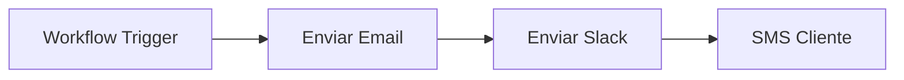
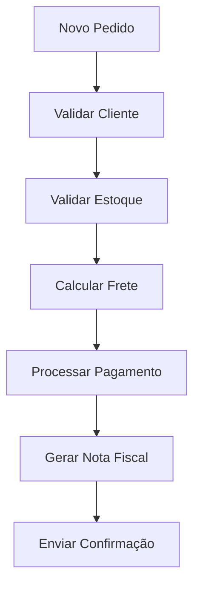
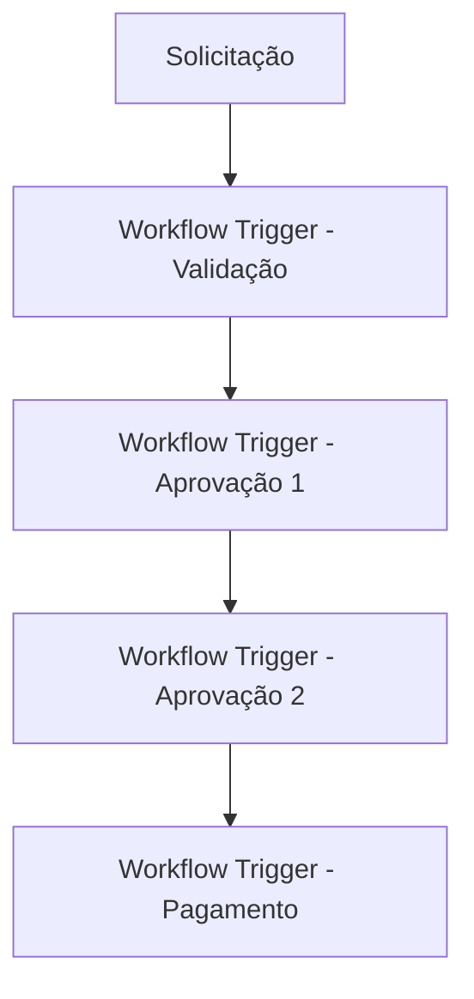
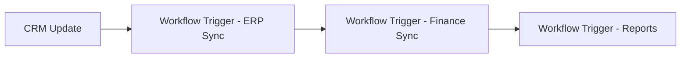
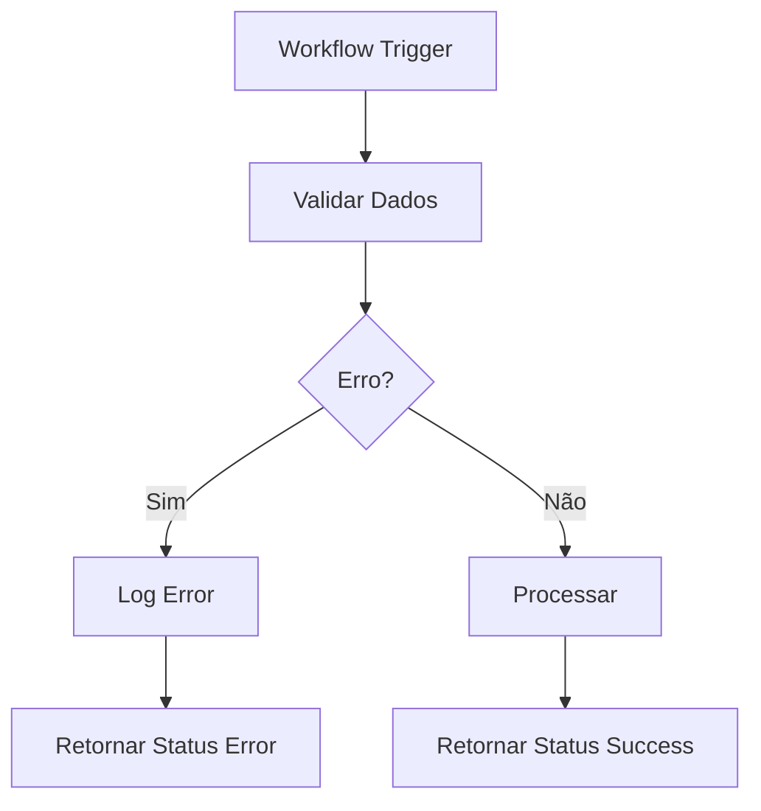
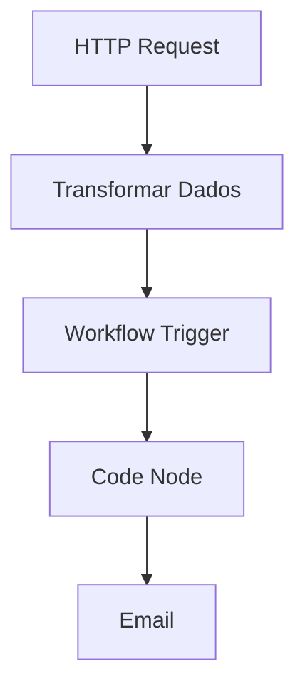

---
title: Workflow Trigger
sidebar_position: 6
description: Como usar o Workflow Trigger para executar workflows a partir de outros workflows
keywords: [n8n, workflow trigger, subworkflow, execução, automação, trigger]
---

<IonicIcon name="git-branch-outline" style={{fontSize: '24px', color: '#ea4b71'}} />

O **Workflow Trigger** é um nó especial que permite executar um workflow a partir de outro workflow, criando uma hierarquia de automações. Este recurso é fundamental para organizar workflows complexos em módulos menores e reutilizáveis.

<IonicIcon name="information-circle-outline" style={{fontSize: '24px', color: '#ea4b71'}} />

## Configuração Básica

```javascript
{
  "workflowId": "workflow_123456",
  "waitForWorkflow": true,
  "options": {
    "pinData": {
      "inputData": "{{$json}}"
    },
    "startNodes": ["node_1", "node_2"]
  }
}
```

<IonicIcon name="code-outline" style={{fontSize: '24px', color: '#ea4b71'}} />

## Exemplos Práticos

### Exemplo 1: Workflow Modular de Notificações

**Workflow Principal** (Processamento de Pedidos):


**Workflow de Notificações** (Executado pelo trigger):



### Exemplo 2: Validação Modular

```javascript
// Workflow principal
{
  "workflowId": "validacao_cliente",
  "waitForWorkflow": true,
  "options": {
    "pinData": {
      "cliente": "{{$json.cliente}}",
      "pedido": "{{$json.pedido}}"
    }
  }
}
```

<IonicIcon name="construct-outline" style={{fontSize: '24px', color: '#ea4b71'}} />

## Casos de Uso

### Processamento de Pedidos - E-commerce

**Cenário**: Sistema de e-commerce que processa pedidos com múltiplas validações.



**Implementação com Workflow Trigger**:

- Workflow principal: Orquestração geral
- Workflow de validação: Verificações de cliente e estoque
- Workflow de pagamento: Processamento financeiro
- Workflow de notificação: Comunicação com cliente

### Sistema de Aprovações

**Cenário**: Sistema de aprovação de despesas com múltiplos níveis.



### Integração de Sistemas

**Cenário**: Sincronização entre CRM, ERP e sistema financeiro.



<IonicIcon name="flash-outline" style={{fontSize: '24px', color: '#ea4b71'}} />

## Passando Dados Entre Workflows

```javascript
{
  "workflowId": "processar_pedido",
  "waitForWorkflow": true,
  "options": {
    "pinData": {
      "cliente": "{{$json.cliente}}",
      "pedido": {
        "id": "{{$json.pedido.id}}",
        "valor": "{{$json.pedido.valor}}",
        "itens": "{{$json.pedido.itens}}"
      },
      "contexto": {
        "origem": "{{$workflow.name}}",
        "timestamp": "{{$now}}"
      }
    }
  }
}
```

### Recebendo Dados do Workflow Filho

```javascript
// Acessando dados retornados pelo workflow filho
{
  "resultado_validacao": "{{$json.resultado}}",
  "status": "{{$json.status}}",
  "mensagem": "{{$json.mensagem}}"
}
```

<IonicIcon name="warning-outline" style={{fontSize: '24px', color: '#ea4b71'}} />

## Tratamento de Erros

### Configuração de Error Handling

```javascript
// Workflow principal com tratamento de erro
{
  "workflowId": "validacao_critica",
  "waitForWorkflow": true,
  "options": {
    "pinData": {
      "dados": "{{$json}}"
    }
  }
}
```

### Workflow de Validação com Error Handling



<IonicIcon name="speedometer-outline" style={{fontSize: '24px', color: '#ea4b71'}} />

## Performance e Otimização

### Boas Práticas

1. **Evite Loops Infinitos**
   - Não crie workflows que se chamam mutuamente
   - Use contadores para limitar execuções recursivas

2. **Otimize o Tamanho dos Dados**
   - Passe apenas dados essenciais entre workflows
   - Use compressão para dados grandes

3. **Monitore Execuções**
   - Configure alertas para workflows que falham
   - Use logs para rastrear execuções

### Exemplo de Monitoramento

```javascript
// Workflow de monitoramento
{
  "workflowId": "monitor_execucoes",
  "waitForWorkflow": false,
  "options": {
    "pinData": {
      "workflow_pai": "{{$workflow.name}}",
      "timestamp": "{{$now}}",
      "status": "iniciado"
    }
  }
}
```

<IonicIcon name="help-circle-outline" style={{fontSize: '24px', color: '#ea4b71'}} />

## Troubleshooting

### Problemas Comuns

**Erro: "Workflow not found"**
- Verifique se o Workflow ID está correto
- Confirme se o workflow existe e está ativo
- Verifique permissões de acesso

**Erro: "Timeout"**
- Aumente o timeout do workflow filho
- Otimize a performance do workflow filho
- Considere usar `waitForWorkflow: false`

**Erro: "Circular dependency"**
- Verifique se não há chamadas circulares
- Use contadores para limitar recursão
- Reestruture a lógica se necessário

### Logs para Debugging

```javascript
{
  "workflowId": "workflow_teste",
  "waitForWorkflow": true,
  "options": {
    "pinData": {
      "debug": true,
      "dados_entrada": "{{$json}}",
      "workflow_origem": "{{$workflow.name}}"
    }
  }
}
```

<IonicIcon name="link-outline" style={{fontSize: '24px', color: '#ea4b71'}} />

## Integração com Outros Nós

### Fluxo Típico



### Exemplo Completo

```javascript
// 1. HTTP Request - Buscar dados
{
  "url": "https://api.exemplo.com/pedidos",
  "method": "GET"
}

// 2. Transformar Dados
{
  "pedidos_processados": "{{$json.pedidos.filter(item => item.status === 'pendente')}}"
}

// 3. Workflow Trigger - Processar cada pedido
{
  "workflowId": "processar_pedido",
  "waitForWorkflow": true,
  "options": {
    "pinData": {
      "pedido": "{{$json}}"
    }
  }
}

// 4. Code Node - Consolidar resultados
const resultados = $input.all();
const sucessos = resultados.filter(r => r.json.status === 'success').length;
const falhas = resultados.filter(r => r.json.status === 'error').length;

return {
  "resumo": {
    "total_processados": resultados.length,
    "sucessos": sucessos,
    "falhas": falhas
  }
};
```

<IonicIcon name="document-text-outline" style={{fontSize: '24px', color: '#ea4b71'}} />

## Referências

- **[Subworkflows](../../../logica-e-dados/flow-logic/subworkflows.mdx)** - Conceitos avançados de subworkflows
- **[Error Handling](../../../logica-e-dados/flow-logic/error-handling.md)** - Tratamento de erros em workflows
- **[Execution Order](../../../logica-e-dados/flow-logic/execution-order.mdx)** - Ordem de execução de nós
- **[Data Mapping](../../../logica-e-dados/data/data-mapping-avancado.mdx)** - Mapeamento avançado de dados

---

<IonicIcon name="bulb-outline" style={{fontSize: '18px', color: '#ea4b71'}} />

**Dica**: Use o Workflow Trigger para modularizar workflows complexos e criar bibliotecas reutilizáveis de automação.
