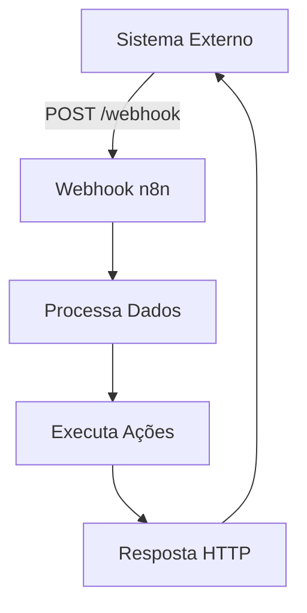

# <IonicIcon name="globe-outline" size={32} color="#ea4b71" /> Webhook Node

O **Webhook** é um dos nodes mais importantes do n8n, permitindo que seu workflow seja **acionado por aplicações externas** através de requisições HTTP. É perfeito para integrar sistemas que precisam notificar o n8n quando algo acontece.

## <IonicIcon name="help-circle-outline" size={24} color="#ea4b71" /> O que é um Webhook?

Um **webhook** é uma forma de receber dados de outros sistemas **em tempo real**. Ao invés de ficar consultando um serviço constantemente (polling), o webhook permite que o próprio serviço **notifique** o n8n quando algo relevante acontece.

### <IonicIcon name="bulb-outline" size={20} color="#10b981" /> **Analogia Simples**
- <IonicIcon name="refresh-outline" size={16} color="#6b7280" /> **Polling** = Ficar tocando a campainha para ver se alguém está em casa
- <IonicIcon name="notifications-outline" size={16} color="#6b7280" /> **Webhook** = Deixar sua campainha ligada para que as pessoas toquem quando chegarem

## <IonicIcon name="settings-outline" size={24} color="#ea4b71" /> **Configuração Básica**

### <IonicIcon name="add-outline" size={20} color="#10b981" /> 1. **Adicionando o Node**
1. <IonicIcon name="move-outline" size={16} color="#6b7280" /> Arraste o **Webhook** node para seu workflow
2. <IonicIcon name="settings-outline" size={16} color="#6b7280" /> Configure as opções principais
3. <IonicIcon name="link-outline" size={16} color="#6b7280" /> O n8n irá gerar automaticamente uma **URL única**

### <IonicIcon name="options-outline" size={20} color="#10b981" /> 2. **Configurações Principais**

#### <IonicIcon name="arrow-forward-outline" size={18} color="#10b981" /> **HTTP Method**
Escolha o método HTTP que o webhook irá aceitar:

```http
GET - Para consultas simples
POST - Para envio de dados (mais comum)
PUT - Para atualizações completas
PATCH - Para atualizações parciais
DELETE - Para exclusões
```

#### <IonicIcon name="trail-sign-outline" size={18} color="#10b981" /> **Path**
Defina um caminho personalizado para seu webhook:

```
Padrão: /webhook/uuid-automatico
Custom: /webhook/meu-sistema
```

#### <IonicIcon name="shield-checkmark-outline" size={18} color="#10b981" /> **Authentication**
Configure segurança para seu webhook:

- <IonicIcon name="close-outline" size={16} color="#6b7280" /> **None** - Sem autenticação (cuidado!)
- <IonicIcon name="person-outline" size={16} color="#6b7280" /> **Basic Auth** - Usuário e senha
- <IonicIcon name="key-outline" size={16} color="#6b7280" /> **Header Auth** - Token no cabeçalho

## <IonicIcon name="git-network-outline" size={24} color="#ea4b71" /> **Fluxo de Trabalho**



## <IonicIcon name="code-outline" size={24} color="#ea4b71" /> **Exemplos Práticos**

### <IonicIcon name="storefront-outline" size={20} color="#10b981" /> **Exemplo 1: E-commerce - Nova Compra**

**Cenário:** Sua loja online precisa processar pedidos automaticamente.

```json
{
"event": "new_order",
"order_id": "ORD-123",
"customer": {
"name": "João Silva",
"email": "joao@email.com"
},
"total": 299.90,
"items": [
{
"product": "Produto A",
"quantity": 2,
"price": 149.95
}
]
}
```

**Ações do Workflow:**
1. <IonicIcon name="checkmark-circle-outline" size={16} color="#6b7280" /> Validar dados do pedido
2. <IonicIcon name="mail-outline" size={16} color="#6b7280" /> Enviar email de confirmação
3. <IonicIcon name="cube-outline" size={16} color="#6b7280" /> Criar ordem no estoque
4. <IonicIcon name="card-outline" size={16} color="#6b7280" /> Processar pagamento

---

### <IonicIcon name="help-buoy-outline" size={20} color="#10b981" /> **Exemplo 2: Suporte - Novo Ticket**

**Cenário:** Sistema de helpdesk cria tickets automaticamente.

```json
{
"event": "ticket_created",
"ticket": {
"id": "TICK-456",
"priority": "alta",
"category": "tecnico",
"customer": "empresa@exemplo.com",
"subject": "Sistema fora do ar",
"description": "Não consigo acessar o sistema..."
}
}
```

**Ações do Workflow:**
1. <IonicIcon name="flag-outline" size={16} color="#6b7280" /> Classificar prioridade
2. <IonicIcon name="person-add-outline" size={16} color="#6b7280" /> Atribuir ao técnico
3. <IonicIcon name="logo-slack" size={16} color="#6b7280" /> Notificar no Slack
4. <IonicIcon name="analytics-outline" size={16} color="#6b7280" /> Atualizar dashboard

---

### <IonicIcon name="megaphone-outline" size={20} color="#10b981" /> **Exemplo 3: Marketing - Lead Qualificado**

**Cenário:** Landing page captura leads importantes.

```json
{
"event": "qualified_lead",
"lead": {
"name": "Maria Santos",
"email": "maria@empresa.com",
"company": "Empresa XYZ",
"phone": "+5511999999999",
"source": "google_ads",
"score": 85
}
}
```

**Ações do Workflow:**
1. <IonicIcon name="add-circle-outline" size={16} color="#6b7280" /> Adicionar ao CRM
2. <IonicIcon name="flame-outline" size={16} color="#6b7280" /> Marcar como hot lead
3. <IonicIcon name="mail-open-outline" size={16} color="#6b7280" /> Enviar sequência de emails
4. <IonicIcon name="calendar-outline" size={16} color="#6b7280" /> Agendar follow-up

## <IonicIcon name="shield-checkmark-outline" size={24} color="#ea4b71" /> **Segurança**

### <IonicIcon name="checkmark-done-outline" size={20} color="#10b981" /> **Validação de Origem**
```javascript
// Exemplo de validação por IP
const allowedIPs = ['192.168.1.100', '10.0.0.50'];
const clientIP = $request.headers['x-forwarded-for'] || $request.ip;

if (!allowedIPs.includes(clientIP)) {
throw new Error('IP não autorizado');
}
```

### <IonicIcon name="finger-print-outline" size={20} color="#10b981" /> **Verificação de Assinatura**
```javascript
// Exemplo de validação com HMAC
const crypto = require('crypto');
const secret = 'minha-chave-secreta';
const signature = $request.headers['x-signature'];
const payload = JSON.stringify($request.body);

const expectedSignature = crypto
.createHmac('sha256', secret)
.update(payload)
.digest('hex');

if (signature !== `sha256=${expectedSignature}`) {
throw new Error('Assinatura inválida');
}
```

## <IonicIcon name="list-outline" size={24} color="#ea4b71" /> **Headers Úteis**

O webhook automaticamente captura informações importantes:

```javascript
// Dados disponíveis no $request
{
"headers": {
"content-type": "application/json",
"user-agent": "Sistema/1.0",
"x-custom-header": "valor-personalizado"
},
"query": {
"param1": "valor1",
"param2": "valor2"
},
"body": {
// Dados enviados via POST
},
"method": "POST",
"url": "/webhook/meu-endpoint"
}
```

## <IonicIcon name="warning-outline" size={24} color="#ea4b71" /> **Tratamento de Erros**

### <IonicIcon name="close-circle-outline" size={20} color="#10b981" /> **Resposta de Erro Personalizada**
```javascript
// No node de resposta
if (!$json.customer || !$json.customer.email) {
return {
status: 400,
body: {
error: "Email do cliente é obrigatório",
code: "MISSING_EMAIL"
}
};
}
```

### <IonicIcon name="refresh-circle-outline" size={20} color="#10b981" /> **Retry Logic**
Configure no sistema que envia o webhook:
- <IonicIcon name="time-outline" size={16} color="#6b7280" /> **Timeout:** 30 segundos
- <IonicIcon name="repeat-outline" size={16} color="#6b7280" /> **Retry:** 3 tentativas
- <IonicIcon name="trending-up-outline" size={16} color="#6b7280" /> **Backoff:** Exponencial (1s, 2s, 4s)

## <IonicIcon name="speedometer-outline" size={24} color="#ea4b71" /> **Dicas de Performance**

### <IonicIcon name="flash-outline" size={20} color="#10b981" /> **1. Response Rápido**
```javascript
// Processe depois, responda agora
$response.status(200).json({
message: "Recebido com sucesso",
id: $json.order_id
});

// Continue processamento...
```

### <IonicIcon name="layers-outline" size={20} color="#10b981" /> **2. Processamento Assíncrono**
Use **subworkflows** para processos longos:
```
Webhook → Validação → Resposta Rápida
↘ Subworkflow → Processamento Lento
```

### <IonicIcon name="albums-outline" size={20} color="#10b981" /> **3. Batching**
Para múltiplos webhooks similares:
```
Webhook → Queue → Batch Processing (a cada 100 items)
```

## <IonicIcon name="bug-outline" size={24} color="#ea4b71" /> **Debugging**

### <IonicIcon name="document-text-outline" size={20} color="#10b981" /> **Logs Úteis**
```javascript
// Log completo da requisição
console.log('Webhook recebido:', {
timestamp: new Date().toISOString(),
method: $request.method,
url: $request.url,
headers: $request.headers,
body: $request.body
});
```

### <IonicIcon name="build-outline" size={20} color="#10b981" /> **Ferramentas de Teste**
- <IonicIcon name="desktop-outline" size={16} color="#6b7280" /> **Postman** - Para testes manuais
- <IonicIcon name="tunnel-outline" size={16} color="#6b7280" /> **ngrok** - Para expor webhooks locais
- <IonicIcon name="globe-outline" size={16} color="#6b7280" /> **Webhook.site** - Para inspecionar payloads

## <IonicIcon name="apps-outline" size={24} color="#ea4b71" /> **Integrações Populares**

| Serviço | Evento | Payload |
|---------|--------|---------|
| **Stripe** | `payment_success` | Dados do pagamento |
| **GitHub** | `push` | Commits enviados |
| **Shopify** | `order_created` | Novo pedido |
| **Typeform** | `form_response` | Resposta do formulário |
| **Calendly** | `meeting_scheduled` | Reunião agendada |

## <IonicIcon name="construct-outline" size={24} color="#ea4b71" /> **Problemas Comuns**

### <IonicIcon name="alert-circle-outline" size={20} color="#10b981" /> **Webhook não dispara**
```bash
# Verifique se a URL está correta
curl -X POST https://sua-instancia.n8n.io/webhook/seu-path \
-H "Content-Type: application/json" \
-d '{"test": "data"}'
```

### <IonicIcon name="timer-outline" size={20} color="#10b981" /> **Timeout nos webhooks**
- <IonicIcon name="time-outline" size={16} color="#6b7280" /> Configure timeout adequado (30s+)
- <IonicIcon name="layers-outline" size={16} color="#6b7280" /> Use processamento assíncrono
- <IonicIcon name="refresh-circle-outline" size={16} color="#6b7280" /> Implemente retry logic

### <IonicIcon name="document-outline" size={20} color="#10b981" /> **Headers ausentes**
```javascript
// Sempre verifique se existem
const userAgent = $request.headers['user-agent'] || 'Desconhecido';
const contentType = $request.headers['content-type'] || 'text/plain';
```

## <IonicIcon name="arrow-forward-circle-outline" size={24} color="#ea4b71" /> **Próximos Passos**

Depois de dominar webhooks, explore:

1. <IonicIcon name="cloud-outline" size={16} color="#6b7280" /> **[HTTP Request Node](./http-request)** - Para fazer chamadas HTTP
2. <IonicIcon name="create-outline" size={16} color="#6b7280" /> **[Set Node](../data-processing/set)** - Para manipular dados
3. <IonicIcon name="hand-left-outline" size={16} color="#6b7280" /> **[Manual Trigger](../../trigger-nodes/time-based/manual-trigger)** - Para testes manuais
4. <IonicIcon name="flash-outline" size={16} color="#6b7280" /> **[Webhook Trigger](../../trigger-nodes/event-based/webhook-trigger)** - Versão trigger do webhook

---

**<IonicIcon name="globe-outline" size={16} color="#ea4b71" /> O Webhook é a porta de entrada para integrar qualquer sistema com o n8n!**
