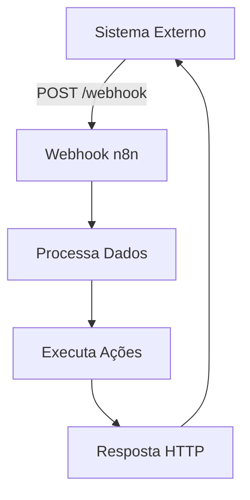

# <ion-icon name="code-slash-outline" style={{ fontSize: '32px', color: '#ea4b71' }}></ion-icon> Webhook Node

O **Webhook** é um dos nodes mais importantes do n8n, permitindo que seu workflow seja **acionado por aplicações externas** através de requisições HTTP. É perfeito para integrar sistemas que precisam notificar o n8n quando algo acontece.

## <ion-icon name="git-network-outline" style={{ fontSize: '24px', color: '#ea4b71' }}></ion-icon> O que é um Webhook?

Um **webhook** é uma forma de receber dados de outros sistemas **em tempo real**. Ao invés de ficar consultando um serviço constantemente (polling), o webhook permite que o próprio serviço **notifique** o n8n quando algo relevante acontece.

###  **Analogia Simples**
-  **Polling** = Ficar tocando a campainha para ver se alguém está em casa
-  **Webhook** = Deixar sua campainha ligada para que as pessoas toquem quando chegarem

## <ion-icon name="settings-outline" style={{ fontSize: '24px', color: '#ea4b71' }}></ion-icon> **Configuração Básica**

###  1. **Adicionando o Node**
1.  Arraste o **Webhook** node para seu workflow
2.  Configure as opções principais
3.  O n8n irá gerar automaticamente uma **URL única**

###  2. **Configurações Principais**

####  **HTTP Method**
Escolha o método HTTP que o webhook irá aceitar:

```http
GET - Para consultas simples
POST - Para envio de dados (mais comum)
PUT - Para atualizações completas
PATCH - Para atualizações parciais
DELETE - Para exclusões
```

####  **Path**
Defina um caminho personalizado para seu webhook:

```
Padrão: /webhook/uuid-automatico
Custom: /webhook/meu-sistema
```

####  **Authentication**
Configure segurança para seu webhook:

-  **None** - Sem autenticação (cuidado!)
-  **Basic Auth** - Usuário e senha
-  **Header Auth** - Token no cabeçalho

## <ion-icon name="git-branch-outline" style={{ fontSize: '24px', color: '#ea4b71' }}></ion-icon> **Fluxo de Trabalho**



## <ion-icon name="bulb-outline" style={{ fontSize: '24px', color: '#ea4b71' }}></ion-icon> **Exemplos Práticos**

###  **Exemplo 1: E-commerce - Nova Compra**

**Cenário:** Sua loja online precisa processar pedidos automaticamente.

```json
{
"event": "new_order",
"order_id": "ORD-123",
"customer": {
"name": "João Silva",
"email": "joao@email.com"
},
"total": 299.90,
"items": [
{
"product": "Produto A",
"quantity": 2,
"price": 149.95
}
]
}
```

**Ações do Workflow:**
1.  Validar dados do pedido
2.  Enviar email de confirmação
3.  Criar ordem no estoque
4.  Processar pagamento

---

###  **Exemplo 2: Suporte - Novo Ticket**

**Cenário:** Sistema de helpdesk cria tickets automaticamente.

```json
{
"event": "ticket_created",
"ticket": {
"id": "TICK-456",
"priority": "alta",
"category": "tecnico",
"customer": "empresa@exemplo.com",
"subject": "Sistema fora do ar",
"description": "Não consigo acessar o sistema..."
}
}
```

**Ações do Workflow:**
1.  Classificar prioridade
2.  Atribuir ao técnico
3.  Notificar no Slack
4.  Atualizar dashboard

---

###  **Exemplo 3: Marketing - Lead Qualificado**

**Cenário:** Landing page captura leads importantes.

```json
{
"event": "qualified_lead",
"lead": {
"name": "Maria Santos",
"email": "maria@empresa.com",
"company": "Empresa XYZ",
"phone": "+5511999999999",
"source": "google_ads",
"score": 85
}
}
```

**Ações do Workflow:**
1.  Adicionar ao CRM
2.  Marcar como hot lead
3.  Enviar sequência de emails
4.  Agendar follow-up

## <ion-icon name="shield-checkmark-outline" style={{ fontSize: '24px', color: '#ea4b71' }}></ion-icon> **Segurança**

###  **Validação de Origem**
```javascript
// Exemplo de validação por IP
const allowedIPs = ['192.168.1.100', '10.0.0.50'];
const clientIP = $request.headers['x-forwarded-for'] || $request.ip;

if (!allowedIPs.includes(clientIP)) {
throw new Error('IP não autorizado');
}
```

###  **Verificação de Assinatura**
```javascript
// Exemplo de validação com HMAC
const crypto = require('crypto');
const secret = 'minha-chave-secreta';
const signature = $request.headers['x-signature'];
const payload = JSON.stringify($request.body);

const expectedSignature = crypto
.createHmac('sha256', secret)
.update(payload)
.digest('hex');

if (signature !== `sha256=${expectedSignature}`) {
throw new Error('Assinatura inválida');
}
```

## <ion-icon name="chevron-forward-outline" style={{ fontSize: '24px', color: '#ea4b71' }}></ion-icon> **Headers Úteis**

O webhook automaticamente captura informações importantes:

```javascript
// Dados disponíveis no $request
{
"headers": {
"content-type": "application/json",
"user-agent": "Sistema/1.0",
"x-custom-header": "valor-personalizado"
},
"query": {
"param1": "valor1",
"param2": "valor2"
},
"body": {
// Dados enviados via POST
},
"method": "POST",
"url": "/webhook/meu-endpoint"
}
```

## <ion-icon name="bug-outline" style={{ fontSize: '24px', color: '#ea4b71' }}></ion-icon> **Tratamento de Erros**

###  **Resposta de Erro Personalizada**
```javascript
// No node de resposta
if (!$json.customer || !$json.customer.email) {
return {
status: 400,
body: {
error: "Email do cliente é obrigatório",
code: "MISSING_EMAIL"
}
};
}
```

###  **Retry Logic**
Configure no sistema que envia o webhook:
-  **Timeout:** 30 segundos
-  **Retry:** 3 tentativas
-  **Backoff:** Exponencial (1s, 2s, 4s)

## <ion-icon name="speedometer-outline" style={{ fontSize: '24px', color: '#ea4b71' }}></ion-icon> **Dicas de Performance**

###  **1. Response Rápido**
```javascript
// Processe depois, responda agora
$response.status(200).json({
message: "Recebido com sucesso",
id: $json.order_id
});

// Continue processamento...
```

###  **2. Processamento Assíncrono**
Use **subworkflows** para processos longos:
```
Webhook → Validação → Resposta Rápida
↘ Subworkflow → Processamento Lento
```

###  **3. Batching**
Para múltiplos webhooks similares:
```
Webhook → Queue → Batch Processing (a cada 100 items)
```

## <ion-icon name="bug-outline" style={{ fontSize: '24px', color: '#ea4b71' }}></ion-icon> **Debugging**

###  **Logs Úteis**
```javascript
// Log completo da requisição
console.log('Webhook recebido:', {
timestamp: new Date().toISOString(),
method: $request.method,
url: $request.url,
headers: $request.headers,
body: $request.body
});
```

###  **Ferramentas de Teste**
-  **Postman** - Para testes manuais
-  **ngrok** - Para expor webhooks locais
-  **Webhook.site** - Para inspecionar payloads

## <ion-icon name="chevron-forward-outline" style={{ fontSize: '24px', color: '#ea4b71' }}></ion-icon> **Integrações Populares**

| Serviço | Evento | Payload |
|---------|--------|---------|
| **Stripe** | `payment_success` | Dados do pagamento |
| **GitHub** | `push` | Commits enviados |
| **Shopify** | `order_created` | Novo pedido |
| **Typeform** | `form_response` | Resposta do formulário |
| **Calendly** | `meeting_scheduled` | Reunião agendada |

## <ion-icon name="bug-outline" style={{ fontSize: '24px', color: '#ea4b71' }}></ion-icon> **Problemas Comuns**

###  **Webhook não dispara**
```bash
# <ion-icon name="color-palette-outline" style={{ fontSize: '32px', color: '#ea4b71' }}></ion-icon> Verifique se a URL está correta
curl -X POST https://sua-instancia.n8n.io/webhook/seu-path \
-H "Content-Type: application/json" \
-d '{"test": "data"}'
```

###  **Timeout nos webhooks**
-  Configure timeout adequado (30s+)
-  Use processamento assíncrono
-  Implemente retry logic

###  **Headers ausentes**
```javascript
// Sempre verifique se existem
const userAgent = $request.headers['user-agent'] || 'Desconhecido';
const contentType = $request.headers['content-type'] || 'text/plain';
```

## <ion-icon name="arrow-forward-circle-outline" style={{ fontSize: '24px', color: '#ea4b71' }}></ion-icon> **Próximos Passos**

Depois de dominar webhooks, explore:

1.  **[HTTP Request Node](./http-request)** - Para fazer chamadas HTTP
2.  **[Set Node](../data-processing/set)** - Para manipular dados
3.  **[Manual Trigger](../../trigger-nodes/time-based/manual-trigger)** - Para testes manuais
4.  **[Webhook Trigger](../../trigger-nodes/event-based/webhook-trigger)** - Versão trigger do webhook

---

** O Webhook é a porta de entrada para integrar qualquer sistema com o n8n!**
