# 🔗 Webhook Node

O **Webhook** é um dos nodes mais importantes do n8n, permitindo que seu workflow seja **acionado por aplicações externas** através de requisições HTTP. É perfeito para integrar sistemas que precisam notificar o n8n quando algo acontece.

## 🎯 O que é um Webhook?

Um **webhook** é uma forma de receber dados de outros sistemas **em tempo real**. Ao invés de ficar consultando um serviço constantemente (polling), o webhook permite que o próprio serviço **notifique** o n8n quando algo relevante acontece.

### 💡 **Analogia Simples**
- **Polling** = Ficar tocando a campainha para ver se alguém está em casa
- **Webhook** = Deixar sua campainha ligada para que as pessoas toquem quando chegarem

## ⚙️ **Configuração Básica**

### 1. **Adicionando o Node**
1. Arraste o **Webhook** node para seu workflow
2. Configure as opções principais
3. O n8n irá gerar automaticamente uma **URL única**

### 2. **Configurações Principais**

#### **HTTP Method**
Escolha o método HTTP que o webhook irá aceitar:

```http
GET     - Para consultas simples
POST    - Para envio de dados (mais comum)
PUT     - Para atualizações completas
PATCH   - Para atualizações parciais
DELETE  - Para exclusões
```

#### **Path**
Defina um caminho personalizado para seu webhook:

```
Padrão:    /webhook/uuid-automatico
Custom:    /webhook/meu-sistema
```

#### **Authentication**
Configure segurança para seu webhook:

- **None** - Sem autenticação (cuidado!)
- **Basic Auth** - Usuário e senha
- **Header Auth** - Token no cabeçalho

## 🔄 **Fluxo de Trabalho**

```mermaid
graph TD
    A[Sistema Externo] -->|POST /webhook| B[Webhook n8n]
    B --> C[Processa Dados]
    C --> D[Executa Ações]
    D --> E[Resposta HTTP]
    E --> A
```



## 📊 **Exemplos Práticos**

### **Exemplo 1: E-commerce - Nova Compra**

**Cenário:** Sua loja online precisa processar pedidos automaticamente.

```json
{
  "event": "new_order",
  "order_id": "ORD-123",
  "customer": {
    "name": "João Silva",
    "email": "joao@email.com"
  },
  "total": 299.90,
  "items": [
    {
      "product": "Produto A",
      "quantity": 2,
      "price": 149.95
    }
  ]
}
```

**Ações do Workflow:**
1. ✅ Validar dados do pedido
2. 📧 Enviar email de confirmação
3. 📦 Criar ordem no estoque
4. 💰 Processar pagamento

---

### **Exemplo 2: Suporte - Novo Ticket**

**Cenário:** Sistema de helpdesk cria tickets automaticamente.

```json
{
  "event": "ticket_created",
  "ticket": {
    "id": "TICK-456",
    "priority": "alta",
    "category": "tecnico",
    "customer": "empresa@exemplo.com",
    "subject": "Sistema fora do ar",
    "description": "Não consigo acessar o sistema..."
  }
}
```

**Ações do Workflow:**
1. 🔍 Classificar prioridade
2. 👨‍💻 Atribuir ao técnico
3. 📱 Notificar no Slack
4. 📊 Atualizar dashboard

---

### **Exemplo 3: Marketing - Lead Qualificado**

**Cenário:** Landing page captura leads importantes.

```json
{
  "event": "qualified_lead",
  "lead": {
    "name": "Maria Santos",
    "email": "maria@empresa.com",
    "company": "Empresa XYZ",
    "phone": "+5511999999999",
    "source": "google_ads",
    "score": 85
  }
}
```

**Ações do Workflow:**
1. 📋 Adicionar ao CRM
2. 🎯 Marcar como hot lead
3. 📧 Enviar sequência de emails
4. 📅 Agendar follow-up

## 🛡️ **Segurança**

### **Validação de Origem**
```javascript
// Exemplo de validação por IP
const allowedIPs = ['192.168.1.100', '10.0.0.50'];
const clientIP = $request.headers['x-forwarded-for'] || $request.ip;

if (!allowedIPs.includes(clientIP)) {
  throw new Error('IP não autorizado');
}
```

### **Verificação de Assinatura**
```javascript
// Exemplo de validação com HMAC
const crypto = require('crypto');
const secret = 'minha-chave-secreta';
const signature = $request.headers['x-signature'];
const payload = JSON.stringify($request.body);

const expectedSignature = crypto
  .createHmac('sha256', secret)
  .update(payload)
  .digest('hex');

if (signature !== `sha256=${expectedSignature}`) {
  throw new Error('Assinatura inválida');
}
```

## 📝 **Headers Úteis**

O webhook automaticamente captura informações importantes:

```javascript
// Dados disponíveis no $request
{
  "headers": {
    "content-type": "application/json",
    "user-agent": "Sistema/1.0",
    "x-custom-header": "valor-personalizado"
  },
  "query": {
    "param1": "valor1",
    "param2": "valor2"
  },
  "body": {
    // Dados enviados via POST
  },
  "method": "POST",
  "url": "/webhook/meu-endpoint"
}
```

## 🚨 **Tratamento de Erros**

### **Resposta de Erro Personalizada**
```javascript
// No node de resposta
if (!$json.customer || !$json.customer.email) {
  return {
    status: 400,
    body: {
      error: "Email do cliente é obrigatório",
      code: "MISSING_EMAIL"
    }
  };
}
```

### **Retry Logic**
Configure no sistema que envia o webhook:
- **Timeout:** 30 segundos
- **Retry:** 3 tentativas
- **Backoff:** Exponencial (1s, 2s, 4s)

## ⚡ **Dicas de Performance**

### **1. Response Rápido**
```javascript
// Processe depois, responda agora
$response.status(200).json({
  message: "Recebido com sucesso",
  id: $json.order_id
});

// Continue processamento...
```

### **2. Processamento Assíncrono**
Use **subworkflows** para processos longos:
```
Webhook → Validação → Resposta Rápida
       ↘ Subworkflow → Processamento Lento
```

### **3. Batching**
Para múltiplos webhooks similares:
```
Webhook → Queue → Batch Processing (a cada 100 items)
```

## 🔍 **Debugging**

### **Logs Úteis**
```javascript
// Log completo da requisição
console.log('Webhook recebido:', {
  timestamp: new Date().toISOString(),
  method: $request.method,
  url: $request.url,
  headers: $request.headers,
  body: $request.body
});
```

### **Ferramentas de Teste**
- **Postman** - Para testes manuais
- **ngrok** - Para expor webhooks locais
- **Webhook.site** - Para inspecionar payloads

## 🔗 **Integrações Populares**

| Serviço | Evento | Payload |
|---------|--------|---------|
| **Stripe** | `payment_success` | Dados do pagamento |
| **GitHub** | `push` | Commits enviados |
| **Shopify** | `order_created` | Novo pedido |
| **Typeform** | `form_response` | Resposta do formulário |
| **Calendly** | `meeting_scheduled` | Reunião agendada |

## ❓ **Problemas Comuns**

### **Webhook não dispara**
```bash
# Verifique se a URL está correta
curl -X POST https://sua-instancia.n8n.io/webhook/seu-path \
  -H "Content-Type: application/json" \
  -d '{"test": "data"}'
```

### **Timeout nos webhooks**
- Configure timeout adequado (30s+)
- Use processamento assíncrono
- Implemente retry logic

### **Headers ausentes**
```javascript
// Sempre verifique se existem
const userAgent = $request.headers['user-agent'] || 'Desconhecido';
const contentType = $request.headers['content-type'] || 'text/plain';
```

## 🎯 **Próximos Passos**

Depois de dominar webhooks, explore:

1. **[HTTP Request Node](./http-request)** - Para fazer chamadas HTTP
2. **[Set Node](../data-processing/set)** - Para manipular dados
3. **[Manual Trigger](../../trigger-nodes/time-based/manual-trigger)** - Para testes manuais
4. **[Webhook Trigger](../../trigger-nodes/event-based/webhook-trigger)** - Versão trigger do webhook

---

**🔥 O Webhook é a porta de entrada para integrar qualquer sistema com o n8n!**
