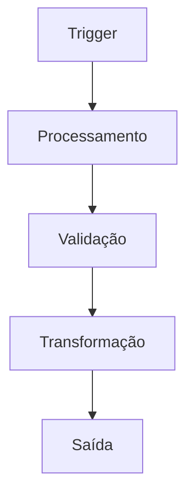
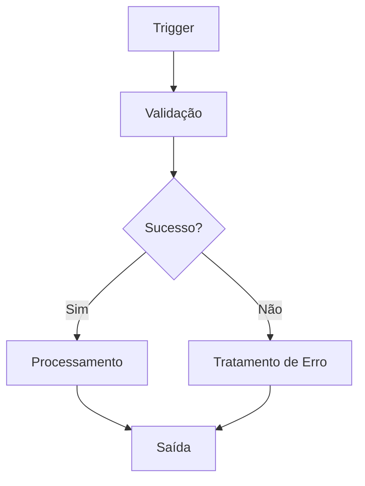
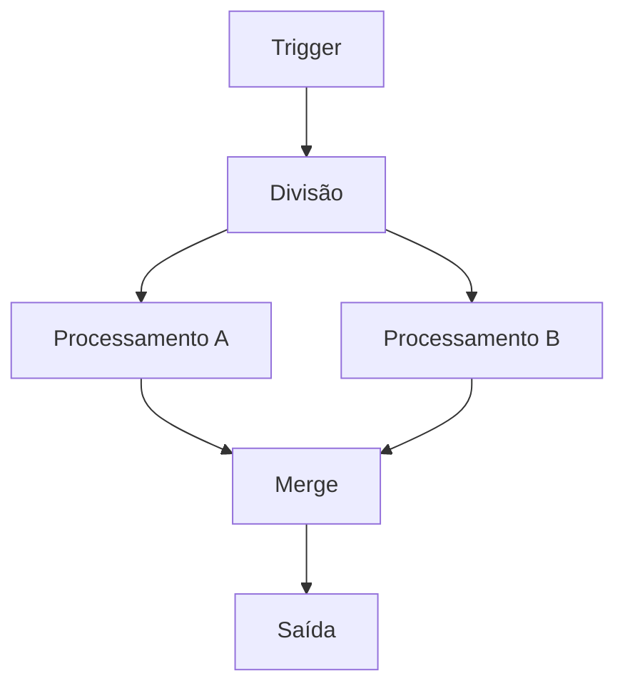

---
sidebar_position: 2
title: Built-in Nodes
description: Nodes nativos e funcionalidades básicas do n8n
keywords: [n8n, built-in nodes, funcionalidades, core, http, dados]
---

<IonicIcon name="information-circle-outline" style={{fontSize: '24px', color: '#ea4b71'}} />

Os **nodes built-in** são os blocos fundamentais do n8n, fornecendo funcionalidades essenciais que você pode usar em qualquer workflow. Eles são nativos da plataforma e não requerem instalação adicional.

## Categorias de Nodes

### Core Nodes

<IonicIcon name="code-slash-outline" style={{fontSize: '24px', color: '#ea4b71'}} />

**Principais funcionalidades:**

- Execução de código JavaScript
- Manipulação de dados
- Debug e logging
- Transformações customizadas
- Lógica de negócio

**Casos de uso:**

- Processamento de dados complexo
- Validações customizadas
- Transformações de formato
- Integração com APIs externas
- Lógica de negócio específica

[Ver documentação completa →](/integracoes/builtin-nodes/core-nodes/index)

### HTTP Requests

<IonicIcon name="globe-outline" style={{fontSize: '24px', color: '#ea4b71'}} />

**Principais funcionalidades:**

- Requisições HTTP/HTTPS
- Suporte a múltiplos métodos
- Autenticação integrada
- Headers customizados
- Tratamento de respostas

**Casos de uso:**

- Integração com APIs REST
- Webhooks e callbacks
- Autenticação OAuth
- Upload e download de arquivos
- Comunicação com serviços externos

[Ver documentação completa →](/integracoes/builtin-nodes/http-requests/index)

### Logic Control

<IonicIcon name="git-branch-outline" style={{fontSize: '24px', color: '#ea4b71'}} />

**Principais funcionalidades:**

- Controle de fluxo condicional
- Múltiplas condições
- Combinação de dados
- Delays e sincronização
- Roteamento dinâmico

**Casos de uso:**

- Validação de dados
- Roteamento por critérios
- Processamento paralelo
- Rate limiting
- Fluxos de aprovação

[Ver documentação completa →](/integracoes/builtin-nodes/logic-control/index)

### Data Processing

<IonicIcon name="analytics-outline" style={{fontSize: '24px', color: '#ea4b71'}} />

**Principais funcionalidades:**

- Agregação de dados
- Transformação de campos
- Filtragem e ordenação
- Conversão de formatos
- Manipulação de arrays

**Casos de uso:**

- Consolidação de relatórios
- Limpeza de dados
- Normalização de formatos
- Agregação estatística
- Preparação de dados

[Ver documentação completa →](/integracoes/builtin-nodes/data-processing/index)

### Utilities

<IonicIcon name="construct-outline" style={{fontSize: '24px', color: '#ea4b71'}} />

**Principais funcionalidades:**

- Manipulação de datas
- Processamento de texto
- Conversões de formato
- Validações
- Transformações matemáticas

**Casos de uso:**

- Formatação de dados
- Validação de entrada
- Conversão de tipos
- Cálculos matemáticos
- Manipulação de strings

[Ver documentação completa →](/integracoes/builtin-nodes/utilities/index)

### Trigger Nodes

<IonicIcon name="flash-outline" style={{fontSize: '24px', color: '#ea4b71'}} />

**Principais funcionalidades:**

- Inicialização de workflows
- Webhooks
- Agendamento
- Eventos de aplicações
- Triggers manuais

**Casos de uso:**

- Automação baseada em eventos
- Integração com aplicações
- Agendamento de tarefas
- Webhooks de sistemas externos
- Triggers manuais para testes

[Ver documentação completa →](/integracoes/builtin-nodes/trigger-nodes/index)

## Conceitos Fundamentais

### Estrutura de um Node

Cada node no n8n possui uma estrutura básica:

```javascript
{
  "name": "Nome do Node",
  "type": "n8n-nodes-base.nodeType",
  "position": [x, y],
  "parameters": {
    // Configurações específicas do node
  }
}
```

### Fluxo de Dados

Os dados fluem entre os nodes através de:

- **Entrada**: Dados recebidos do node anterior
- **Processamento**: Transformação dos dados
- **Saída**: Dados enviados para o próximo node

### Tipos de Nodes

**Trigger Nodes:**
- Iniciam workflows
- Não recebem dados de entrada
- Exemplos: Webhook, Schedule, Manual

**Regular Nodes:**
- Processam dados
- Recebem e enviam dados
- Exemplos: HTTP Request, Code, If

**Output Nodes:**
- Finalizam workflows
- Não enviam dados para outros nodes
- Exemplos: Email, Slack, Database

## Padrões de Uso

### Padrão Básico



### Padrão com Condições



### Padrão Paralelo



## Boas Práticas

### Nomenclatura

1. **Use nomes descritivos** para nodes
2. **Mantenha consistência** na nomenclatura
3. **Documente funções** nos comentários
4. **Use tags** para organização
5. **Evite nomes genéricos**

### Organização

1. **Agrupe nodes relacionados**
2. **Use espaçamento adequado**
3. **Mantenha fluxo lógico**
4. **Documente workflows complexos**
5. **Teste cada seção**

### Performance

1. **Otimize queries** de banco de dados
2. **Use paginação** para grandes datasets
3. **Implemente cache** quando apropriado
4. **Monitore tempo de execução**
5. **Evite loops desnecessários**

## Troubleshooting

### Problemas Comuns

**Node não executa**
- Verifique se está conectado corretamente
- Confirme se recebe dados de entrada
- Teste com dados de exemplo
- Verifique logs de erro

**Dados incorretos**
- Valide formato dos dados de entrada
- Confirme configuração do node
- Teste com dados conhecidos
- Use Debug Helper

**Workflow lento**
- Identifique gargalos
- Otimize queries
- Use processamento paralelo
- Monitore recursos

### Dicas de Debug

1. **Use Debug Helper** para inspecionar dados
2. **Configure logging** detalhado
3. **Teste nodes individualmente**
4. **Valide dados de entrada**
5. **Monitore execução**

## Próximos Passos

- [Core Nodes](/integracoes/builtin-nodes/core-nodes/index) - Funcionalidades básicas
- [HTTP Requests](/integracoes/builtin-nodes/http-requests/index) - Integração com APIs
- [Logic Control](/integracoes/builtin-nodes/logic-control/index) - Controle de fluxo
- [Data Processing](/integracoes/builtin-nodes/data-processing/index) - Processamento de dados
- [Utilities](/integracoes/builtin-nodes/utilities/index) - Ferramentas auxiliares
- [Trigger Nodes](/integracoes/builtin-nodes/trigger-nodes/index) - Inicialização de workflows
