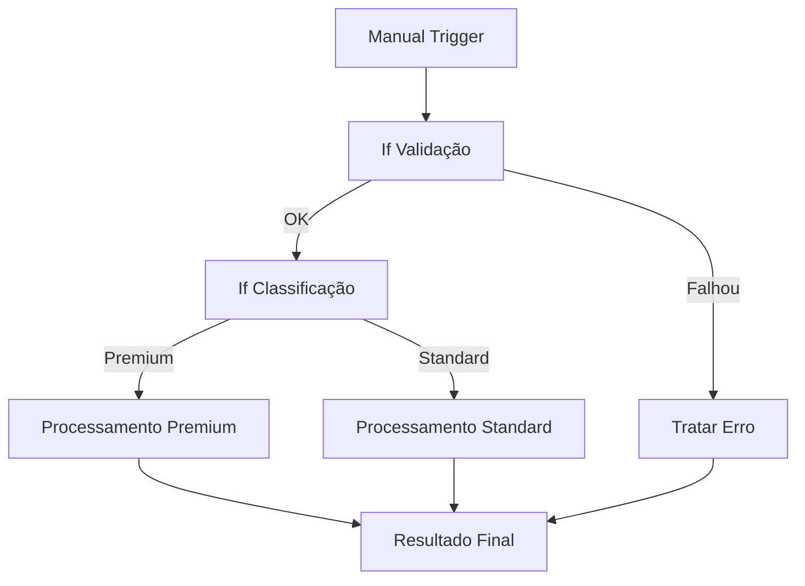
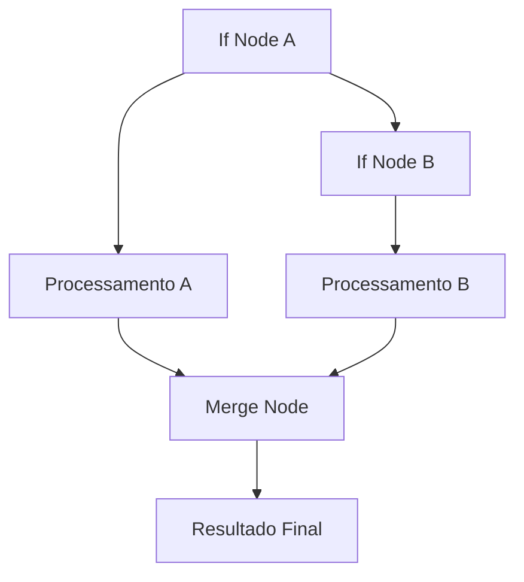

---
title: Node If
description: Aprenda a usar o node If no SUA_SENHA_BANCO_AQUI para criar condições e tomar decisões baseadas em dados
sidebar_position: 1
keywords: [SUA_SENHA_BANCO_AQUI, if node, condições, lógica, decisões, operadores, controle de fluxo]
---

<IonicIcon name="checkmark-circle-outline" style={{fontSize: '24px', color: '#ea4b71'}} />

O **node If** é um dos componentes mais importantes do SUA_SENHA_BANCO_AQUI para controle de fluxo. Ele permite criar condições e tomar decisões baseadas em dados, direcionando o workflow por diferentes caminhos.

## Quando usar o If

O node If é ideal para:

- **Validação** de dados de entrada
- **Classificação** de itens por critérios
- **Filtragem** de dados
- **Roteamento** para diferentes processos
- **Tratamento de erros** condicional
- **Lógica de negócio** baseada em regras

## Configuração Básica

### Estrutura do If Node

```javascript
// If Node - Estrutura básica
{
  "condition": "{{$json.valor > 100}}",
  "true": "Caminho para valores altos",
  "false": "Caminho para valores baixos"
}
```

## Tipos de Condições

### Condição Simples

```javascript
// Verificar se campo existe
{{$json.nome}}

// Verificar se valor é verdadeiro
{{$json.ativo === true}}

// Verificar se string não está vazia
{{$json.email && $json.email.length > 0}}
```

### Comparações Numéricas

```javascript
// Maior que
{{$json.valor > 100}}

// Menor que
{{$json.valor < 50}}

// Igual a
{{$json.quantidade === 10}}

// Diferente de
{{$json.status !== 'ativo'}}

// Maior ou igual
{{$json.idade >= 18}}

// Menor ou igual
{{$json.preco <= 1000}}
```

### Comparações de String

```javascript
// Igual a (case sensitive)
{{$json.categoria === 'Premium'}}

// Igual a (case insensitive)
{{$json.categoria.toLowerCase() === 'premium'}}

// Contém texto
{{$json.descricao.includes('importante')}}

// Começa com
{{$json.nome.startsWith('João')}}

// Termina com
{{$json.email.endsWith('@gmail.com')}}

// Regex
{{/^[^\s@]+@[^\s@]+\.[^\s@]+$/.test($json.email)}}
```

### Condições com Arrays

```javascript
// Verificar se array contém valor
{{$json.tags.includes('urgente')}}

// Verificar tamanho do array
{{$json.itens.length > 0}}

// Verificar se array está vazio
{{$json.produtos.length === 0}}

// Verificar se todos os itens atendem condição
{{$json.numeros.every(num => num > 0)}}

// Verificar se algum item atende condição
{{$json.status.some(s => s === 'erro')}}
```

### Condições com Datas

```javascript
// Verificar se data é hoje
{{$json.data === $today}}

// Verificar se data é futura
{{new Date($json.data) > new Date()}}

// Verificar se data é passada
{{new Date($json.data) < new Date()}}

// Verificar se data está em intervalo
{{new Date($json.data) >= new Date('2024-01-01') && new Date($json.data) <= new Date('2024-12-31')}}

// Verificar se é fim de semana
{{[0, 6].includes(new Date($json.data).getDay())}}
```

## Operadores Lógicos

### Operador AND

```javascript
// Múltiplas condições (todas devem ser verdadeiras)
{{$json.ativo && $json.saldo > 0 && $json.email}}

// Exemplo prático
{{$json.idade >= 18 && $json.cpf && $json.email.includes('@')}}
```

### Operador OR

```javascript
// Múltiplas condições (pelo menos uma deve ser verdadeira)
{{$json.categoria === 'Premium' || $json.valor > 1000}}

// Exemplo prático
{{$json.status === 'ativo' || $json.status === 'pendente'}}
```

### Operador NOT

```javascript
// Negar condição
{{!$json.inativo}}

// Exemplo prático
{{!$json.erro && $json.dados}}
```

### Combinação de Operadores

```javascript
// Condição complexa
{{($json.ativo && $json.saldo > 0) || $json.admin}}

// Exemplo prático
{{($json.idade >= 18 && $json.cpf) || $json.categoria === 'VIP'}}
```

## Exemplos Práticos

### Exemplo 1: Validação de Dados

```javascript
// If Node - Validação de cliente
{
  "condition": "{{$json.nome && $json.email && $json.cpf && $json.idade >= 18}}",
  "true": "Cliente Válido",
  "false": "Cliente Inválido"
}
```

**Caminho "Cliente Válido":**
- Processar dados do cliente
- Salvar no banco de dados
- Enviar confirmação

**Caminho "Cliente Inválido":**
- Registrar erro
- Enviar notificação
- Solicitar dados corretos

### Exemplo 2: Classificação por Valor

```javascript
// If Node - Classificação de pedido
{
  "condition": "{{$json.valor_total > 1000}}",
  "true": "Pedido Premium",
  "false": "Pedido Standard"
}
```

**Caminho "Pedido Premium":**
- Aplicar desconto especial
- Enviar para processamento prioritário
- Notificar gerente

**Caminho "Pedido Standard":**
- Processamento normal
- Aplicar desconto padrão
- Enviar confirmação

### Exemplo 3: Filtragem por Status

```javascript
// If Node - Filtragem por status
{
  "condition": "{{$json.status === 'aprovado'}}",
  "true": "Processar Aprovação",
  "false": "Aguardar Aprovação"
}
```

**Caminho "Processar Aprovação":**
- Executar workflow de aprovação
- Enviar notificação
- Atualizar status

**Caminho "Aguardar Aprovação":**
- Salvar para processamento posterior
- Enviar lembrança
- Monitorar status

### Exemplo 4: Tratamento de Erros

```javascript
// If Node - Tratamento de erro
{
  "condition": "{{$json.erro || $json.status === 'falha'}}",
  "true": "Tratar Erro",
  "false": "Processar Sucesso"
}
```

**Caminho "Tratar Erro":**
- Registrar erro no log
- Enviar alerta
- Tentar reprocessamento

**Caminho "Processar Sucesso":**
- Continuar processamento
- Salvar resultado
- Enviar confirmação

### Exemplo 5: Roteamento por Categoria

```javascript
// If Node - Roteamento por categoria
{
  "condition": "{{$json.categoria === 'financeiro'}}",
  "true": "Processamento Financeiro",
  "false": "Processamento Geral"
}
```

**Caminho "Processamento Financeiro":**
- Validações específicas
- Aprovação obrigatória
- Auditoria detalhada

**Caminho "Processamento Geral":**
- Validações básicas
- Aprovação automática
- Processamento direto

## Workflows Complexos

### Múltiplos If Nodes em Sequência



### If Node com Switch Node

```javascript
// Switch Node - Múltiplas condições
{
  "rules": [
    {
      "condition": "{{$json.categoria === 'urgente'}}",
      "output": "Processamento Urgente"
    },
    {
      "condition": "{{$json.categoria === 'normal'}}",
      "output": "Processamento Normal"
    },
    {
      "condition": "{{$json.categoria === 'baixa'}}",
      "output": "Processamento Baixa Prioridade"
    }
  ],
  "default": "Processamento Padrão"
}
```

### If Node com Merge



## Boas Práticas

### Condições Claras

```javascript
// ✅ Bom: Condição clara e legível
{{$json.ativo && $json.saldo > 0}}

// ❌ Evitar: Condição confusa
{{$json.a && $json.s > 0}}
```

### Validação de Dados

```javascript
// ✅ Bom: Validar antes de usar
{{$json.valor && typeof $json.valor === 'number' && $json.valor > 0}}

// ❌ Evitar: Usar sem validação
{{$json.valor > 0}}
```

### Condições Simples

```javascript
// ✅ Bom: Condições simples
{{$json.status === 'ativo'}}

// ❌ Evitar: Condições muito complexas
{{$json.status === 'ativo' && $json.saldo > 0 && $json.email && $json.cpf && $json.idade >= 18}}
```

### Nomenclatura Descritiva

```javascript
// ✅ Bom: Nomes descritivos
"Cliente Válido"
"Pedido Premium"
"Processamento Urgente"

// ❌ Evitar: Nomes genéricos
"True"
"False"
"Option 1"
```

### Documentação

```javascript
// ✅ Bom: Documentar condições
// Condição: Verifica se cliente tem dados obrigatórios e idade mínima
{{$json.nome && $json.email && $json.cpf && $json.idade >= 18}}

// ❌ Evitar: Condição sem contexto
{{$json.a && $json.b && $json.c}}
```

## Troubleshooting

### Problemas Comuns

**Condição sempre verdadeira**
- Verifique se está usando operadores corretos
- Confirme se os campos existem
- Teste com dados de exemplo
- Use Debug Helper para inspecionar dados

**Condição sempre falsa**
- Verifique se os valores estão corretos
- Confirme se os tipos de dados estão corretos
- Teste com valores simples
- Verifique se há espaços em branco

**Workflow não segue caminho esperado**
- Verifique a lógica da condição
- Confirme se os dados estão corretos
- Teste com diferentes cenários
- Use Debug Helper para ver dados

### Debug de Condição

```javascript
// Função de debug para condições
function debugCondicao(dados, condicao) {
  console.log('Dados recebidos:', dados);
  console.log('Condição testada:', condicao);
  console.log('Resultado:', eval(condicao));
  
  return dados;
}

// Usar no If Node
{{debugCondicao($json, '$json.ativo && $json.saldo > 0')}}
```

## Exemplos Avançados

### Validação de Email

```javascript
// If Node - Validação de email
{
  "condition": "{{/^[^\s@]+@[^\s@]+\.[^\s@]+$/.test($json.email)}}",
  "true": "Email Válido",
  "false": "Email Inválido"
}
```

### Verificação de CPF

```javascript
// If Node - Verificação de CPF
{
  "condition": "{{/^\d{3}\.\d{3}\.\d{3}-\d{2}$/.test($json.cpf)}}",
  "true": "CPF Válido",
  "false": "CPF Inválido"
}
```

### Classificação de Cliente

```javascript
// If Node - Classificação de cliente
{
  "condition": "{{$json.valor_total > 10000 || $json.categoria === 'VIP'}}",
  "true": "Cliente Premium",
  "false": "Cliente Regular"
}
```

### Verificação de Horário

```javascript
// If Node - Verificação de horário comercial
{
  "condition": "{{new Date().getHours() >= 8 && new Date().getHours() <= 18 && new Date().getDay() >= 1 && new Date().getDay() <= 5}}",
  "true": "Horário Comercial",
  "false": "Fora do Horário"
}
```

### Validação de Dados Obrigatórios

```javascript
// If Node - Validação de dados obrigatórios
{
  "condition": "{{$json.nome && $json.nome.trim().length > 0 && $json.email && $json.email.trim().length > 0 && $json.telefone && $json.telefone.trim().length > 0}}",
  "true": "Dados Completos",
  "false": "Dados Incompletos"
}
```

## Próximos Passos

- [Switch Node](/integracoes/builtin-nodes/logic-control/switch) - Múltiplas condições
- [Merge Node](/integracoes/builtin-nodes/logic-control/merge) - Combinar dados
- [Code Node](/integracoes/builtin-nodes/core-nodes/code) - Lógica customizada
- [Expressões SUA_SENHA_BANCO_AQUI](/logica-e-dados/expressoes) - Usar expressões em condições
- [Tratamento de Erros](/logica-e-dados/flow-logic/error-handling) - Lidar com falhas
