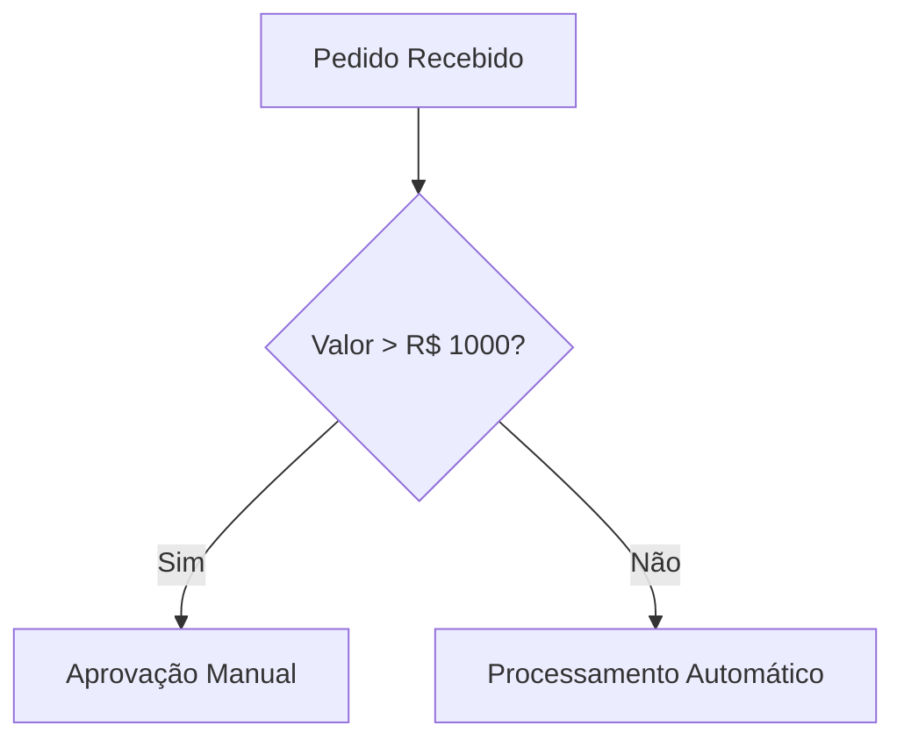
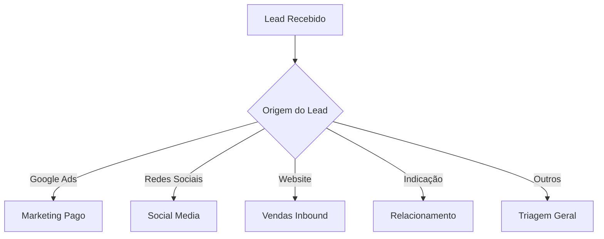
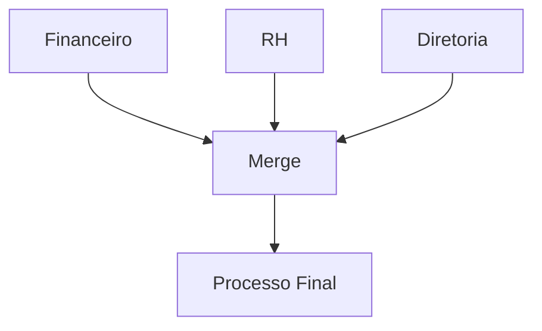

import Admonition from '@theme/Admonition';

# <ion-icon name="code-slash-outline" style={{ fontSize: '24px', color: '#ea4b71' }}></ion-icon> Nodes de Lógica e Controle

Os nodes de lógica e controle do n8n permitem criar **workflows inteligentes, adaptativos e robustos**. Com eles, você implementa decisões condicionais, múltiplos caminhos, loops, tratamento de erros e junção de dados, tornando suas automações muito mais poderosas.

## <ion-icon name="grid-outline" style={{ fontSize: '24px', color: '#ea4b71' }}></ion-icon> O que você vai encontrar aqui

- **[Splitting: Ramificação Condicional](../../../logica-e-dados/01-flow-logic/splitting)**
- **[Node IF: Decisão Binária](#node-if)**
- **[Node Switch: Decisão Multicondicional](#node-switch)**
- **[Node Merge: Reunindo Ramificações](#node-merge)**
- **[Looping: Repetição e Processamento em Lote](../../../logica-e-dados/01-flow-logic/looping)**
- **[Tratamento de Erros](../../../logica-e-dados/01-flow-logic/error-handling)**
- **Boas práticas, debugging e troubleshooting**
- **Casos de uso reais**

---

## <ion-icon name="code-slash-outline" style={{ fontSize: '24px', color: '#ea4b71' }}></ion-icon> Visão Geral dos Nodes

| Node         | Finalidade                  | Saídas         | Quando usar?                  |
|--------------|-----------------------------|----------------|-------------------------------|
| [IF](#node-if)      | Decisão binária (Sim/Não)      | true, false    | Separar fluxo em dois caminhos |
| [Switch](#node-switch)  | Decisão múltipla (casos)        | 1 por regra    | Vários caminhos possíveis      |
| [Merge](#node-merge)   | Reunir ramificações             | 1              | Consolidar dados/fluxos        |
| [Looping](../../../logica-e-dados/01-flow-logic/looping)   | Repetição/processamento em lote | -              | Iterar sobre listas/arrays      |

---

## <ion-icon name="chevron-forward-outline" style={{ fontSize: '24px', color: '#ea4b71' }}></ion-icon> Splitting: Ramificação Condicional

Crie pontos de decisão no seu workflow para que cada item siga o caminho adequado, usando **IF** e **Switch**. Veja o guia completo:

- [Splitting: Como ramificar fluxos e criar lógica condicional →](../../../logica-e-dados/01-flow-logic/splitting)

---

## <ion-icon name="code-slash-outline" style={{ fontSize: '24px', color: '#ea4b71' }}></ion-icon> Node IF: Decisão Binária {#node-if}

Use o node IF para separar o fluxo em dois caminhos (Sim/Não, Verdadeiro/Falso).

**Exemplo:**
> Se o valor do pedido for maior que R$ 1000, envie para aprovação manual. Caso contrário, processe automaticamente.

- [Guia detalhado: Splitting e IF →](../../../logica-e-dados/01-flow-logic/splitting)
- [Documentação oficial IF Node (EN)](https://docs.n8n.io/integrations/builtin/core-nodes/n8n-nodes-base.if/)

---

## <ion-icon name="code-slash-outline" style={{ fontSize: '24px', color: '#ea4b71' }}></ion-icon> Node Switch: Decisão Multicondicional {#node-switch}

O node Switch permite criar múltiplos caminhos baseados em diferentes valores ou regras.

**Exemplo:**
> Classifique leads por origem: Google Ads → Marketing Pago, Redes Sociais → Social Media, Website → Vendas Inbound, Indicação → Relacionamento.

- [Guia detalhado: Splitting e Switch →](../../../logica-e-dados/01-flow-logic/splitting)
- [Documentação oficial Switch Node (EN)](https://docs.n8n.io/integrations/builtin/core-nodes/n8n-nodes-base.switch/)

---

## <ion-icon name="code-slash-outline" style={{ fontSize: '24px', color: '#ea4b71' }}></ion-icon> Node Merge: Reunindo Ramificações {#node-merge}

Após ramificar o fluxo, use o node Merge para reunir os caminhos e consolidar dados.

**Exemplo:**
> Após diferentes aprovações (financeiro, RH, diretoria), reúna todos os resultados para uma ação final.

- [Guia detalhado: Merge →](../../../logica-e-dados/01-flow-logic/merging)
- [Documentação oficial Merge Node (EN)](https://docs.n8n.io/integrations/builtin/core-nodes/n8n-nodes-base.merge/)

---

## <ion-icon name="git-branch-outline" style={{ fontSize: '24px', color: '#ea4b71' }}></ion-icon> Looping: Repetição e Processamento em Lote

Implemente loops para processar arrays, repetir ações e criar automações dinâmicas:

- [Guia de Looping →](../../../logica-e-dados/01-flow-logic/looping)

---

## <ion-icon name="bug-outline" style={{ fontSize: '24px', color: '#ea4b71' }}></ion-icon> Tratamento de Erros

Garanta workflows resilientes com nodes de tratamento de erro, retry automático e notificações:

- [Guia de Tratamento de Erros →](../../../logica-e-dados/01-flow-logic/error-handling)

---

## <ion-icon name="bug-outline" style={{ fontSize: '24px', color: '#ea4b71' }}></ion-icon> Boas Práticas e Troubleshooting

- Use **Always Output Data** em IF/Switch para garantir merges corretos
- Nomeie nodes e caminhos de forma clara
- Teste expressões no editor antes de usar
- Use [Debug Helper](/integracoes/builtin-nodes/core-nodes/debug-helper) e Execution History para depuração
- Consulte [Splitting: Troubleshooting e dicas](../../../logica-e-dados/01-flow-logic/splitting#troubleshooting-problemas-comuns)

---

## <ion-icon name="bulb-outline" style={{ fontSize: '24px', color: '#ea4b71' }}></ion-icon> Exemplos e Casos de Uso

- E-commerce: Processamento de pedidos por tipo de pagamento
- Marketing: Segmentação de leads
- Aprovação de férias: múltiplas regras e sub-workflows
- Workflows paralelos com Merge

Veja exemplos completos em:

- [Splitting: Casos de uso e exemplos práticos →](../../../logica-e-dados/01-flow-logic/splitting#casos-de-uso-comuns)
- [Catálogo de Workflows](/catalogo)

---

<Admonition type="info" title="Recursos Oficiais e Comunidade">
- [Documentação oficial n8n](https://docs.n8n.io/)
- [Exemplos de Workflows](https://n8n.io/workflows)
- [Fórum da Comunidade](https://community.n8n.io/)
</Admonition>
