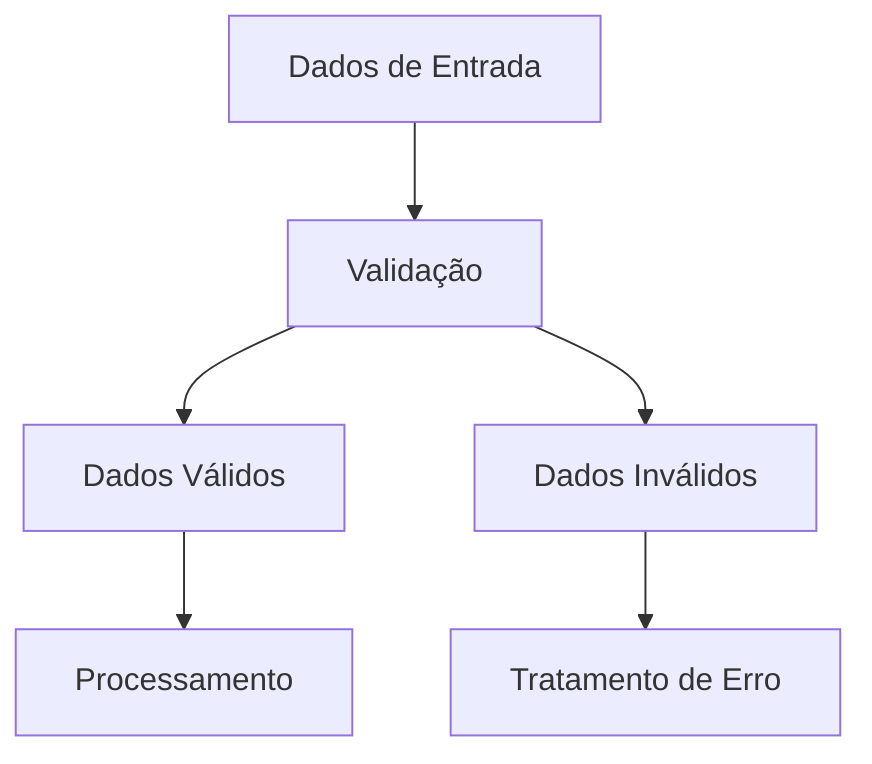
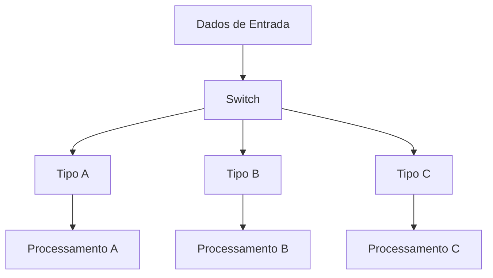
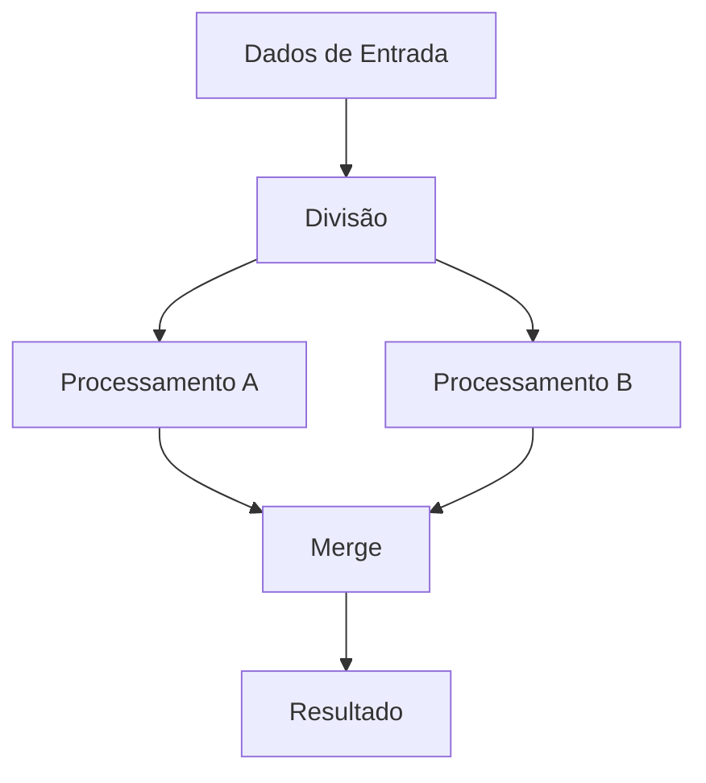
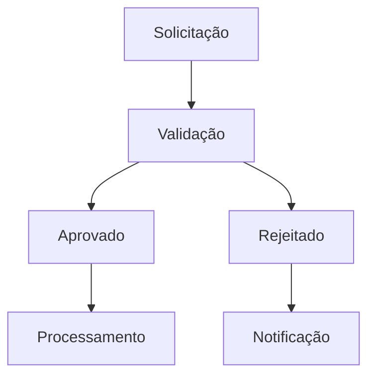
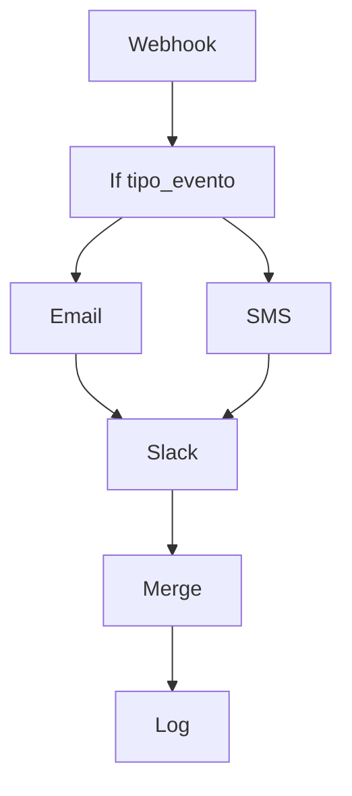
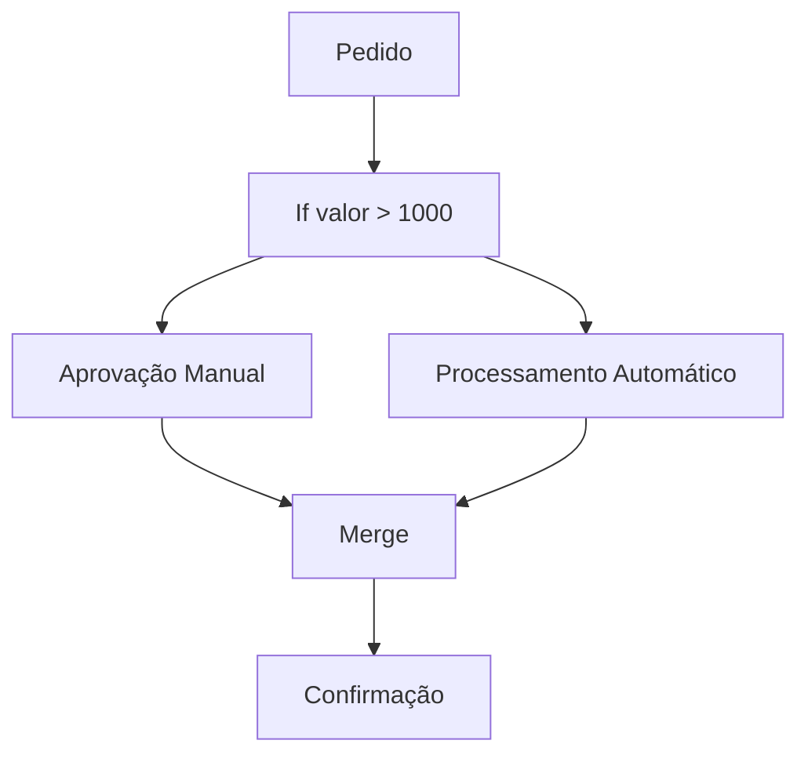
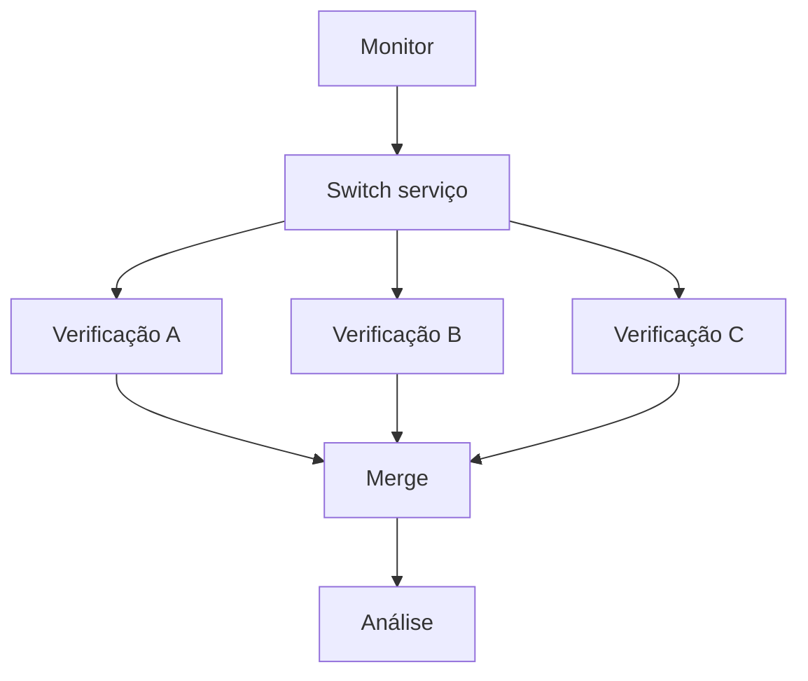

---
title: Controle de Lógica
description: Nodes para controlar o fluxo de execução e tomar decisões baseadas em condições no SUA_SENHA_BANCO_AQUI
sidebar_position: 1
keywords: [SUA_SENHA_BANCO_AQUI, lógica, controle, fluxo, condições, decisões, if, switch, merge]
---

<IonicIcon name="git-branch-outline" style={{fontSize: '24px', color: '#ea4b71'}} />

Os nodes de **Controle de Lógica** são fundamentais para criar workflows inteligentes e dinâmicos no SUA_SENHA_BANCO_AQUI. Eles permitem que você controle o fluxo de execução, tome decisões baseadas em condições e combine dados de diferentes fontes.

## Nodes Disponíveis

### If Node

<IonicIcon name="checkmark-circle-outline" style={{fontSize: '24px', color: '#ea4b71'}} />

**Principais funcionalidades:**

- Avaliar condições simples e complexas
- Direcionar dados para diferentes caminhos
- Usar expressões SUA_SENHA_BANCO_AQUI para lógica avançada
- Combinar múltiplas condições
- Criar fluxos condicionais

**Casos de uso:**

- Validar dados de entrada
- Filtrar informações por critérios
- Implementar regras de negócio
- Criar fluxos de aprovação
- Processar dados diferentes baseado em condições

[Ver documentação completa →](/integracoes/builtin-nodes/logic-control/if)

### Switch Node

<IonicIcon name="git-network-outline" style={{fontSize: '24px', color: '#ea4b71'}} />

**Principais funcionalidades:**

- Múltiplos caminhos de saída
- Condições independentes
- Caminho padrão para casos não cobertos
- Avaliação sequencial de condições
- Fluxos paralelos de processamento

**Casos de uso:**

- Classificar dados por tipo
- Implementar máquinas de estado
- Processar diferentes tipos de eventos
- Criar workflows de roteamento
- Implementar lógica de negócio complexa

[Ver documentação completa →](/integracoes/builtin-nodes/logic-control/switch)

### Merge Node

<IonicIcon name="git-merge-outline" style={{fontSize: '24px', color: '#ea4b71'}} />

**Principais funcionalidades:**

- Combinar dados de diferentes nodes
- Unir informações relacionadas
- Sincronizar fluxos paralelos
- Agregar dados de múltiplas fontes
- Criar estruturas de dados consolidadas

**Casos de uso:**

- Mesclar dados de diferentes APIs
- Combinar informações de clientes
- Sincronizar processamento paralelo
- Agregar resultados de múltiplas consultas
- Consolidar dados de diferentes sistemas

[Ver documentação completa →](/integracoes/builtin-nodes/logic-control/merge)

### Wait Node

<IonicIcon name="time-outline" style={{fontSize: '24px', color: '#ea4b71'}} />

**Principais funcionalidades:**

- Adicionar pausas programadas
- Implementar delays condicionais
- Sincronizar processos
- Controlar timing de execução
- Implementar rate limiting

**Casos de uso:**

- Rate limiting para APIs
- Processamento em lotes
- Retry com backoff exponencial
- Sincronização com sistemas externos
- Polling inteligente

[Ver documentação completa →](/integracoes/builtin-nodes/logic-control/wait)

## Conceitos Fundamentais

### Fluxo de Controle

O **fluxo de controle** determina como os dados se movem através do workflow, baseado em condições e decisões.

**Tipos de fluxo:**

- **Sequencial**: Execução linha por linha
- **Condicional**: Execução baseada em condições
- **Paralelo**: Execução simultânea
- **Convergente**: Múltiplos caminhos se unem

### Condições e Expressões

As **condições** são expressões que avaliam para verdadeiro ou falso, determinando o caminho do fluxo.

**Tipos de condições:**

- **Comparações**: `==`, `!=`, `>`, `<`, `>=`, `<=`
- **Lógicas**: `AND`, `OR`, `NOT`
- **Existe**: Verificar se campo existe
- **Vazio**: Verificar se valor está vazio
- **Regex**: Padrões de texto

### Estruturas de Decisão

As **estruturas de decisão** permitem criar lógica complexa no workflow:

1. **If-Then-Else**: Decisão binária
2. **Switch-Case**: Múltiplas opções
3. **Nested Conditions**: Condições aninhadas
4. **Parallel Processing**: Processamento paralelo

## Padrões de Controle

### Validação e Filtragem



**Exemplo:**
1. **If** node valida email
2. **If** node verifica se usuário existe
3. **If** node confirma se dados estão completos
4. Dados válidos seguem para processamento

### Roteamento por Tipo



**Exemplo:**

1. **Switch** node classifica por tipo de pedido
2. Pedidos normais vão para processamento padrão
3. Pedidos urgentes vão para processamento prioritário
4. Pedidos especiais vão para aprovação manual

### Processamento Paralelo



**Exemplo:**
1. Dados são divididos em dois fluxos
2. **HTTP Request** busca informações do cliente
3. **HTTP Request** busca histórico de compras
4. **Merge** node combina as informações

### Fluxo de Aprovação



**Exemplo:**

1. **If** node verifica se valor está dentro do limite
2. **If** node confirma se aprovador está disponível
3. **Switch** node direciona para diferentes níveis de aprovação
4. **Merge** node consolida resultado final

## Exemplos Práticos

### Exemplo 1: Sistema de Notificações

**Cenário:** Enviar notificações diferentes baseado no tipo de evento.

**Workflow:**



**Configuração:**

- **If** node: `$json.tipo_evento === "urgente"`
- **Switch** node: `$json.canal` (email, sms, slack)
- **Merge** node: Combina resultados de todos os canais

### Exemplo 2: Processamento de Pedidos

**Cenário:** Processar pedidos de forma diferente baseado no valor e tipo.

**Workflow:**



**Configuração:**

- **If** node: `$json.valor > 1000`
- **Switch** node: `$json.tipo_pedido` (normal, premium, express)
- **Merge** node: Unifica resultado final

### Exemplo 3: Sistema de Monitoramento

**Cenário:** Monitorar diferentes serviços e alertar baseado na severidade.

**Workflow:**



**Configuração:**

- **Switch** node: `$json.servico` (api, database, website)
- **If** node: `$json.status === "down"`
- **Merge** node: Consolida status de todos os serviços

## Boas Práticas

### Estruturação de Condições

1. **Use nomes descritivos** para condições
2. **Simplifique lógica complexa** em múltiplos nodes
3. **Documente regras de negócio** nos comentários
4. **Teste todas as condições** com dados reais
5. **Mantenha condições legíveis** e organizadas

### Performance

1. **Evite condições aninhadas** excessivas
2. **Use Switch** para múltiplas opções
3. **Otimize ordem das condições** (mais prováveis primeiro)
4. **Processe em paralelo** quando possível
5. **Monitore tempo de execução**

### Manutenção

1. **Use variáveis** para valores reutilizáveis
2. **Centralize lógica comum** em nodes separados
3. **Implemente logging** para debug
4. **Configure alertas** para falhas
5. **Documente fluxos complexos**

## Troubleshooting

### Problemas Comuns

**Condições não funcionam**
- Verifique sintaxe das expressões
- Confirme tipos de dados
- Use o node Debug Helper
- Teste condições individualmente

**Fluxo inesperado**
- Verifique ordem das condições
- Confirme valores de entrada
- Valide lógica de decisão
- Use logs para rastrear fluxo

**Merge não funciona**
- Verifique se todos os inputs estão conectados
- Confirme estrutura dos dados
- Valide configuração do merge
- Teste com dados de exemplo

### Dicas de Debug

1. **Use o node Debug Helper** para inspecionar dados
2. **Configure logging detalhado**
3. **Teste condições individualmente**
4. **Valide dados de entrada**
5. **Monitore fluxo de execução**

## Expressões Avançadas

### Operadores de Comparação

```javascript
// Comparações básicas
$json.valor > 100
$json.status === "ativo"
$json.email !== ""

// Comparações com arrays
$json.tags.includes("urgente")
$json.categorias.indexOf("tecnologia") > -1
```

### Operadores Lógicos

```javascript
// AND lógico
$json.valor > 100 && $json.status === "ativo"

// OR lógico
$json.tipo === "urgente" || $json.prioridade === "alta"

// NOT lógico
!$json.processado
```

### Verificações de Existência

```javascript
// Verificar se campo existe
$json.hasOwnProperty("email")

// Verificar se valor não é nulo
$json.valor != null

// Verificar se array não está vazio
$json.items.length > 0
```

### Expressões Complexas

```javascript
// Múltiplas condições
($json.valor > 1000 && $json.cliente_tipo === "premium") || 
($json.valor > 5000 && $json.cliente_tipo === "normal")

// Validação de email
/^[^\s@]+@[^\s@]+\.[^\s@]+$/.test($json.email)

// Verificação de data
new Date($json.data_vencimento) > new Date()
```

## Próximos Passos

- [Expressões SUA_SENHA_BANCO_AQUI](/logica-e-dados/expressoes) - Usar expressões avançadas
- [Nodes de Dados](/integracoes/builtin-nodes/data-processing/index) - Processar dados
- [Tratamento de Erros](/logica-e-dados/flow-logic/error-handling) - Lidar com falhas
- [Fluxo de Execução](/logica-e-dados/flow-logic/execution-order) - Controlar ordem
- [Debugging](/logica-e-dados/flow-logic/debugging) - Depurar workflows
