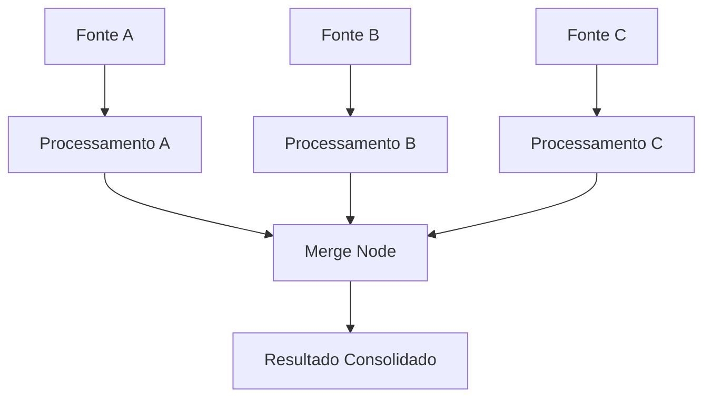
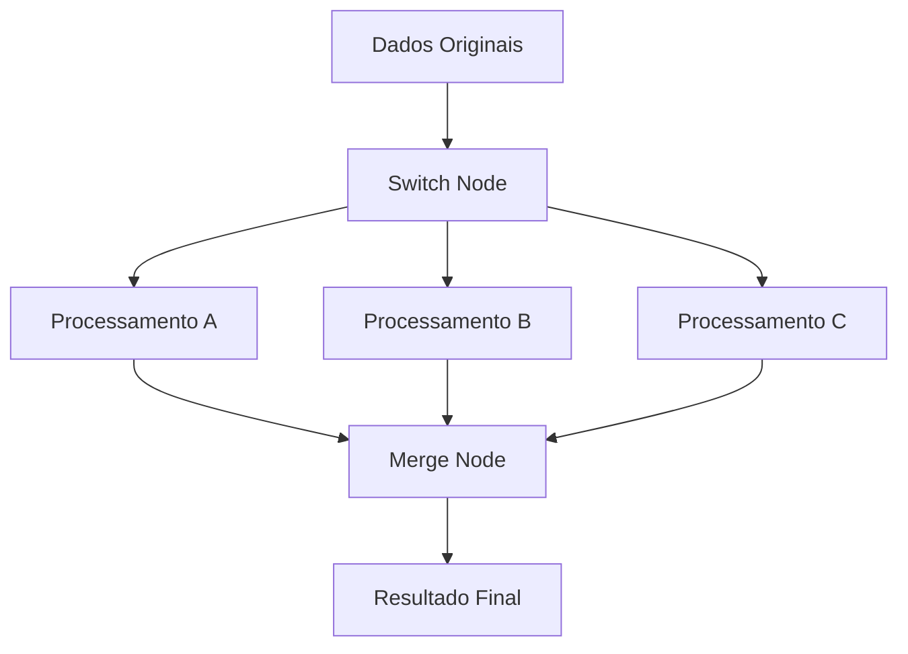

---
title: Node Merge
description: Aprenda a usar o node Merge no SUA_SENHA_BANCO_AQUI para combinar dados de múltiplas fontes
sidebar_position: 3
keywords: [SUA_SENHA_BANCO_AQUI, merge node, combinação, dados, sincronização, união, fluxo]
---

<IonicIcon name="git-merge-outline" style={{fontSize: '24px', color: '#ea4b71'}} />

O **node Merge** é uma ferramenta essencial do SUA_SENHA_BANCO_AQUI para combinar dados de múltiplas fontes. Ele permite unir informações de diferentes caminhos do workflow, criando datasets consolidados e enriquecidos.

## Quando usar o Merge

O node Merge é ideal para:

- **Consolidação** de dados de múltiplas APIs
- **Enriquecimento** de dados com informações complementares
- **Unificação** de resultados de processamentos paralelos
- **Criação** de relatórios consolidados
- **Sincronização** de dados de diferentes sistemas
- **Combinação** de dados de diferentes períodos

## Configuração Básica

### Estrutura do Merge Node

```javascript
// Merge Node - Estrutura básica
{
  "mode": "combine", // combine, append, overwrite
  "combineBy": "id", // Campo para combinar dados
  "options": {
    "combineMode": "multiplex", // multiplex, waitForAll
    "combineBy": "id"
  }
}
```

## Modos de Operação

### Combine Mode

Combinar dados baseado em campo comum.

```javascript
{
  "mode": "combine",
  "combineBy": "id",
  "options": {
    "combineMode": "multiplex"
  }
}
```

**Funcionamento:**
- Combina dados que têm o mesmo valor no campo especificado
- Cria um item consolidado com dados de todas as fontes
- Mantém a estrutura original dos dados

### Append Mode

Anexar dados de diferentes fontes.

```javascript
{
  "mode": "append",
  "options": {
    "combineMode": "multiplex"
  }
}
```

**Funcionamento:**
- Adiciona dados de uma fonte aos dados de outra
- Cria arrays com todos os itens
- Útil para consolidar listas

### Overwrite Mode

Sobrescrever dados com informações mais recentes.

```javascript
{
  "mode": "overwrite",
  "combineBy": "id",
  "options": {
    "combineMode": "multiplex"
  }
}
```

**Funcionamento:**
- Substitui dados antigos por novos
- Mantém apenas a versão mais recente
- Útil para atualizações de dados

## Modos de Combinação

### Multiplex

```javascript
// Processar dados assim que chegarem
{
  "combineMode": "multiplex"
}
```

**Características:**
- Processa dados assim que chegam de qualquer fonte
- Não espera por todas as fontes
- Mais rápido e eficiente
- Pode resultar em dados incompletos

### Wait for All

```javascript
// Aguardar dados de todas as fontes
{
  "combineMode": "waitForAll"
}
```

**Características:**
- Aguarda dados de todas as fontes antes de processar
- Garante dados completos
- Pode ser mais lento
- Útil para dados interdependentes

## Exemplos Práticos

### Exemplo 1: Enriquecimento de Dados de Cliente

```javascript
// Merge Node - Enriquecer dados de cliente
{
  "mode": "combine",
  "combineBy": "cliente_id",
  "options": {
    "combineMode": "multiplex"
  }
}
```

**Fontes de dados:**

- **Fonte 1:** Dados básicos do cliente (nome, email, telefone)
- **Fonte 2:** Histórico de compras (total, frequência, última compra)
- **Fonte 3:** Dados de endereço (CEP, cidade, estado)

**Resultado:**

```json
{
  "cliente_id": "12345",
  "nome": "João Silva",
  "email": "joao@email.com",
  "telefone": "(11) 99999-9999",
  "total_compras": 15000,
  "frequencia": 5,
  "ultima_compra": "2024-01-15",
  "cep": "01234-567",
  "cidade": "São Paulo",
  "estado": "SP"
}
```

### Exemplo 2: Consolidação de Vendas por Região

```javascript
// Merge Node - Consolidar vendas
{
  "mode": "append",
  "options": {
    "combineMode": "waitForAll"
  }
}
```

**Fontes de dados:**

- **Fonte 1:** Vendas da região Norte
- **Fonte 2:** Vendas da região Sul
- **Fonte 3:** Vendas da região Sudeste

**Resultado:**

```json
[
  {
    "regiao": "Norte",
    "vendas": 5000,
    "clientes": 50
  },
  {
    "regiao": "Sul",
    "vendas": 8000,
    "clientes": 80
  },
  {
    "regiao": "Sudeste",
    "vendas": 12000,
    "clientes": 120
  }
]
```

### Exemplo 3: Atualização de Produtos

```javascript
// Merge Node - Atualizar produtos
{
  "mode": "overwrite",
  "combineBy": "produto_id",
  "options": {
    "combineMode": "multiplex"
  }
}
```

**Fontes de dados:**
- **Fonte 1:** Dados básicos do produto (nome, categoria, preço)
- **Fonte 2:** Dados atualizados (preço, estoque, status)

**Resultado:**
```json
{
  "produto_id": "P001",
  "nome": "Notebook Dell",
  "categoria": "Eletrônicos",
  "preco": 3500.00, // Atualizado
  "estoque": 15,    // Novo campo
  "status": "ativo" // Novo campo
}
```

### Exemplo 4: Relatório Consolidado

```javascript
// Merge Node - Relatório consolidado
{
  "mode": "combine",
  "combineBy": "data",
  "options": {
    "combineMode": "waitForAll"
  }
}
```

**Fontes de dados:**
- **Fonte 1:** Vendas do dia
- **Fonte 2:** Clientes novos
- **Fonte 3:** Produtos mais vendidos

**Resultado:**
```json
{
  "data": "2024-01-15",
  "vendas": {
    "total": 15000,
    "quantidade": 25
  },
  "clientes": {
    "novos": 5,
    "ativos": 120
  },
  "produtos": [
    {
      "nome": "Notebook",
      "quantidade": 10
    },
    {
      "nome": "Mouse",
      "quantidade": 15
    }
  ]
}
```

## Casos de Uso Avançados

### Merge com Transformação de Dados

```javascript
// Code Node - Preparar dados para merge
const dadosPreparados = $json.map(item => ({
  ...item,
  timestamp: new Date().toISOString(),
  fonte: 'api_principal'
}));

return dadosPreparados;

// Merge Node - Combinar dados
{
  "mode": "combine",
  "combineBy": "id",
  "options": {
    "combineMode": "multiplex"
  }
}

// Code Node - Processar dados consolidados
const dadosConsolidados = $json.map(item => ({
  ...item,
  processado_em: new Date().toISOString()
}));

return dadosConsolidados;
```

### Merge com Validação

```javascript
// Code Node - Validar dados antes do merge
const dados = $json;
const validacoes = {
  nome: dados.nome && dados.nome.length > 0,
  email: dados.email && dados.email.includes('@'),
  telefone: dados.telefone && dados.telefone.length >= 10
};

const todasValidas = Object.values(validacoes).every(v => v);

if (!todasValidas) {
  console.warn('Dados inválidos:', dados, validacoes);
  return null;
}

return dados;

// Merge Node - Combinar apenas dados válidos
{
  "mode": "combine",
  "combineBy": "id",
  "options": {
    "combineMode": "multiplex"
  }
}
```

### Merge com Agregação

```javascript
// Aggregate Node - Agregar dados por categoria
{
  "groupBy": ["categoria"],
  "aggregations": [
    {
      "field": "valor",
      "operation": "sum",
      "name": "total_categoria"
    },
    {
      "field": "id",
      "operation": "count",
      "name": "quantidade_categoria"
    }
  ]
}

// Merge Node - Combinar com dados originais
{
  "mode": "combine",
  "combineBy": "categoria",
  "options": {
    "combineMode": "multiplex"
  }
}
```

### Merge com Cache

```javascript
// Code Node - Cache de dados
const cache = new Map();

async function buscarDados(id) {
  if (cache.has(id)) {
    return cache.get(id);
  }
  
  const dados = await buscarDados(id);
  cache.set(id, dados);
  return dados;
}

// Merge Node - Combinar dados frescos com cache
{
  "mode": "combine",
  "combineBy": "id",
  "options": {
    "combineMode": "multiplex"
  }
}
```

## Workflows Complexos

### Merge com Múltiplas Fontes



### Merge Hierárquico

```javascript
// Primeiro Merge - Dados básicos
{
  "mode": "combine",
  "combineBy": "cliente_id"
}

// Segundo Merge - Dados financeiros
{
  "mode": "combine",
  "combineBy": "cliente_id"
}

// Terceiro Merge - Dados de endereço
{
  "mode": "combine",
  "combineBy": "cliente_id"
}
```

### Merge com Paralelização



## Boas Práticas

### Escolha do Campo de Combinação

```javascript
// ✅ Bom: Campo único e estável
{
  "combineBy": "id"
}

// ❌ Evitar: Campo que pode mudar
{
  "combineBy": "nome"
}
```

### Modo de Combinação

```javascript
// ✅ Bom: Multiplex para dados independentes
{
  "combineMode": "multiplex"
}

// ✅ Bom: Wait for All para dados interdependentes
{
  "combineMode": "waitForAll"
}
```

### Validação de Dados

```javascript
// ✅ Bom: Validar antes do merge
const dadosValidados = dados.filter(item => 
  item.id && item.nome && item.email
);

// ❌ Evitar: Merge sem validação
// Pode resultar em dados inconsistentes
```

### Tratamento de Erros

```javascript
// ✅ Bom: Tratar dados ausentes
const dadosCompletos = dados.map(item => ({
  ...item,
  fonte: item.fonte || 'desconhecida',
  timestamp: item.timestamp || new Date().toISOString()
}));

// ❌ Evitar: Ignorar dados ausentes
// Pode causar problemas no merge
```

## Troubleshooting

### Problemas Comuns

**Dados não são combinados**
- Verifique se o campo de combinação existe
- Confirme se os valores são iguais
- Teste com dados de exemplo
- Use Debug Helper para ver dados

**Merge lento**
- Use multiplex para dados independentes
- Reduza o número de fontes
- Otimize as consultas de dados
- Considere usar cache

**Dados duplicados**
- Verifique se há campos únicos
- Use overwrite mode quando apropriado
- Implemente validação de duplicatas
- Considere usar Aggregate Node

### Debug de Merge Node

```javascript
// Função de debug para Merge Node
function debugMerge(dados) {
  console.log('Dados recebidos:', dados);
  console.log('Número de itens:', dados.length);
  console.log('Campos disponíveis:', Object.keys(dados[0] || {}));
  console.log('Exemplo de item:', dados[0]);
  console.log('==================');
  
  return dados;
}

// Usar após o Merge Node
return { json: debugMerge($json) };
```

## Integração com Outros Nós

### Merge Node com Set Node

```javascript
// Merge Node - Combinar dados
{
  "mode": "combine",
  "combineBy": "id"
}

// Set Node - Adicionar metadados
{
  "mode": "keepAllSet",
  "values": {
    "string": [
      {
        "name": "fonte_consolidada",
        "value": "{{$json.fonte_1 || $json.fonte_2 || 'múltiplas'}}"
      },
      {
        "name": "timestamp_merge",
        "value": "{{$now.toISOString()}}"
      }
    ]
  }
}
```

### Merge Node com Aggregate Node

```javascript
// Merge Node - Combinar dados de vendas
{
  "mode": "append",
  "options": {
    "combineMode": "waitForAll"
  }
}

// Aggregate Node - Calcular totais
{
  "groupBy": ["regiao"],
  "aggregations": [
    {
      "field": "vendas",
      "operation": "sum",
      "name": "total_vendas"
    },
    {
      "field": "clientes",
      "operation": "sum",
      "name": "total_clientes"
    }
  ]
}
```

### Merge Node com If Node

```javascript
// Merge Node - Combinar dados de cliente
{
  "mode": "combine",
  "combineBy": "cliente_id"
}

// If Node - Verificar dados completos
{
  "condition": "{{$json.nome && $json.email && $json.telefone}}",
  "true": "Dados Completos",
  "false": "Dados Incompletos"
}
```

## Próximos Passos

- [Switch Node](/integracoes/builtin-nodes/logic-control/switch) - Múltiplas condições
- [If Node](/integracoes/builtin-nodes/logic-control/if) - Controle de fluxo
- [Aggregate Node](/integracoes/builtin-nodes/data-processing/aggregate) - Agregação de dados
- [Set Node](/integracoes/builtin-nodes/data-processing/set) - Manipulação de dados
- [Expressões SUA_SENHA_BANCO_AQUI](/logica-e-dados/expressoes) - Usar expressões em merge
