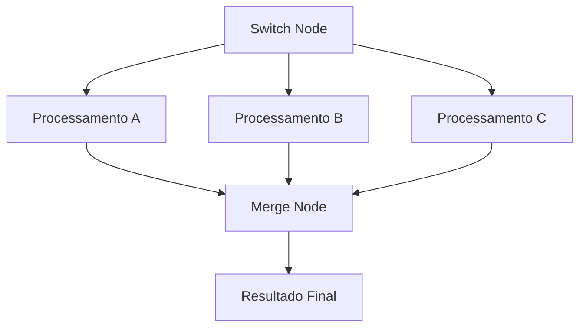
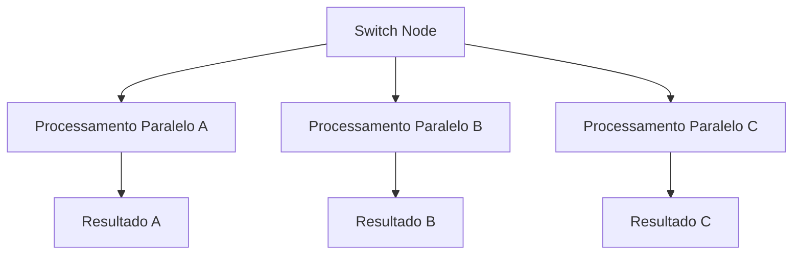

---
title: Node Switch
description: Aprenda a usar o node Switch no n8n para criar múltiplas condições e roteamento de dados
sidebar_position: 2
keywords: [n8n, switch node, múltiplas condições, roteamento, lógica, decisões, fluxo]
---

<IonicIcon name="git-branch-outline" style={{fontSize: '24px', color: '#ea4b71'}} />

O **node Switch** é uma ferramenta avançada do n8n para controle de fluxo com múltiplas condições. Ele permite criar workflows dinâmicos com vários caminhos baseados em diferentes critérios.

## Quando usar o Switch

O node Switch é ideal para:

- **Classificação** de dados por múltiplos critérios
- **Roteamento** para diferentes processos
- **Validação** com múltiplas regras
- **Processamento** paralelo de dados
- **Workflows** com muitas condições
- **Lógica de negócio** complexa

## Configuração Básica

### Estrutura do Switch Node

```javascript
// Switch Node - Estrutura básica
{
  "rules": [
    {
      "condition": "{{$json.categoria === 'urgente'}}",
      "output": "Processamento Urgente"
    },
    {
      "condition": "{{$json.categoria === 'normal'}}",
      "output": "Processamento Normal"
    },
    {
      "condition": "{{$json.categoria === 'baixa'}}",
      "output": "Processamento Baixa Prioridade"
    }
  ],
  "default": "Processamento Padrão"
}
```

## Tipos de Condições

### Condições Simples

```javascript
// Verificar valor exato
{
  "condition": "{{$json.status === 'ativo'}}",
  "output": "Cliente Ativo"
}

// Verificar múltiplos valores
{
  "condition": "{{$json.categoria === 'premium' || $json.categoria === 'vip'}}",
  "output": "Cliente Premium"
}

// Verificar se campo existe
{
  "condition": "{{$json.email && $json.email.length > 0}}",
  "output": "Email Válido"
}
```

### Comparações Numéricas

```javascript
// Faixas de valor
{
  "condition": "{{$json.valor > 10000}}",
  "output": "Valor Alto"
}

// Múltiplas faixas
{
  "condition": "{{$json.valor >= 1000 && $json.valor <= 5000}}",
  "output": "Valor Médio"
}

// Comparações complexas
{
  "condition": "{{$json.idade >= 18 && $json.idade <= 65}}",
  "output": "Idade Válida"
}
```

### Comparações de String

```javascript
// Verificar início de string
{
  "condition": "{{$json.email.startsWith('admin')}}",
  "output": "Administrador"
}

// Verificar fim de string
{
  "condition": "{{$json.arquivo.endsWith('.pdf')}}",
  "output": "Documento PDF"
}

// Verificar conteúdo
{
  "condition": "{{$json.descricao.includes('urgente')}}",
  "output": "Urgente"
}

// Regex
{
  "condition": "{{/^[^\s@]+@[^\s@]+\.[^\s@]+$/.test($json.email)}}",
  "output": "Email Válido"
}
```

### Condições com Arrays

```javascript
// Verificar se array contém valor
{
  "condition": "{{$json.tags.includes('importante')}}",
  "output": "Tag Importante"
}

// Verificar tamanho do array
{
  "condition": "{{$json.itens.length > 10}}",
  "output": "Muitos Itens"
}

// Verificar se array está vazio
{
  "condition": "{{$json.produtos.length === 0}}",
  "output": "Sem Produtos"
}
```

### Condições com Datas

```javascript
// Verificar se é hoje
{
  "condition": "{{$json.data === $today}}",
  "output": "Hoje"
}

// Verificar se é fim de semana
{
  "condition": "{{[0, 6].includes(new Date($json.data).getDay())}}",
  "output": "Fim de Semana"
}

// Verificar se é horário comercial
{
  "condition": "{{new Date().getHours() >= 8 && new Date().getHours() <= 18}}",
  "output": "Horário Comercial"
}
```

## Exemplos Práticos

### Exemplo 1: Classificação de Clientes

```javascript
// Switch Node - Classificação de clientes
{
  "rules": [
    {
      "condition": "{{$json.valor_total > 10000 && $json.frequencia > 10}}",
      "output": "Cliente VIP"
    },
    {
      "condition": "{{$json.valor_total > 5000 || $json.categoria === 'premium'}}",
      "output": "Cliente Premium"
    },
    {
      "condition": "{{$json.valor_total > 1000 && $json.ativo}}",
      "output": "Cliente Ativo"
    },
    {
      "condition": "{{$json.ativo}}",
      "output": "Cliente Regular"
    }
  ],
  "default": "Cliente Inativo"
}
```

### Exemplo 2: Roteamento de Pedidos

```javascript
// Switch Node - Roteamento de pedidos
{
  "rules": [
    {
      "condition": "{{$json.urgente && $json.valor > 5000}}",
      "output": "Aprovação Gerencial"
    },
    {
      "condition": "{{$json.categoria === 'financeiro'}}",
      "output": "Aprovação Financeira"
    },
    {
      "condition": "{{$json.valor > 1000}}",
      "output": "Aprovação Supervisor"
    },
    {
      "condition": "{{$json.status === 'rascunho'}}",
      "output": "Aguardando Finalização"
    }
  ],
  "default": "Aprovação Automática"
}
```

### Exemplo 3: Validação de Dados

```javascript
// Switch Node - Validação de dados
{
  "rules": [
    {
      "condition": "{{!$json.nome || $json.nome.length < 2}}",
      "output": "Nome Inválido"
    },
    {
      "condition": "{{!/^[^\s@]+@[^\s@]+\.[^\s@]+$/.test($json.email)}}",
      "output": "Email Inválido"
    },
    {
      "condition": "{{!$json.cpf || $json.cpf.length !== 11}}",
      "output": "CPF Inválido"
    },
    {
      "condition": "{{$json.idade < 18}}",
      "output": "Menor de Idade"
    }
  ],
  "default": "Dados Válidos"
}
```

### Exemplo 4: Processamento por Região

```javascript
// Switch Node - Processamento por região
{
  "rules": [
    {
      "condition": "{{$json.regiao === 'norte'}}",
      "output": "Processamento Norte"
    },
    {
      "condition": "{{$json.regiao === 'nordeste'}}",
      "output": "Processamento Nordeste"
    },
    {
      "condition": "{{$json.regiao === 'centro-oeste'}}",
      "output": "Processamento Centro-Oeste"
    },
    {
      "condition": "{{$json.regiao === 'sudeste'}}",
      "output": "Processamento Sudeste"
    },
    {
      "condition": "{{$json.regiao === 'sul'}}",
      "output": "Processamento Sul"
    }
  ],
  "default": "Região Não Identificada"
}
```

### Exemplo 5: Análise de Performance

```javascript
// Switch Node - Análise de performance
{
  "rules": [
    {
      "condition": "{{$json.tempo_execucao < 1000}}",
      "output": "Performance Excelente"
    },
    {
      "condition": "{{$json.tempo_execucao >= 1000 && $json.tempo_execucao < 5000}}",
      "output": "Performance Boa"
    },
    {
      "condition": "{{$json.tempo_execucao >= 5000 && $json.tempo_execucao < 10000}}",
      "output": "Performance Regular"
    },
    {
      "condition": "{{$json.tempo_execucao >= 10000}}",
      "output": "Performance Ruim"
    }
  ],
  "default": "Performance Não Medida"
}
```

## Casos de Uso Avançados

### Múltiplas Condições Aninhadas

```javascript
// Switch Node - Condições complexas
{
  "rules": [
    {
      "condition": "{{$json.categoria === 'urgente' && $json.valor > 5000 && $json.cliente_vip}}",
      "output": "Processamento VIP Urgente"
    },
    {
      "condition": "{{$json.categoria === 'urgente' && $json.valor > 5000}}",
      "output": "Processamento Urgente Alto Valor"
    },
    {
      "condition": "{{$json.categoria === 'urgente'}}",
      "output": "Processamento Urgente"
    },
    {
      "condition": "{{$json.valor > 10000}}",
      "output": "Processamento Alto Valor"
    },
    {
      "condition": "{{$json.cliente_vip}}",
      "output": "Processamento VIP"
    }
  ],
  "default": "Processamento Padrão"
}
```

### Roteamento Dinâmico

```javascript
// Switch Node - Roteamento dinâmico
{
  "rules": [
    {
      "condition": "{{$json.tipo === 'venda' && $json.valor > 1000}}",
      "output": "{{'Venda_' + $json.categoria + '_Alto_Valor'}}"
    },
    {
      "condition": "{{$json.tipo === 'venda'}}",
      "output": "{{'Venda_' + $json.categoria}}"
    },
    {
      "condition": "{{$json.tipo === 'suporte' && $json.prioridade === 'alta'}}",
      "output": "Suporte_Urgente"
    },
    {
      "condition": "{{$json.tipo === 'suporte'}}",
      "output": "Suporte_Regular"
    }
  ],
  "default": "Processamento_Geral"
}
```

### Validação em Etapas

```javascript
// Switch Node - Validação em etapas
{
  "rules": [
    {
      "condition": "{{!$json.dados_basicos}}",
      "output": "Validar Dados Básicos"
    },
    {
      "condition": "{{!$json.dados_financeiros}}",
      "output": "Validar Dados Financeiros"
    },
    {
      "condition": "{{!$json.documentos}}",
      "output": "Validar Documentos"
    },
    {
      "condition": "{{!$json.aprovacao}}",
      "output": "Aguardar Aprovação"
    }
  ],
  "default": "Processamento Completo"
}
```

### Análise de Tendências

```javascript
// Switch Node - Análise de tendências
{
  "rules": [
    {
      "condition": "{{$json.crescimento > 20 && $json.tendencia === 'positiva'}}",
      "output": "Crescimento Forte"
    },
    {
      "condition": "{{$json.crescimento > 10 && $json.tendencia === 'positiva'}}",
      "output": "Crescimento Moderado"
    },
    {
      "condition": "{{$json.crescimento > 0}}",
      "output": "Crescimento Leve"
    },
    {
      "condition": "{{$json.crescimento < 0 && $json.tendencia === 'negativa'}}",
      "output": "Declínio"
    },
    {
      "condition": "{{$json.crescimento === 0}}",
      "output": "Estável"
    }
  ],
  "default": "Tendência Indefinida"
}
```

## Workflows Complexos

### Switch Node com Merge



### Switch Node Aninhado

```javascript
// Primeiro Switch - Categoria
{
  "rules": [
    {
      "condition": "{{$json.categoria === 'vendas'}}",
      "output": "Switch Vendas"
    },
    {
      "condition": "{{$json.categoria === 'suporte'}}",
      "output": "Switch Suporte"
    }
  ]
}

// Switch Vendas - Tipo de venda
{
  "rules": [
    {
      "condition": "{{$json.valor > 1000}}",
      "output": "Venda Alto Valor"
    },
    {
      "condition": "{{$json.valor > 500}}",
      "output": "Venda Médio Valor"
    }
  ],
  "default": "Venda Baixo Valor"
}
```

### Switch Node com Paralelização



## Boas Práticas

### Ordem das Condições

```javascript
// ✅ Bom: Condições mais específicas primeiro
{
  "rules": [
    {
      "condition": "{{$json.urgente && $json.valor > 10000}}",
      "output": "Máxima Prioridade"
    },
    {
      "condition": "{{$json.urgente}}",
      "output": "Alta Prioridade"
    },
    {
      "condition": "{{$json.valor > 1000}}",
      "output": "Média Prioridade"
    }
  ]
}

// ❌ Evitar: Condições genéricas primeiro
{
  "rules": [
    {
      "condition": "{{$json.valor > 1000}}",
      "output": "Média Prioridade"
    },
    {
      "condition": "{{$json.urgente}}",
      "output": "Alta Prioridade"
    }
  ]
}
```

### Nomenclatura de Saídas

```javascript
// ✅ Bom: Nomes descritivos
{
  "output": "Processamento_Urgente_Alto_Valor"
}

// ❌ Evitar: Nomes genéricos
{
  "output": "Option1"
}
```

### Condições Simples

```javascript
// ✅ Bom: Condições claras
{
  "condition": "{{$json.status === 'ativo' && $json.valor > 1000}}"
}

// ❌ Evitar: Condições muito complexas
{
  "condition": "{{$json.status === 'ativo' && $json.valor > 1000 && $json.categoria === 'premium' && $json.regiao === 'sudeste' && $json.idade >= 18}}"
}
```

### Uso do Default

```javascript
// ✅ Bom: Sempre definir default
{
  "rules": [...],
  "default": "Processamento Padrão"
}

// ❌ Evitar: Deixar sem default
{
  "rules": [...]
}
```

## Troubleshooting

### Problemas Comuns

**Workflow não segue caminho esperado**
- Verifique a ordem das condições
- Confirme se os dados estão corretos
- Teste com dados de exemplo
- Use Debug Helper para ver dados

**Condições não funcionam**
- Verifique sintaxe das expressões
- Confirme se os campos existem
- Teste condições individualmente
- Verifique tipos de dados

**Performance lenta**
- Reduza número de condições
- Simplifique expressões
- Use condições eficientes
- Considere usar If Nodes separados

### Debug de Switch Node

```javascript
// Função de debug para Switch Node
function debugSwitch(dados) {
  console.log('Dados recebidos:', dados);
  console.log('Campos disponíveis:', Object.keys(dados));
  console.log('Exemplo de item:', dados[0]);
  console.log('==================');
  
  return dados;
}

// Usar antes do Switch Node
return { json: debugSwitch($json) };
```

## Integração com Outros Nós

### Switch Node com Set Node

```javascript
// Switch Node - Classificar dados
{
  "rules": [
    {
      "condition": "{{$json.valor > 1000}}",
      "output": "Alto Valor"
    }
  ],
  "default": "Baixo Valor"
}

// Set Node - Adicionar metadados
{
  "mode": "keepAllSet",
  "values": {
    "string": [
      {
        "name": "categoria_processamento",
        "value": "{{$json.categoria}}"
      },
      {
        "name": "timestamp_processamento",
        "value": "{{$now.toISOString()}}"
      }
    ]
  }
}
```

### Switch Node com HTTP Request

```javascript
// Switch Node - Rotear para APIs diferentes
{
  "rules": [
    {
      "condition": "{{$json.tipo === 'cliente'}}",
      "output": "API Clientes"
    },
    {
      "condition": "{{$json.tipo === 'produto'}}",
      "output": "API Produtos"
    }
  ],
  "default": "API Geral"
}

// HTTP Request - Usar endpoint dinâmico
{
  "url": "{{$json.endpoint}}",
  "method": "POST",
  "body": "{{$json.payload}}"
}
```

## Próximos Passos

- [If Node](/integracoes/builtin-nodes/logic-control/if) - Condições simples
- [Merge Node](/integracoes/builtin-nodes/logic-control/merge) - Combinar dados
- [Code Node](/integracoes/builtin-nodes/core-nodes/code) - Lógica customizada
- [Expressões n8n](/logica-e-dados/expressoes) - Usar expressões em condições
- [Tratamento de Erros](/logica-e-dados/flow-logic/error-handling) - Lidar com falhas
