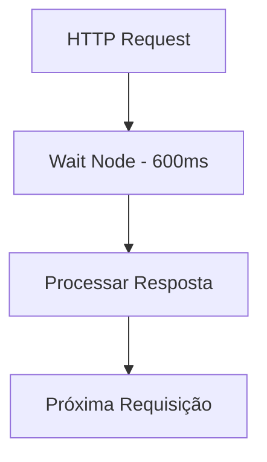
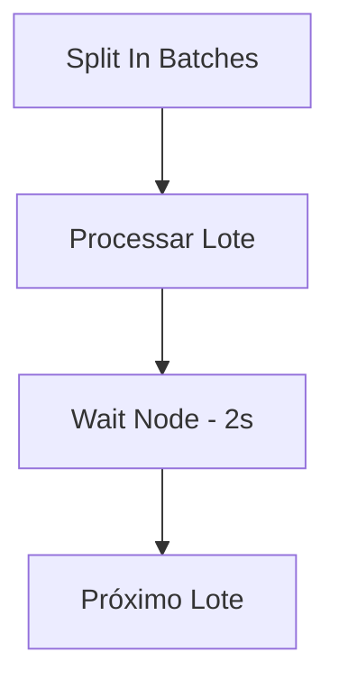
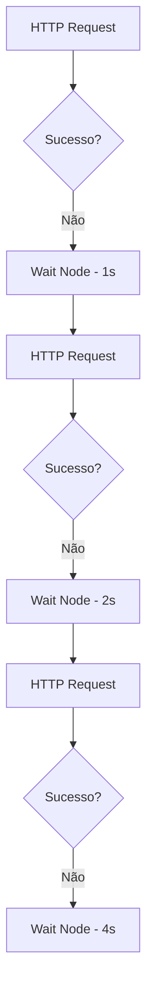
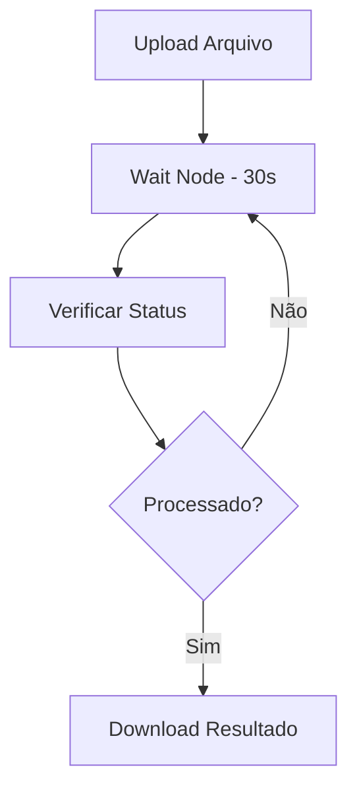

---
title: Wait Node
sidebar_position: 4
description: Como usar o Wait Node para adicionar pausas e delays em workflows
keywords: [n8n, wait node, delay, pausa, tempo, automação, workflow]
---

#ionicicon-nametime-outline-style-fontsize-24px color: '#cor-ea4b71-wait-node

O **Wait Node** é um nó fundamental para controlar o timing e a sequência de execução em workflows. Ele permite adicionar pausas programadas, delays condicionais e sincronização entre diferentes etapas da automação.

#ionicicon-nameinformation-circle-outline-style-fontsize-24px color: '#cor-ea4b71-conceito-o Wait Node funciona como um **controlador de tempo** que pausa a execução do workflow por um período específico. Isso é essencial para:

- **Rate Limiting**: Respeitar limites de API
- **Sincronização**: Aguardar processos externos
- **Retry Logic**: Implementar tentativas com delays
- **Batch Processing**: Processar dados em lotes com pausas
- **User Experience**: Criar delays naturais em automações

#ionicicon-namesettings-outline-style-fontsize-24px color: '#cor-ea4b71-configurao

#tipos-de-wait

#id-1-wait-for-time-aguarda até um horário específico antes de continuar.

**Configuração:**
```json
{
  "waitFor": "time",
  "time": "2024-01-15T10:30:00.000Z"
}
```

**Exemplo prático:**
```javascript
// Aguardar até 9h da manhã
{
  "waitFor": "time",
  "time": "{{ $now.setHours(9, 0, 0, 0) }}"
}
```

#id-2-wait-for-duration-aguarda por um período específico de tempo.

**Configuração:**
```json
{
  "waitFor": "duration",
  "duration": 5000  // 5 segundos
}
```

**Opções de duração:**
- **Milliseconds**: Tempo em milissegundos
- **Seconds**: Tempo em segundos
- **Minutes**: Tempo em minutos
- **Hours**: Tempo em horas

#id-3-wait-for-webhook-aguarda até receber uma requisição webhook.

**Configuração:**
```json
{
  "waitFor": "webhook",
  "webhookId": "wait_webhook_123"
}
```

#id-4-wait-for-workflow-aguarda até que outro workflow seja executado.

**Configuração:**
```json
{
  "waitFor": "workflow",
  "workflowId": "workflow_123"
}
```

#ionicicon-namecode-outline-style-fontsize-24px color: '#cor-ea4b71-exemplos-prticos

#exemplo-1-rate-limiting-para API

**Cenário**: Integração com API que tem limite de 100 requisições por minuto.



**Configuração:**
```javascript
// Wait Node - Rate Limiting
{
  "waitFor": "duration",
  "duration": 600  // 600ms entre requisições
}
```

#exemplo-2-processamento-em-lotes

**Cenário**: Processar lista de emails em lotes de 10 com pausa de 2 segundos.



**Configuração:**
```javascript
// Wait Node - Entre lotes
{
  "waitFor": "duration",
  "duration": 2000  // 2 segundos
}
```

#exemplo-3-retry-com-backoff Exponencial

**Cenário**: Tentar novamente uma operação com delays crescentes.



**Configuração dinâmica:**
```javascript
// Wait Node com backoff exponencial
{
  "waitFor": "duration",
  "duration": "{{ Math.pow(2, $runIndex) * 1000 }}"
}
```

#exemplo-4-sincronizao-com-processo Externo

**Cenário**: Aguardar processamento de arquivo em sistema externo.



**Configuração:**
```javascript
// Wait Node - Aguardar processamento
{
  "waitFor": "duration",
  "duration": 30000  // 30 segundos
}
```

#ionicicon-nameconstruct-outline-style-fontsize-24px color: '#cor-ea4b71-casos-de Uso Avançados

#id-1-sistema-de-notificaes-escalonadas

**Cenário**: Sistema que envia notificações com delays crescentes.

```javascript
// Workflow de notificação escalonada
const delays = [0, 300000, 900000, 3600000]; // 0, 5min, 15min, 1h
const currentDelay = delays[$runIndex] || delays[delays.length - 1];

return {
  "waitFor": "duration",
  "duration": currentDelay
};
```

#id-2-integrao-com-sistemas-legados

**Cenário**: Aguardar sincronização com sistema que processa em lotes.

```javascript
// Aguardar até próximo horário de processamento
const now = new Date();
const nextBatch = new Date(now);
nextBatch.setHours(Math.ceil(now.getHours() / 2) * 2, 0, 0, 0);

if (nextBatch <= now) {
  nextBatch.setHours(nextBatch.getHours() + 2);
}

return {
  "waitFor": "time",
  "time": nextBatch.toISOString()
};
```

#id-3-polling-inteligente-cenrio-verificar status de job com polling adaptativo.

```javascript
// Polling com delay adaptativo baseado no status
const status = $json.status;
let delay;

switch(status) {
  case 'pending':
    delay = 5000; // 5s
    break;
  case 'processing':
    delay = 10000; // 10s
    break;
  case 'almost_done':
    delay = 2000; // 2s
    break;
  default:
    delay = 30000; // 30s
}

return {
  "waitFor": "duration",
  "duration": delay
};
```

#ionicicon-nameflash-outline-style-fontsize-24px color: '#cor-ea4b71-expresses-e Data Mapping

#delays-dinmicos-javascript-delay baseado no tamanho dos dados
{
  "waitFor": "duration",
  "duration": "{{ $json.items.length * 100 }}"
}

// Delay baseado na hora do dia
{
  "waitFor": "duration",
  "duration": "{{ $now.getHours() < 9 || $now.getHours() > 18 ? 300000 : 5000 }}"
}

// Delay baseado em configuração externa
{
  "waitFor": "duration",
  "duration": "{{ $('Config Node').json.delay_ms }}"
}
```

#horrios-dinmicos-javascript-aguardar até próxima hora cheia
{
  "waitFor": "time",
  "time": "{{ $now.setMinutes(0, 0, 0).addHours(1) }}"
}

// Aguardar até próximo dia útil
{
  "waitFor": "time",
  "time": "{{ $now.getDay() === 0 ? $now.addDays(1) : $now.addDays(1) }}"
}
```

#ionicicon-namewarning-outline-style-fontsize-24px color: '#cor-ea4b71-tratamento-de Erros

#timeout-e-cancelamento-javascript Wait Node com timeout
{
  "waitFor": "duration",
  "duration": 300000,  // 5 minutos
  "timeout": 600000    // 10 minutos máximo
}
```

#retry-com-wait-mermaid-graph TD
    A[Operação] --> B{Sucesso?}
    B -->|Não| C[Wait Node]
    C --> D[Retry]
    D --> B
    B -->|Sim| E[Continuar]
```

#ionicicon-namespeedometer-outline-style-fontsize-24px color: '#cor-ea4b71-performance-e Otimização

#boas-prticas-1-use-delays Apropriados**
   - Respeite rate limits das APIs
   - Considere o impacto no tempo total do workflow
   - Use delays dinâmicos quando possível

2. **Evite Delays Desnecessários**
   - Não use Wait Node apenas para "dar tempo"
   - Considere alternativas como webhooks
   - Use polling inteligente

3. **Monitore Performance**
   - Acompanhe o tempo total de execução
   - Identifique gargalos causados por delays
   - Otimize baseado em métricas reais

#exemplo-de-monitoramento-javascript Wait Node com logging
const startTime = $now;
const delay = 5000;

// Log do delay
console.log(`Aguardando ${delay}ms`);

return {
  "waitFor": "duration",
  "duration": delay,
  "metadata": {
    "startTime": startTime,
    "delay": delay,
    "reason": "rate_limiting"
  }
};
```

#ionicicon-namehelp-circle-outline-style-fontsize-24px color: '#cor-ea4b71-troubleshooting

#problemas-comuns-wait-node-no funciona**
- Verifique se o tipo de wait está correto
- Confirme se a duração está em milissegundos
- Verifique se o horário está no formato correto

**Workflow muito lento**
- Revise se os delays são necessários
- Considere usar webhooks em vez de polling
- Otimize a lógica de delays dinâmicos

**Timeout de execução**
- Aumente o timeout do workflow
- Reduza delays muito longos
- Use webhooks para operações longas

#cor-debugging-javascript-wait-node com debugging
const debug = {
  "waitType": "duration",
  "duration": 5000,
  "timestamp": $now,
  "workflow": $workflow.name,
  "node": $node.name
};

console.log('Wait Node Debug:', JSON.stringify(debug, null, 2));

return {
  "waitFor": "duration",
  "duration": 5000
};
```

#ionicicon-namelink-outline-style-fontsize-24px color: '#cor-ea4b71-integrao-com Outros Nós

#fluxo-tpico-mermaid-graph-td
    A[HTTP Request] --> B[Wait Node]
    B --> C[Code Node]
    C --> D[Email]
```

#exemplo-completo-javascript-1 HTTP Request - Buscar dados
{
  "url": "https://api.exemplo.com/dados",
  "method": "GET"
}

// 2. Wait Node - Rate limiting
{
  "waitFor": "duration",
  "duration": 1000
}

// 3. Code Node - Processar dados
const dados = $json;
const processados = dados.map(item => ({
  ...item,
  processado_em: $now
}));

return processados;

// 4. HTTP Request - Enviar dados processados
{
  "url": "https://api.exemplo.com/processados",
  "method": "POST",
  "body": $json
}
```

#ionicicon-namedocument-text-outline-style-fontsize-24px color: '#cor-ea4b71-referncias **[Error Handling](../../logica-e-dados/flow-logic/error-handling)** - Tratamento de erros em workflows
- **[Execution Order](../../logica-e-dados/flow-logic/execution-order)** - Ordem de execução de nós
- **[Webhook Trigger](../../integracoes/trigger-nodes/event-based/webhook-trigger)** - Triggers baseados em webhooks
- **[Rate Limiting](../../logica-e-dados/flow-logic/rate-limiting)** - Controle de taxa de requisições

---

> <IonicIcon name="bulb-outline" style={{ fontSize: '18px', color: '#cor-ea4b71-dica-use o Wait Node estrategicamente para criar workflows mais robustos e respeitosos com os sistemas externos. Lembre-se que delays muito longos podem impactar a experiência do usuário, então sempre considere alternativas como webhooks para operações que podem demorar.

---

:::warning **Nota de Atenção**
Esta documentação está em processo de validação. Os exemplos práticos e configurações de nós apresentados precisam ser testados e validados em ambientes reais. A intenção é sempre fornecer práticas e exemplos que funcionem corretamente em produção. Se encontrar inconsistências ou problemas, por favor, reporte para que possamos melhorar a qualidade da documentação.
:::

