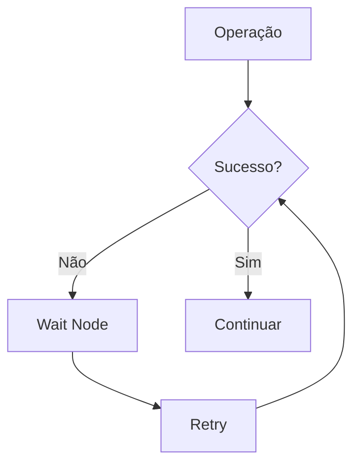
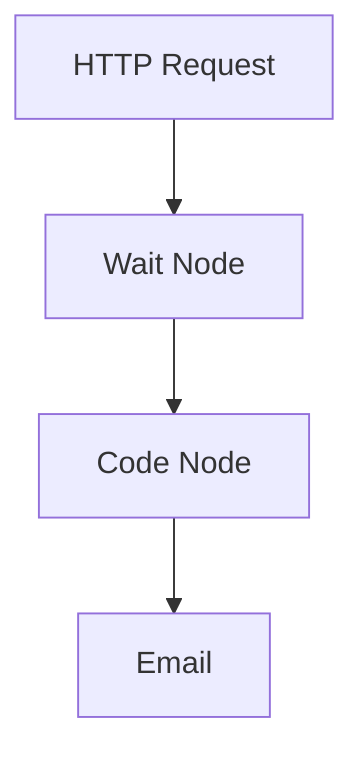

# <IonicIcon name="time-outline" style={{ fontSize: '24px', color: '#ea4b71' }} /> Wait Node

O **Wait Node** é um nó fundamental para controlar o timing e a sequência de execução em workflows. Ele permite adicionar pausas programadas, delays condicionais e sincronização entre diferentes etapas da automação.

## <IonicIcon name="information-circle-outline" style={{ fontSize: '24px', color: '#ea4b71' }} /> Conceito

O Wait Node funciona como um **controlador de tempo** que pausa a execução do workflow por um período específico. Isso é essencial para:

- **Rate Limiting**: Respeitar limites de API
- **Sincronização**: Aguardar processos externos
- **Retry Logic**: Implementar tentativas com delays
- **Batch Processing**: Processar dados em lotes com pausas
- **User Experience**: Criar delays naturais em automações

## <IonicIcon name="settings-outline" style={{ fontSize: '24px', color: '#ea4b71' }} /> Configuração

### Tipos de Wait

#### 1. Wait for Time

Aguarda até um horário específico antes de continuar.

**Configuração:**
```json
{
  "waitFor": "time",
  "time": "2024-01-15T10:30:00.000Z"
}
```

**Exemplo prático:**
```javascript
// Aguardar até 9h da manhã
{
  "waitFor": "time",
  "time": "{{ $now.setHours(9, 0, 0, 0) }}"
}
```

#### 2. Wait for Duration

Aguarda por um período específico de tempo.

**Configuração:**
```json
{
  "waitFor": "duration",
  "duration": 5000  // 5 segundos
}
```

**Opções de duração:**
- **Milliseconds**: Tempo em milissegundos
- **Seconds**: Tempo em segundos
- **Minutes**: Tempo em minutos
- **Hours**: Tempo em horas

#### 3. Wait for Webhook

Aguarda até receber uma requisição webhook.

**Configuração:**
```json
{
  "waitFor": "webhook",
  "webhookId": "wait_webhook_123"
}
```

#### 4. Wait for Workflow

Aguarda até que outro workflow seja executado.

**Configuração:**
```json
{
  "waitFor": "workflow",
  "workflowId": "workflow_123"
}
```

## <IonicIcon name="code-outline" style={{ fontSize: '24px', color: '#ea4b71' }} /> Exemplos Práticos

### Exemplo 1: Rate Limiting para API

**Cenário**: Integração com API que tem limite de 100 requisições por minuto.


**Configuração:**
```javascript
// Wait Node - Rate Limiting
{
  "waitFor": "duration",
  "duration": 600  // 600ms entre requisições
}
```

### Exemplo 2: Processamento em Lotes

**Cenário**: Processar lista de emails em lotes de 10 com pausa de 2 segundos.


**Configuração:**
```javascript
// Wait Node - Entre lotes
{
  "waitFor": "duration",
  "duration": 2000  // 2 segundos
}
```

### Exemplo 3: Retry com Backoff Exponencial

**Cenário**: Tentar novamente uma operação com delays crescentes.


**Configuração dinâmica:**
```javascript
// Wait Node com backoff exponencial
{
  "waitFor": "duration",
  "duration": "{{ Math.pow(2, $runIndex) * 1000 }}"
}
```

### Exemplo 4: Sincronização com Processo Externo

**Cenário**: Aguardar processamento de arquivo em sistema externo.


**Configuração:**
```javascript
// Wait Node - Aguardar processamento
{
  "waitFor": "duration",
  "duration": 30000  // 30 segundos
}
```

## <IonicIcon name="construct-outline" style={{ fontSize: '24px', color: '#ea4b71' }} /> Casos de Uso Avançados

### 1. Sistema de Notificações Escalonadas

**Cenário**: Sistema que envia notificações com delays crescentes.

```javascript
// Workflow de notificação escalonada
const delays = [0, 300000, 900000, 3600000]; // 0, 5min, 15min, 1h
const currentDelay = delays[$runIndex] || delays[delays.length - 1];

return {
  "waitFor": "duration",
  "duration": currentDelay
};
```

### 2. Integração com Sistemas Legados

**Cenário**: Aguardar sincronização com sistema que processa em lotes.

```javascript
// Aguardar até próximo horário de processamento
const now = new Date();
const nextBatch = new Date(now);
nextBatch.setHours(Math.ceil(now.getHours() / 2) * 2, 0, 0, 0);

if (nextBatch <= now) {
  nextBatch.setHours(nextBatch.getHours() + 2);
}

return {
  "waitFor": "time",
  "time": nextBatch.toISOString()
};
```

### 3. Polling Inteligente

**Cenário**: Verificar status de job com polling adaptativo.

```javascript
// Polling com delay adaptativo baseado no status
const status = $json.status;
let delay;

switch(status) {
  case 'pending':
    delay = 5000; // 5s
    break;
  case 'processing':
    delay = 10000; // 10s
    break;
  case 'almost_done':
    delay = 2000; // 2s
    break;
  default:
    delay = 30000; // 30s
}

return {
  "waitFor": "duration",
  "duration": delay
};
```

## <IonicIcon name="flash-outline" style={{ fontSize: '24px', color: '#ea4b71' }} /> Expressões e Data Mapping

### Delays Dinâmicos

```javascript
// Delay baseado no tamanho dos dados
{
  "waitFor": "duration",
  "duration": "{{ $json.items.length * 100 }}"
}

// Delay baseado na hora do dia
{
  "waitFor": "duration",
  "duration": "{{ $now.getHours() < 9 || $now.getHours() > 18 ? 300000 : 5000 }}"
}

// Delay baseado em configuração externa
{
  "waitFor": "duration",
  "duration": "{{ $('Config Node').json.delay_ms }}"
}
```

### Horários Dinâmicos

```javascript
// Aguardar até próxima hora cheia
{
  "waitFor": "time",
  "time": "{{ $now.setMinutes(0, 0, 0).addHours(1) }}"
}

// Aguardar até próximo dia útil
{
  "waitFor": "time",
  "time": "{{ $now.getDay() === 0 ? $now.addDays(1) : $now.addDays(1) }}"
}
```

## <IonicIcon name="warning-outline" style={{ fontSize: '24px', color: '#ea4b71' }} /> Tratamento de Erros

### Timeout e Cancelamento

```javascript
// Wait Node com timeout
{
  "waitFor": "duration",
  "duration": 300000,  // 5 minutos
  "timeout": 600000    // 10 minutos máximo
}
```

### Retry com Wait



## <IonicIcon name="speedometer-outline" style={{ fontSize: '24px', color: '#ea4b71' }} /> Performance e Otimização

### Boas Práticas

1. **Use Delays Apropriados**
   - Respeite rate limits das APIs
   - Considere o impacto no tempo total do workflow
   - Use delays dinâmicos quando possível

2. **Evite Delays Desnecessários**
   - Não use Wait Node apenas para "dar tempo"
   - Considere alternativas como webhooks
   - Use polling inteligente

3. **Monitore Performance**
   - Acompanhe o tempo total de execução
   - Identifique gargalos causados por delays
   - Otimize baseado em métricas reais

### Exemplo de Monitoramento

```javascript
// Wait Node com logging
const startTime = $now;
const delay = 5000;

// Log do delay
console.log(`Aguardando ${delay}ms`);

return {
  "waitFor": "duration",
  "duration": delay,
  "metadata": {
    "startTime": startTime,
    "delay": delay,
    "reason": "rate_limiting"
  }
};
```

## <IonicIcon name="help-circle-outline" style={{ fontSize: '24px', color: '#ea4b71' }} /> Troubleshooting

### Problemas Comuns

**Wait Node não funciona**
- Verifique se o tipo de wait está correto
- Confirme se a duração está em milissegundos
- Verifique se o horário está no formato correto

**Workflow muito lento**
- Revise se os delays são necessários
- Considere usar webhooks em vez de polling
- Otimize a lógica de delays dinâmicos

**Timeout de execução**
- Aumente o timeout do workflow
- Reduza delays muito longos
- Use webhooks para operações longas

### Debugging

```javascript
// Wait Node com debugging
const debug = {
  "waitType": "duration",
  "duration": 5000,
  "timestamp": $now,
  "workflow": $workflow.name,
  "node": $node.name
};

console.log('Wait Node Debug:', JSON.stringify(debug, null, 2));

return {
  "waitFor": "duration",
  "duration": 5000
};
```

## <IonicIcon name="link-outline" style={{ fontSize: '24px', color: '#ea4b71' }} /> Integração com Outros Nós

### Fluxo Típico



### Exemplo Completo

```javascript
// 1. HTTP Request - Buscar dados
{
  "url": "https://api.exemplo.com/dados",
  "method": "GET"
}

// 2. Wait Node - Rate limiting
{
  "waitFor": "duration",
  "duration": 1000
}

// 3. Code Node - Processar dados
const dados = $json;
const processados = dados.map(item => ({
  ...item,
  processado_em: $now
}));

return processados;

// 4. HTTP Request - Enviar dados processados
{
  "url": "https://api.exemplo.com/processados",
  "method": "POST",
  "body": $json
}
```

## <IonicIcon name="document-text-outline" style={{ fontSize: '24px', color: '#ea4b71' }} /> Referências

- **[Error Handling](../../logica-e-dados/flow-logic/error-handling)** - Tratamento de erros em workflows
- **[Execution Order](../../logica-e-dados/flow-logic/execution-order)** - Ordem de execução de nós
- **[Webhook Trigger](../../integracoes/trigger-nodes/event-based/webhook-trigger)** - Triggers baseados em webhooks
- **[Rate Limiting](../../logica-e-dados/flow-logic/rate-limiting)** - Controle de taxa de requisições

---

> <IonicIcon name="bulb-outline" style={{ fontSize: '18px', color: '#ea4b71' }} /> **Dica**: Use o Wait Node estrategicamente para criar workflows mais robustos e respeitosos com os sistemas externos. Lembre-se que delays muito longos podem impactar a experiência do usuário, então sempre considere alternativas como webhooks para operações que podem demorar.

---

:::warning **Nota de Atenção**
Esta documentação está em processo de validação. Os exemplos práticos e configurações de nós apresentados precisam ser testados e validados em ambientes reais. A intenção é sempre fornecer práticas e exemplos que funcionem corretamente em produção. Se encontrar inconsistências ou problemas, por favor, reporte para que possamos melhorar a qualidade da documentação.
:::

