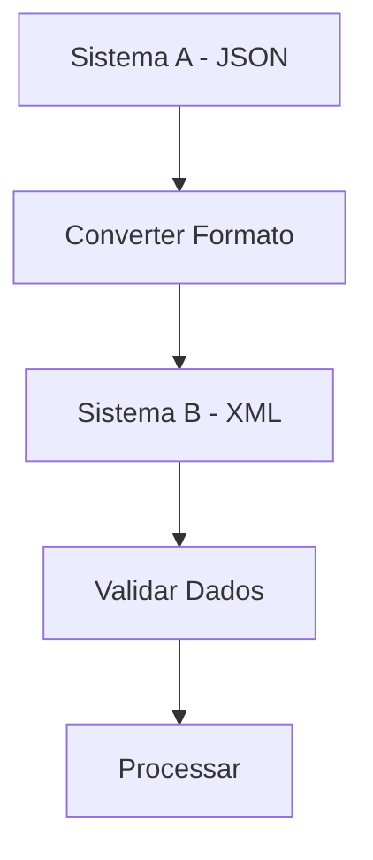
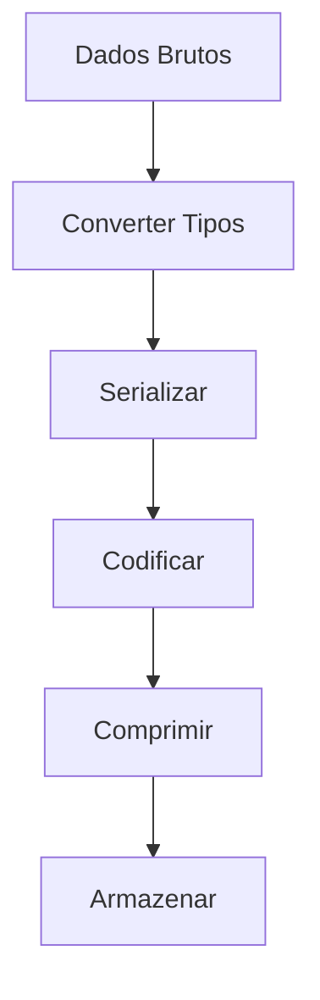
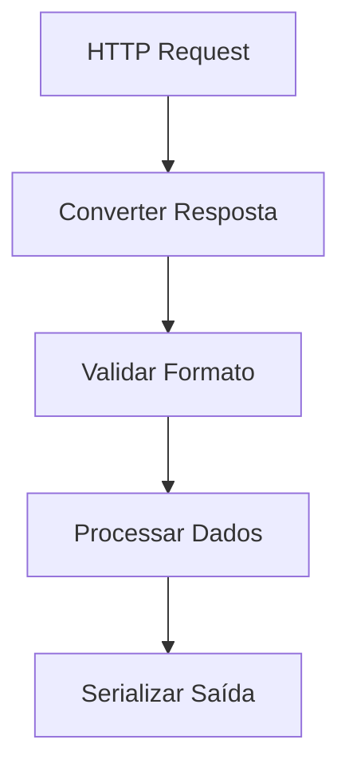

<IonicIcon name="swap-horizontal-outline" style={{fontSize: '24px', color: '#ea4b71'}} />

Os **utilitários de conversão** fornecem funcionalidades essenciais para transformação, serialização e conversão de formatos de dados no n8n. Esses nodes são fundamentais para workflows que lidam com integração entre sistemas, normalização de dados, codificação e conversão de tipos.

## Quando usar Conversion Utilities

### Casos de Uso Principais

- **Integração entre sistemas** com formatos diferentes
- **Normalização de dados** para padronização
- **Codificação/decodificação** de dados
- **Conversão de tipos** de dados
- **Serialização** para APIs e bancos de dados
- **Compressão** de dados para otimização

### Cenários Aplicáveis

- Integração com APIs REST e SOAP
- Conversão entre formatos de arquivo
- Normalização de dados de entrada
- Codificação de dados sensíveis
- Conversão de unidades de medida
- Serialização para armazenamento

## Tipos de Operações

### Conversão de Tipos

```javascript
// Exemplo: Conversão de tipos básicos
{
  "dados_originais": {
    "numero_string": "123",
    "booleano_string": "true",
    "data_string": "2024-01-15"
  },
  "dados_convertidos": {
    "numero": 123,
    "booleano": true,
    "data": "2024-01-15T00:00:00.000Z"
  }
}
```

### Serialização JSON/XML

```javascript
// Exemplo: Serialização de dados
{
  "objeto_original": {
    "nome": "João Silva",
    "idade": 30,
    "email": "joao@exemplo.com"
  },
  "json_string": "{\"nome\":\"João Silva\",\"idade\":30,\"email\":\"joao@exemplo.com\"}",
  "xml_string": "<pessoa><nome>João Silva</nome><idade>30</idade><email>joao@exemplo.com</email></pessoa>"
}
```

### Codificação/Decodificação

```javascript
// Exemplo: Codificação de dados
{
  "texto_original": "Dados sensíveis",
  "base64": "RGFkb3Mgc2Vuc8OtdmVpcyA=",
  "url_encoded": "Dados%20sens%C3%ADveis",
  "hex": "4461646f732073656e73c3ad76656973"
}
```

## Configuração Básica

### Estrutura de Configuração

```javascript
{
  "operation": "convert", // convert, serialize, encode, compress
  "input": {
    "data": "{{$json.dados_originais}}",
    "from_type": "string",
    "to_type": "number"
  },
  "options": {
    "encoding": "utf8",
    "format": "json",
    "compression": "gzip"
  }
}
```

### Parâmetros Principais

**Operações Disponíveis:**
- `convert` - Conversão de tipos
- `serialize` - Serialização de dados
- `encode` - Codificação/decodificação
- `compress` - Compressão de dados
- `format` - Formatação de saída

**Formatos Suportados:**
- `JSON` - JavaScript Object Notation
- `XML` - Extensible Markup Language
- `CSV` - Comma Separated Values
- `YAML` - YAML Ain't Markup Language
- `Base64` - Codificação base64

## Exemplos Práticos

### Exemplo 1: Conversão de Dados de API

```javascript
// Conversão de dados de API externa
{
  "dados_api": {
    "user_id": "12345",
    "status": "active",
    "created_at": "2024-01-15T10:30:00Z"
  },
  "dados_convertidos": {
    "id": 12345,
    "ativo": true,
    "data_criacao": "2024-01-15T10:30:00Z"
  }
}
```

### Exemplo 2: Serialização para Armazenamento

```javascript
// Serialização para banco de dados
{
  "configuracao_original": {
    "timeout": 30000,
    "retry_attempts": 3,
    "headers": {
      "Authorization": "Bearer SEU_TOKEN_AQUI"
    }
  },
  "configuracao_serializada": "{\"timeout\":30000,\"retry_attempts\":3,\"headers\":{\"Authorization\":\"Bearer SEU_TOKEN_AQUI\"}}"
}
```

### Exemplo 3: Codificação de Dados Sensíveis

```javascript
// Codificação de dados para transmissão
{
  "credenciais_originais": {
    "username": "usuario",
    "password": "SUA_SENHA_SEGURA_AQUI"
  },
  "credenciais_codificadas": {
    "auth_header": "Basic dXN1YXJpbzpzZW5oYTEyMw==",
    "json_encoded": "{\"username\":\"dXN1YXJpbw==\",\"password\":\"c2VuaGExMjM=\"}"
  }
}
```

## Casos de Uso Avançados

### Integração de Sistemas



### Pipeline de Dados



## Expressões e Data Mapping

### Expressões Comuns

```javascript
// Conversão de tipo
"{{Number($json.string_number)}}"
"{{Boolean($json.string_boolean)}}"
"{{String($json.number_value)}}"

// Serialização
"{{JSON.stringify($json.object)}}"
"{{JSON.parse($json.json_string)}}"

// Codificação
"{{btoa($json.text)}}"
"{{atob($json.base64)}}"
```

### Mapeamento de Dados

```javascript
// Exemplo: Mapeamento com conversão
{
  "dados_entrada": "{{$json.dados_originais}}",
  "dados_convertidos": "{{JSON.stringify($json.dados_entrada)}}",
  "dados_codificados": "{{btoa($json.dados_convertidos)}}",
  "tamanho_bytes": "{{$json.dados_codificados.length}}"
}
```

## Tratamento de Erros

### Validação de Conversão

```javascript
// Função de conversão segura
function converterSeguro(valor, tipoDestino) {
  try {
    switch (tipoDestino) {
      case 'number':
        return Number(valor);
      case 'boolean':
        return Boolean(valor);
      case 'string':
        return String(valor);
      case 'object':
        return JSON.parse(valor);
      default:
        throw new Error(`Tipo não suportado: ${tipoDestino}`);
    }
  } catch (erro) {
    console.error('Erro na conversão:', erro);
    return null;
  }
}
```

### Tratamento de Serialização

```javascript
// Função de serialização segura
function serializarSeguro(objeto, formato) {
  try {
    switch (formato) {
      case 'json':
        return JSON.stringify(objeto);
      case 'xml':
        return converterParaXML(objeto);
      case 'csv':
        return converterParaCSV(objeto);
      default:
        throw new Error(`Formato não suportado: ${formato}`);
    }
  } catch (erro) {
    console.error('Erro na serialização:', erro);
    return null;
  }
}
```

## Performance e Otimização

### Boas Práticas

1. **Cache de conversões** para dados repetitivos
2. **Validação prévia** de tipos de dados
3. **Uso de streams** para dados grandes
4. **Compressão seletiva** baseada no tamanho
5. **Tratamento de encoding** adequado

### Otimizações Específicas

```javascript
// Cache de conversões
const conversionCache = new Map();

function getCachedConversion(input, operation) {
  const key = `${input}_${operation}`;
  if (!conversionCache.has(key)) {
    conversionCache.set(key, performConversion(input, operation));
  }
  return conversionCache.get(key);
}
```

## Troubleshooting

### Problemas Comuns

**Conversão falha**
- Verifique tipo de dados de entrada
- Confirme formato esperado
- Valide dados antes da conversão
- Teste com dados conhecidos

**Serialização incorreta**
- Verifique estrutura de dados
- Confirme formato de saída
- Valide caracteres especiais
- Teste com objetos simples

**Codificação inválida**
- Verifique encoding de entrada
- Confirme formato de codificação
- Valide caracteres especiais
- Teste com dados ASCII

### Dicas de Debug

```javascript
// Função de debug para conversões
function debugConversao(dados, operacao) {
  console.log(`Debug ${operacao}:`, {
    entrada: dados,
    tipo_entrada: typeof dados,
    saida: performConversion(dados, operacao),
    tipo_saida: typeof performConversion(dados, operacao)
  });
}
```

## Integração com Outros Nós

### Com HTTP Request



### Com Code Node

```javascript
// Conversão no Code Node
const dadosEntrada = $input.first().json.dados;
const dadosConvertidos = {
  id: Number(dadosEntrada.id),
  ativo: Boolean(dadosEntrada.status === 'active'),
  configuracao: JSON.parse(dadosEntrada.config)
};

return [{json: dadosConvertidos}];
```

### Com If Node

```javascript
// Condição baseada em tipo
{
  "condition": "{{typeof $json.valor === 'number'}}",
  "true": "Valor Numérico",
  "false": "Converter para Número"
}
```

## Próximos Passos

- [Date/Time Utilities](/integracoes/builtin-nodes/utilities/date-time) - Manipulação de datas
- [Text Utilities](/integracoes/builtin-nodes/utilities/text) - Processamento de texto
- [Validation Utilities](/integracoes/builtin-nodes/utilities/validation) - Validações
- [Math Utilities](/integracoes/builtin-nodes/utilities/math) - Transformações matemáticas
- [Core Nodes](/integracoes/builtin-nodes/core-nodes) - Funcionalidades básicas
- [Expressões n8n](/logica-e-dados/expressoes) - Usar expressões com conversões 