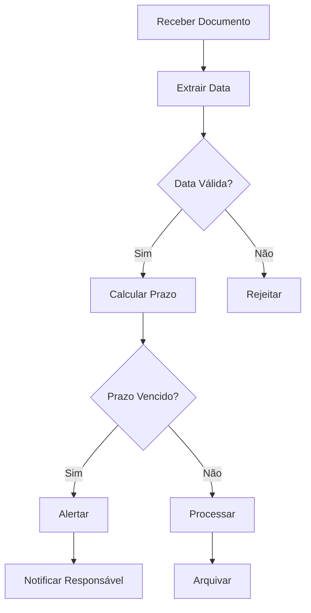
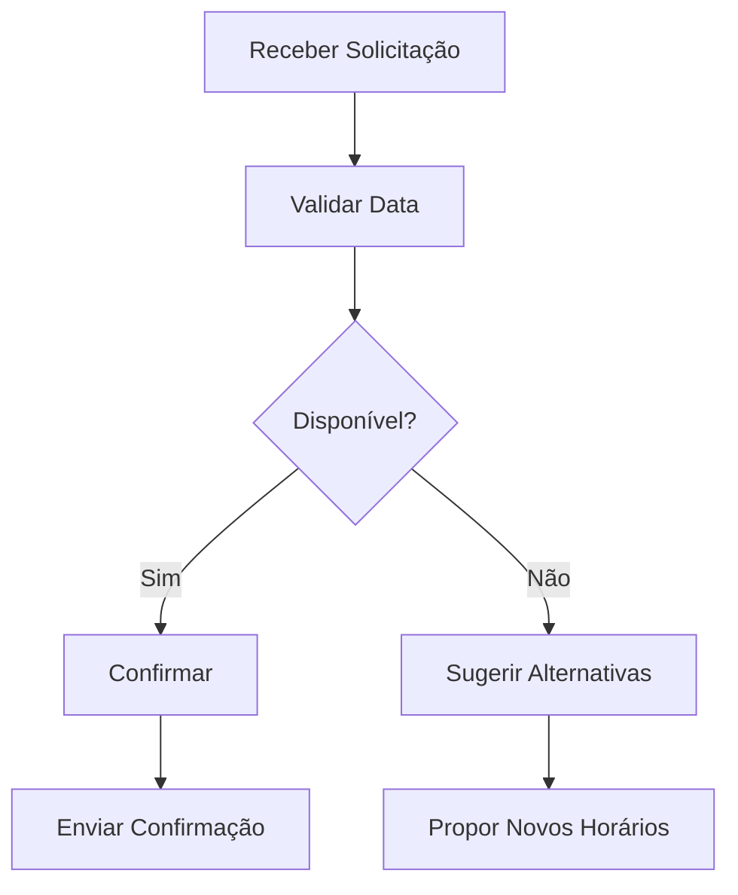
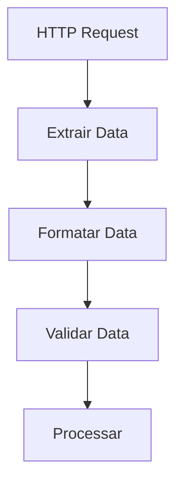

<IonicIcon name="calendar-outline" style={{fontSize: '24px', color: '#ea4b71'}} />

Os **utilitários de data e hora** fornecem funcionalidades essenciais para manipulação de datas, horários, timezones e cálculos temporais no n8n. Esses nodes são fundamentais para workflows que lidam com agendamentos, relatórios temporais, validações de prazos e formatação de dados temporais.

## Quando usar Date/Time Utilities

### Casos de Uso Principais

- **Formatação de relatórios** com datas padronizadas
- **Cálculo de prazos** e diferenças entre datas
- **Validação de datas** de entrada
- **Conversão de timezones** para integrações globais
- **Agendamento inteligente** baseado em períodos
- **Análise temporal** de dados e métricas

### Cenários Aplicáveis

- Sistemas de CRM com prazos de vencimento
- Relatórios financeiros com períodos específicos
- Integrações com sistemas de agendamento
- Workflows de compliance com datas de auditoria
- Automações de marketing com timing de campanhas

## Tipos de Operações

### Formatação de Datas

```javascript
// Exemplo: Formatação básica
{
  "data_entrada": "2024-01-15T10:30:00Z",
  "formato_saida": "15/01/2024",
  "formato_completo": "15 de Janeiro de 2024 às 10:30",
  "formato_iso": "2024-01-15T10:30:00.000Z"
}
```

### Cálculos de Diferença

```javascript
// Exemplo: Cálculo de prazo
{
  "data_inicio": "2024-01-01T00:00:00Z",
  "data_fim": "2024-01-15T00:00:00Z",
  "diferenca_dias": 14,
  "diferenca_horas": 336,
  "diferenca_minutos": 20160
}
```

### Conversão de Timezone

```javascript
// Exemplo: Conversão de timezone
{
  "data_utc": "2024-01-15T10:30:00Z",
  "timezone_origem": "UTC",
  "timezone_destino": "America/Sao_Paulo",
  "data_convertida": "2024-01-15T08:30:00-03:00"
}
```

## Configuração Básica

### Estrutura de Configuração

```javascript
{
  "operation": "format", // format, calculate, convert, validate
  "input": {
    "date": "{{$json.data_entrada}}",
    "format": "DD/MM/YYYY",
    "timezone": "America/Sao_Paulo"
  },
  "options": {
    "locale": "pt-BR",
    "strict": true,
    "fallback": "now"
  }
}
```

### Parâmetros Principais

**Operações Disponíveis:**
- `format` - Formatação de datas
- `calculate` - Cálculos temporais
- `convert` - Conversão de timezone
- `validate` - Validação de datas
- `extract` - Extração de componentes

**Formatos Suportados:**
- `DD/MM/YYYY` - Data brasileira
- `YYYY-MM-DD` - Data ISO
- `DD/MM/YYYY HH:mm` - Data e hora
- `MMMM DD, YYYY` - Data por extenso
- `timestamp` - Timestamp Unix

## Exemplos Práticos

### Exemplo 1: Formatação de Relatório

```javascript
// Formatação para relatório financeiro
{
  "data_processamento": "2024-01-15T10:30:00Z",
  "periodo_inicio": "2024-01-01T00:00:00Z",
  "periodo_fim": "2024-01-31T23:59:59Z",
  "formatações": {
    "data_relatorio": "15/01/2024",
    "periodo_formatado": "01/01/2024 a 31/01/2024",
    "mes_ano": "Janeiro/2024",
    "timestamp": 1705312200000
  }
}
```

### Exemplo 2: Cálculo de Prazos

```javascript
// Cálculo de prazo de vencimento
{
  "data_emissao": "2024-01-15T10:30:00Z",
  "prazo_dias": 30,
  "data_vencimento": "2024-02-14T10:30:00Z",
  "dias_restantes": 15,
  "status": "dentro_prazo"
}
```

### Exemplo 3: Validação de Datas

```javascript
// Validação de data de nascimento
{
  "data_nascimento": "1990-05-15",
  "idade": 33,
  "validação": {
    "formato_valido": true,
    "data_futura": false,
    "idade_minima": true,
    "idade_maxima": true
  }
}
```

## Casos de Uso Avançados

### Workflow de Compliance



### Sistema de Agendamento



## Expressões e Data Mapping

### Expressões Comuns

```javascript
// Data atual
"{{$now}}"

// Data formatada
"{{$now.format('DD/MM/YYYY')}}"

// Adicionar dias
"{{$now.plus({days: 7})}}"

// Subtrair meses
"{{$now.minus({months: 1})}}"

// Comparar datas
"{{$json.data_vencimento.isAfter($now)}}"
```

### Mapeamento de Dados

```javascript
// Exemplo: Mapeamento de datas
{
  "data_entrada": "{{$json.data_original}}",
  "data_processada": "{{$json.data_entrada.format('DD/MM/YYYY')}}",
  "timestamp": "{{$json.data_entrada.toMillis()}}",
  "dias_desde_inicio": "{{$json.data_entrada.diff($now, 'days')}}"
}
```

## Tratamento de Erros

### Validação de Entrada

```javascript
// Função de validação de data
function validarData(data) {
  try {
    const dataObj = new Date(data);
    return {
      valida: !isNaN(dataObj.getTime()),
      data: dataObj,
      erro: null
    };
  } catch (erro) {
    return {
      valida: false,
      data: null,
      erro: erro.message
    };
  }
}
```

### Tratamento de Timezone

```javascript
// Função de conversão segura
function converterTimezone(data, timezone) {
  try {
    return data.setZone(timezone);
  } catch (erro) {
    console.error('Erro na conversão de timezone:', erro);
    return data; // Retorna data original em caso de erro
  }
}
```

## Performance e Otimização

### Boas Práticas

1. **Cache de timezones** para operações repetitivas
2. **Validação prévia** de formatos de data
3. **Uso de timestamps** para cálculos complexos
4. **Limitação de precisão** quando apropriado
5. **Tratamento de edge cases** (anos bissextos, etc.)

### Otimizações Específicas

```javascript
// Cache de timezones
const timezoneCache = new Map();

function getTimezone(timezone) {
  if (!timezoneCache.has(timezone)) {
    timezoneCache.set(timezone, DateTime.fromISO('2024-01-01', {zone: timezone}));
  }
  return timezoneCache.get(timezone);
}
```

## Troubleshooting

### Problemas Comuns

**Data inválida**
- Verifique formato de entrada
- Confirme timezone
- Valide se a data existe
- Teste com dados conhecidos

**Conversão incorreta**
- Verifique timezone de origem
- Confirme timezone de destino
- Valide formato de saída
- Teste com horário de verão

**Cálculos errados**
- Confirme unidades de medida
- Verifique precisão necessária
- Valide datas de referência
- Teste casos extremos

### Dicas de Debug

```javascript
// Função de debug para datas
function debugData(data, contexto) {
  console.log(`Debug ${contexto}:`, {
    original: data,
    timestamp: data.toMillis(),
    iso: data.toISO(),
    formatado: data.toFormat('dd/MM/yyyy HH:mm'),
    timezone: data.zoneName
  });
}
```

## Integração com Outros Nós

### Com HTTP Request



### Com Code Node

```javascript
// Processamento de datas no Code Node
const dataEntrada = $input.first().json.data;
const dataProcessada = DateTime.fromISO(dataEntrada)
  .setZone('America/Sao_Paulo')
  .toFormat('dd/MM/yyyy HH:mm');

return [{json: {data_formatada: dataProcessada}}];
```

### Com If Node

```javascript
// Condição baseada em data
{
  "condition": "{{$json.data_vencimento.isBefore($now)}}",
  "true": "Prazo Vencido",
  "false": "Dentro do Prazo"
}
```

## Próximos Passos

- [Text Utilities](/integracoes/builtin-nodes/utilities/text) - Processamento de texto
- [Validation Utilities](/integracoes/builtin-nodes/utilities/validation) - Validações
- [Core Nodes](/integracoes/builtin-nodes/core-nodes) - Funcionalidades básicas
- [Expressões n8n](/logica-e-dados/expressoes) - Usar expressões com datas
- [Data Mapping](../../../logica-e-dados/data/data-mapping-avancado.mdx) - Mapeamento de dados temporais 