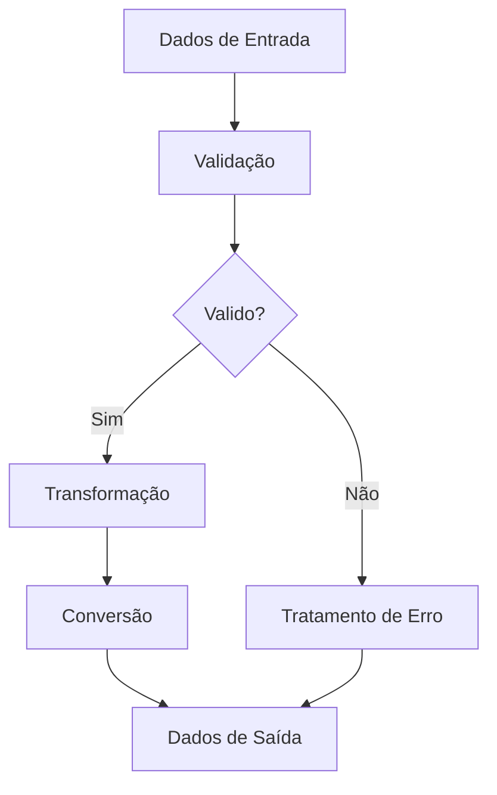

---
sidebar_position: 1
title: Nodes Utilitários
description: Nodes nativos para funções auxiliares e processamento de dados
keywords: [n8n, utilitários, helpers, processamento, dados]
---

<IonicIcon name="construct-outline" style={{fontSize: '24px', color: '#ea4b71'}} />

Os **nodes utilitários** são ferramentas essenciais do n8n para funções auxiliares, incluindo manipulação de datas, processamento de texto, conversões de formato, validações, transformações matemáticas e outras operações que complementam workflows principais.

## Categorias de Utilitários

### Manipulação de Datas

<IonicIcon name="calendar-outline" style={{fontSize: '24px', color: '#ea4b71'}} />

**Principais funcionalidades:**

- Formatação de datas
- Cálculos de diferença
- Conversão de timezone
- Validação de datas
- Operações com períodos

**Casos de uso:**

- Formatação de relatórios
- Cálculo de prazos
- Validação de datas de entrada
- Conversão de formatos
- Análise temporal

[Ver documentação completa →](/integracoes/builtin-nodes/utilities/date-time)

### Processamento de Texto

<IonicIcon name="text-outline" style={{fontSize: '24px', color: '#ea4b71'}} />

**Principais funcionalidades:**

- Manipulação de strings
- Busca e substituição
- Validação de formato
- Conversão de case
- Extração de padrões

**Casos de uso:**

- Limpeza de dados
- Validação de emails
- Formatação de nomes
- Extração de informações
- Normalização de texto

[Ver documentação completa →](/integracoes/builtin-nodes/utilities/text)

### Conversões de Formato

<IonicIcon name="swap-horizontal-outline" style={{fontSize: '24px', color: '#ea4b71'}} />

**Principais funcionalidades:**

- Conversão de tipos
- Serialização JSON/XML
- Codificação/decodificação
- Compressão de dados
- Conversão de unidades

**Casos de uso:**

- Integração entre sistemas
- Normalização de dados
- Conversão de unidades
- Codificação de dados
- Serialização para APIs

[Ver documentação completa →](/integracoes/builtin-nodes/utilities/conversion)

### Validações

<IonicIcon name="checkmark-circle-outline" style={{fontSize: '24px', color: '#ea4b71'}} />

**Principais funcionalidades:**

- Validação de dados
- Verificação de formato
- Validação de CPF/CNPJ
- Validação de email
- Verificação de campos obrigatórios

**Casos de uso:**

- Validação de formulários
- Verificação de dados de entrada
- Validação de documentos
- Controle de qualidade
- Prevenção de erros

[Ver documentação completa →](/integracoes/builtin-nodes/utilities/validation)

### Transformações Matemáticas

<IonicIcon name="calculator-outline" style={{fontSize: '24px', color: '#ea4b71'}} />

**Principais funcionalidades:**

- Operações matemáticas
- Cálculos estatísticos
- Funções trigonométricas
- Arredondamento
- Conversão de bases

**Casos de uso:**

- Cálculos financeiros
- Análise estatística
- Conversão de unidades
- Cálculos de desconto
- Processamento de valores

[Ver documentação completa →](/integracoes/builtin-nodes/utilities/math)

## Conceitos Fundamentais

### Tipos de Utilitários

**Transformadores:**
- Modificam dados de entrada
- Retornam dados processados
- Exemplos: Date/Time, Text, Math

**Validadores:**
- Verificam dados de entrada
- Retornam status de validação
- Exemplos: Validation, Format Check

**Conversores:**
- Alteram formato dos dados
- Mantêm informações originais
- Exemplos: JSON, XML, Base64

### Fluxo de Processamento



## Padrões de Uso

### Padrão de Validação

```javascript
// Exemplo: Validação de email
{
  "email": "usuario@exemplo.com",
  "validacao": {
    "formato": true,
    "dominio": true,
    "mx_record": true
  }
}
```

### Padrão de Transformação

```javascript
// Exemplo: Formatação de data
{
  "data_entrada": "2024-01-15T10:30:00Z",
  "data_formatada": "15/01/2024 10:30",
  "timestamp": 1705312200000
}
```

### Padrão de Conversão

```javascript
// Exemplo: Conversão de formato
{
  "dados_originais": "texto simples",
  "base64": "dGV4dG8gc2ltcGxl",
  "json": {
    "conteudo": "texto simples"
  }
}
```

## Exemplos Práticos

### Exemplo 1: Validação de Cliente

```javascript
// Validação completa de dados de cliente
{
  "nome": "João Silva",
  "email": "joao@exemplo.com",
  "cpf": "123.456.789-00",
  "telefone": "(11) 99999-9999",
  "validacoes": {
    "nome_valido": true,
    "email_valido": true,
    "cpf_valido": true,
    "telefone_valido": true
  }
}
```

### Exemplo 2: Formatação de Relatório

```javascript
// Formatação de dados para relatório
{
  "data_original": "2024-01-15T10:30:00Z",
  "data_formatada": "15/01/2024",
  "hora_formatada": "10:30",
  "valor_original": 1234.56,
  "valor_formatado": "R$ 1.234,56"
}
```

### Exemplo 3: Conversão de Dados

```javascript
// Conversão entre formatos
{
  "xml_original": "<cliente><nome>João</nome></cliente>",
  "json_convertido": {
    "cliente": {
      "nome": "João"
    }
  },
  "base64_encoded": "PGNsaWVudGU+PG5vbWU+Sm/Do288L25vbWU+PC9jbGllbnRlPg=="
}
```

## Boas Práticas

### Validação de Dados

1. **Valide sempre** dados de entrada
2. **Use validações específicas** para cada tipo
3. **Documente regras** de validação
4. **Trate erros** adequadamente
5. **Mantenha consistência** nas validações

### Formatação

1. **Use formatos padrão** quando possível
2. **Mantenha consistência** na formatação
3. **Documente formatos** esperados
4. **Teste com dados reais**
5. **Considere internacionalização**

### Conversões

1. **Preserve dados originais** quando possível
2. **Use conversões reversíveis** quando apropriado
3. **Valide resultados** de conversões
4. **Documente limitações**
5. **Teste casos extremos**

## Troubleshooting

### Problemas Comuns

**Validação falha**
- Verifique formato dos dados de entrada
- Confirme regras de validação
- Teste com dados conhecidos
- Verifique logs de erro

**Conversão incorreta**
- Valide dados de entrada
- Confirme formato de saída
- Teste com dados simples
- Verifique configurações

**Formatação inesperada**
- Confirme formato esperado
- Verifique configurações de locale
- Teste com diferentes inputs
- Valide resultados

### Dicas de Debug

1. **Use dados de teste** conhecidos
2. **Valide cada etapa** do processamento
3. **Configure logging** detalhado
4. **Teste casos extremos**
5. **Monitore performance**

## Próximos Passos

- [Date/Time Utilities](/integracoes/builtin-nodes/utilities/date-time) - Manipulação de datas
- [Text Utilities](/integracoes/builtin-nodes/utilities/text) - Processamento de texto
- [Conversion Utilities](/integracoes/builtin-nodes/utilities/conversion) - Conversões de formato
- [Validation Utilities](/integracoes/builtin-nodes/utilities/validation) - Validações
- [Math Utilities](/integracoes/builtin-nodes/utilities/math) - Transformações matemáticas
- [Core Nodes](/integracoes/builtin-nodes/core-nodes/index) - Funcionalidades básicas
