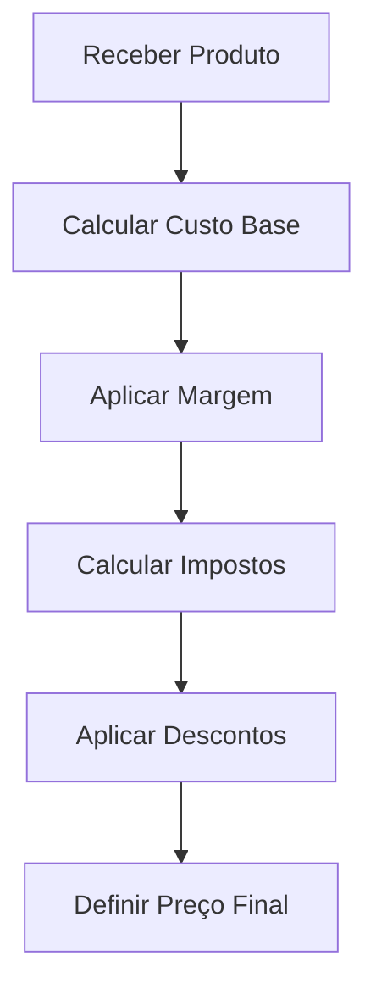
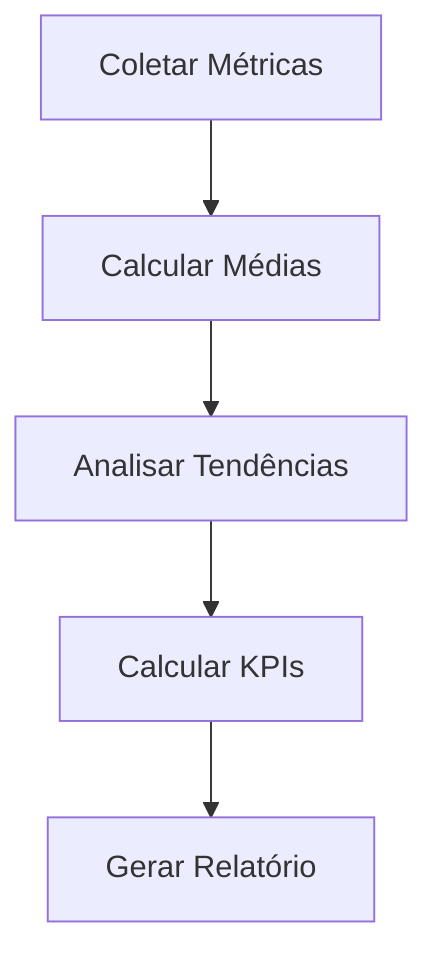
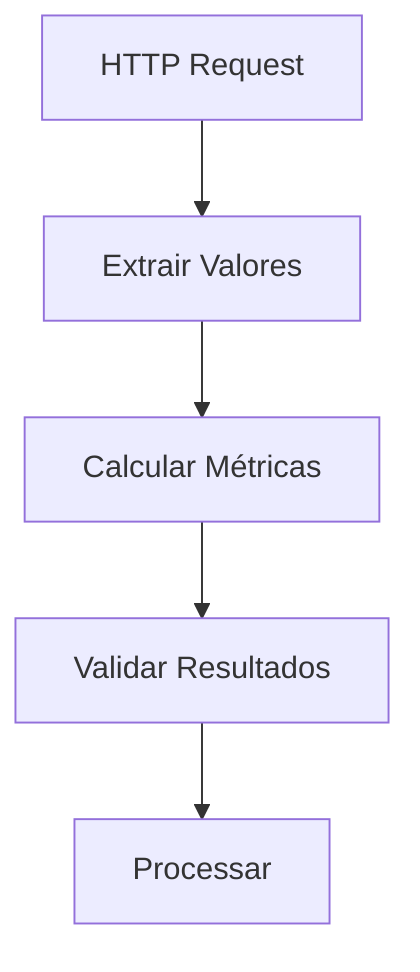

<IonicIcon name="calculator-outline" style={{fontSize: '24px', color: '#ea4b71'}} />

Os **utilitários matemáticos** fornecem funcionalidades essenciais para cálculos, transformações numéricas e operações matemáticas no n8n. Esses nodes são fundamentais para workflows que lidam com cálculos financeiros, análises estatísticas, conversões de unidades e processamento de dados numéricos.

## Quando usar Math Utilities

### Casos de Uso Principais

- **Cálculos financeiros** e operações monetárias
- **Análise estatística** e agregações numéricas
- **Conversão de unidades** de medida
- **Transformações matemáticas** de dados
- **Cálculos de desconto** e impostos
- **Processamento de métricas** e KPIs

### Cenários Aplicáveis

- Sistemas financeiros com cálculos complexos
- E-commerce com cálculos de preços e descontos
- Análise de dados com estatísticas
- Conversão de unidades para relatórios
- Cálculos de impostos e taxas
- Processamento de métricas de negócio

## Tipos de Operações

### Operações Básicas

```javascript
// Exemplo: Operações matemáticas básicas
{
  "valores_entrada": {
    "a": 10,
    "b": 5,
    "c": 3
  },
  "resultados": {
    "soma": 18,
    "subtracao": 2,
    "multiplicacao": 150,
    "divisao": 2,
    "potencia": 1000,
    "raiz": 2.236
  }
}
```

### Cálculos Financeiros

```javascript
// Exemplo: Cálculos financeiros
{
  "dados_financeiros": {
    "valor_base": 1000.00,
    "taxa_juros": 0.05,
    "periodo_meses": 12,
    "imposto": 0.15
  },
  "resultados_financeiros": {
    "juros_simples": 600.00,
    "juros_compostos": 795.86,
    "valor_com_imposto": 1150.00,
    "valor_liquido": 977.50
  }
}
```

### Estatísticas

```javascript
// Exemplo: Cálculos estatísticos
{
  "dados_amostra": [10, 20, 30, 40, 50],
  "estatisticas": {
    "media": 30,
    "mediana": 30,
    "moda": null,
    "desvio_padrao": 15.81,
    "variancia": 250,
    "minimo": 10,
    "maximo": 50
  }
}
```

## Configuração Básica

### Estrutura de Configuração

```javascript
{
  "operation": "calculate", // calculate, convert, aggregate, transform
  "input": {
    "values": "{{$json.valores}}",
    "operation": "sum",
    "precision": 2
  },
  "options": {
    "round_mode": "round",
    "decimal_places": 2,
    "scientific_notation": false
  }
}
```

### Parâmetros Principais

**Operações Disponíveis:**
- `sum` - Soma de valores
- `average` - Média aritmética
- `multiply` - Multiplicação
- `divide` - Divisão
- `power` - Potenciação
- `sqrt` - Raiz quadrada
- `log` - Logaritmo
- `sin`, `cos`, `tan` - Funções trigonométricas

**Modos de Arredondamento:**
- `round` - Arredondamento padrão
- `floor` - Arredondamento para baixo
- `ceil` - Arredondamento para cima
- `truncate` - Truncamento

## Exemplos Práticos

### Exemplo 1: Cálculo de Preço com Desconto

```javascript
// Cálculo de preço final com desconto
{
  "dados_produto": {
    "preco_base": 150.00,
    "desconto_percentual": 15,
    "imposto_percentual": 10
  },
  "calculos": {
    "desconto_valor": 22.50,
    "preco_com_desconto": 127.50,
    "imposto_valor": 12.75,
    "preco_final": 140.25
  }
}
```

### Exemplo 2: Análise de Vendas

```javascript
// Análise estatística de vendas
{
  "vendas_mensais": [12000, 15000, 18000, 14000, 16000, 19000],
  "analise_vendas": {
    "total_vendas": 94000,
    "media_mensal": 15666.67,
    "crescimento_medio": 14.29,
    "mes_maior_venda": 6,
    "mes_menor_venda": 1
  }
}
```

### Exemplo 3: Conversão de Unidades

```javascript
// Conversão de unidades de medida
{
  "medidas_originais": {
    "comprimento_km": 5,
    "peso_kg": 2.5,
    "temperatura_celsius": 25
  },
  "medidas_convertidas": {
    "comprimento_m": 5000,
    "peso_g": 2500,
    "temperatura_fahrenheit": 77
  }
}
```

## Casos de Uso Avançados

### Sistema de Precificação



### Análise de Performance



## Expressões e Data Mapping

### Expressões Comuns

```javascript
// Operações básicas
"{{$json.a + $json.b}}"
"{{$json.a - $json.b}}"
"{{$json.a * $json.b}}"
"{{$json.a / $json.b}}"

// Funções matemáticas
"{{Math.pow($json.base, $json.expoente)}}"
"{{Math.sqrt($json.valor)}}"
"{{Math.round($json.valor)}}"

// Cálculos financeiros
"{{$json.valor * (1 + $json.taxa)}}"
"{{$json.valor * (1 - $json.desconto/100)}}"
```

### Mapeamento de Dados

```javascript
// Exemplo: Mapeamento com cálculos
{
  "valores_entrada": "{{$json.dados_originais}}",
  "soma_total": "{{$json.valores_entrada.reduce((a, b) => a + b, 0)}}",
  "media": "{{$json.soma_total / $json.valores_entrada.length}}",
  "percentual": "{{($json.valor_atual / $json.valor_anterior - 1) * 100}}"
}
```

## Tratamento de Erros

### Validação de Entrada

```javascript
// Função de validação matemática
function validarEntradaMatematica(valores) {
  try {
    const resultado = {
      valido: true,
      erros: [],
      valores_validados: []
    };
    
    for (const valor of valores) {
      if (typeof valor !== 'number' || isNaN(valor)) {
        resultado.valido = false;
        resultado.erros.push(`Valor inválido: ${valor}`);
      } else {
        resultado.valores_validados.push(valor);
      }
    }
    
    return resultado;
  } catch (erro) {
    return {
      valido: false,
      erros: [erro.message],
      valores_validados: []
    };
  }
}
```

### Tratamento de Divisão por Zero

```javascript
// Função de divisão segura
function dividirSeguro(dividendo, divisor) {
  try {
    if (divisor === 0) {
      throw new Error('Divisão por zero não é permitida');
    }
    return dividendo / divisor;
  } catch (erro) {
    console.error('Erro na divisão:', erro);
    return null;
  }
}
```

## Performance e Otimização

### Boas Práticas

1. **Validação prévia** de tipos numéricos
2. **Cache de cálculos** para operações repetitivas
3. **Uso de bibliotecas** especializadas para cálculos complexos
4. **Precisão adequada** para o tipo de cálculo
5. **Tratamento de overflow** para números grandes

### Otimizações Específicas

```javascript
// Cache de cálculos
const mathCache = new Map();

function getCachedCalculation(input, operation) {
  const key = `${input}_${operation}`;
  if (!mathCache.has(key)) {
    mathCache.set(key, performCalculation(input, operation));
  }
  return mathCache.get(key);
}
```

## Troubleshooting

### Problemas Comuns

**Resultado incorreto**
- Verifique tipos de dados de entrada
- Confirme operação matemática
- Valide precisão necessária
- Teste com dados conhecidos

**Overflow numérico**
- Use bibliotecas para números grandes
- Implemente validação de limites
- Considere precisão decimal
- Teste com casos extremos

**Precisão inadequada**
- Configure casas decimais
- Use bibliotecas de precisão
- Valide arredondamento
- Teste com valores críticos

### Dicas de Debug

```javascript
// Função de debug para cálculos
function debugCalculo(valores, operacao) {
  console.log(`Debug cálculo ${operacao}:`, {
    valores_entrada: valores,
    tipo_operacao: operacao,
    resultado: performCalculation(valores, operacao),
    timestamp: new Date().toISOString()
  });
}
```

## Integração com Outros Nós

### Com HTTP Request



### Com Code Node

```javascript
// Cálculos no Code Node
const dadosEntrada = $input.first().json.dados;
const resultados = {
  soma: dadosEntrada.valores.reduce((a, b) => a + b, 0),
  media: dadosEntrada.valores.reduce((a, b) => a + b, 0) / dadosEntrada.valores.length,
  maximo: Math.max(...dadosEntrada.valores),
  minimo: Math.min(...dadosEntrada.valores)
};

return [{json: resultados}];
```

### Com If Node

```javascript
// Condição baseada em cálculo
{
  "condition": "{{$json.valor > $json.limite}}",
  "true": "Acima do Limite",
  "false": "Abaixo do Limite"
}
```

## Próximos Passos

- [Date/Time Utilities](/integracoes/builtin-nodes/utilities/date-time) - Manipulação de datas
- [Text Utilities](/integracoes/builtin-nodes/utilities/text) - Processamento de texto
- [Conversion Utilities](/integracoes/builtin-nodes/utilities/conversion) - Conversões de formato
- [Validation Utilities](/integracoes/builtin-nodes/utilities/validation) - Validações
- [Core Nodes](/integracoes/builtin-nodes/core-nodes) - Funcionalidades básicas
- [Expressões n8n](/logica-e-dados/expressoes) - Usar expressões matemáticas 