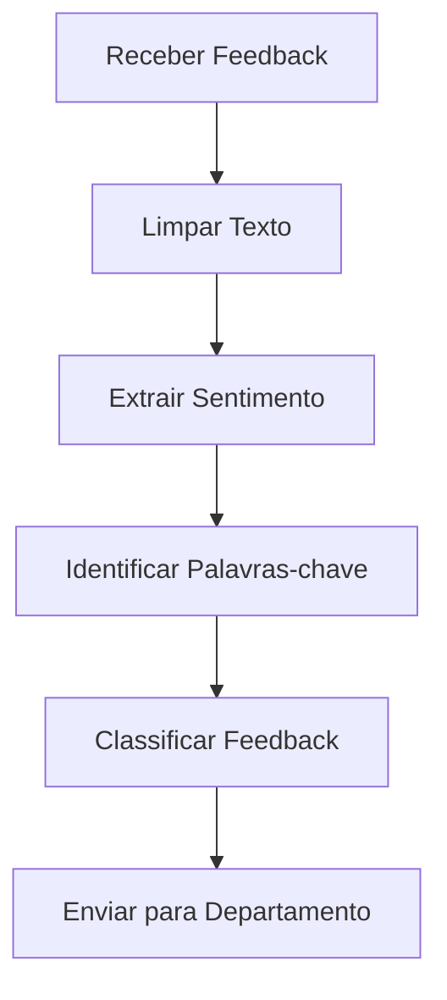
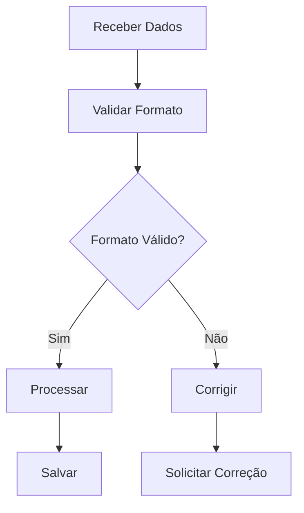
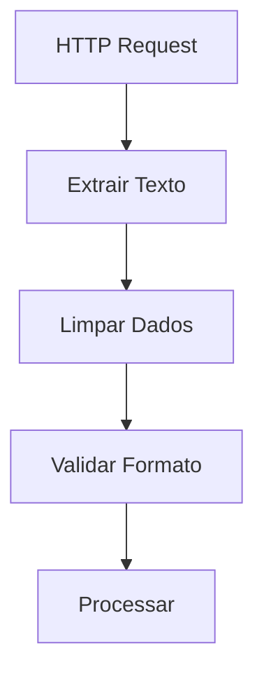

<IonicIcon name="text-outline" style={{fontSize: '24px', color: '#ea4b71'}} />

Os **utilitários de texto** fornecem funcionalidades essenciais para manipulação, formatação, validação e transformação de strings no n8n. Esses nodes são fundamentais para workflows que lidam com limpeza de dados, normalização de texto, extração de informações e formatação de conteúdo.

## Quando usar Text Utilities

### Casos de Uso Principais

- **Limpeza de dados** e normalização de texto
- **Validação de formatos** (email, telefone, CPF)
- **Extração de informações** de textos estruturados
- **Formatação de conteúdo** para relatórios
- **Busca e substituição** de padrões
- **Conversão de case** e normalização

### Cenários Aplicáveis

- Sistemas de CRM com dados de clientes
- Processamento de formulários web
- Análise de feedback e comentários
- Normalização de dados de entrada
- Geração de relatórios formatados
- Integração com sistemas externos

## Tipos de Operações

### Manipulação de Strings

```javascript
// Exemplo: Operações básicas
{
  "texto_original": "  João Silva  ",
  "trim": "João Silva",
  "uppercase": "JOÃO SILVA",
  "lowercase": "joão silva",
  "capitalize": "João Silva",
  "length": 11
}
```

### Busca e Substituição

```javascript
// Exemplo: Busca e substituição
{
  "texto_original": "O cliente João Silva fez uma compra de R$ 150,00",
  "substituicoes": {
    "nome_extraido": "João Silva",
    "valor_extraido": "R$ 150,00",
    "texto_limpo": "O cliente [NOME] fez uma compra de [VALOR]"
  }
}
```

### Validação de Formato

```javascript
// Exemplo: Validação de dados
{
  "email": "joao@exemplo.com",
  "telefone": "(11) 99999-9999",
  "cpf": "123.456.789-00",
  "validacoes": {
    "email_valido": true,
    "telefone_valido": true,
    "cpf_valido": true
  }
}
```

## Configuração Básica

### Estrutura de Configuração

```javascript
{
  "operation": "format", // format, extract, validate, replace
  "input": {
    "text": "{{$json.texto_original}}",
    "pattern": "regex_pattern",
    "replacement": "novo_texto"
  },
  "options": {
    "case_sensitive": false,
    "multiline": true,
    "global": true
  }
}
```

### Parâmetros Principais

**Operações Disponíveis:**
- `format` - Formatação de texto
- `extract` - Extração de informações
- `validate` - Validação de formato
- `replace` - Busca e substituição
- `split` - Divisão de texto
- `join` - Junção de textos

**Expressões Regulares Comuns:**
- `/\d+/` - Números
- `/[a-zA-Z]+/` - Letras
- `/^\w+@\w+\.\w+$/` - Email
- `/^\d{3}\.\d{3}\.\d{3}-\d{2}$/` - CPF

## Exemplos Práticos

### Exemplo 1: Limpeza de Dados

```javascript
// Limpeza de dados de cliente
{
  "dados_originais": {
    "nome": "  joão silva  ",
    "email": "JOÃO@EXEMPLO.COM",
    "telefone": "11-99999-9999"
  },
  "dados_limpos": {
    "nome": "João Silva",
    "email": "joao@exemplo.com",
    "telefone": "(11) 99999-9999"
  }
}
```

### Exemplo 2: Extração de Informações

```javascript
// Extração de dados de texto
{
  "texto_original": "Pedido #12345 - Cliente: João Silva - Valor: R$ 150,00",
  "informacoes_extraidas": {
    "numero_pedido": "12345",
    "nome_cliente": "João Silva",
    "valor": "R$ 150,00"
  }
}
```

### Exemplo 3: Validação de Formulário

```javascript
// Validação de dados de entrada
{
  "dados_formulario": {
    "nome": "João Silva",
    "email": "joao@exemplo.com",
    "cpf": "123.456.789-00"
  },
  "resultado_validacao": {
    "nome_valido": true,
    "email_valido": true,
    "cpf_valido": true,
    "formulario_completo": true
  }
}
```

## Casos de Uso Avançados

### Processamento de Feedback



### Sistema de Validação



## Expressões e Data Mapping

### Expressões Comuns

```javascript
// Comprimento de texto
"{{$json.texto.length}}"

// Conversão de case
"{{$json.texto.toUpperCase()}}"
"{{$json.texto.toLowerCase()}}"

// Busca de padrão
"{{$json.texto.match(/regex/)[0]}}"

// Substituição
"{{$json.texto.replace(/padrão/, 'substituição')}}"
```

### Mapeamento de Dados

```javascript
// Exemplo: Mapeamento de texto
{
  "texto_entrada": "{{$json.texto_original}}",
  "texto_processado": "{{$json.texto_entrada.trim().toLowerCase()}}",
  "palavras": "{{$json.texto_entrada.split(' ')}}",
  "primeira_palavra": "{{$json.texto_entrada.split(' ')[0]}}"
}
```

## Tratamento de Erros

### Validação de Entrada

```javascript
// Função de validação de texto
function validarTexto(texto, tipo) {
  const validacoes = {
    email: /^[^\s@]+@[^\s@]+\.[^\s@]+$/,
    telefone: /^\(\d{2}\)\s\d{4,5}-\d{4}$/,
    cpf: /^\d{3}\.\d{3}\.\d{3}-\d{2}$/,
    nome: /^[a-zA-ZÀ-ÿ\s]+$/
  };
  
  return {
    valido: validacoes[tipo].test(texto),
    texto: texto,
    tipo: tipo
  };
}
```

### Tratamento de Caracteres Especiais

```javascript
// Função de normalização
function normalizarTexto(texto) {
  return texto
    .normalize('NFD')
    .replace(/[\u0300-\u036f]/g, '')
    .replace(/[^\w\s]/g, '')
    .trim();
}
```

## Performance e Otimização

### Boas Práticas

1. **Use expressões regulares** eficientes
2. **Evite loops desnecessários** em strings
3. **Cache de padrões** para operações repetitivas
4. **Limite o tamanho** de strings processadas
5. **Use métodos nativos** quando possível

### Otimizações Específicas

```javascript
// Cache de expressões regulares
const regexCache = new Map();

function getRegex(pattern, flags) {
  const key = `${pattern}_${flags}`;
  if (!regexCache.has(key)) {
    regexCache.set(key, new RegExp(pattern, flags));
  }
  return regexCache.get(key);
}
```

## Troubleshooting

### Problemas Comuns

**Texto não encontrado**
- Verifique se o texto existe
- Confirme case sensitivity
- Valide expressão regular
- Teste com dados conhecidos

**Substituição incorreta**
- Verifique padrão de busca
- Confirme texto de substituição
- Valide flags da regex
- Teste com exemplos simples

**Validação falha**
- Confirme formato esperado
- Verifique expressão regular
- Valide dados de entrada
- Teste casos extremos

### Dicas de Debug

```javascript
// Função de debug para texto
function debugTexto(texto, operacao) {
  console.log(`Debug ${operacao}:`, {
    original: texto,
    length: texto.length,
    trimmed: texto.trim(),
    lowercase: texto.toLowerCase(),
    uppercase: texto.toUpperCase(),
    words: texto.split(' ').length
  });
}
```

## Integração com Outros Nós

### Com HTTP Request



### Com Code Node

```javascript
// Processamento de texto no Code Node
const textoEntrada = $input.first().json.texto;
const textoProcessado = textoEntrada
  .trim()
  .toLowerCase()
  .replace(/[^\w\s]/g, '');

return [{json: {texto_limpo: textoProcessado}}];
```

### Com If Node

```javascript
// Condição baseada em texto
{
  "condition": "{{$json.email.includes('@')}}",
  "true": "Email Válido",
  "false": "Email Inválido"
}
```

## Próximos Passos

- [Date/Time Utilities](/integracoes/builtin-nodes/utilities/date-time) - Manipulação de datas
- [Validation Utilities](/integracoes/builtin-nodes/utilities/validation) - Validações
- [Conversion Utilities](/integracoes/builtin-nodes/utilities/conversion) - Conversões de formato
- [Core Nodes](/integracoes/builtin-nodes/core-nodes/index) - Funcionalidades básicas
- [Expressões n8n](/logica-e-dados/expressoes) - Usar expressões com texto
- [Data Mapping](/logica-e-dados/data/data-mapping) - Mapeamento de dados textuais 