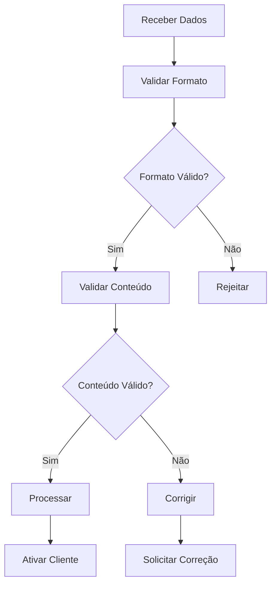
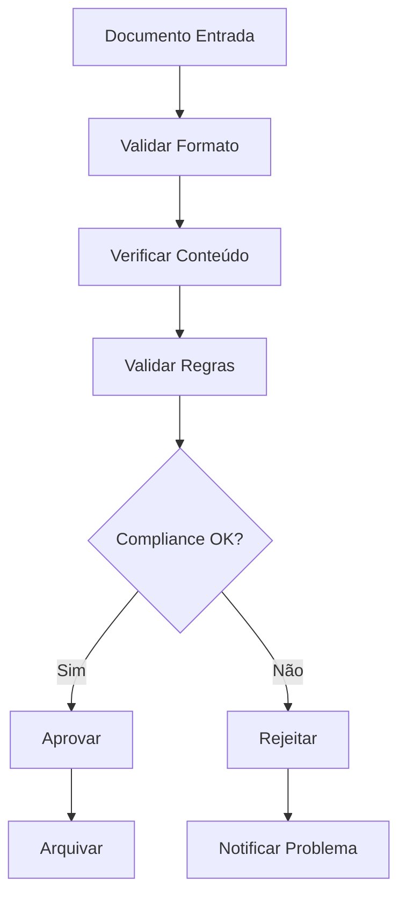
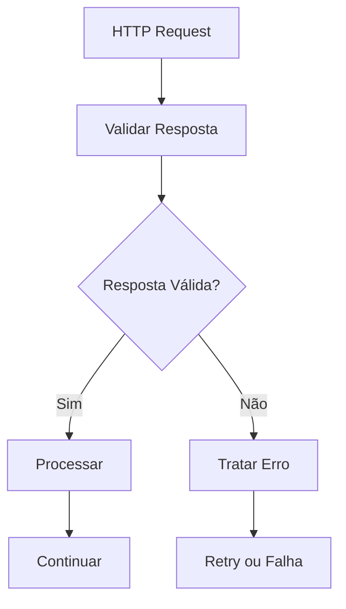

<IonicIcon name="checkmark-circle-outline" style={{fontSize: '24px', color: '#ea4b71'}} />

Os **utilitários de validação** fornecem funcionalidades essenciais para verificação, validação e controle de qualidade de dados no SUA_SENHA_BANCO_AQUI. Esses nodes são fundamentais para workflows que lidam com formulários, integrações de dados, compliance e garantia de integridade de informações.

## Quando usar Validation Utilities

### Casos de Uso Principais

- **Validação de formulários** e dados de entrada
- **Verificação de documentos** (CPF, CNPJ, RG)
- **Controle de qualidade** de dados
- **Compliance** com regras de negócio
- **Prevenção de erros** em workflows
- **Garantia de integridade** de dados

### Cenários Aplicáveis

- Sistemas de CRM com validação de clientes
- Processamento de pedidos com validação de dados
- Integração com APIs com verificação de respostas
- Workflows de compliance com validação de documentos
- Automações de marketing com validação de leads
- Sistemas financeiros com validação de transações

## Tipos de Validações

### Validação de Documentos

```javascript
// Exemplo: Validação de CPF
{
  "cpf_entrada": "123.456.789-00",
  "validacao_cpf": {
    "formato_valido": true,
    "digitos_verificadores": true,
    "cpf_valido": true,
    "mensagem": "CPF válido"
  }
}
```

### Validação de Email

```javascript
// Exemplo: Validação de email
{
  "email_entrada": "joao@exemplo.com",
  "validacao_email": {
    "formato_valido": true,
    "dominio_valido": true,
    "mx_record": true,
    "email_valido": true
  }
}
```

### Validação de Telefone

```javascript
// Exemplo: Validação de telefone
{
  "telefone_entrada": "(11) 99999-9999",
  "validacao_telefone": {
    "formato_valido": true,
    "ddd_valido": true,
    "numero_valido": true,
    "telefone_valido": true
  }
}
```

## Configuração Básica

### Estrutura de Configuração

```javascript
{
  "operation": "validate", // validate, verify, check, format
  "input": {
    "data": "{{$json.dados_entrada}}",
    "type": "cpf",
    "rules": {
      "required": true,
      "format": "strict",
      "custom_rules": []
    }
  },
  "options": {
    "strict": true,
    "allow_empty": false,
    "custom_validators": []
  }
}
```

### Parâmetros Principais

**Tipos de Validação Disponíveis:**
- `cpf` - Validação de CPF brasileiro
- `cnpj` - Validação de CNPJ brasileiro
- `email` - Validação de email
- `telefone` - Validação de telefone
- `cep` - Validação de CEP
- `custom` - Validação customizada

**Regras de Validação:**
- `required` - Campo obrigatório
- `format` - Formato específico
- `length` - Comprimento mínimo/máximo
- `range` - Faixa de valores
- `pattern` - Padrão regex

## Exemplos Práticos

### Exemplo 1: Validação de Cliente

```javascript
// Validação completa de dados de cliente
{
  "dados_cliente": {
    "nome": "João Silva",
    "email": "joao@exemplo.com",
    "cpf": "123.456.789-00",
    "telefone": "(11) 99999-9999"
  },
  "resultado_validacao": {
    "nome_valido": true,
    "email_valido": true,
    "cpf_valido": true,
    "telefone_valido": true,
    "cliente_valido": true,
    "erros": []
  }
}
```

### Exemplo 2: Validação de Pedido

```javascript
// Validação de dados de pedido
{
  "dados_pedido": {
    "numero": "PED-2024-001",
    "cliente_id": "12345",
    "valor": 150.00,
    "itens": [
      {"produto": "Produto A", "quantidade": 2, "preco": 75.00}
    ]
  },
  "validacao_pedido": {
    "numero_valido": true,
    "cliente_existe": true,
    "valor_positivo": true,
    "itens_validos": true,
    "pedido_valido": true
  }
}
```

### Exemplo 3: Validação de Configuração

```javascript
// Validação de configuração de API
{
  "config_api": {
    "url": "https://api.exemplo.com",
    "timeout": 30000,
    "retry_attempts": 3,
    "headers": {
      "Authorization": "Bearer token123"
    }
  },
  "validacao_config": {
    "url_valida": true,
    "timeout_valido": true,
    "retry_valido": true,
    "headers_validos": true,
    "config_valida": true
  }
}
```

## Casos de Uso Avançados

### Workflow de Onboarding



### Sistema de Compliance



## Expressões e Data Mapping

### Expressões Comuns

```javascript
// Validação de campo obrigatório
"{{$json.campo !== null && $json.campo !== ''}}"

// Validação de formato
"{{/^\d{3}\.\d{3}\.\d{3}-\d{2}$/.test($json.cpf)}}"

// Validação de comprimento
"{{$json.texto.length >= 3 && $json.texto.length <= 100}}"

// Validação de faixa
"{{$json.valor >= 0 && $json.valor <= 1000}}"
```

### Mapeamento de Dados

```javascript
// Exemplo: Mapeamento com validação
{
  "dados_entrada": "{{$json.dados_originais}}",
  "dados_validados": "{{validarDados($json.dados_entrada)}}",
  "status_validacao": "{{$json.dados_validados.valido}}",
  "erros": "{{$json.dados_validados.erros}}"
}
```

## Tratamento de Erros

### Validação Segura

```javascript
// Função de validação segura
function validarSeguro(dados, regras) {
  try {
    const resultado = {
      valido: true,
      erros: [],
      dados_validados: {}
    };
    
    for (const [campo, regra] of Object.entries(regras)) {
      const valor = dados[campo];
      const validacao = aplicarRegra(valor, regra);
      
      if (!validacao.valido) {
        resultado.valido = false;
        resultado.erros.push(validacao.erro);
      } else {
        resultado.dados_validados[campo] = valor;
      }
    }
    
    return resultado;
  } catch (erro) {
    return {
      valido: false,
      erros: [erro.message],
      dados_validados: {}
    };
  }
}
```

### Tratamento de Validações Complexas

```javascript
// Função de validação de CPF
function validarCPF(cpf) {
  try {
    // Remove caracteres não numéricos
    const numeros = cpf.replace(/\D/g, '');
    
    // Verifica se tem 11 dígitos
    if (numeros.length !== 11) {
      return { valido: false, erro: 'CPF deve ter 11 dígitos' };
    }
    
    // Verifica se todos os dígitos são iguais
    if (/^(\d)\1{10}$/.test(numeros)) {
      return { valido: false, erro: 'CPF inválido' };
    }
    
    // Calcula dígitos verificadores
    let soma = 0;
    for (let i = 0; i < 9; i++) {
      soma += parseInt(numeros[i]) * (10 - i);
    }
    let resto = 11 - (soma % 11);
    const digito1 = resto < 2 ? 0 : resto;
    
    soma = 0;
    for (let i = 0; i < 10; i++) {
      soma += parseInt(numeros[i]) * (11 - i);
    }
    resto = 11 - (soma % 11);
    const digito2 = resto < 2 ? 0 : resto;
    
    // Verifica dígitos verificadores
    if (parseInt(numeros[9]) !== digito1 || parseInt(numeros[10]) !== digito2) {
      return { valido: false, erro: 'CPF inválido' };
    }
    
    return { valido: true, erro: null };
  } catch (erro) {
    return { valido: false, erro: 'Erro na validação do CPF' };
  }
}
```

## Performance e Otimização

### Boas Práticas

1. **Validação precoce** de dados críticos
2. **Cache de validações** para dados repetitivos
3. **Validação em lote** para grandes volumes
4. **Validação progressiva** em formulários
5. **Tratamento de timeouts** para validações externas

### Otimizações Específicas

```javascript
// Cache de validações
const validationCache = new Map();

function getCachedValidation(input, type) {
  const key = `${input}_${type}`;
  if (!validationCache.has(key)) {
    validationCache.set(key, performValidation(input, type));
  }
  return validationCache.get(key);
}
```

## Troubleshooting

### Problemas Comuns

**Validação falha**
- Verifique formato dos dados de entrada
- Confirme regras de validação
- Teste com dados conhecidos
- Verifique logs de erro

**Performance lenta**
- Implemente cache de validações
- Otimize expressões regulares
- Use validação em lote
- Monitore tempo de execução

**Falsos positivos/negativos**
- Revise regras de validação
- Teste casos extremos
- Valide dados de exemplo
- Ajuste sensibilidade

### Dicas de Debug

```javascript
// Função de debug para validações
function debugValidacao(dados, tipo) {
  console.log(`Debug validação ${tipo}:`, {
    dados_entrada: dados,
    tipo_validacao: tipo,
    resultado: performValidation(dados, tipo),
    timestamp: new Date().toISOString()
  });
}
```

## Integração com Outros Nós

### Com HTTP Request



### Com Code Node

```javascript
// Validação no Code Node
const dadosEntrada = $input.first().json.dados;
const resultadoValidacao = validarDados(dadosEntrada);

if (resultadoValidacao.valido) {
  return [{json: {dados_validados: resultadoValidacao.dados}}];
} else {
  throw new Error(`Dados inválidos: ${resultadoValidacao.erros.join(', ')}`);
}
```

### Com If Node

```javascript
// Condição baseada em validação
{
  "condition": "{{$json.validacao.valido}}",
  "true": "Dados Válidos",
  "false": "Dados Inválidos"
}
```

## Próximos Passos

- [Date/Time Utilities](/integracoes/builtin-nodes/utilities/date-time) - Manipulação de datas
- [Text Utilities](/integracoes/builtin-nodes/utilities/text) - Processamento de texto
- [Conversion Utilities](/integracoes/builtin-nodes/utilities/conversion) - Conversões de formato
- [Math Utilities](/integracoes/builtin-nodes/utilities/math) - Transformações matemáticas
- [Core Nodes](/integracoes/builtin-nodes/core-nodes/index) - Funcionalidades básicas
- [Expressões SUA_SENHA_BANCO_AQUI](/logica-e-dados/expressoes) - Usar expressões com validações 