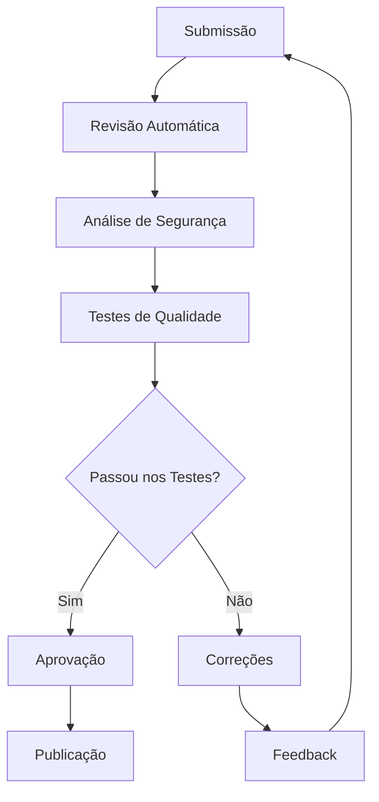

---
sidebar_position: 3
title: Community Nodes
description: Nodes da comunidade e desenvolvimento customizado
keywords: [n8n, community nodes, custom, desenvolvimento, npm]
---

<IonicIcon name="people-outline" style={{fontSize: '24px', color: '#ea4b71'}} />

Os **Community Nodes** representam o ecossistema de integrações desenvolvidas pela comunidade global do n8n. Esses nodes expandem significativamente as capacidades da plataforma, oferecendo integrações personalizadas para casos de uso específicos que não são cobertos pelos nodes nativos.

## O que são Community Nodes

### Definição e Características

Os Community Nodes são integrações desenvolvidas por desenvolvedores da comunidade que:

- **Extendem funcionalidades** do n8n com integrações específicas
- **Resolvem casos de uso** não cobertos pelos nodes oficiais
- **Seguem padrões** de qualidade e segurança estabelecidos
- **São mantidos** pela comunidade de desenvolvedores
- **Passam por avaliação** antes de serem disponibilizados

### Diferenças dos Nodes Oficiais

**Community Nodes:**
- Desenvolvidos pela comunidade
- Requerem instalação manual
- Podem ter limitações de suporte
- Atualizações dependem dos mantenedores
- Casos de uso específicos

**Nodes Oficiais:**
- Desenvolvidos pela equipe n8n
- Incluídos por padrão
- Suporte oficial completo
- Atualizações automáticas
- Funcionalidades core

## Ecossistema da Comunidade

### Marketplace Oficial

<IonicIcon name="storefront-outline" style={{fontSize: '24px', color: '#ea4b71'}} />

**Principais funcionalidades:**

- Catálogo centralizado de nodes
- Sistema de avaliações e reviews
- Documentação integrada
- Downloads e estatísticas
- Comunidade ativa

**Casos de uso:**

- Descoberta de integrações
- Avaliação de qualidade
- Feedback da comunidade
- Estatísticas de uso
- Recomendações

[Explorar Marketplace →](https://marketplace.n8n.io)

### Repositório GitHub

<IonicIcon name="logo-github" style={{fontSize: '24px', color: '#ea4b71'}} />

**Principais funcionalidades:**

- Código fonte aberto
- Issues e pull requests
- Documentação técnica
- Contribuições da comunidade
- Versionamento

**Casos de uso:**

- Desenvolvimento colaborativo
- Reporte de bugs
- Sugestões de melhorias
- Contribuições de código
- Acompanhamento de versões

[Ver no GitHub →](https://github.com/n8n-io/n8n-nodes-starter-template)

## Critérios de Qualidade

### Padrões de Desenvolvimento

**Código:**
- Seguir convenções JavaScript/TypeScript
- Implementar tratamento de erros
- Documentar APIs e parâmetros
- Testes unitários e de integração
- Compatibilidade com versões n8n

**Documentação:**
- README detalhado
- Exemplos de uso
- Casos de uso práticos
- Screenshots da interface
- Changelog atualizado

### Segurança e Confiabilidade

**Segurança:**
- Validação de entrada
- Sanitização de dados
- Tratamento seguro de credenciais
- Auditoria de dependências
- Conformidade com LGPD

**Confiabilidade:**
- Testes de regressão
- Monitoramento de performance
- Tratamento de timeouts
- Retry mechanisms
- Logs de debug

## Processo de Avaliação

### Revisão de Código



### Critérios de Aprovação

**Funcionalidade:**
- Node funciona conforme especificado
- Interface intuitiva e consistente
- Documentação clara e completa
- Exemplos funcionais

**Qualidade:**
- Código bem estruturado
- Tratamento adequado de erros
- Performance aceitável
- Compatibilidade garantida

## Casos de Uso Comuns

### Integrações Específicas

**APIs Brasileiras:**
- Receita Federal (CNPJ/CPF)
- Correios (CEP)
- Bancos brasileiros
- Sistemas governamentais

**Ferramentas de Negócio:**
- CRMs específicos
- ERPs brasileiros
- Sistemas de pagamento
- Plataformas de e-commerce

### Automações Especializadas

**Marketing:**
- Automação de campanhas
- Segmentação de leads
- Análise de performance
- Integração com redes sociais

**Financeiro:**
- Reconciliação bancária
- Gestão de cobrança
- Relatórios fiscais
- Compliance regulatório

## Estatísticas da Comunidade

### Crescimento e Adoção

```javascript
// Estatísticas da comunidade (2024)
{
  "total_nodes": 5000,
  "desenvolvedores_ativos": 1200,
  "downloads_mensais": 150000,
  "nodes_aprovados": 3200,
  "categorias_disponiveis": 45
}
```

### Categorias Mais Populares

1. **Comunicação** - 25% dos nodes
2. **E-commerce** - 20% dos nodes
3. **Financeiro** - 15% dos nodes
4. **Marketing** - 12% dos nodes
5. **Produtividade** - 10% dos nodes
6. **Outros** - 18% dos nodes

## Tendências de Desenvolvimento

### Tecnologias Emergentes

**IA e Machine Learning:**
- Integração com APIs de IA
- Processamento de linguagem natural
- Análise preditiva
- Automação inteligente

**Blockchain e Web3:**
- Integração com criptomoedas
- Smart contracts
- NFTs e tokens
- DeFi applications

### Integrações Futuras

**IoT e Hardware:**
- Sensores e dispositivos
- Automação residencial
- Monitoramento industrial
- Wearables e health tech

**Realidade Virtual/Aumentada:**
- Metaverso
- AR/VR applications
- Gamification
- Experiências imersivas

## Boas Práticas

### Para Usuários

1. **Pesquise antes de instalar** - Leia reviews e documentação
2. **Teste em ambiente de desenvolvimento** - Evite problemas em produção
3. **Mantenha backups** - Preserve configurações importantes
4. **Monitore atualizações** - Fique atento a novas versões
5. **Participe da comunidade** - Compartilhe feedback e experiências

### Para Desenvolvedores

1. **Siga os padrões** - Use templates e convenções estabelecidas
2. **Documente adequadamente** - Facilite o uso por outros desenvolvedores
3. **Teste extensivamente** - Garanta qualidade e confiabilidade
4. **Mantenha compatibilidade** - Atualize conforme novas versões do n8n
5. **Engaje com a comunidade** - Responda issues e contribua

## Troubleshooting

### Problemas Comuns

**Node não aparece**
- Verifique se foi instalado corretamente
- Confirme compatibilidade com versão do n8n
- Reinicie o servidor n8n
- Verifique logs de erro

**Erro de execução**
- Valide configuração do node
- Verifique credenciais e permissões
- Confirme conectividade com API externa
- Consulte documentação do node

**Conflitos de dependências**
- Atualize para versões compatíveis
- Resolva conflitos de versões
- Use lockfiles para controle
- Considere usar containers

### Dicas de Debug

```javascript
// Função de debug para community nodes
function debugCommunityNode(nodeName, config) {
  console.log(`Debug ${nodeName}:`, {
    configuracao: config,
    versao_n8n: process.env.N8N_VERSION,
    timestamp: new Date().toISOString()
  });
}
```

## Próximos Passos

- [Instalação de Community Nodes](/integracoes/community-nodes/instalacao) - Como instalar e gerenciar
- [Community Nodes Populares](/integracoes/community-nodes/populares) - Catálogo recomendado
- [Criar Nodes Customizados](../criar-nodes/tutorial-desenvolvimento.mdx) - Desenvolver seus próprios nodes
- [Built-in Nodes](../builtin-nodes/http-requests/webhook.md) - Nodes nativos do n8n
- [Integrações Brasileiras](../../integracoes-br/financeiro/compliance-fiscal.md) - Nodes específicos para o Brasil
