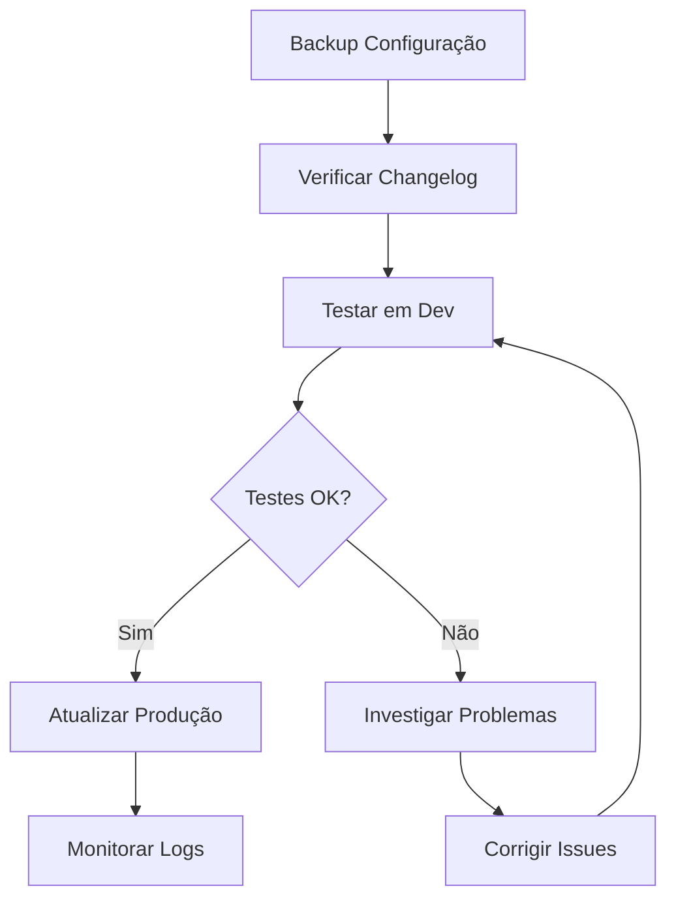

---
sidebar_position: 2
title: Instalação de Community Nodes
description: Como instalar e gerenciar nodes da comunidade no n8n
keywords: [n8n, community nodes, instalação, npm, comunidade]
---

<IonicIcon name="download-outline" style={{fontSize: '24px', color: '#ea4b71'}} />

Este guia detalha como **instalar e gerenciar community nodes** no n8n, incluindo busca no marketplace oficial, instalação via npm, configuração de dependências, resolução de conflitos, atualizações seguras e troubleshooting de problemas comuns.

## Métodos de Instalação

### Via Marketplace Oficial

<IonicIcon name="storefront-outline" style={{fontSize: '24px', color: '#ea4b71'}} />

**Passo a passo:**

1. **Acesse o marketplace** em [marketplace.n8n.io](https://marketplace.n8n.io)
2. **Pesquise o node** desejado por nome ou categoria
3. **Leia a documentação** e reviews da comunidade
4. **Clique em "Install"** para obter o comando de instalação
5. **Execute o comando** no terminal do servidor n8n

**Vantagens:**
- Interface amigável
- Documentação integrada
- Reviews da comunidade
- Atualizações automáticas
- Suporte oficial

### Via NPM

<IonicIcon name="logo-nodejs" style={{fontSize: '24px', color: '#ea4b71'}} />

**Comando básico:**
```bash
npm install @n8n/nodes-[nome-do-node]
```

**Exemplo prático:**
```bash
# Instalar node do WhatsApp
npm install @n8n/nodes-whatsapp

# Instalar node do Telegram
npm install @n8n/nodes-telegram

# Instalar múltiplos nodes
npm install @n8n/nodes-whatsapp @n8n/nodes-telegram @n8n/nodes-discord
```

**Parâmetros importantes:**
- `--save` - Salvar no package.json
- `--save-dev` - Salvar como dependência de desenvolvimento
- `--global` - Instalação global (não recomendado)
- `--force` - Forçar instalação (use com cuidado)

## Configuração de Dependências

### Estrutura de Dependências

```json
{
  "dependencies": {
    "@n8n/nodes-whatsapp": "^1.0.0",
    "@n8n/nodes-telegram": "^2.1.0",
    "@n8n/nodes-discord": "^1.5.0"
  },
  "devDependencies": {
    "@n8n/nodes-test": "^0.1.0"
  }
}
```

### Gerenciamento de Versões

**Lockfile (recomendado):**
```bash
# Gerar package-lock.json
npm install

# Usar versões exatas
npm ci
```

**Sem lockfile:**
```bash
# Instalar versão específica
npm install @n8n/nodes-whatsapp@1.0.0

# Atualizar para última versão
npm update @n8n/nodes-whatsapp
```

## Configuração do Ambiente

### Variáveis de Ambiente

```bash
# Configuração para community nodes
N8N_CUSTOM_EXTENSIONS=/path/to/custom/nodes
N8N_NODE_TYPES_WHITELIST=@n8n/nodes-whatsapp,@n8n/nodes-telegram
N8N_DISABLE_PRODUCTION_MAIN_PROCESS=false
```

### Estrutura de Diretórios

```
n8n/
├── custom/
│   ├── nodes/
│   │   ├── whatsapp/
│   │   ├── telegram/
│   │   └── discord/
│   └── credentials/
├── node_modules/
├── package.json
└── package-lock.json
```

## Processo de Instalação

### Passo 1: Preparação

```bash
# Verificar versão do n8n
n8n --version

# Verificar Node.js
node --version

# Verificar npm
npm --version
```

### Passo 2: Instalação

```bash
# Navegar para diretório do n8n
cd /path/to/n8n

# Instalar node
npm install @n8n/nodes-[nome]

# Verificar instalação
npm list @n8n/nodes-[nome]
```

### Passo 3: Configuração

```bash
# Reiniciar n8n
n8n restart

# Verificar logs
n8n logs

# Testar node
# Acesse a interface web e verifique se o node aparece
```

## Resolução de Conflitos

### Conflitos de Versão

**Problema:** Múltiplas versões do mesmo node
```bash
# Verificar versões instaladas
npm ls @n8n/nodes-whatsapp

# Remover versões duplicadas
npm dedupe

# Forçar reinstalação
npm install --force
```

**Solução:**
```bash
# Limpar cache
npm cache clean --force

# Remover node_modules
rm -rf node_modules

# Reinstalar tudo
npm install
```

### Conflitos de Dependências

**Problema:** Dependências incompatíveis
```json
{
  "conflicts": {
    "axios": "0.21.1 vs 0.27.2",
    "lodash": "4.17.21 vs 4.17.20"
  }
}
```

**Solução:**
```bash
# Usar npm-check-updates
npx npm-check-updates

# Atualizar dependências
npm update

# Resolver manualmente
npm install axios@0.27.2 lodash@4.17.21
```

## Atualizações Seguras

### Estratégia de Atualização



### Comandos de Atualização

```bash
# Verificar atualizações disponíveis
npm outdated

# Atualizar node específico
npm update @n8n/nodes-whatsapp

# Atualizar todos os nodes
npm update

# Atualizar para versão específica
npm install @n8n/nodes-whatsapp@2.0.0
```

### Backup e Rollback

```bash
# Backup da configuração
cp package.json package.json.backup
cp package-lock.json package-lock.json.backup

# Rollback em caso de problema
cp package.json.backup package.json
cp package-lock.json.backup package-lock.json
npm install
```

## Troubleshooting

### Problemas Comuns

**Node não aparece na interface**
```bash
# Verificar instalação
npm list @n8n/nodes-[nome]

# Verificar logs
n8n logs --level debug

# Reiniciar n8n
n8n restart
```

**Erro de dependência**
```bash
# Verificar dependências
npm ls

# Resolver conflitos
npm dedupe

# Limpar cache
npm cache clean --force
```

**Erro de permissão**
```bash
# Verificar permissões
ls -la node_modules/

# Corrigir permissões
sudo chown -R $USER:$USER node_modules/
```

### Dicas de Debug

```javascript
// Função de debug para instalação
function debugInstallation(nodeName) {
  console.log(`Debug instalação ${nodeName}:`, {
    versao_n8n: process.env.N8N_VERSION,
    versao_node: process.version,
    diretorio: process.cwd(),
    timestamp: new Date().toISOString()
  });
}
```

## Boas Práticas

### Antes da Instalação

1. **Leia a documentação** do node
2. **Verifique compatibilidade** com sua versão do n8n
3. **Teste em ambiente de desenvolvimento**
4. **Faça backup** da configuração atual
5. **Verifique dependências** e conflitos

### Durante a Instalação

1. **Use lockfiles** para controle de versões
2. **Instale um node por vez** para facilitar debug
3. **Monitore logs** durante a instalação
4. **Teste funcionalidade** após instalação
5. **Documente mudanças** realizadas

### Após a Instalação

1. **Valide funcionamento** do node
2. **Configure credenciais** necessárias
3. **Teste casos de uso** básicos
4. **Monitore performance** e logs
5. **Atualize documentação** interna

## Próximos Passos

- [Community Nodes Populares](/integracoes/community-nodes/populares) - Catálogo recomendado
- [Criar Nodes Customizados](../criar-nodes/tutorial-desenvolvimento.mdx) - Desenvolver seus próprios nodes
- [Built-in Nodes](../builtin-nodes/http-requests/webhook.md) - Nodes nativos do n8n
- [Integrações Brasileiras](../../integracoes-br/financeiro/compliance-fiscal.md) - Nodes específicos para o Brasil
- [Troubleshooting](/usando-n8n/troubleshooting) - Resolução de problemas
