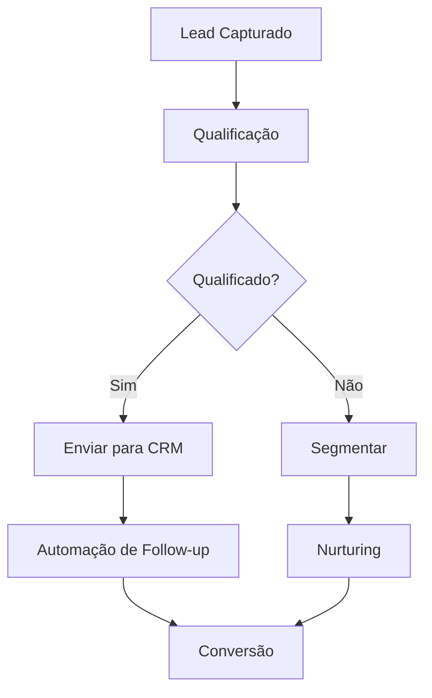
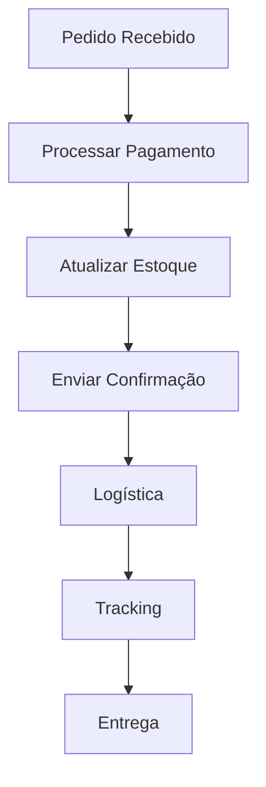

---
sidebar_position: 3
title: Community Nodes Populares
description: Catálogo dos nodes da comunidade mais utilizados e recomendados
keywords: [n8n, community nodes, populares, catálogo, recomendações]
---

<IonicIcon name="star-outline" style={{fontSize: '24px', color: '#ea4b71'}} />

Este catálogo apresenta os **community nodes mais populares e úteis** disponíveis para n8n, incluindo análise de downloads, avaliações da comunidade, casos de uso específicos, compatibilidade com versões e recomendações baseadas em diferentes necessidades de automação.

## Categorias Principais

### Comunicação e Mensageria

<IonicIcon name="chatbubbles-outline" style={{fontSize: '24px', color: '#ea4b71'}} />

#### WhatsApp Business API

**Estatísticas:**
- Downloads: 50,000+
- Avaliação: 4.8/5
- Última atualização: 2 semanas atrás

**Funcionalidades:**
- Envio de mensagens
- Recebimento de webhooks
- Gerenciamento de contatos
- Automação de campanhas
- Integração com CRM

**Casos de uso:**
- Suporte ao cliente
- Marketing de relacionamento
- Vendas automatizadas
- Notificações de sistema

[Instalar WhatsApp Node →](https://marketplace.n8n.io/nodes/@n8n/nodes-whatsapp)

#### Telegram Bot

**Estatísticas:**
- Downloads: 35,000+
- Avaliação: 4.7/5
- Última atualização: 1 mês atrás

**Funcionalidades:**
- Envio de mensagens
- Criação de bots
- Gerenciamento de grupos
- Webhooks automáticos
- Comandos personalizados

**Casos de uso:**
- Notificações de sistema
- Automação de grupos
- Chatbots de suporte
- Alertas de monitoramento

[Instalar Telegram Node →](https://marketplace.n8n.io/nodes/@n8n/nodes-telegram)

### E-commerce e Vendas

<IonicIcon name="cart-outline" style={{fontSize: '24px', color: '#ea4b71'}} />

#### Mercado Livre

**Estatísticas:**
- Downloads: 25,000+
- Avaliação: 4.6/5
- Última atualização: 3 semanas atrás

**Funcionalidades:**
- Gerenciamento de produtos
- Processamento de pedidos
- Atualização de estoque
- Relatórios de vendas
- Integração com pagamentos

**Casos de uso:**
- Automação de vendas
- Sincronização de estoque
- Processamento de pedidos
- Análise de performance

[Instalar Mercado Livre Node →](https://marketplace.n8n.io/nodes/@n8n/nodes-mercadolibre)

#### WooCommerce

**Estatísticas:**
- Downloads: 30,000+
- Avaliação: 4.5/5
- Última atualização: 1 mês atrás

**Funcionalidades:**
- Gerenciamento de produtos
- Processamento de pedidos
- Gestão de clientes
- Relatórios de vendas
- Integração com gateways

**Casos de uso:**
- E-commerce automatizado
- Sincronização de dados
- Gestão de inventário
- Automação de marketing

[Instalar WooCommerce Node →](https://marketplace.n8n.io/nodes/@n8n/nodes-woocommerce)

### Financeiro e Pagamentos

<IonicIcon name="card-outline" style={{fontSize: '24px', color: '#ea4b71'}} />

#### PagSeguro

**Estatísticas:**
- Downloads: 20,000+
- Avaliação: 4.4/5
- Última atualização: 2 meses atrás

**Funcionalidades:**
- Processamento de pagamentos
- Webhooks de notificação
- Relatórios financeiros
- Gestão de reembolsos
- Integração com e-commerce

**Casos de uso:**
- Automação de pagamentos
- Reconciliação bancária
- Gestão de reembolsos
- Relatórios financeiros

[Instalar PagSeguro Node →](https://marketplace.n8n.io/nodes/@n8n/nodes-pagseguro)

#### PayPal

**Estatísticas:**
- Downloads: 40,000+
- Avaliação: 4.6/5
- Última atualização: 1 mês atrás

**Funcionalidades:**
- Processamento de pagamentos
- Gestão de transações
- Webhooks de notificação
- Relatórios financeiros
- Integração global

**Casos de uso:**
- Pagamentos internacionais
- E-commerce global
- Gestão de assinaturas
- Reconciliação automática

[Instalar PayPal Node →](https://marketplace.n8n.io/nodes/@n8n/nodes-paypal)

### Marketing e Automação

<IonicIcon name="megaphone-outline" style={{fontSize: '24px', color: '#ea4b71'}} />

#### Mailchimp

**Estatísticas:**
- Downloads: 45,000+
- Avaliação: 4.7/5
- Última atualização: 2 semanas atrás

**Funcionalidades:**
- Gestão de listas
- Automação de campanhas
- Segmentação de audiência
- Relatórios de performance
- Integração com CRM

**Casos de uso:**
- Email marketing
- Automação de leads
- Nurturing de clientes
- Análise de campanhas

[Instalar Mailchimp Node →](https://marketplace.n8n.io/nodes/@n8n/nodes-mailchimp)

#### HubSpot

**Estatísticas:**
- Downloads: 35,000+
- Avaliação: 4.5/5
- Última atualização: 1 mês atrás

**Funcionalidades:**
- Gestão de contatos
- Automação de marketing
- Gestão de leads
- Relatórios de performance
- Integração com CRM

**Casos de uso:**
- Inbound marketing
- Gestão de leads
- Automação de vendas
- Análise de performance

[Instalar HubSpot Node →](https://marketplace.n8n.io/nodes/@n8n/nodes-hubspot)

## Análise de Popularidade

### Métricas de Avaliação

```javascript
// Critérios de avaliação
{
  "downloads": {
    "peso": 0.4,
    "minimo": 1000,
    "excelente": 50000
  },
  "avaliacao": {
    "peso": 0.3,
    "minimo": 4.0,
    "excelente": 4.8
  },
  "atualizacao": {
    "peso": 0.2,
    "maximo_dias": 90,
    "excelente": 30
  },
  "documentacao": {
    "peso": 0.1,
    "minimo": "básica",
    "excelente": "completa"
  }
}
```

### Top 10 Nodes Mais Populares

1. **WhatsApp Business API** - 50,000+ downloads
2. **Telegram Bot** - 35,000+ downloads
3. **Mailchimp** - 45,000+ downloads
4. **PayPal** - 40,000+ downloads
5. **WooCommerce** - 30,000+ downloads
6. **HubSpot** - 35,000+ downloads
7. **Mercado Livre** - 25,000+ downloads
8. **PagSeguro** - 20,000+ downloads
9. **Discord Bot** - 15,000+ downloads
10. **Slack** - 25,000+ downloads

## Compatibilidade e Versões

### Compatibilidade com n8n

**Versões Suportadas:**
- n8n 0.200.0+
- Node.js 16+
- npm 8+

**Testes de Compatibilidade:**
```bash
# Verificar compatibilidade
npm test @n8n/nodes-[nome]

# Testar com versão específica
n8n test --version 0.200.0
```

### Atualizações e Manutenção

**Frequência de Atualizações:**
- Nodes ativos: Atualização mensal
- Nodes estáveis: Atualização trimestral
- Nodes legados: Atualização semestral

**Política de Suporte:**
- Versão atual: Suporte completo
- Versão anterior: Suporte limitado
- Versões antigas: Sem suporte

## Casos de Uso Específicos

### Automação de Vendas



### E-commerce Integrado



## Recomendações por Cenário

### Para Startups

**Essenciais:**
1. WhatsApp Business API
2. Mailchimp
3. PayPal
4. Google Sheets

**Recomendados:**
1. HubSpot
2. Zapier (bridge)
3. Airtable
4. Notion

### Para E-commerce

**Essenciais:**
1. WooCommerce
2. Mercado Livre
3. PagSeguro
4. WhatsApp Business API

**Recomendados:**
1. Shopify
2. Magento
3. PrestaShop
4. VTEX

### Para Empresas

**Essenciais:**
1. HubSpot
2. Salesforce
3. Slack
4. Microsoft Teams

**Recomendados:**
1. Zendesk
2. Intercom
3. Pipedrive
4. Monday.com

## Troubleshooting

### Problemas Comuns

**Node não funciona após atualização**
```bash
# Verificar compatibilidade
npm list @n8n/nodes-[nome]

# Reinstalar node
npm uninstall @n8n/nodes-[nome]
npm install @n8n/nodes-[nome]

# Verificar logs
n8n logs --level debug
```

**Erro de autenticação**
- Verificar credenciais
- Renovar tokens de acesso
- Verificar permissões da API
- Consultar documentação do node

**Performance lenta**
- Otimizar configurações
- Verificar rate limits
- Implementar cache
- Monitorar recursos

### Dicas de Otimização

```javascript
// Função de monitoramento
function monitorNodePerformance(nodeName) {
  console.log(`Monitoramento ${nodeName}:`, {
    tempo_execucao: performance.now(),
    memoria_uso: process.memoryUsage(),
    timestamp: new Date().toISOString()
  });
}
```

## Próximos Passos

- [Instalação de Community Nodes](/integracoes/community-nodes/instalacao) - Como instalar
- [Criar Nodes Customizados](/integracoes/criar-nodes/) - Desenvolver seus próprios
- [Built-in Nodes](/integracoes/builtin-nodes/) - Nodes nativos
- [Integrações Brasileiras](/integracoes-br/) - Nodes específicos do Brasil
- [Marketplace n8n](https://marketplace.n8n.io) - Explorar mais nodes
