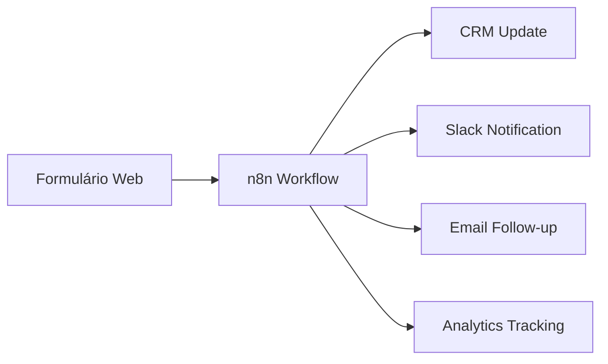

# Automação sem fricção

## <ion-icon name="list-outline" style={{ fontSize: '24px', color: '#ea4b71' }}></ion-icon> O que você vai aprender aqui

- **A História Por Trás da Solução** - Como Jan Oberhauser identificou e resolveu o problema universal de integração
- **A Solução: n8n Como 'Tradutor Universal' Para Aplicações** - Como funciona na prática e por que é diferente
- **Por Que o n8n Funciona Onde Outros Falham** - Diferencial arquitetural e benefícios específicos
- **Validação: Quem Já Usa e Por Quê** - Casos reais e integrações brasileiras específicas
- **Seus Próximos Passos** - Checkpoint de validação e caminhos de aprendizado 
- **Estrutura Desta Documentação** - Como navegar pelos recursos disponíveis
- **Nossa Comunidade Brasileira** - Como participar e contribuir

---

## <ion-icon name="alert-circle-outline" style={{ fontSize: '24px', color: '#ea4b71' }}></ion-icon> O Problema: Quando Conectar Sistemas Vira Pesadelo

São 18h de uma sexta-feira. Sua equipe acabou de fechar uma venda importante no CRM, mas o Slack permanece em silêncio. O relatório semanal que deveria chegar automaticamente na caixa de entrada do CEO não apareceu. E aqueles dados do formulário de contato do site? Ainda estão esperando alguém copiar manualmente para a planilha de leads.

Essa história se repete em milhares de empresas brasileiras todos os dias. Não por falta de tecnologia, mas porque conectar sistemas ainda é como tentar fazer dois estranhos conversarem em idiomas diferentes - teoricamente possível, mas frustrantemente complexo na prática.

### <span style={{color: '#ea4b71'}}>A Armadilha dos Três Caminhos Falhos</span>

Quando você precisa conectar sistemas, três opções aparecem como soluções óbvias. Cada uma promete resolver seu problema, mas todas acabam criando novos.

<details>
<summary><ion-icon name="code-slash-outline" style={{ fontSize: '18px', color: '#dc2626' }}></ion-icon> <strong>Caminho 1: A Pessoa Desenvolvedora Heroica (Scripts Customizados)</strong></summary>

**A promessa:** "Vamos fazer um script rapidinho que conecta o formulário com o CRM."

**A realidade três meses depois:** Seu script funcionou perfeitamente até o dia em que a API do CRM mudou sem aviso. A autenticação expirou no meio da madrugada, e ninguém percebeu até segunda-feira quando 47 leads foram perdidos.

A pessoa desenvolvedora que criou o script saiu da empresa, deixando para trás 200 linhas de código sem documentação e um comentário enigmático: `// TODO: melhorar tratamento de erro`.

Agora você tem duas opções: contratar alguém para decifrar o código legado ou recomeçar do zero. Qualquer uma vai consumir mais tempo que o desenvolvimento original.

**A frustração real:** Scripts customizados quebram não quando você espera, mas sempre no pior momento possível. E manutenção sempre custa mais que desenvolvimento.

</details>

<details>
<summary><ion-icon name="warning-outline" style={{ fontSize: '18px', color: '#d97706' }}></ion-icon> <strong>Caminho 2: A Simplicidade Enganosa (Ferramentas No-Code)</strong></summary>

**A promessa:** "Sem código, sem complicação. Arraste e solte, pronto!"

**A realidade três meses depois:** Sua automação simples de "formulário → CRM → Slack" custava R$ 150/mês quando processava 1.000 leads. Agora, com o crescimento da empresa, são 15.000 leads mensais e a conta chegou a R$ 2.300/mês.

Você quer adicionar uma lógica condicional simples: "se o lead é de São Paulo E o valor é maior que R$ 10.000, enviar para o gerente sênior". Mas a ferramenta só permite condições básicas, não condições compostas. A solução? Pagar por um plano "Pro" que inclui "lógica avançada" por mais R$ 500/mês.

E aquelas integrações brasileiras que você precisa? PIX, ViaCEP, consulta de CNPJ na Receita Federal? "Em desenvolvimento para 2026", segundo o roadmap internacional.

**A frustração real:** Ferramentas no-code funcionam perfeitamente até você precisar de algo específico. E custos por execução transformam crescimento em penalidade financeira.

</details>

<details>
<summary><ion-icon name="information-circle-outline" style={{ fontSize: '18px', color: '#2563eb' }}></ion-icon> <strong>Caminho 3: O Martelo Para Parafusos (Soluções Enterprise)</strong></summary>

**A promessa:** "Plataforma robusta que resolve tudo, do simples ao complexo."

**A realidade três meses depois:** Você contratou 40 horas de consultoria especializada para configurar uma automação que deveria ser simples. O manual de 847 páginas explica como integrar com SAP, mas não menciona como conectar um formulário básico do WordPress.

A licença mínima custa R$ 15.000/ano para até 10 usuários, mas você só precisava de 2 automações simples. A interface foi claramente projetada por arquitetos de software para outros arquitetos de software - sua equipe de marketing desistiu de usar depois de três tentativas frustradas.

**A frustração real:** Soluções enterprise resolvem problemas que você não tem, ignorando os problemas que você realmente enfrenta.

</details>

---

### <span style={{color: '#ea4b71'}}>O Padrão Universal de Frustração</span>

Independente do caminho escolhido, o resultado é sempre o mesmo: você resolve um problema técnico e ganha três problemas organizacionais.

- **Time de TI sobrecarregado** mantendo scripts que deveriam ser "temporários"
- **Dependência de especialistas** para mudanças que deveriam ser simples
- **Custos imprevisíveis** que crescem mais rápido que o valor gerado
- **Integração incompleta** que resolve 80% do problema e deixa 20% para trabalho manual

:::note Nota importante
Esta não é uma limitação técnica - é uma falha de design das ferramentas disponíveis. Elas foram construídas para resolver problemas de grandes corporações americanas ou para impressionar com simplicidade superficial, não para atender necessidades reais de empresas em crescimento.
:::

### <span style={{color: '#ea4b71'}}>Por Que Isso Acontece (E Por Que Importa)</span>

O problema fundamental não é tecnológico - é de **arquitetura de soluções**. Precisamos de uma abordagem que seja:

**<ion-icon name="checkmark-circle-outline" style={{ fontSize: '18px', color: '#22c55e' }}></ion-icon> Requisitos da Solução Ideal:**

- **Suficientemente poderosa** para lógica complexa quando necessário
- **Suficientemente simples** para que qualquer pessoa da equipe possa entender e manter  
- **Suficientemente flexível** para crescer junto com a empresa
- **Suficientemente acessível** para que custos não se tornem proibitivos com o sucesso

É exatamente essa lacuna que **[Jan Oberhauser](https://www.linkedin.com/in/janoberhauser/)** identificou em 2019 quando enfrentava os mesmos dilemas como pessoa desenvolvedora. Sua frustração com essa falsa escolha entre simplicidade limitada e complexidade desnecessária levou à criação de uma quarta opção.

**<ion-icon name="bulb" style={{ fontSize: '18px', color: '#fbbf24' }}></ion-icon> Uma opção que não existia até então.**

---

## <ion-icon name="construct-outline" style={{ fontSize: '24px', color: '#ea4b71' }}></ion-icon> A Solução: n8n Como "Tradutor Universal" Para Aplicações

**O n8n (pronuncia-se "n-eight-n") é uma plataforma de automação que funciona como um tradutor universal para aplicações** - ele entende a "linguagem" de mais de 400 serviços diferentes e os faz conversar entre si através de uma interface visual intuitiva.

### <span style={{color: '#ea4b71'}}>Como Funciona na Prática</span>

**Pense no n8n como um sistema de encanamento inteligente** para dados: ao invés de você construir tubulações customizadas entre cada sistema, o n8n fornece conectores padronizados que se adaptam às especificidades de cada aplicação.



**Ao invés de:** Escrever código para conectar Formulário → CRM → Slack → Email → Analytics  
**Você faz:** Arrasta blocos visuais, conecta com cliques, testa em tempo real, deploya automaticamente

### <span style={{color: '#ea4b71'}}>Arquitetura</span>

**<ion-icon name="construct-outline" style={{ fontSize: '18px', color: '#ea4b71' }}></ion-icon> Execução híbrida:** Interface visual para fluxo principal + código JavaScript/Python para lógica específica quando necessário.

```javascript
// Exemplo: Lógica customizada dentro de workflow visual
const customerValue = $input.item.json.orderTotal;
const priority = customerValue > 10000 ? 'high' : 'normal';
const assignedRep = priority === 'high' ? 'senior-team' : 'junior-team';

return [{
  priority,
  assignedRep,
  originalData: $input.item.json
}];
```

**<ion-icon name="cloud-outline" style={{ fontSize: '18px', color: '#ea4b71' }}></ion-icon> Self-hosted + Cloud:** Controle total dos dados com opção de hosting gerenciado.

---

## <ion-icon name="checkmark-circle-outline" style={{ fontSize: '24px', color: '#ea4b71' }}></ion-icon> Por Que o n8n Funciona Onde Outros Falham

### <ion-icon name="code-slash-outline" style={{ fontSize: '20px', color: '#ea4b71' }}></ion-icon> 1. Para Pessoas Desenvolvedoras: Flexibilidade Sem Compromissos

**Problema específico:** Alternar constantemente entre GUI limitada para automações simples e código complexo para lógica avançada.

**Solução n8n:**
- **Interface visual** para 80% dos casos de uso
- **Nós de código** JavaScript/Python para lógica específica
- **API REST robusta** para integração com sistemas existentes
- **Versionamento de workflows** através de JSON exportável
- **Webhooks nativos** sem configuração de infraestrutura

#### <span style={{color: '#22c55e'}}>Progressive Code Examples</span>

**Básico - Webhook Simples:**
```javascript
// Apenas receber dados
return $input.all();
```

**Realístico - Validação e Transformação:**
```javascript
// Validar e transformar dados de leads
const leads = $input.all().filter(item => {
  return item.json.email && item.json.email.includes('@');
});

return leads.map(lead => ({
  ...lead.json,
  status: 'validated',
  timestamp: new Date().toISOString()
}));
```

**Avançado - Lógica de Negócio Complexa:**
```javascript
// Sistema de scoring e roteamento automático
const customerValue = $input.item.json.orderTotal;
const location = $input.item.json.state;
const priority = customerValue > 10000 ? 'high' : 'normal';

// Lógica de roteamento baseada em múltiplos critérios
let assignedRep = 'junior-team';
if (priority === 'high' && ['SP', 'RJ'].includes(location)) {
  assignedRep = 'senior-team';
} else if (customerValue > 5000) {
  assignedRep = 'mid-level-team';
}

return [{
  priority,
  assignedRep,
  originalData: $input.item.json,
  routingLogic: 'automated'
}];
```

**Checkpoint Intermediário:** <ion-icon name="checkmark-circle" style={{ fontSize: '16px', color: '#22c55e' }}></ion-icon> Se você já programa em JavaScript, pode começar imediatamente com nós de código customizados. Veja **[Integrações Avançadas](./integracoes/index.md)** para exemplos práticos.

---

### <ion-icon name="people-circle-outline" style={{ fontSize: '20px', color: '#ea4b71' }}></ion-icon> 2. Para Equipes de Negócio: Autonomia Sem Dependência

**Problema específico:** Dependência de TI para automações simples, mas necessidade de lógica mais sofisticada que ferramentas tradicionais oferecem.

**Solução n8n:**
- **Templates prontos** para casos de uso comuns
- **Editor visual** que qualquer pessoa aprende em &lt;30 minutos
- **Colaboração** através de workflows compartilhados
- **Debugging visual** mostra exatamente onde um processo falhou

#### <span style={{color: '#22c55e'}}>Templates Prontos para Uso</span>

**Básico - Notificação de Formulário:**
```yaml
# Template: Formulário → Email + Slack
trigger: webhook
action1: send-email
action2: send-slack-message
```

**Realístico - Onboarding de Cliente:**
```yaml
# Template: CRM → Email → Slack → Google Sheets
trigger: new-customer-crm
action1: send-welcome-email
action2: notify-sales-team
action3: add-to-tracking-sheet
condition: if-customer-type = 'enterprise'
```

**Avançado - Relatório Semanal Automático:**
```yaml
# Template: Múltiplas fontes → Consolidação → Distribuição
trigger: weekly-schedule
action1: collect-google-analytics
action2: collect-facebook-ads
action3: collect-crm-data
action4: generate-report
action5: send-to-stakeholders
```

**Checkpoint de validação:** <ion-icon name="checkmark-circle" style={{ fontSize: '16px', color: '#22c55e' }}></ion-icon> Se você consegue criar uma planilha no Excel com fórmulas, consegue criar workflows no n8n. Veja **[Primeiro Workflow](./primeiros-passos/primeiro-workflow.md)** para começar.

---

### <ion-icon name="business-outline" style={{ fontSize: '20px', color: '#ea4b71' }}></ion-icon> 3. Para Empresas: Controle Total Sem Vendor Lock-in

**Problema específico:** Vendor lock-in e custos crescentes por execução conforme automação escala.

**Solução n8n:**
- **Open-source** com licença fair-code (uso livre + comunidade ativa)
- **Self-hosted** = controle total de dados e custos previsíveis
- **Clustering** para alta disponibilidade em produção
- **Audit logs** e monitoramento empresarial built-in

#### <span style={{color: '#22c55e'}}>Comparação de Custos Reais</span>

**Automação que executa 100K vezes/mês:**

| Plataforma | Custo Mensal | Limitações |
|------------|--------------|------------|
| Zapier Professional | US$ 19,99–29,99/mês (R$ 100–160) | 100K tasks, sem código customizado |
| Microsoft Power Automate | US$ 15/mês (R$ 78); Process/Hosted: até US$ 215/mês (R$ 1.120) | 100K actions, dependência Microsoft |
| n8n self-hosted | US$ 5–50/mês pelo VPS (R$ 26–260) | Ilimitado, controle total, sem limite de tarefas |

**Checkpoint Intermediário:** <ion-icon name="checkmark-circle" style={{ fontSize: '16px', color: '#22c55e' }}></ion-icon> Para implementação empresarial, consulte **[Deployment em Produção](./hosting-n8n/index.md)** e **[Configuração de Segurança](./hosting-n8n/seguranca/index.md)**.

---

## <ion-icon name="checkmark-circle" style={{ fontSize: '20px', color: '#22c55e' }}></ion-icon> Checkpoint Intermediário: Você Entendeu o Diferencial?

<ion-icon name="bulb-outline" style={{ fontSize: '16px', color: '#ea4b71' }}></ion-icon> **Antes de continuar, confirme que você entendeu:**

- [ ] **n8n combina simplicidade visual com poder de código** quando necessário
- [ ] **Self-hosted elimina vendor lock-in** e custos crescentes
- [ ] **Templates + código customizado** cobrem 100% dos casos de uso
- [ ] **Comunidade ativa** garante evolução contínua

**Se respondeu "sim" para todos, você está pronto para ver casos reais. Se não, volte e revise a seção anterior.**

---

## <ion-icon name="people-outline" style={{ fontSize: '24px', color: '#ea4b71' }}></ion-icon> Validação: Quem Já Usa e Por Quê

O n8n conquistou **123.000+ estrelas no GitHub** (julho de 2025) e é usado por milhares de organizações porque resolve problemas reais de integração:

### <span style={{color: '#ea4b71'}}>Casos de Uso Validados</span>

**E-commerce (Shopify + WooCommerce + ERP):**  
Automação de sincronização de produtos, estoque e pedidos entre Shopify e WooCommerce sem código customizado.

**SaaS B2B (Onboarding automatizado):**  
Estrutura ideal para fluxo completo: do cadastro ao primeiro valor, com triggers (signup) → ação (e‑mail, CRM) → condições → acompanhamento.

**Agências (Relatórios automáticos):**  
Nodes nativos para Google Analytics, Facebook Ads e AdWords permitem coleta, consolidação e envio automático (e‑mail/Slack).

**Fintech (Compliance e monitoramento):**  
Capaz de automatizar verificação de documentos, consultas a bureaus, decisões e notificações multicanais (e‑mail, SMS, Telegram).

### <span style={{color: '#ea4b71'}}>Integrações Brasileiras Nativas</span>

O n8n tem crescimento significativo no Brasil devido a integrações nativas com:
- **PIX** - Workflow oficial para gerar QR Code conforme padrão do Banco Central
- **ViaCEP** - Nodes comunitários facilitam consulta de endereços via CEP
- **Receita Federal (CNPJ/CPF)** - Scripts e nodes para validação disponíveis na comunidade
- **Correios** - Nodes não oficiais, mas com uso frequente
- **Mercado Pago** - Tutoriais e vídeos mostram integração com Mercado Pago via n8n, incluindo PIX

---

## <ion-icon name="library-outline" style={{ fontSize: '24px', color: '#ea4b71' }}></ion-icon> Estrutura Desta Documentação

Esta documentação segue uma progressão lógica do conceito à implementação avançada:

### <ion-icon name="flag" style={{ fontSize: '18px', color: '#ea4b71' }}></ion-icon> **Primeiros Passos**
Fundamentos sólidos para primeiro workflow funcional.

**[Instalação](./primeiros-passos/guia-instalacao)** - Guia completo para todas as opções de deployment  
**[Conceitos Fundamentais](./primeiros-passos/conceitos-fundamentais)** - Workflows, nodes, triggers, connections  
**[Primeiro Workflow](./primeiros-passos/primeiro-workflow)** - Tutorial prático com caso real  

### <ion-icon name="construct" style={{ fontSize: '18px', color: '#ea4b71' }}></ion-icon> **Guias Práticos**
Casos de uso reais com implementação completa.

**[Interface e Navegação](./usando-n8n/interface/index.md)** - Dominando o editor visual  
**[Lógica e Fluxo de Dados](./logica-e-dados/index.md)** - Condicionais, loops, error handling  
**[Integrações Avançadas](./integracoes/index.md)** - APIs customizadas, webhooks  

### <ion-icon name="book" style={{ fontSize: '18px', color: '#ea4b71' }}></ion-icon> **Referência Técnica**
Documentação completa para implementação em produção.

**[API Reference](./api/index.md)** - Documentação completa da REST API  
**[Deployment em Produção](./hosting-n8n/index.md)** - Clustering, monitoramento, backup  
**[Criando Nodes Customizados](./integracoes/criar-nodes/index.md)** - Desenvolvimento avançado  

### <ion-icon name="star" style={{ fontSize: '18px', color: '#ea4b71' }}></ion-icon> **Recursos Especializados**

**[Integrações Brasileiras](./integracoes-br/index.md)** - PIX, ViaCEP, Receita Federal  
**[Casos de Uso Avançados](./comunidade/casos-uso-avancados/index.md)** - E-commerce, SaaS, Fintech  
**[Troubleshooting](./referencia/guias/index.md)** - Diagnóstico e resolução de problemas  

---

## <ion-icon name="heart-outline" style={{ fontSize: '24px', color: '#ea4b71' }}></ion-icon> Nossa Comunidade Brasileira

Este material é mantido pela **comunidade brasileira de n8n**, sem vínculo oficial com a empresa. Nosso objetivo é democratizar automação inteligente no Brasil, fornecendo recursos contextualizados e integrações específicas do mercado nacional.

### Como Contribuir

**<ion-icon name="create-outline" style={{ fontSize: '16px', color: '#ea4b71' }}></ion-icon> Melhorar a documentação:**  
- [Editar esta página no GitHub](https://github.com/tatyquebralayout/n8n-Doc-pt-BR/edit/main/docs/intro.md)
- [Reportar problemas ou sugestões](https://github.com/tatyquebralayout/n8n-Doc-pt-BR/issues/new)


---


